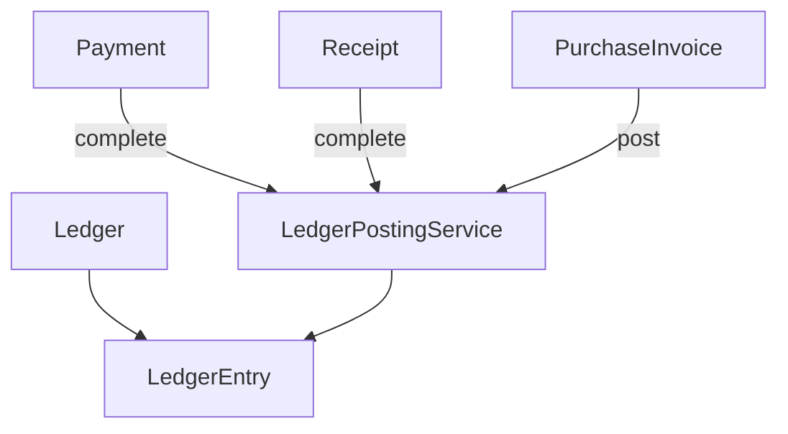

# Finance module — agent memory model

Implementation-grounded reference for `backend/src/finance/`. For table-level domain design, see [financial.md](../../../docs/pharmacy_erp_architecture_docs/database/tables/financial/financial.md).

---

## 1. Module snapshot

| Item | Value |
|------|-------|
| **Purpose** | Chart of accounts (Ledger), read-only LedgerEntry, Payment, Receipt with double-entry posting |
| **Module** | [`finance.module.ts`](../../../backend/src/finance/finance.module.ts) |
| **Controllers** | 4 (`ledger`, `ledger-entry`, `payment`, `receipt`) |
| **Services** | 4 |
| **Exports** | `LedgerService`, `PaymentService`, `ReceiptService` |
| **Persistence** | `LedgerPostingService` in `backend/src/persistence/ledger/` |

---

## 2. Domain model

### Golden rules

1. **Ledger balance never stored** — derived from `LedgerEntry` sums.
2. **LedgerEntry immutable** after post — reversals only.
3. **Strict financial year** — `assertTransactionDateInOpenYear` rejects dates outside current open FY.
4. **System ledger codes** — `CASH001`, `BANK001`, `SUP001`, `CUST001`, `PUR001`, `GSTIN001`, etc. (see `SystemLedgerCode`).
5. **All mutations** — `auditService.log` + `outboxService.enqueue` in same `tx` (`AuditModule.FINANCE`).

---

## 3. API catalog

Permissions use `FINANCE:RESOURCE:ACTION`. Delete endpoints require `DeleteEntityQueryDto` (`version` query param).

### Ledger (COA)

| Method | Path | Permission |
|--------|------|------------|
| GET | `/ledgers` | `FINANCE:LEDGER:READ` |
| GET | `/ledgers/:id` | `FINANCE:LEDGER:READ` |
| POST | `/ledgers` | `FINANCE:LEDGER:CREATE` |
| PATCH | `/ledgers/:id` | `FINANCE:LEDGER:UPDATE` |
| DELETE | `/ledgers/:id` | `FINANCE:LEDGER:DELETE` |

### Ledger Entry (read-only)

| Method | Path | Permission |
|--------|------|------------|
| GET | `/ledger-entries` | `FINANCE:LEDGER_ENTRY:READ` |
| GET | `/ledger-entries/:id` | `FINANCE:LEDGER_ENTRY:READ` |

Filters: `ledgerId`, `voucherType`, `voucherId`, `fromDate`, `toDate`, `isPosted`.

### Payment

| Method | Path | Permission |
|--------|------|------------|
| GET | `/payments` | `FINANCE:PAYMENT:READ` |
| GET | `/payments/:id` | `FINANCE:PAYMENT:READ` |
| POST | `/payments` | `FINANCE:PAYMENT:CREATE` |
| PATCH | `/payments/:id` | `FINANCE:PAYMENT:UPDATE` |
| DELETE | `/payments/:id` | `FINANCE:PAYMENT:DELETE` |
| POST | `/payments/:id/complete` | `FINANCE:PAYMENT:COMPLETE` |
| POST | `/payments/:id/cancel` | `FINANCE:PAYMENT:CANCEL` |

### Receipt

| Method | Path | Permission |
|--------|------|------------|
| GET | `/receipts` | `FINANCE:RECEIPT:READ` |
| GET | `/receipts/:id` | `FINANCE:RECEIPT:READ` |
| POST | `/receipts` | `FINANCE:RECEIPT:CREATE` |
| PATCH | `/receipts/:id` | `FINANCE:RECEIPT:UPDATE` |
| DELETE | `/receipts/:id` | `FINANCE:RECEIPT:DELETE` |
| POST | `/receipts/:id/complete` | `FINANCE:RECEIPT:COMPLETE` |
| POST | `/receipts/:id/cancel` | `FINANCE:RECEIPT:CANCEL` |

---

## 4. Workflow ledger (summary)

| Event | Ledger effect |
|-------|---------------|
| Purchase invoice post | DR `PUR001` (net − tax), DR `GSTIN001` (tax), CR `SUP001` (net) |
| Purchase invoice cancel | Reversal voucher (blocked when `paidAmount > 0`) |
| Payment complete (`SUPPLIER_PAYMENT`) | DR `SUP001`, CR Cash/Bank |
| Payment complete (`CUSTOMER_REFUND`) | DR `CUST001`, CR Cash/Bank |
| Payment complete (`PURCHASE_REFUND`) | DR Cash/Bank, CR `SUP001` |
| Payment + `PURCHASE_INVOICE` ref | Requires POSTED invoice; optimistic allocation to `paidAmount` / `balanceAmount` |
| Receipt complete (`CUSTOMER_PAYMENT`) | DR Cash/Bank, CR `CUST001`; requires `referenceId` (customer); adjusts outstanding |
| Receipt + `SALES_INVOICE` ref | Validates balance via sales settlement helpers |

**Reversal rule:** `reverseVoucher` scopes originals by exact `originalVoucherNumber`; reversal lines post under `*-REV` voucher number.

Document numbers: `DocumentType.PAYMENT` / `RECEIPT` via `SequenceGeneratorService` (`PAY-{BR}-{SEQ}`, `REC-{BR}-{SEQ}`).

---

## 5. Layer map

| File | Base path |
|------|-----------|
| `ledger.controller.ts` | `ledgers` |
| `ledger-entry.controller.ts` | `ledger-entries` |
| `payment.controller.ts` | `payments` |
| `receipt.controller.ts` | `receipts` |

Shared persistence: `backend/src/persistence/ledger/ledger-posting.service.ts`.

Canonical types: `JournalLineInput` and `NormalBalance` live in `persistence/ledger/` (`ledger-posting.types.ts`, `ledger-posting.constants.ts`); finance re-exports `NormalBalance` via `finance.constants.ts`. Receipt customer resolution: `resolveReceiptCustomerId` in `finance.util.ts`. PI payment allocation: `adjustPurchaseInvoicePaymentAllocation(tx, invoiceId, signedDelta)`.

---

## 6. Not implemented

Unit/persistence/e2e tests, Angular clients, manual journal voucher API, financial reports (trial balance, P&L, balance sheet), Expense table CRUD, sales invoice receipt allocation.
