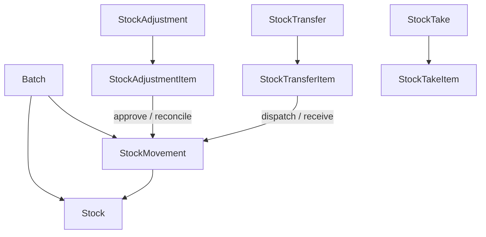

# Inventory module — agent memory model

Implementation-grounded reference for `backend/src/inventory/`. For table-level domain design, see [inventory.md](../../../docs/pharmacy_erp_architecture_docs/database/tables/inventory/inventory.md).

---

## 1. Module snapshot

| Item | Value |
|------|-------|
| **Purpose** | Org-global batch master data; branch-scoped stock balances; immutable movement ledger; document workflows (adjustment, transfer, stock-take) |
| **Module** | [`inventory.module.ts`](../../../backend/src/inventory/inventory.module.ts) |
| **Controllers** | 9 (6 headers + 3 nested item controllers) |
| **Services** | 9 (+ `batch.service.spec.ts`) |
| **Exports** | `BatchService` only |
| **Party alignment** | Same CRUD template as [`backend/src/party/`](../../../backend/src/party/); nested items via child routes (no `items[]` on create body) |

---

## 2. Domain model

### Golden rules

1. **Never** update `Stock.availableQuantity` (or other quantity buckets) directly in feature services. All stock changes go through [`InventoryLedgerService.applyMovement`](../../../backend/src/persistence/inventory/inventory-ledger.service.ts) inside `unitOfWork.run`.
2. **`StockMovement` is immutable** — read-only HTTP API; movements are created only by the ledger (and other domain modules that call it).
3. **`Batch` is org-global** — no branch filter on list/get. **`Stock`**, **adjustments**, and **stock-takes** are branch-scoped via `RequestContext` (`getTenantScope` + `withBranchScope`).
4. **Document numbers** — allocate via `SequenceGeneratorService.next()` inside the same transaction as header create (`STOCK_ADJUSTMENT`, `STOCK_TRANSFER`, `STOCK_TAKE`; ledger allocates `STOCK_MOVEMENT`).
5. **All mutations** — `auditService.log` + `outboxService.enqueue` in the same `tx` as the business write.
6. **Reads** use `prisma.client`; **writes** use `unitOfWork.run(tx => …)` only.

---

## 3. Status machines

Edits and deletes on document headers/items are allowed only while parent status is **DRAFT** (enforced by `assertDraftStatus` in [`inventory.util.ts`](../../../backend/src/inventory/utils/inventory.util.ts)). Stock-take items also allow create/update/delete when parent is `IN_PROGRESS`.

| Document | Status flow | Workflow endpoints |
|----------|-------------|-------------------|
| **StockAdjustment** | `DRAFT` → `APPROVED` | `POST /stock-adjustments/:id/approve` |
| **StockTransfer** | `DRAFT` (or `PENDING_APPROVAL`) → `DISPATCHED` → `COMPLETED` / `PARTIALLY_RECEIVED` | `POST /stock-transfers/:id/dispatch`, `POST /stock-transfers/:id/receive` |
| **StockTake** | `DRAFT` → `IN_PROGRESS` → `COUNTED` → `RECONCILED` | `POST /stock-takes/:id/start`, `POST /stock-takes/:id/complete`, `POST /stock-takes/:id/reconcile` |

Enum values live in [`inventory.constants.ts`](../../../backend/src/inventory/constants/inventory.constants.ts).

---

## 4. API catalog

Permissions use `INVENTORY:RESOURCE:ACTION`. Delete endpoints require `DeleteEntityQueryDto` (`version` query param).

### Batch — org-global master

| Method | Path | Permission |
|--------|------|------------|
| GET | `/batches` | `INVENTORY:BATCH:READ` |
| GET | `/batches/:id` | `INVENTORY:BATCH:READ` |
| POST | `/batches` | `INVENTORY:BATCH:CREATE` |
| PATCH | `/batches/:id` | `INVENTORY:BATCH:UPDATE` |
| DELETE | `/batches/:id` | `INVENTORY:BATCH:DELETE` |

Query: `BatchListQueryDto` (`PaginationQueryDto` + optional `medicineId`).

### Stock — read-only, branch-scoped

| Method | Path | Permission |
|--------|------|------------|
| GET | `/stocks` | `INVENTORY:STOCK:READ` |
| GET | `/stocks/:id` | `INVENTORY:STOCK:READ` |

Query: `StockListQueryDto` (optional `branchId`, `batchId`, `medicineId` filters; list still scoped to context branch).

### StockMovement — read-only ledger, branch-scoped

| Method | Path | Permission |
|--------|------|------------|
| GET | `/stock-movements` | `INVENTORY:STOCK_MOVEMENT:READ` |
| GET | `/stock-movements/:id` | `INVENTORY:STOCK_MOVEMENT:READ` |

Query: `StockMovementListQueryDto` (filters: `movementType`, `movementDirection`, `fromDate`, `toDate`, `batchId`, `medicineId`).

### StockAdjustment — header

| Method | Path | Permission |
|--------|------|------------|
| GET | `/stock-adjustments` | `INVENTORY:STOCK_ADJUSTMENT:READ` |
| GET | `/stock-adjustments/:id` | `INVENTORY:STOCK_ADJUSTMENT:READ` |
| POST | `/stock-adjustments` | `INVENTORY:STOCK_ADJUSTMENT:CREATE` |
| PATCH | `/stock-adjustments/:id` | `INVENTORY:STOCK_ADJUSTMENT:UPDATE` |
| POST | `/stock-adjustments/:id/approve` | `INVENTORY:STOCK_ADJUSTMENT:APPROVE` |
| DELETE | `/stock-adjustments/:id` | `INVENTORY:STOCK_ADJUSTMENT:DELETE` |

Create sets `status: DRAFT`, allocates `adjustmentNumber`, `createdBy` from context. Approve body: `ApproveStockAdjustmentDto` (optional `remarks`).

### StockAdjustment — items (`/stock-adjustments/:adjustmentId/items`)

| Method | Path | Permission |
|--------|------|------------|
| GET | `/` | `INVENTORY:STOCK_ADJUSTMENT:READ` |
| GET | `/:id` | `INVENTORY:STOCK_ADJUSTMENT:READ` |
| POST | `/` | `INVENTORY:STOCK_ADJUSTMENT:CREATE` |
| PATCH | `/:id` | `INVENTORY:STOCK_ADJUSTMENT:UPDATE` |
| DELETE | `/:id` | `INVENTORY:STOCK_ADJUSTMENT:DELETE` |

Parent `adjustmentId` from route only — not in item create body.

### StockTransfer — header

| Method | Path | Permission |
|--------|------|------------|
| GET | `/stock-transfers` | `INVENTORY:STOCK_TRANSFER:READ` |
| GET | `/stock-transfers/:id` | `INVENTORY:STOCK_TRANSFER:READ` |
| POST | `/stock-transfers` | `INVENTORY:STOCK_TRANSFER:CREATE` |
| PATCH | `/stock-transfers/:id` | `INVENTORY:STOCK_TRANSFER:UPDATE` |
| POST | `/stock-transfers/:id/dispatch` | `INVENTORY:STOCK_TRANSFER:DISPATCH` |
| POST | `/stock-transfers/:id/receive` | `INVENTORY:STOCK_TRANSFER:RECEIVE` |
| DELETE | `/stock-transfers/:id` | `INVENTORY:STOCK_TRANSFER:DELETE` |

Create validates `sourceBranchId !== destinationBranchId`. Sequence allocated at source branch.

### StockTransfer — items (`/stock-transfers/:transferId/items`)

Same CRUD pattern as adjustment items; permissions use `STOCK_TRANSFER` resource (`READ`/`CREATE`/`UPDATE`/`DELETE`).

### StockTake — header

| Method | Path | Permission |
|--------|------|------------|
| GET | `/stock-takes` | `INVENTORY:STOCK_TAKE:READ` |
| GET | `/stock-takes/:id` | `INVENTORY:STOCK_TAKE:READ` |
| POST | `/stock-takes` | `INVENTORY:STOCK_TAKE:CREATE` |
| PATCH | `/stock-takes/:id` | `INVENTORY:STOCK_TAKE:UPDATE` |
| POST | `/stock-takes/:id/start` | `INVENTORY:STOCK_TAKE:UPDATE` |
| POST | `/stock-takes/:id/complete` | `INVENTORY:STOCK_TAKE:UPDATE` |
| POST | `/stock-takes/:id/reconcile` | `INVENTORY:STOCK_TAKE:RECONCILE` |
| DELETE | `/stock-takes/:id` | `INVENTORY:STOCK_TAKE:DELETE` |

### StockTake — items (`/stock-takes/:stockTakeId/items`)

CRUD while parent is `DRAFT` or `IN_PROGRESS`. Server computes variance fields on create/update (see §8).

---

## 5. Layer map

### Controllers (`controllers/`)

| File | Base path |
|------|-----------|
| `batch.controller.ts` | `batches` |
| `stock.controller.ts` | `stocks` |
| `stock-movement.controller.ts` | `stock-movements` |
| `stock-adjustment.controller.ts` | `stock-adjustments` |
| `stock-adjustment-item.controller.ts` | `stock-adjustments/:adjustmentId/items` |
| `stock-transfer.controller.ts` | `stock-transfers` |
| `stock-transfer-item.controller.ts` | `stock-transfers/:transferId/items` |
| `stock-take.controller.ts` | `stock-takes` |
| `stock-take-item.controller.ts` | `stock-takes/:stockTakeId/items` |

### Services (`services/`)

| Service | Responsibility |
|---------|----------------|
| `batch.service.ts` | Batch CRUD; unique `(medicineId, batchNumber)`; delete blocked if active stock |
| `stock.service.ts` | Read-only balances |
| `stock-movement.service.ts` | Read-only ledger |
| `stock-adjustment.service.ts` | Header CRUD + `approve` (ledger) |
| `stock-adjustment-item.service.ts` | Nested item CRUD |
| `stock-transfer.service.ts` | Header CRUD + `dispatch` / `receive` (ledger) |
| `stock-transfer-item.service.ts` | Nested item CRUD |
| `stock-take.service.ts` | Header CRUD + `start` / `complete` / `reconcile` |
| `stock-take-item.service.ts` | Nested item CRUD + variance computation |

### DTOs (`dto/`) — 21 active files

**Create / update pairs:** `batch`, `stock-adjustment`, `stock-adjustment-item`, `stock-transfer`, `stock-transfer-item`, `stock-take`, `stock-take-item`.

**List query:** `batch-list-query`, `stock-list-query`, `stock-movement-list-query`.

**Workflow:** `approve-stock-adjustment`, `dispatch-stock-transfer`, `receive-stock-transfer`, `reconcile-stock-take`.

**Read-only entities:** no create/update DTOs for `Stock` or `StockMovement` (list-query only).

### Mappers (`mappers/`) — 9 files

`batch`, `stock`, `stock-movement`, `stock-adjustment`, `stock-adjustment-item`, `stock-transfer`, `stock-transfer-item`, `stock-take`, `stock-take-item`.

Each exports `{Entity}Response` + `to{Entity}Response()`.

### Supporting

| File | Role |
|------|------|
| `constants/inventory.constants.ts` | Domain enums for `@IsIn` validation |
| `utils/inventory.util.ts` | `serializeBigInt`, `serializeDecimal`, asserts, `optimisticUpdate`, `computeVarianceType` |

---

## 6. DTO conventions

- **Update DTOs:** required `version` (`@IsInt() @Min(1)`); all other fields `@IsOptional()`.
- **Child create DTOs:** no parent FK in body (parent from route param).
- **Do not expose in create DTOs:** `adjustmentNumber`, `transferNumber`, `stockTakeNumber`, `movementNumber`, `status`, `createdBy`, or server-computed stock-take fields (`systemQuantity`, `varianceQuantity`, `varianceValue`, `varianceType`).
- **BigInt columns:** `MandatoryBigIntField()` / `OptionalBigIntField()` from `common/dto/bigint.decorator.ts`.
- **Decimals:** `@Type(() => Number)`, `@IsNumber({ maxDecimalPlaces: 2 })`, `@Min(0)` where non-negative.
- **Signed quantity:** only on `CreateStockAdjustmentItemDto` / `UpdateStockAdjustmentItemDto` (no `@Min(0)` on quantity).
- **List/delete:** reuse `PaginationQueryDto`, `DeleteEntityQueryDto` from `common/dto/`.

---

## 7. Mapper conventions

- One-way `entity → response` only; services map DTO → Prisma inline.
- IDs and FKs: `bigint` → `string` via `.toString()` or `serializeBigInt`.
- `Decimal` → `number` via `serializeDecimal`.
- Timestamps (`createdAt`, etc.) remain `bigint` in response types (global JSON serializer stringifies on wire).
- No nested relation objects in header mappers — items returned via separate endpoints.

---

## 8. Service patterns

| Operation | Pattern |
|-----------|---------|
| `list` / `getById` | `this.prisma.client.*`, `deletedAt: null` |
| Branch scope | `getTenantScope(requestContext)` + `withBranchScope` for Stock, StockMovement, StockAdjustment, StockTake |
| `create` / `update` / `delete` | `this.unitOfWork.run(async (tx) => { … })` |
| Optimistic lock | `updateMany({ where: { id, version } })` then `optimisticUpdate(result, id)` |
| Workflow | Status guards → `inventoryLedger.applyMovement` → audit `APPROVE` or `UPDATE` → outbox |

**Stock take item variance (server-side):**

- `systemQuantity` = current `Stock.availableQuantity` for `(branchId, batchId)` (0 if no row).
- `varianceQuantity` = `physicalQuantity - systemQuantity`.
- `varianceValue` = `varianceQuantity * unitCost` (from batch `purchaseRate`).
- `varianceType` = `MATCHED` | `SURPLUS` | `DEFICIT` via `computeVarianceType`.

---

## 9. Workflow ledger side-effects

| Action | Ledger | Notes |
|--------|--------|-------|
| **Approve adjustment** | Per item: `ADJUSTMENT_GAIN` (IN) if qty > 0; `ADJUSTMENT_LOSS` (OUT) if qty < 0 | `referenceTable: stock_adjustments` |
| **Dispatch transfer** | `TRANSFER_OUT` at `sourceBranchId` | One movement per item (`sentQuantity`) |
| **Receive transfer** | `TRANSFER_IN` at `destinationBranchId` | Qty = `receivedQuantity ?? sentQuantity`; may set `PARTIALLY_RECEIVED` |
| **Reconcile stock-take** | Creates approved `StockAdjustment` + items for non-zero variances; posts ledger same as approve | Links `stockAdjustmentId` on items; status → `RECONCILED` |

---

## 10. Cross-cutting references

| Concern | Location |
|---------|----------|
| Error codes | [`error-code.ts`](../../../backend/src/common/exceptions/error-code.ts) — `BATCH_*`, `STOCK_*`, `STOCK_ADJUSTMENT_*`, `INVALID_DOCUMENT_STATUS`, `DOCUMENT_HAS_NO_ITEMS` |
| Outbox entity types | [`entity-type.constants.ts`](../../../backend/src/persistence/outbox/entity-type.constants.ts) — `BATCH`, `STOCK_ADJUSTMENT`, `STOCK_TRANSFER`, `STOCK_TAKE`, `STOCK` |
| Document types | [`document-type.constants.ts`](../../../backend/src/persistence/sequence/document-type.constants.ts) — `STOCK_MOVEMENT`, `STOCK_ADJUSTMENT`, `STOCK_TRANSFER`, `STOCK_TAKE` |
| Permissions seed | [`permission.json`](../../../backend/seed/data/security/permission.json) — `BATCH_*`, `STOCK_*`, workflow actions |
| Sequence seed | [`sequence-generator.json`](../../../backend/seed/data/configuration/sequence-generator.json) — per-branch SM/ADJ/ST/STK rows |
| Audit module | `AuditModule.INVENTORY` |
| Tenant scope | [`tenant-scope.util.ts`](../../../backend/src/persistence/context/tenant-scope.util.ts) |

Re-seed after adding permissions/sequences: `npm run db:seed:fresh` from `backend/` (or append seed for new rows only).

---

## 11. Out of scope (not implemented)

- E2E HTTP tests for inventory endpoints
- Angular / Electron API client types for inventory
- `inTransitQuantity` / `reservedQuantity` bucket management on `Stock`
- Dedicated transfer approval step (`PENDING_APPROVAL` workflow UI); dispatch accepts `DRAFT` directly
- Inventory reporting providers
- Nested `items[]` on document create (`@ValidateNested`)

---

## 12. Related documentation

- [inventory.md](../../../docs/pharmacy_erp_architecture_docs/database/tables/inventory/inventory.md) — table specs and business rules
- [persistence-patterns.md](../../../docs/pharmacy_erp_architecture_docs/database/persistence-patterns.md) — UnitOfWork, ledger, outbox
- [extending-the-backend.md](../../../docs/pharmacy_erp_architecture_docs/architecture/extending-the-backend.md) — general module recipe
- [party module](../../../backend/src/party/) — CRUD + nested child route reference implementation
