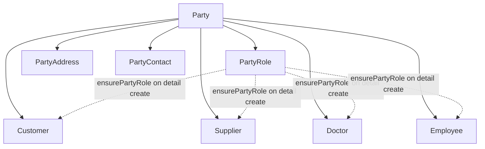

# Party module — agent memory model

Implementation-grounded reference for `backend/src/party/`. For table-level domain design, see [party_management.md](../../../docs/pharmacy_erp_architecture_docs/database/tables/party_management/party_management.md).

This module is the **canonical CRUD template** for backend feature modules. Inventory and other modules mirror its patterns (thin controllers, `unitOfWork.run` writes, nested child routes, audit + outbox).

---

## 1. Module snapshot

| Item | Value |
|------|-------|
| **Purpose** | Org-global master data for persons/organizations; shared identity (`Party`) + shared children (roles, addresses, contacts) + role-specific detail tables (customer, supplier, doctor, employee) |
| **Module** | [`party.module.ts`](../../../backend/src/party/party.module.ts) |
| **Controllers** | 8 (1 header + 3 nested child + 4 role-detail) |
| **Services** | 8 (+ `party.service.spec.ts`, `customer.service.spec.ts`) |
| **Exports** | `PartyService`, `CustomerService`, `SupplierService`, `DoctorService`, `EmployeeService` |
| **Template role** | Reference CRUD implementation — inventory aligns to this module |

---

## 2. Domain model

### Golden rules

1. **Reads** use `prisma.client`; **writes** use `unitOfWork.run(tx => …)` only.
2. **All mutations** — `auditService.log` + `outboxService.enqueue` in the same `tx` (`AuditModule.PARTY`).
3. **Org-global** — no branch scoping on list/get. `RequestContext` is used for `deletedBy` on party delete only.
4. **Two nesting patterns** (do not conflate):
   - **Shared children** (`/parties/:partyId/roles`, `addresses`, `contacts`): parent `partyId` from **route param**, not body.
   - **Role details** (`/customers`, `/suppliers`, `/doctors`, `/employees`): `partyId` in **create body**, top-level routes.
5. **Role detail create** calls `ensurePartyRole(tx, partyId, roleType)` — auto-creates `PartyRole` if missing.
6. **Party delete** blocked when any active child exists (customer, supplier, doctor, employee, role, contact, address) — see [`party.service.ts`](../../../backend/src/party/services/party.service.ts) `delete()`.
7. **Soft-delete restore** — role detail entities restore a soft-deleted row for the same `partyId` on create instead of inserting a duplicate.

---

## 3. Lifecycle rules

No workflow endpoints. Lifecycle is enforced via soft-delete, optimistic locking, and service guards.

| Rule | Enforcement |
|------|-------------|
| Soft delete | `deletedAt` timestamp; list/get filter `deletedAt: null` |
| Optimistic lock | Update/delete require `version`; `updateMany` + `optimisticUpdate()` |
| Unique business codes | `assertUniqueBusinessCode` on customer/supplier/doctor/employee codes |
| Unique party role | One active `PartyRole` per `(partyId, roleType)` |
| Default address | Creating address with `isDefault: true` clears other defaults of same `addressType` |
| Active party filter | `activePartyFilter` (`party: { deletedAt: null }`) on role-detail list/get |

---

## 4. API catalog

Permissions use `MODULE:RESOURCE:ACTION` format (built at login from seed `module`/`resource`/`action` in [`auth.service.ts`](../../../backend/src/auth/auth.service.ts)). Delete endpoints require `DeleteEntityQueryDto` (`version` query param). All list endpoints use [`PaginationQueryDto`](../../../backend/src/common/dto/pagination-query.dto.ts).

### Party — header

| Method | Path | Permission |
|--------|------|------------|
| GET | `/parties` | `PARTY:PARTY:READ` |
| GET | `/parties/:id` | `PARTY:PARTY:READ` |
| POST | `/parties` | `PARTY:PARTY:CREATE` |
| PATCH | `/parties/:id` | `PARTY:PARTY:UPDATE` |
| DELETE | `/parties/:id` | `PARTY:PARTY:DELETE` |

### Party roles (`/parties/:partyId/roles`)

| Method | Path | Permission |
|--------|------|------------|
| GET | `/` | `PARTY:PARTY:READ` |
| GET | `/:id` | `PARTY:PARTY:READ` |
| POST | `/` | `PARTY:PARTY:CREATE` |
| PATCH | `/:id` | `PARTY:PARTY:UPDATE` |
| DELETE | `/:id` | `PARTY:PARTY:DELETE` |

Parent `partyId` from route only — not in create body.

### Party addresses (`/parties/:partyId/addresses`)

Same CRUD pattern and `PARTY:PARTY:*` permissions as roles.

### Party contacts (`/parties/:partyId/contacts`)

Same CRUD pattern and `PARTY:PARTY:*` permissions as roles.

### Customer — role detail

| Method | Path | Permission |
|--------|------|------------|
| GET | `/customers` | `PARTY:CUSTOMER:READ` |
| GET | `/customers/:id` | `PARTY:CUSTOMER:READ` |
| POST | `/customers` | `PARTY:CUSTOMER:CREATE` |
| PATCH | `/customers/:id` | `PARTY:CUSTOMER:UPDATE` |
| DELETE | `/customers/:id` | `PARTY:CUSTOMER:DELETE` |

Create body includes `partyId`. Create also calls `ensurePartyRole(..., CUSTOMER)`.

### Supplier — role detail

| Method | Path | Permission |
|--------|------|------------|
| GET | `/suppliers` | `PARTY:SUPPLIER:READ` |
| GET | `/suppliers/:id` | `PARTY:SUPPLIER:READ` |
| POST | `/suppliers` | `PARTY:SUPPLIER:CREATE` |
| PATCH | `/suppliers/:id` | `PARTY:SUPPLIER:UPDATE` |
| DELETE | `/suppliers/:id` | `PARTY:SUPPLIER:DELETE` |

### Doctor — role detail

| Method | Path | Permission |
|--------|------|------------|
| GET | `/doctors` | `PARTY:DOCTOR:READ` |
| GET | `/doctors/:id` | `PARTY:DOCTOR:READ` |
| POST | `/doctors` | `PARTY:DOCTOR:CREATE` |
| PATCH | `/doctors/:id` | `PARTY:DOCTOR:UPDATE` |
| DELETE | `/doctors/:id` | `PARTY:DOCTOR:DELETE` |

### Employee — role detail

| Method | Path | Permission |
|--------|------|------------|
| GET | `/employees` | `PARTY:EMPLOYEE:READ` |
| GET | `/employees/:id` | `PARTY:EMPLOYEE:READ` |
| POST | `/employees` | `PARTY:EMPLOYEE:CREATE` |
| PATCH | `/employees/:id` | `PARTY:EMPLOYEE:UPDATE` |
| DELETE | `/employees/:id` | `PARTY:EMPLOYEE:DELETE` |

---

## 5. Layer map

### Controllers (`controllers/`)

| File | Base path |
|------|-----------|
| `party.controller.ts` | `parties` |
| `party-role.controller.ts` | `parties/:partyId/roles` |
| `party-address.controller.ts` | `parties/:partyId/addresses` |
| `party-contact.controller.ts` | `parties/:partyId/contacts` |
| `customer.controller.ts` | `customers` |
| `supplier.controller.ts` | `suppliers` |
| `doctor.controller.ts` | `doctors` |
| `employee.controller.ts` | `employees` |

### Services (`services/`)

| Service | Responsibility |
|---------|----------------|
| `party.service.ts` | Party CRUD; delete guarded by active children |
| `party-role.service.ts` | Nested role CRUD; unique `(partyId, roleType)` |
| `party-address.service.ts` | Nested address CRUD; default-address clearing |
| `party-contact.service.ts` | Nested contact CRUD |
| `customer.service.ts` | Customer CRUD; `ensurePartyRole`, soft-delete restore |
| `supplier.service.ts` | Supplier CRUD; same patterns as customer |
| `doctor.service.ts` | Doctor CRUD; same patterns as customer |
| `employee.service.ts` | Employee CRUD; same patterns as customer |

### DTOs (`dto/`) — 16 files

**Create / update pairs:** `party`, `party-role`, `party-address`, `party-contact`, `customer`, `supplier`, `doctor`, `employee`.

No module-specific list-query DTOs — all lists use shared `PaginationQueryDto`.

### Mappers (`mappers/`) — 8 files

`party`, `party-role`, `party-address`, `party-contact`, `customer`, `supplier`, `doctor`, `employee`.

Each exports `{Entity}Response` + `to{Entity}Response()`.

### Supporting

| File | Role |
|------|------|
| `constants/party.constants.ts` | Domain enums for `@IsIn` validation |
| `utils/party.util.ts` | Serializers, asserts, `ensurePartyRole`, `assertUniqueBusinessCode`, `optimisticUpdate` |

---

## 6. DTO conventions

- **Update DTOs:** required `version` (`@IsInt() @Min(1)`); all other fields `@IsOptional()`.
- **Nested child create** (address, contact, role): no `partyId` in body.
- **Role detail create** (customer, supplier, doctor, employee): `partyId` required via `OptionalBigIntField()`.
- **Do not expose in create DTOs:** `uuid`, `version`, `createdAt`, `updatedAt`, `deletedAt`, `outstandingAmount` (server-managed on customer/supplier).
- **Enums** from `party.constants.ts`: `PartyType`, `PartyRoleType`, `AddressType`, `ContactType`, `CustomerType`, `SupplierType`.
- **Decimals:** `@Type(() => Number)`, `@IsNumber({ maxDecimalPlaces: 2 })`, `@Min(0)` where non-negative.
- **Dates:** `joiningDate` on employee uses `OptionalBigIntField()` (epoch ms); mappers use `serializeDate` for `Date` columns where applicable.
- **List/delete:** reuse `PaginationQueryDto`, `DeleteEntityQueryDto` from `common/dto/`.

---

## 7. Mapper conventions

- One-way `entity → response` only; services map DTO → Prisma inline.
- IDs and FKs: `bigint` → `string` via `.toString()` or `serializeBigInt`.
- `Decimal` → `number` via `serializeDecimal`; `Date` → ISO string via `serializeDate`.
- No nested relation objects in responses — flat FK IDs only.
- Timestamps (`createdAt`, etc.) remain `bigint` in response types (global JSON serializer stringifies on wire).

---

## 8. Service patterns

| Operation | Pattern |
|-----------|---------|
| `list` / `getById` | `this.prisma.client.*`, `deletedAt: null`, optional `query.search` |
| `create` / `update` / `delete` | `this.unitOfWork.run(async (tx) => { … })` |
| Nested routes | `assertPartyExists(tx, partyId)` before write |
| Role detail create | `ensurePartyRole` + `assertUniqueBusinessCode` + soft-delete restore for same `partyId` |
| Optimistic lock | `updateMany({ where: { id, version } })` then `optimisticUpdate(result, id)` |
| Party delete | Check all child tables for active rows; reject if any exist |

**Typical create flow (role detail):**

1. Validate party exists
2. `ensurePartyRole(tx, partyId, roleType)`
3. `assertUniqueBusinessCode` for business code field
4. Reject if active row exists for `partyId`; else restore soft-deleted row or insert new
5. Audit + outbox in same transaction

---

## 9. Cross-cutting references

| Concern | Location |
|---------|----------|
| Error codes | [`error-code.ts`](../../../backend/src/common/exceptions/error-code.ts) — `PARTY_NOT_FOUND`, `PARTY_ROLE_NOT_FOUND`, `PARTY_ADDRESS_NOT_FOUND`, `PARTY_CONTACT_NOT_FOUND`, `CUSTOMER_NOT_FOUND`, `SUPPLIER_NOT_FOUND`, `DOCTOR_NOT_FOUND`, `EMPLOYEE_NOT_FOUND` |
| Outbox types | [`entity-type.constants.ts`](../../../backend/src/persistence/outbox/entity-type.constants.ts) — `PARTY`, `PARTY_ROLE`, `PARTY_ADDRESS`, `PARTY_CONTACT`, `CUSTOMER`, `SUPPLIER`, `DOCTOR`, `EMPLOYEE` |
| Permissions seed | [`permission.json`](../../../backend/seed/data/security/permission.json) — `PARTY_*`, `CUSTOMER_*`, `SUPPLIER_*`, `DOCTOR_*`, `EMPLOYEE_*`, `REPORT_PARTY_VIEW` |
| Audit module | `AuditModule.PARTY` |
| Reporting | [`party-reports.provider.ts`](../../../backend/src/reporting/providers/party/party-reports.provider.ts) |

---

## 10. Reporting (implemented)

Three reports registered at module init in [`party-reports.provider.ts`](../../../backend/src/reporting/providers/party/party-reports.provider.ts):

| Report ID | Name | Permission |
|-----------|------|------------|
| `party.customer-list` | Customer List | `REPORT_PARTY_VIEW` (`ReportPermission.PARTY_VIEW`) |
| `party.supplier-list` | Supplier List | `REPORT_PARTY_VIEW` |
| `party.customer-outstanding` | Customer Outstanding | `REPORT_PARTY_VIEW` |

Reports use `PrismaService` directly (read-only, no UnitOfWork). Customer/supplier list joins `party` for `displayName`; supports `search` and optional `createdAt` date filter.

---

## 11. Out of scope / follow-ups

- E2E HTTP tests for party endpoints
- Angular / Electron API client types
- Automatic cascade delete of party children
- `ADMIN` / `OTHER` role detail tables (only `PartyRole` row, no detail entity)
- List-query DTOs with entity-specific filters (only generic pagination today)
- Doctor/employee list reports (only customer/supplier/outstanding implemented)

---

## 12. Related documentation

- [party_management.md](../../../docs/pharmacy_erp_architecture_docs/database/tables/party_management/party_management.md) — table specs and business rules
- [persistence-patterns.md](../../../docs/pharmacy_erp_architecture_docs/database/persistence-patterns.md) — UnitOfWork, outbox
- [extending-the-backend.md](../../../docs/pharmacy_erp_architecture_docs/architecture/extending-the-backend.md) — general module recipe (uses party as example)
- [reporting.md](../../../docs/pharmacy_erp_architecture_docs/architecture/reporting.md) — report registry pattern
- Inventory consumer: [inventory-module.md](inventory-module.md) — documents alignment to this module
