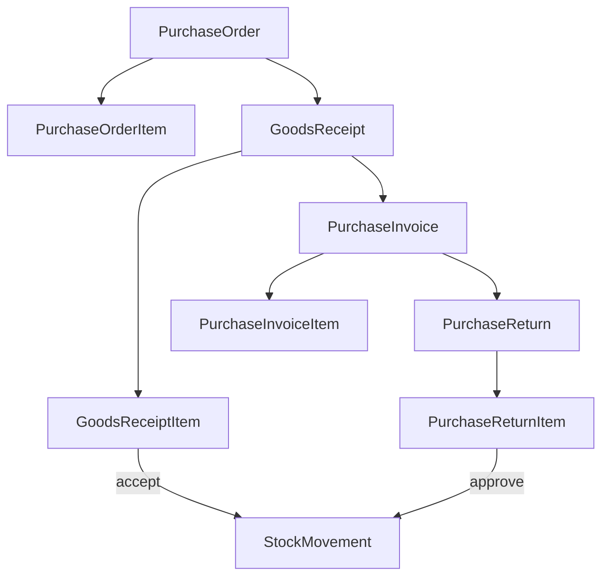

# Purchase module — agent memory model

Implementation-grounded reference for `backend/src/purchase/`. For table-level domain design, see [purchase.md](../../../docs/pharmacy_erp_architecture_docs/database/tables/purchase/purchase.md).

---

## 1. Module snapshot

| Item | Value |
|------|-------|
| **Purpose** | Procurement lifecycle: PO, GRN (inventory inbound), supplier invoice, purchase return (inventory outbound) |
| **Module** | [`purchase.module.ts`](../../../backend/src/purchase/purchase.module.ts) |
| **Controllers** | 8 (4 headers + 4 nested item controllers) |
| **Services** | 8 |
| **Exports** | None |
| **Inventory alignment** | GRN accept / return approve call `InventoryLedgerService`; invoice post does not touch stock |
| **Finance alignment** | Invoice post/cancel call `LedgerPostingService` + supplier outstanding (see finance module) |

---

## 2. Domain model

### Golden rules

1. **Never** update `Stock.availableQuantity` directly — use `InventoryLedgerService.applyMovement` inside `unitOfWork.run`.
2. **PO and Invoice do not change stock** — GRN accept is the inbound boundary; return approve is outbound.
3. **Branch-scoped** via `RequestContext` (`getTenantScope` + `withBranchScope`).
4. **Document numbers** — `PURCHASE_ORDER`, `GOODS_RECEIPT`, `PURCHASE_INVOICE`, `PURCHASE_RETURN` via `SequenceGeneratorService`.
5. **All mutations** — `auditService.log` + `outboxService.enqueue` in same `tx` (`AuditModule.PURCHASE`).
6. **GRN without PO** — `SettingKey.PURCHASE_ALLOW_GRN_WITHOUT_PO` (default false).

---

## 3. API catalog

Permissions use `PURCHASE:RESOURCE:ACTION`. Delete endpoints require `DeleteEntityQueryDto` (`version` query param).

### List query filters

Header list endpoints (`GET /purchase-orders`, `/goods-receipts`, `/purchase-invoices`, `/purchase-returns`) extend pagination with:

| Query param | Applies to |
|-------------|------------|
| `status` | All four |
| `supplierId` | All four |
| `fromDate`, `toDate` | All four (document date field per type) |
| `purchaseOrderId` | GRN only |

### Purchase Order — header

| Method | Path | Permission |
|--------|------|------------|
| GET | `/purchase-orders` | `PURCHASE:PURCHASE_ORDER:READ` |
| GET | `/purchase-orders/:id` | `PURCHASE:PURCHASE_ORDER:READ` |
| POST | `/purchase-orders` | `PURCHASE:PURCHASE_ORDER:CREATE` |
| PATCH | `/purchase-orders/:id` | `PURCHASE:PURCHASE_ORDER:UPDATE` |
| DELETE | `/purchase-orders/:id` | `PURCHASE:PURCHASE_ORDER:DELETE` |
| POST | `/purchase-orders/:id/submit` | `PURCHASE:PURCHASE_ORDER:SUBMIT` |
| POST | `/purchase-orders/:id/approve` | `PURCHASE:PURCHASE_ORDER:APPROVE` |
| POST | `/purchase-orders/:id/reject` | `PURCHASE:PURCHASE_ORDER:REJECT` |
| POST | `/purchase-orders/:id/send` | `PURCHASE:PURCHASE_ORDER:SEND` |
| POST | `/purchase-orders/:id/force-close` | `PURCHASE:PURCHASE_ORDER:FORCE_CLOSE` |
| POST | `/purchase-orders/:id/cancel` | `PURCHASE:PURCHASE_ORDER:CANCEL` |

### Purchase Order — items (`/purchase-orders/:purchaseOrderId/items`)

Nested CRUD at `/purchase-orders/:purchaseOrderId/items`: `POST` → `CREATE`, `PATCH` → `UPDATE`, `DELETE` → `DELETE`, `GET` → `READ`. Same pattern for GRN, invoice, and return item controllers.

### Goods Receipt — header

| Method | Path | Permission |
|--------|------|------------|
| POST | `/goods-receipts/:id/submit-inspection` | `PURCHASE:GOODS_RECEIPT:SUBMIT_INSPECTION` |
| POST | `/goods-receipts/:id/accept` | `PURCHASE:GOODS_RECEIPT:ACCEPT` |
| POST | `/goods-receipts/:id/reject` | `PURCHASE:GOODS_RECEIPT:REJECT` |
| POST | `/goods-receipts/:id/cancel` | `PURCHASE:GOODS_RECEIPT:CANCEL` |

Plus standard list/get/create/patch/delete with `GOODS_RECEIPT` permissions.

### Purchase Invoice — header

| Method | Path | Permission |
|--------|------|------------|
| POST | `/purchase-invoices/:id/post` | `PURCHASE:PURCHASE_INVOICE:POST` |
| POST | `/purchase-invoices/:id/cancel` | `PURCHASE:PURCHASE_INVOICE:CANCEL` (blocked when `paidAmount > 0`; cancel finance payments first) |

### Purchase Return — header

| Method | Path | Permission |
|--------|------|------------|
| POST | `/purchase-returns/:id/submit` | `PURCHASE:PURCHASE_RETURN:SUBMIT` |
| POST | `/purchase-returns/:id/approve` | `PURCHASE:PURCHASE_RETURN:APPROVE` |
| POST | `/purchase-returns/:id/reject` | `PURCHASE:PURCHASE_RETURN:REJECT` |
| POST | `/purchase-returns/:id/cancel` | `PURCHASE:PURCHASE_RETURN:CANCEL` |

---

## 4. Layer map

| File | Base path |
|------|-----------|
| `purchase-order.controller.ts` | `purchase-orders` |
| `purchase-order-item.controller.ts` | `purchase-orders/:purchaseOrderId/items` |
| `goods-receipt.controller.ts` | `goods-receipts` |
| `goods-receipt-item.controller.ts` | `goods-receipts/:goodsReceiptId/items` |
| `purchase-invoice.controller.ts` | `purchase-invoices` |
| `purchase-invoice-item.controller.ts` | `purchase-invoices/:purchaseInvoiceId/items` |
| `purchase-return.controller.ts` | `purchase-returns` |
| `purchase-return-item.controller.ts` | `purchase-returns/:purchaseReturnId/items` |

---

## 5. Not implemented

Unit/persistence/e2e tests, Angular clients, reporting providers.
