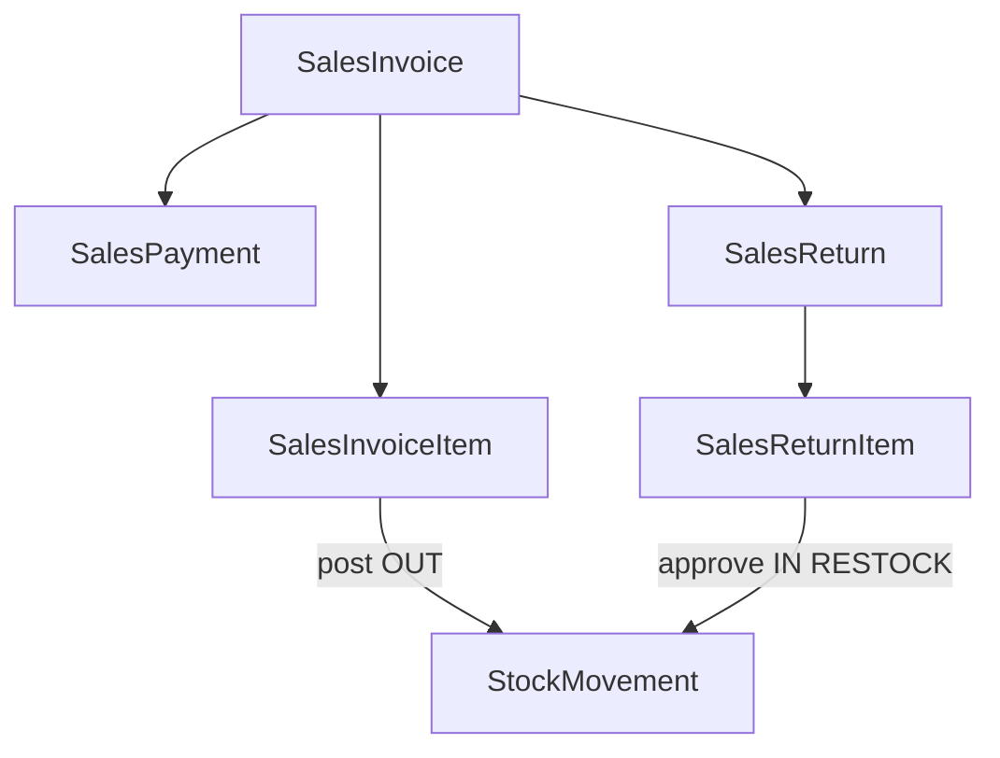

# Sales module — agent memory model

Implementation-grounded reference for `backend/src/sales/`.

---

## 1. Module snapshot

| Item | Value |
|------|-------|
| **Purpose** | Retail/pharmacy sales: invoice, payments, returns |
| **Module** | [`sales.module.ts`](../../../backend/src/sales/sales.module.ts) |
| **Controllers** | 5 (3 headers + 2 nested item/payment controllers) |
| **Services** | 5 |
| **Exports** | None |
| **Inventory alignment** | Invoice post OUT; cancel/return approve IN via `InventoryLedgerService` |
| **Finance alignment** | Invoice post/payment/return via `LedgerPostingService` + `finance.util` helpers |

---

## 2. Domain model

### Golden rules

1. Stock changes only through `InventoryLedgerService.applyMovement`.
2. FEFO batch reallocation and PriceList pricing at invoice **post**.
3. Branch-scoped via `getTenantScope` + `withBranchScope`.
4. Sequences: `SALES_INVOICE` (at post), `SALES_PAYMENT`, `SALES_RETURN`.
5. Audit + outbox in same tx (`AuditModule.SALES`).

---

## 3. API catalog

Permissions use `SALES:RESOURCE:ACTION`. Delete endpoints require `DeleteEntityQueryDto` (`version` query param).

### Sales Invoice — header (`/sales-invoices`)

| Method | Path | Permission |
|--------|------|------------|
| GET | `/sales-invoices` | `SALES:SALES_INVOICE:READ` |
| GET | `/sales-invoices/:id` | `SALES:SALES_INVOICE:READ` |
| POST | `/sales-invoices` | `SALES:SALES_INVOICE:CREATE` |
| PATCH | `/sales-invoices/:id` | `SALES:SALES_INVOICE:UPDATE` |
| DELETE | `/sales-invoices/:id` | `SALES:SALES_INVOICE:DELETE` |
| POST | `/sales-invoices/:id/post` | `SALES:SALES_INVOICE:POST` |
| POST | `/sales-invoices/:id/cancel` | `SALES:SALES_INVOICE:CANCEL` |

### Sales Invoice — items (`/sales-invoices/:salesInvoiceId/items`)

Nested CRUD; permissions use `SALES_INVOICE` (`READ`/`UPDATE`).

### Sales Payment (`/sales-invoices/:salesInvoiceId/payments`)

| Method | Path | Permission |
|--------|------|------------|
| POST | `.../payments/:id/complete` | `SALES:SALES_PAYMENT:COMPLETE` |
| POST | `.../payments/:id/cancel` | `SALES:SALES_PAYMENT:CANCEL` |

Plus standard nested CRUD with `SALES_PAYMENT` permissions.

### Sales Return — header (`/sales-returns`)

| Method | Path | Permission |
|--------|------|------------|
| POST | `/sales-returns/:id/approve` | `SALES:SALES_RETURN:APPROVE` |
| POST | `/sales-returns/:id/cancel` | `SALES:SALES_RETURN:CANCEL` |

Plus standard list/get/create/patch/delete with `SALES_RETURN` permissions.

### Sales Return — items (`/sales-returns/:salesReturnId/items`)

Nested CRUD; `RESTOCK` disposition only.

---

## 4. Layer map

| File | Base path |
|------|-----------|
| `sales-invoice.controller.ts` | `sales-invoices` |
| `sales-invoice-item.controller.ts` | `sales-invoices/:salesInvoiceId/items` |
| `sales-payment.controller.ts` | `sales-invoices/:salesInvoiceId/payments` |
| `sales-return.controller.ts` | `sales-returns` |
| `sales-return-item.controller.ts` | `sales-returns/:salesReturnId/items` |

---

## 5. Settings

| Key | Purpose |
|-----|---------|
| `sales.enforce_mrp_cap` | Cap unit price at MRP from price list |
| `sales.allow_expired_sale` | Allow FEFO to pick expired batches on post |
| `sales.allow_expired_customer_return` | Allow return of expired batches |

---

## 6. Not implemented

Unit/persistence/e2e tests, Angular clients, loyalty integration, non-RESTOCK dispositions.
