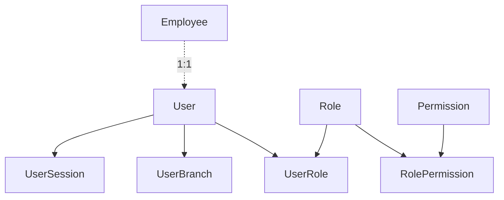

# Security module — agent memory model

Implementation-grounded reference for `backend/src/security/`. Auth endpoints remain in `backend/src/auth/`. Table specs: [user_and_security.md](../../../docs/pharmacy_erp_architecture_docs/database/tables/user_and_security/user_and_security.md).

---

## 1. Module snapshot

| Item | Value |
|------|-------|
| **Purpose** | RBAC admin — users, roles, permissions, branch access, session management |
| **Module** | [`security.module.ts`](../../../backend/src/security/security.module.ts) |
| **Controllers** | 7 (4 top-level + 3 nested junction) |
| **Services** | 7 |
| **Exports** | `UserService` |
| **Auth split** | `auth/` — login, logout, refresh, me, change-password |

---

## 2. Domain model

### Golden rules

1. **Reads** use `prisma.client`; **writes** use `unitOfWork.run(tx => …)` only.
2. **All mutations** — `auditService.log` + `outboxService.enqueue` in the same `tx` (`AuditModule.SECURITY`).
3. **Org-global** admin APIs — no branch filter on list/get.
4. **Nested junctions** — `userId` / `roleId` from route param, not create body.
5. **Session invalidation** — `invalidateUserSessions` / `invalidateSessionsForRole` on security-sensitive changes.
6. **Passwords** — hash via `PasswordService`; never return `passwordHash`.

---

## 3. API catalog

Permissions use `SECURITY:RESOURCE:ACTION` format. Delete endpoints require `DeleteEntityQueryDto` (`version` query param).

### Users — `/users`

| Method | Path | Permission |
|--------|------|------------|
| GET | `/users` | `SECURITY:USER:READ` |
| GET | `/users/:id` | `SECURITY:USER:READ` |
| POST | `/users` | `SECURITY:USER:CREATE` |
| PATCH | `/users/:id` | `SECURITY:USER:UPDATE` |
| DELETE | `/users/:id` | `SECURITY:USER:DELETE` |
| POST | `/users/:id/reset-password` | `SECURITY:USER:RESET_PASSWORD` |
| POST | `/users/:id/unlock` | `SECURITY:USER:UNLOCK` |

Create body: `employeeId`, `username`, `password`, `isActive?`, `mustChangePassword?`. Update: `isActive`, `mustChangePassword` only (not `employeeId`).

### User branches — `/users/:userId/branches`

| Method | Path | Permission |
|--------|------|------------|
| GET | `/` | `SECURITY:USER_BRANCH:READ` |
| GET | `/:id` | `SECURITY:USER_BRANCH:READ` |
| POST | `/` | `SECURITY:USER_BRANCH:CREATE` |
| PATCH | `/:id` | `SECURITY:USER_BRANCH:UPDATE` |
| DELETE | `/:id` | `SECURITY:USER_BRANCH:DELETE` |

### User roles — `/users/:userId/roles`

| Method | Path | Permission |
|--------|------|------------|
| GET | `/` | `SECURITY:USER_ROLE:READ` |
| GET | `/:id` | `SECURITY:USER_ROLE:READ` |
| POST | `/` | `SECURITY:USER_ROLE:CREATE` |
| PATCH | `/:id` | `SECURITY:USER_ROLE:UPDATE` |
| DELETE | `/:id` | `SECURITY:USER_ROLE:DELETE` |
| PUT | `/replace` | `SECURITY:USER_ROLE:REPLACE` |

### Roles — `/roles`

| Method | Path | Permission |
|--------|------|------------|
| GET | `/roles` | `SECURITY:ROLE:READ` |
| GET | `/roles/:id` | `SECURITY:ROLE:READ` |
| POST | `/roles` | `SECURITY:ROLE:CREATE` |
| PATCH | `/roles/:id` | `SECURITY:ROLE:UPDATE` |
| DELETE | `/roles/:id` | `SECURITY:ROLE:DELETE` |

### Role permissions — `/roles/:roleId/permissions`

| Method | Path | Permission |
|--------|------|------------|
| GET | `/` | `SECURITY:ROLE_PERMISSION:READ` |
| GET | `/:id` | `SECURITY:ROLE_PERMISSION:READ` |
| POST | `/` | `SECURITY:ROLE_PERMISSION:CREATE` |
| PATCH | `/:id` | `SECURITY:ROLE_PERMISSION:UPDATE` |
| DELETE | `/:id` | `SECURITY:ROLE_PERMISSION:DELETE` |
| PUT | `/replace` | `SECURITY:ROLE_PERMISSION:REPLACE` |

### Permissions — `/permissions`

| Method | Path | Permission |
|--------|------|------------|
| GET | `/permissions` | `SECURITY:PERMISSION:READ` |
| GET | `/permissions/:id` | `SECURITY:PERMISSION:READ` |
| POST | `/permissions` | `SECURITY:PERMISSION:CREATE` |
| PATCH | `/permissions/:id` | `SECURITY:PERMISSION:UPDATE` |
| DELETE | `/permissions/:id` | `SECURITY:PERMISSION:DELETE` |

### User sessions — `/user-sessions`

| Method | Path | Permission |
|--------|------|------------|
| GET | `/user-sessions` | `SECURITY:USER_SESSION:READ` |
| GET | `/user-sessions/:id` | `SECURITY:USER_SESSION:READ` |
| POST | `/user-sessions/:id/force-logout` | `SECURITY:USER_SESSION:FORCE_LOGOUT` |

List supports optional `userId`, `isActive` filters via `UserSessionListQueryDto`.

### Auth — `/auth` (not in security module)

| Method | Path | Auth |
|--------|------|------|
| POST | `/auth/change-password` | JWT required; verifies current password, invalidates sessions |

---

## 4. Layer map

### Controllers (`controllers/`)

| File | Base path |
|------|-----------|
| `user.controller.ts` | `users` |
| `user-branch.controller.ts` | `users/:userId/branches` |
| `user-role.controller.ts` | `users/:userId/roles` |
| `role.controller.ts` | `roles` |
| `role-permission.controller.ts` | `roles/:roleId/permissions` |
| `permission.controller.ts` | `permissions` |
| `user-session.controller.ts` | `user-sessions` |

### Services (`services/`)

| Service | Responsibility |
|---------|----------------|
| `user.service.ts` | User CRUD, reset-password, unlock; session invalidation on deactivate/delete/reset |
| `user-branch.service.ts` | Nested branch assignment CRUD |
| `user-role.service.ts` | Nested role assignment CRUD + replace |
| `role.service.ts` | Role CRUD; delete blocked when assigned to users |
| `role-permission.service.ts` | Nested permission grant CRUD + replace |
| `permission.service.ts` | Permission CRUD; delete blocked when granted to roles |
| `user-session.service.ts` | Session list/get + force-logout |

### Supporting

| File | Role |
|------|------|
| `constants/security.constants.ts` | `LogoutReason` enum |
| `utils/security.util.ts` | Serializers, asserts, `optimisticUpdate`, `throwNotFound` |
| `utils/session.util.ts` | `invalidateUserSessions`, `invalidateSessionsForRole` |

---

## 5. Cross-cutting references

| Concern | Location |
|---------|----------|
| Error codes | [`error-code.ts`](../../../backend/src/common/exceptions/error-code.ts) — `USER_NOT_FOUND`, `ROLE_NOT_FOUND`, `PERMISSION_NOT_FOUND`, etc. |
| Outbox types | [`entity-type.constants.ts`](../../../backend/src/persistence/outbox/entity-type.constants.ts) — `USER`, `ROLE`, `PERMISSION`, `USER_ROLE`, `ROLE_PERMISSION`, `USER_BRANCH`, `USER_SESSION` |
| Permissions seed | [`permission.json`](../../../backend/seed/data/security/permission.json) — `SECURITY_*` (30 permissions) |
| Audit module | `AuditModule.SECURITY` |
| Password hashing | `PasswordService` from `AuthModule` (exported) |

---

## 6. Out of scope / follow-ups

- Unit/persistence/e2e tests
- Angular / Electron API client types
- MFA, password complexity policy settings
- Self-service user profile beyond change-password

---

## 7. Related documentation

- [user_and_security.md](../../../docs/pharmacy_erp_architecture_docs/database/tables/user_and_security/user_and_security.md) — table specs
- [security.md](../../../docs/pharmacy_erp_architecture_docs/architecture/security.md) — auth architecture
- [persistence-patterns.md](../../../docs/pharmacy_erp_architecture_docs/database/persistence-patterns.md) — UnitOfWork, outbox
- Party CRUD template: [party-module.md](party-module.md)
