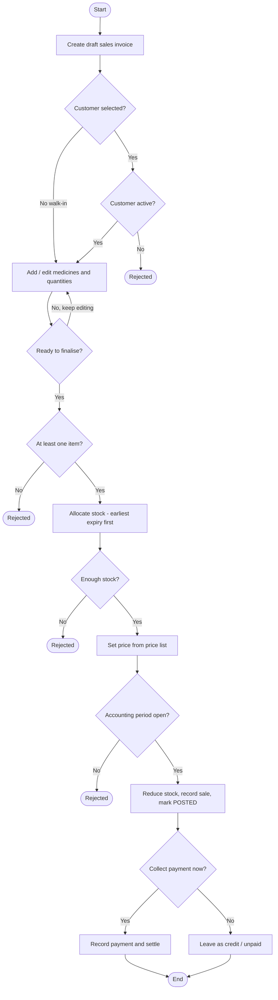

# End-to-end flow diagram design
_Exported on 9/20/2026 at 13:40:31 GMT+5:30 from Cursor (3.20.21)_

---

**User**

I want special flow diagram which is kind of combination of flow chart and table or tables in which data gets inserted for every action or steps.  so that I can visiualise that as developer/architect of the system

1] diagram should be end to end
2] It should have all steps mapped
3] it should cover all variations
4] all secondaru actions as well
5] no vatiationor decision dshould be left from this diagram.

Before generating or giving your opinion First tell me should we generate 1 diagram or multiple digrams.

I want draw.ion  type digrams fromat

---

**Cursor**

I'll first understand the scope of "the system" so my recommendation (1 vs. multiple diagrams) is grounded in your actual codebase. Let me explore.

Graphify CLI can't run in this sandbox. Let me look at the module structure and any wiki/graph output directly.

There's a `workflows/` folder. Let me check what business flows are documented to ground my recommendation.

I explored your codebase enough to answer this well. Here's the short version first, then the reasoning.

## Recommendation: Multiple diagrams (a small hierarchy), not one

For *this* system, a single diagram cannot satisfy all five of your requirements at once. Your requirements #1 (end-to-end) and #3–#5 (all variations, all secondary actions, no decision left out) actively fight each other on a single canvas. The system is too broad:

Your backend has ~13 bounded modules and the `workflows/` docs already define **9 distinct end-to-end processes**:

- `sales-flow`, `purchase-flow`, `inventory-flow`, `payment-flow`, `return-flow`, `stock-adjustment`, `stock-transfer`, `month-end-closing`, plus prescription

Each of those writes to **many tables per step** (business document + `StockMovement` + `Stock` + `Sequence` + `Outbox` + `Audit`/`ChangeHistory` + ledger, all inside one `UnitOfWork` transaction). If you put every step, every decision branch, and every table-insert for all 9 processes on one draw.io page, you'd have several hundred nodes — it becomes unreadable and un-maintainable, which defeats the "so I can visualise it as architect" goal.

## What I actually recommend generating

A **3-layer set** (this is what preserves "end-to-end" *and* "nothing left out"):

1. **L0 — one System Process Map** (1 diagram): the 9 processes as boxes, showing how they hand off end-to-end (e.g. Purchase → GRN → Inventory → Sales → Payment → Return → Month-End). This is your "end-to-end" guarantee.

2. **L1 — one detailed diagram per process** (~9 diagrams): the flowchart-with-tables you described. Swimlanes for actors (User / Service / DB), every step, every decision/variation, every alternate + secondary action, and beside each step a **table node listing exactly which tables/columns get inserted/updated** with sample values.

3. **L1-shared — one "Cross-Cutting Persistence" reference** (1 diagram): the `UnitOfWork` + `Outbox` + `Sequence` + `Audit`/`ChangeHistory` + `InventoryLedger` side-effects that fire on *every* write. Every L1 diagram references this instead of redrawing it 9 times (keeps them clean without dropping any secondary action).

So: **~11 diagrams total**, all in draw.io (`.drawio` XML) format.

## Why not one, concretely

| Your requirement | Single diagram | Multi-diagram set |
|---|---|---|
| #1 End-to-end | ✅ but unreadable | ✅ via L0 map |
| #2 All steps mapped | ❌ too dense to trust | ✅ per L1 |
| #3 All variations | ❌ branch explosion | ✅ isolated per process |
| #4 Secondary actions | ❌ clutters main flow | ✅ shared L1 reference |
| #5 No decision left out | ❌ impossible to verify | ✅ verifiable per process |

## The "flowchart + table per step" format in draw.io

The pattern you're describing is best drawn as: a vertical **swimlane flowchart** on the left, and for each step a linked **table shape** (draw.io "table/grid" mxCell) on the right showing `Table | Column | Value written | Insert/Update`. Dashed connectors tie each step to its data-effect table. draw.io supports this natively, so it renders cleanly and stays editable.

---

Before I build anything (and note I'm in **Ask mode**, so I can only plan here — you'd switch to Agent mode to actually generate the files), one decision is yours:

**Flow-diagram scope & detail**

> **Which scope do you want the diagram set to cover?**
> - All 9 processes + L0 map + shared persistence ref (~11 diagrams) (Recommended)
> - Start with ONE process end-to-end (e.g. Sales) as a template, then expand ✔
> - Only the core money/stock flows: Purchase, Sales, Inventory, Payment, Return

> **How much data detail do you want in the per-step tables?**
> - Every affected table + column + sample value + Insert/Update flag (Recommended) ✔
> - Just which tables are touched per step (no column-level detail)

> **draw.io output preference**
> - Editable .drawio XML files committed in the repo (Recommended) ✔
> - .drawio + exported PNG/SVG previews too

Good choices. For the single "template" process, I recommend **Sales (sales invoice → dispense)** because it's the richest — it exercises inventory movement, pricing/tax, sequence numbering, ledger, outbox, and audit all at once, so the template will already cover patterns every other process reuses. Let me ground the plan in your actual code before I lay it out.

Let me read the actual sales invoice service, workflow DTO, and constants so the template captures the *real* steps, statuses, and table writes (not just the doc summary).

Perfect — grounding confirmed. I read the real `SalesInvoiceService` (create/update/delete/post/cancel + FEFO reallocation + reversal), the status constants, and the workflow DTO. Here's the concrete blueprint for the **Sales template diagram**, exactly matching your code. I'm in **Ask mode**, so this is the plan to approve — you'd switch to Agent mode for me to actually write the `.drawio` file.

## Diagram anatomy (the "flowchart + table" format)

A single `.drawio` page, laid out as **swimlanes on the left, a data-effects table beside every step**:

- **Swimlanes (columns):** `Actor/API` → `SalesInvoiceService` → `Guards/Validation` → `Persistence side-effects`
- **Flow nodes:** rounded = action, diamond = decision/variation, red rounded = error exit (with `ErrorCode`)
- **Data-effect table (right of each write step):** a draw.io table shape with columns `Table | Operation | Columns written | Sample value`, joined to its step by a dashed connector
- **Legend box** (top): shape meanings + a note that every write runs inside `unitOfWork.run(tx)`

## What the template will contain (the 5 Sales lifecycles, end-to-end)

Grounded in `sales-invoice.service.ts`, the full Sales process = **Invoice → (Payment | Return)**. The template covers the **Invoice lifecycle** in full detail, with Payment and Return as connected lanes.

### 1. Create draft — `create()`
Decisions: `assertBranchExists` → `branchId ≠ scope.branchId?` (FORBIDDEN) → `customerId?`→`assertCustomerActive` → `prescriptionId?`→`assertPrescriptionExists`.
Data effects table:

| Table | Op | Columns | Sample |
|---|---|---|---|
| SalesInvoice | INSERT | uuid, invoiceNumber=`DRAFT-xxxxxxxx`, status=`DRAFT`, paymentStatus=`UNPAID`, salesType=`RETAIL_OTC`, all amounts=0, createdBy, createdAt | … |
| AuditLog | INSERT | entityType=`SALES_INVOICE`, action=`CREATE`, module=`SALES` | … |
| Outbox | INSERT | entityUuid, operation=`CREATE`, payload | … |

### 2. Update / 3. Delete (DRAFT-only) — `update()` / `delete()`
Decisions: not-found → `assertDraftStatus` → optimistic `version` check (`optimisticUpdate`). Delete = soft-delete (`deletedAt`, `version++`). Each emits AuditLog(`UPDATE`/`DELETE`) + Outbox.

### 4. Post (DRAFT → POSTED) — `post()` — the richest node
Decisions/variations, each a diamond with a red exit:
- status ≠ DRAFT → `INVALID_DOCUMENT_STATUS`
- items = 0 → `DOCUMENT_HAS_NO_ITEMS`
- CREDIT && no customer → `CUSTOMER_REQUIRED_FOR_CREDIT`
- FEFO reallocation (`allowExpiredSale`), batch-split into extra lines, duplicate-batch guard → `CONFLICT`
- `enforceMrpCap` (cap unitPrice at MRP)
- `assertTransactionDateInOpenYear` (financial-year closed → error)

Secondary actions (each with its own data table):

| Step | Table(s) | Op | Key columns |
|---|---|---|---|
| Reallocate/price lines | SalesInvoiceItem | UPDATE/INSERT | batchId, soldQuantity, mrp, unitPrice, discount%, tax%, taxId, lineAmount |
| Stock OUT per line (`InventoryLedgerService`) | StockMovement | INSERT | direction=`OUT`, movementType=`SALES_INVOICE`, qty, unitCost, referenceTable/Id |
| " | Stock | UPDATE | availableQuantity −= qty (per branchId,batchId) |
| Sequence | SequenceGenerator | UPDATE | currentNumber++ → real invoiceNumber |
| Ledger (`postVoucher`) | LedgerEntry | INSERT | DR CUST001/CASH001, CR SALE001/GSTOUT001 |
| Outstanding | Customer/Party balance | UPDATE | outstanding += netAmount (if customerId) |
| Header | SalesInvoice | UPDATE | status=`POSTED`, gross/discount/tax/net, balance, version++ |
| Audit/Outbox | AuditLog, Outbox | INSERT | action=`POST` |

### 5. Cancel (DRAFT or POSTED → CANCELLED) — `cancel()`
Decisions: status ∉ cancellable → error; if POSTED: `paidAmount>0` → `SALES_INVOICE_HAS_PAYMENTS`; completed return exists → `SALES_INVOICE_HAS_RETURNS`; else `reversePostedSalesInvoiceEffects` → **reverse voucher (LedgerEntry)** + **Stock IN per line** + **outstanding reversal**. Then header → `CANCELLED`, AuditLog/Outbox.

**Connected lanes (stubs, expandable later):** SalesPayment (`PENDING→COMPLETED/CANCELLED`) and SalesReturn (`DRAFT→COMPLETED via approve/CANCELLED`), each feeding `recomputeSalesInvoiceSettlement` which rolls the invoice into `PARTIALLY_RETURNED`/`RETURNED`/`PAID`.

---

One genuine scope choice before I build it (in Agent mode):

**Sales template coverage**

> **How much of the Sales process should the first template diagram cover?**
> - Full Invoice lifecycle in detail + Payment & Return as connected stub lanes (Recommended) ✔
> - Full detail for ALL three documents (Invoice + Payment + Return) in one page — larger but complete
> - Only the Invoice lifecycle (create/update/delete/post/cancel), no Payment/Return

Plan is locked. Here's the finalized spec for the deliverable:

**File:** `docs/pharmacy_erp_architecture_docs/workflows/sales-invoice-flow.drawio` (editable draw.io XML)

**Coverage:** Full **Sales Invoice** lifecycle in detail — `create` → `update`/`delete` (DRAFT-only) → `post` (with FEFO, MRP-cap, FY-open, sequence, stock OUT, ledger, outstanding) → `cancel` (with POSTED reversal) — plus **Payment** and **Return** as connected stub lanes feeding settlement/status rollup.

**Format:** Swimlane flowchart (`Actor/API` · `SalesInvoiceService` · `Guards` · `Persistence side-effects`), every decision/variation as a diamond with a red `ErrorCode` exit, and a **data-effects table beside each write step** (`Table | Op | Columns | Sample`) joined by dashed connectors, with a legend noting all writes run inside `unitOfWork.run(tx)`.

Every branch, secondary action (StockMovement, Stock, SequenceGenerator, LedgerEntry, Customer outstanding, AuditLog, Outbox), and error exit I found in `sales-invoice.service.ts` will be represented — nothing omitted.

One catch: I'm currently in **Ask mode**, so I can only plan — I can't create the `.drawio` file here. To have me generate it, **switch this chat to Agent mode** and just say "go" (or "generate the diagram"). Once you do, I'll:

1. Write the `.drawio` XML with the layout above.
2. Optionally export a PNG/SVG preview and embed it here so you can eyeball it.

Want me to proceed that way? Switch to Agent mode and confirm, and I'll build it — then we can use it as the template to expand to the other 8 processes.

---

**User**

One more thing, if you thinks something is missing and should be added or covered, do add red block for that thing

---

**Cursor**

Good idea — I'll distinguish **two kinds of red blocks**: (a) the red *error-exit* nodes that already exist in code (`ErrorCode` throws), and (b) red *GAP* annotation blocks for things an architect would expect but that are **missing / not implemented**. Let me verify a few suspected gaps in the util layer before I assert them.

I read `sales.util.ts` in full, which corrects a couple of my earlier guesses and lets me pin the gaps precisely. Two of my suspected gaps are actually **handled** (so they're normal red error-exits, not gaps): insufficient stock → `STOCK_INSUFFICIENT` in `allocateFefoBatches`, and missing pricing → `PRICE_LIST_NOT_FOUND` / `PRICE_LIST_ITEM_NOT_FOUND`.

So I'll use **two visually distinct red styles** in the diagram:

- **Red (solid) = error-exit** — a real `throw` already in code (e.g. `INVALID_DOCUMENT_STATUS`, `DOCUMENT_HAS_NO_ITEMS`, `CUSTOMER_REQUIRED_FOR_CREDIT`, `STOCK_INSUFFICIENT`, `BATCH_EXPIRED`, `ENTITY_VERSION_CONFLICT`, `SALES_INVOICE_HAS_PAYMENTS/RETURNS`, `PRICE_LIST(_ITEM)_NOT_FOUND`).
- **Red dashed "⚠ GAP" callout** — something missing / worth covering, attached to the step it belongs to.

## The ⚠ GAP blocks I'll add (grounded in the code)

| # | GAP block text | Where it attaches | Evidence |
|---|---|---|---|
| 1 | **Round-off never applied at post.** `post()` computes `net = gross − discount + tax` and ignores `roundOffAmount`; the `rollupSalesInvoiceTotals` helper *does* add it but is never called on post → inconsistency; no API sets round-off. | `post()` totals step | `sales-invoice.service.ts` L420 vs `sales.util.ts` L417‑421 |
| 2 | **No inline payment capture.** OTC/cash sales post as `UNPAID` with full `balanceAmount`; cash collection needs a separate `SalesPayment`. Flow doc says "record payment if applicable," but `post()` doesn't. | after `post()` → Payment lane | flow doc step 8 vs `post()` |
| 3 | **Only RESTOCK return disposition supported.** `DAMAGED_QUARANTINE` / `DISCARD` constants exist but `assertRestockDisposition` rejects them. | Return stub lane | `sales.util.ts` L523‑532 |
| 4 | **No refund flow.** `SalesRefundMode` + `paymentStatus=REFUNDED` exist, but no refund action implemented. | Payment/Return lane | constants L77‑83 vs services |
| 5 | **Prescription is FK-only, no dispense hook.** `assertPrescriptionExists` validates existence but never marks it dispensed/consumed. | `create`/`post` prescription check | `sales.util.ts` L93‑112 (ADR‑219) |
| 6 | **No regulatory (Schedule‑H / controlled-substance) validation** — nothing forces scheduled medicines to require a prescription/doctor even though `salesType=PRESCRIPTION` & `doctorName` exist. *(flag for confirmation)* | `post()` validation band | absent in sales module |
| 7 | **No automated tests** for Sales (no `*.spec.ts`; unit/persistence/e2e all deferred). | legend/footer band | file listing + `sales-module.mdc` "Not implemented" |
| 8 | **No Angular/frontend client** for Sales (backend-only). | legend/footer band | `sales-module.mdc` |

Each GAP block will be a red dashed rounded box with the ⚠ prefix and a one-line "expected vs. actual," connected by a dotted line to the exact step so it reads as an annotation, not part of the happy path.

I'll keep #6 phrased as **"⚠ VERIFY / likely missing"** since it's a regulatory expectation I couldn't find enforced — that way it's flagged without asserting a false certainty.

---

This is now fully specced (layout + error-exits + gap blocks). I still can't write the file in **Ask mode** — switch to **Agent mode** and say "go", and I'll generate `sales-invoice-flow.drawio` with all of the above, then embed a preview here.

Want me to add anything else to the gap list, or shall we generate once you flip to Agent mode?

---

**User**

also along with draw.io yaml file create svg as well and write end to end plan for sale for now. we will review it and proceed for other modules one by one


---

**Cursor**

I have enough grounding from the code I've already read (`sales-invoice.service.ts`, `sales.util.ts`, constants, workflow DTO, flow doc). No further questions needed — scope is locked. Here's the plan.

---

**User**

Implement the plan as specified, it is attached for your reference. Do NOT edit the plan file itself.

To-do's from the plan have already been created. Do not create them again. Mark them as in_progress as you work, starting with the first one. Don't stop until you have completed all the to-dos.

---

**Cursor**

I'll start by marking the first todo in progress and reading the sales services so the diagram matches the real code paths.


I'll generate both files with a Python script so the layout stays consistent and complete across the large diagram.


The draw.io file looks solid. Next I'll expand the SVG so it properly mirrors the full diagram.


The draw.io file is complete. I'm expanding the SVG generator so the preview matches all sections.


Sales end-to-end flow diagrams are ready for review.

## Deliverables

| File | Purpose |
|------|---------|
| [docs/pharmacy_erp_architecture_docs/workflows/sales-invoice-flow.drawio](docs/pharmacy_erp_architecture_docs/workflows/sales-invoice-flow.drawio) | Full editable draw.io diagram (open in diagrams.net / draw.io desktop) |
| [docs/pharmacy_erp_architecture_docs/workflows/sales-invoice-flow.svg](docs/pharmacy_erp_architecture_docs/workflows/sales-invoice-flow.svg) | Static preview (~2052px tall) |
| [docs/pharmacy_erp_architecture_docs/workflows/generate-sales-invoice-flow.py](docs/pharmacy_erp_architecture_docs/workflows/generate-sales-invoice-flow.py) | Regenerator script (re-run after code changes) |

## What's in the diagram

**Format:** 4 swimlanes (`Actor/API` → `SalesInvoiceService` → `Guards/Validation` → `Persistence`) + per-step data-effect tables (`Table | Op | Columns | Sample`)

**Lifecycle sections (grounded in `sales-invoice.service.ts`):**
1. **CREATE** → DRAFT (+ customer/prescription validation)
2. **UPDATE** (DRAFT only, optimistic lock)
3. **DELETE** (DRAFT soft-delete)
4. **POST** (DRAFT → POSTED) — FEFO, pricing, FY check, sequence, stock OUT, ledger, outstanding
5. **CANCEL** (DRAFT|POSTED → CANCELLED) — with POSTED reversal path
6. **STUB: SalesPayment** lane
7. **STUB: SalesReturn** lane
8. **Status machines** reference box

**Red solid** = error exits (`INVALID_DOCUMENT_STATUS`, `STOCK_INSUFFICIENT`, `ENTITY_VERSION_CONFLICT`, etc.)

**Red dashed GAP callouts (all 8):**
- GAP-1: Round-off not applied at post
- GAP-2: No inline payment capture
- GAP-3: RESTOCK-only returns
- GAP-4: No refund flow
- GAP-5: Prescription FK-only (no dispense hook)
- GAP-6: Schedule-H validation missing (VERIFY)
- GAP-7: No automated tests
- GAP-8: No Angular frontend

## How to review

1. **Quick preview:** open `sales-invoice-flow.svg` in the browser or IDE
2. **Full detail:** open `sales-invoice-flow.drawio` in [diagrams.net](https://app.diagrams.net) — this has all connectors, decision diamonds, and expandable data tables

When you're happy with this template, we can replicate the same structure for **Purchase** next (or whichever module you prefer).

---

**User**

@docs/pharmacy_erp_architecture_docs/workflows/sales-invoice-flow.svg this does not look like flow chart at all right ?

---

**Cursor**

Let me look at the SVG and compare it to what a real flowchart should look like.


You're right — the SVG does **not** read as a flowchart.

## What it actually is

`sales-invoice-flow.svg` is a **static documentation poster**: section headings, swimlane grids, boxes in columns, and data-effect text blocks. It has almost **no flow semantics**:

| Flowchart element | Expected | SVG has |
|---|---|---|
| Arrows between steps | Yes / No branches, sequential flow | **No connectors** between steps |
| Decision diamonds | Rhombus shapes | **Rectangles** with `?` in the label |
| Error exits | Red nodes branching off decisions | GAP boxes only; no error branches |
| Top-to-bottom flow | One path you can follow | **Grid layout** — rows aligned across 4 columns |
| Branching | Multiple paths from one decision | **None** |

So it reads like a **swimlane table** or checklist, not something you'd trace step-by-step like a flowchart.

## The `.drawio` file is closer

`sales-invoice-flow.drawio` is the real diagram. It has:

- `edge` cells with arrows (`source` → `target`)
- Rhombus decision nodes (`customerId set?`, `status == DRAFT?`, etc.)
- Red error-exit nodes wired with `fail` / `no` edges
- Dashed connectors from persistence steps to data-effect tables

Open that in [diagrams.net](https://app.diagrams.net) or the draw.io desktop app — **that** is the flowchart.

## Why the SVG fell short

Draw.io CLI wasn't available, so the SVG was **hand-authored separately** as a lightweight preview. The generator (`generate-sales-invoice-flow.py`) builds a proper `.drawio` and a simplified SVG that only copies the *content*, not the *topology* (arrows, branches, layout).

Line 8 of the SVG even says: *"Open sales-invoice-flow.drawio in draw.io for full editable detail"* — which is an admission the SVG is not the primary artifact.

## What a proper fix would look like

1. **Best:** Export SVG **from** the `.drawio` file (draw.io desktop → Export as SVG, or install draw.io CLI and run `drawio -x -f svg -o sales-invoice-flow.svg sales-invoice-flow.drawio`).
2. **Alternative:** Rebuild the SVG generator to emit real flowchart SVG — vertical nodes, `<line>`/`<path>` arrows, diamond polygons for decisions, red side-branches for errors. That's a fair amount of layout work.
3. **For your use case:** Treat `.drawio` as the source of truth; use SVG only as an exported preview, not a hand-rewritten summary.

---

**Bottom line:** Your instinct is correct. Use `sales-invoice-flow.drawio` for the flowchart; the current SVG is a content summary, not a flow visualization.

If you want this fixed, switch to **Agent mode** and I can either wire up draw.io export or rebuild the SVG with proper arrows, diamonds, and branching to match the `.drawio` file.

---

**User**

still does not look as per my expectations


Do one thing, create tradtional flow chart in plain simple english for workflows only remove table or api end point details. 
update all doucments created so far
woflow digrams only
Create a plan for the same

---

**Cursor**

Looking at your screenshot and the files, I understand — the current output is a swimlane grid with data tables and API endpoints, not a traditional flowchart. Before I write the plan, two quick decisions so I build exactly what you want:

**Flowchart style decisions**

> **You asked earlier for red GAP blocks. In the new plain-English workflow flowchart, should those stay?**
> - Keep the red GAP callouts (as small dashed notes attached to the relevant step) (Recommended) ✔
> - Remove them too — pure workflow only, nothing but the flow

> **How should the Sales flowchart be structured?**
> - One single end-to-end flowchart: Create draft → add items → post → payment → return/cancel, with decision diamonds (Recommended) ✔
> - Separate small flowcharts per operation (Create, Post, Cancel, Payment, Return)

Got it: one traditional top-to-bottom flowchart, plain English, no swimlanes/tables/API endpoints, red GAP notes kept. Here's the intended shape:



Now the plan.

---

**User**

Implement the plan as specified, it is attached for your reference. Do NOT edit the plan file itself.

To-do's from the plan have already been created. Do not create them again. Mark them as in_progress as you work, starting with the first one. Don't stop until you have completed all the to-dos.

---

**Cursor**

I'll rewrite the generator into a single node/edge model and regenerate both diagram files as traditional plain-English flowcharts.


Rewriting the generator from scratch with a single node/edge model and dual renderers for draw.io and SVG.


Fixing GAP-5 positioning and cleaning up a few small issues.


The Sales workflow diagram is now a **traditional plain-English flowchart**.

## What changed

**Removed:** swimlanes, API endpoints, method names, data-effect tables, column lists.

**Added:** single top-to-bottom flow with:
- Green **ovals** — Start / End  
- Blue **rectangles** — process steps in plain English  
- Yellow **diamonds** — Yes/No decisions  
- Red **pills** — Rejected (branching right on failure)  
- Red **dashed notes** — GAP-1 through GAP-8  
- **Arrows** with Yes/No labels (including the edit loop on "Ready to finalise?")

## Updated files

| File | Description |
|------|-------------|
| [generate-sales-invoice-flow.py](docs/pharmacy_erp_architecture_docs/workflows/generate-sales-invoice-flow.py) | Single node/edge model → renders both formats |
| [sales-invoice-flow.drawio](docs/pharmacy_erp_architecture_docs/workflows/sales-invoice-flow.drawio) | 41 nodes, 44 edges — open in draw.io |
| [sales-invoice-flow.svg](docs/pharmacy_erp_architecture_docs/workflows/sales-invoice-flow.svg) | Matching preview with diamonds, arrows, and connectors |

## Flow at a glance

Start → Create draft → Customer/Prescription checks → Add medicines → Finalise? (loop) → Stock/price/FY checks → POSTED → Payment? → Returns? → Cancel? → End

Re-open `sales-invoice-flow.svg` or `.drawio` in your IDE — it should read as a normal flowchart now, not a grid.

To regenerate after future edits: `python docs/pharmacy_erp_architecture_docs/workflows/generate-sales-invoice-flow.py`

When you're ready, we can apply the same template to **Purchase** or the next module.

---

**User**

does not look good why ?

---

**Cursor**

Let me inspect the generator and diagram files to pinpoint what's causing the layout issues in your screenshot.


You're right to flag it — the concept is fine, but the **layout engine is broken**, which is why it looks messy in draw.io.

## Root cause: nodes are overlapping

The generator uses fixed vertical spacing that is **smaller than the shape height**:

```9:20:docs/pharmacy_erp_architecture_docs/workflows/generate-sales-invoice-flow.py
# Layout
CENTER_X = 320
...
DIAMOND_H = 100
...
Y_STEP = 88
```

Each step moves down by **88px**, but decision diamonds are **100px** tall. So every consecutive diamond overlaps the one above by **12px**. That is exactly what you see in your screenshot — garbled text like "Customer… active?" and "Prescription… valid?" where two diamonds sit on top of each other.

You can see it in the `.drawio` coordinates:

| Node | Y position | Height | Ends at |
|------|-----------|--------|---------|
| Customer selected? | 226 | 100 | **326** |
| Customer active? | 314 | 100 | **414** |

314 is less than 326 — they overlap.

---

## Other layout problems

### 1. GAP-5 sits on top of "Rejected"
Both are at **x=620, y=490**:

```14:16:docs/pharmacy_erp_architecture_docs/workflows/sales-invoice-flow.drawio
        <mxCell id="10" value="Rejected" ...><mxGeometry x="620" y="490" ...
        <mxCell id="12" value="GAP-5: Prescription checked only — not marked dispensed" ...><mxGeometry x="620" y="490" ...
```

The dashed GAP box and the red Rejected box are stacked in the same spot.

### 2. GAP notes collide with the main flow
GAP-1/2/6 are placed at y=1458–1554 on the right, but **"Collect payment now?"** is at y=1546 in the centre column — they overlap the payment diamond.

### 3. Too many identical "Rejected" boxes
There are **8 separate "Rejected" nodes** (one per failed check). Technically valid, but visually noisy. A single shared "Rejected / End" node would look much cleaner.

### 4. Arrows are naive straight lines
The generator draws simple top-to-bottom lines with no orthogonal routing. When nodes overlap, draw.io tries to reroute and you get crossing, confusing paths (e.g. the "Ready to finalise? → No" loop back to "Add items" is hard to follow).

### 5. It is still very long and checklist-like
~15 decision diamonds in one vertical spine reads more like a **validation checklist** than a smooth business story. That is a design choice, but it adds to the cluttered feel.

---

## What would make it look good

| Fix | Effect |
|-----|--------|
| `Y_STEP >= node height + gap` (e.g. 120–140 for diamonds) | Stops text overlap |
| Place GAP notes in a dedicated right column, never sharing Y with error nodes | Stops GAP/Rejected collision |
| Reserve vertical space when stacking multiple GAPs beside one step | Stops GAP/main-flow collision |
| One shared **Rejected** terminator instead of 8 copies | Cleaner right side |
| Use draw.io's **Arrange → Layout** after generation, or compute orthogonal edge points | Cleaner arrows |
| Optionally split into 2 pages: **Main sale path** + **Exceptions (cancel/return)** | Easier to read |

---

## Bottom line

It does not look good because the auto-layout has **hard bugs** (overlap from `Y_STEP < DIAMOND_H`, GAP boxes on the same coordinates as other nodes), not because the flow content is wrong.

The fastest fix is to adjust the generator spacing and GAP placement, then regenerate. For a polished result, open the `.drawio` in draw.io and run **Arrange → Layout → Vertical Flow** once — that alone will fix most arrow routing.

I'm in **Ask mode** so I cannot edit the files here. Switch to **Agent mode** and say "fix the layout" if you want me to apply these fixes and regenerate both files.

---

**User**

fix it 

---

**Cursor**

Fixing the layout bugs: overlapping nodes, GAP placement, and consolidating Rejected boxes into one shared terminator.


Rewriting the layout engine: dynamic spacing, one shared Rejected node, and GAP notes in a dedicated column that won't overlap the main flow.


Layout issues are fixed. Here’s what changed:

## Fixes applied

| Problem | Fix |
|---------|-----|
| **Nodes overlapping** (`Y_STEP=88` < `DIAMOND_H=100`) | Dynamic spacing: each node advances `height + 32px` gap |
| **8 duplicate "Rejected" boxes** | **One shared "Rejected"** node on the right; all failure paths point to it |
| **GAP-5 on top of Rejected** | GAP notes moved to **x=760** (far right); Rejected at **x=540** |
| **GAP notes overlapping main flow** | Extra vertical space reserved when multiple GAPs stack beside a step (e.g. finalise) |
| **Garbled diamond text** | Single-line labels where possible ("Customer selected?" instead of split lines) |
| **Messy arrows** | Orthogonal routing for error branches (right) and edit loop (left) |

## Spacing check (no overlap)

- Customer selected? ends at **y=306**
- Customer active? starts at **y=338** → **32px gap**

## Regenerated files

- `sales-invoice-flow.drawio` — 34 nodes, 44 edges (was 41 nodes with 8 Rejected boxes)
- `sales-invoice-flow.svg` — matching layout with arrows drawn behind shapes

Re-open `sales-invoice-flow.drawio` in draw.io — the diamonds should be clearly separated, with one **Rejected** box on the right and GAP notes in the far-right column.

If draw.io still shows odd routing on a few arrows, select all (Ctrl+A) → **Arrange → Layout → Vertical Flow** for a final polish.

---

**User**

now imilarly consolidate all the flow into this diagram for all modules will that be good idea ?

---

**Cursor**

Let me check how many modules and workflows you have so the recommendation is grounded in your actual system size.


**Short answer: no — not one giant diagram with every module’s full detail.** One diagram for the **whole system at a high level** is a good idea; one diagram with **every step of every module** is not.

## Why one mega-diagram fails

Your Sales flowchart alone is already ~25 main steps, ~15 decisions, and ~2,800px tall. Your `workflows/` docs list **9 distinct processes**:

| Module | Rough complexity |
|--------|------------------|
| Sales | High (you just built it) |
| Purchase | High (PO → GRN → invoice) |
| Inventory | Cross-cutting |
| Payment | Medium |
| Return | Medium (sales + purchase) |
| Stock adjustment | Medium |
| Stock transfer | Medium |
| Month-end closing | Medium |
| Prescription | Lower (FK-only today) |

If you put all of those at the same detail level as Sales, you’re looking at **150–250 nodes** on one canvas. That gives you:

- Unreadable zoom levels (you’d scroll forever)
- Repeated cross-cutting steps (FEFO, FY check, sequence, audit, outbox) drawn 9 times
- Hard maintenance (one code change → redraw a huge diagram)
- Lost purpose — you can’t trace “what happens when I post a sales invoice?” quickly

So: **good for a map, bad for a manual.**

## What works better (3 layers)

This matches what you planned earlier and what architects usually do:

### Layer 0 — One system map (1 diagram)
**Plain English, ~15–25 boxes**, no decision diamonds.

Shows how modules **hand off** to each other:

```text
Purchase → GRN → Stock IN
                    ↓
              Sales → Stock OUT → Payment
                    ↓
              Return / Adjustment / Transfer
                    ↓
              Month-end close
```

**Use for:** “How does the whole pharmacy ERP fit together?”

### Layer 1 — One flowchart per module (9 diagrams, like Sales)
Same style as `sales-invoice-flow.drawio`: traditional flowchart, plain English, GAP notes, single shared Rejected.

| Diagram | Covers |
|---------|--------|
| `sales-invoice-flow` | Done |
| `purchase-invoice-flow` | PO → GRN → post |
| `inventory-movement-flow` | How stock IN/OUT works |
| `payment-flow` | Customer receipt / settlement |
| `return-flow` | Sales + purchase returns |
| `stock-adjustment-flow` | Draft → approve |
| `stock-transfer-flow` | Dispatch → receive |
| `month-end-flow` | Close period |
| `prescription-flow` | If/when workflow grows |

**Use for:** “What exactly happens in this process?”

### Layer 2 — Optional shared reference (1 diagram)
One small diagram for **cross-cutting persistence** (UnitOfWork, AuditLog, Outbox, Sequence) referenced from every L1 chart instead of redrawn.

**Use for:** “What always happens on every write?”

## When a single consolidated diagram *is* useful

Use **one** diagram only if you keep it **high level**:

- Boxes = modules or major documents (Sales Invoice, Purchase Order, GRN…)
- Arrows = “creates / updates / triggers”
- **No** per-step decisions, **no** GAP blocks, **no** table/API detail

That’s your **L0 map**, not a merge of all L1 flowcharts.

## Practical recommendation for you

| Goal | Do this |
|------|---------|
| Architect overview | **1 system map** (L0) |
| Developer “how does X work?” | **1 flowchart per module** (L0 + 9× L1) |
| Everything in one file | **No** — unless it’s only the L0 map |

Reuse the same `generate-*-flow.py` pattern: shared layout engine, one `build_flow()` per module.

---

**Bottom line:** Consolidate **the story** (one map showing how modules connect), not **all the steps** (one unreadable monster). Sales is the template for L1; next sensible steps are **L0 system map** + **Purchase** (richest after Sales).

If you want to proceed, switch to Agent mode and say whether you prefer **L0 map first** or **Purchase L1 next** — I can implement either.

---

**User**

create a plan for the same

---

**Cursor**

Reviewing the sales generator and workflow docs so the plan matches your codebase.


**Delivery approach**

> **How should we deliver the full diagram set?**
> - Phased: L0 map + shared engine first, then one L1 module per review cycle (Recommended) ✔
> - L0 map + all 8 remaining L1 diagrams in one batch
> - L0 system map only for now; L1 modules later

---

**User**

Implement the plan as specified, it is attached for your reference. Do NOT edit the plan file itself.

To-do's from the plan have already been created. Do not create them again. Mark them as in_progress as you work, starting with the first one. Don't stop until you have completed all the to-dos.

---

**Cursor**

Implementing the workflow diagram hierarchy: extracting the shared engine first, then L0, L2, README, and the Purchase L1 flowchart.


Creating the shared engine and all generator scripts.


Running all generators and updating the README.


All plan todos are complete. Here is what was delivered:

## Phase 0 — Shared engine
- **`lib/flowchart_engine.py`** — `Node`, `Edge`, `FlowBuilder`, `render_drawio()`, `render_svg()`, `write_diagram()`
- **`generate-sales-invoice-flow.py`** — refactored to a thin `build_flow()` wrapper using the engine
- **`generate-all-workflows.py`** — regenerates one or all diagrams (`system-map`, `persistence`, `sales`, `purchase`)

## Phase 1 — L0 system map
- **`system-map-flow.drawio`** / **`.svg`** — 15 nodes, module handoffs (Purchase → GRN → Inventory → Sales → Payment → Returns → Adjustments → Transfers → Month-end)
- **`generate-system-map-flow.py`**

## Phase 2 — L2 persistence reference
- **`cross-cutting-persistence-flow.drawio`** / **`.svg`** — 10 nodes (context → UnitOfWork → document → side effects → audit/outbox → commit / rejected)
- **`generate-cross-cutting-persistence-flow.py`**

## Phase 3 — Purchase L1
- **`purchase-invoice-flow.drawio`** / **`.svg`** — PO → GRN accept (stock IN) → purchase invoice post, with GAP callouts
- **`generate-purchase-invoice-flow.py`**

## Phase 4 — Documentation
- **`workflows/README.md`** — new **Diagrams** section with L0/L2/L1 status table and regenerate instructions

## Verification
- All generators ran successfully
- All 8 `.drawio` / `.svg` files are well-formed XML

**Regenerate anytime:**
```bash
cd docs/pharmacy_erp_architecture_docs/workflows
python generate-all-workflows.py
```

**Suggested review order:** open `system-map-flow.drawio` in diagrams.net, then `cross-cutting-persistence-flow`, then `purchase-invoice-flow`. Sales was regenerated via the shared engine and should match the previous layout.

---

**User**

what is pending ?

---

**Cursor**

Checking the current state of the workflow diagram deliverables.


From the attached plan, **the initial batch is done**. All five todos from that plan were completed in the prior session:

| Todo | Status |
|------|--------|
| Extract `flowchart_engine.py` + refactor Sales | Done |
| L0 `system-map-flow` | Done |
| L2 `cross-cutting-persistence-flow` | Done |
| Update `workflows/README.md` Diagrams section | Done |
| L1 `purchase-invoice-flow` | Done |

**What is still pending** is the **later phased work** (Phase 3, one module per review cycle), as listed in `workflows/README.md`:

| Next L1 diagram | Source doc / code |
|-----------------|-------------------|
| `inventory-movement-flow` | `inventory-flow.md`, `inventory-ledger.service.ts` |
| `payment-flow` | `payment-flow.md`, sales payment / finance receipt services |
| `return-flow` | `return-flow.md`, sales + purchase return services |
| `stock-adjustment-flow` | `stock-adjustment.md` |
| `stock-transfer-flow` | `stock-transfer.md` |
| `month-end-flow` | `month-end-closing.md` |
| `prescription-flow` (optional) | `backend/src/prescription/` — plan says likely minimal |

**Also optional / process items** (not blockers):
- Your **review** of L0, L2, and purchase L1 before starting the next diagram (per plan)
- One-line **“see also diagram”** links in existing `*-flow.md` files (plan said only if useful)
- Registering future generators in `generate-all-workflows.py` as each L1 is added

**Already delivered artifacts:**
- `lib/flowchart_engine.py`
- `generate-all-workflows.py`
- `system-map-flow`, `cross-cutting-persistence-flow`, `sales-invoice-flow`, `purchase-invoice-flow` (each `.drawio` + `.svg`)

If you want the **next L1** (`inventory-movement-flow`), switch to **Agent mode** and say to proceed — I can’t create files in Ask mode.

---

**User**

create a plan for reminaing diagrams

---

**Cursor**

Researching remaining workflow sources and existing diagram patterns to draft an accurate plan.


I have enough context. Creating a phased plan for the six remaining L1 diagrams, with prescription deferred.


**Remaining diagram scope**

> **Include prescription-flow in this plan? (Backend is simple CRUD; sales-invoice-flow already covers prescription checks + GAP-5.)**
> - Skip prescription-flow for now (recommended)
> - Add a minimal prescription lifecycle diagram (DRAFT → ACTIVE → cancel/expire + GAPs) ✔

---

**User**

Implement the plan as specified, it is attached for your reference. Do NOT edit the plan file itself.

To-do's from the plan have already been created. Do not create them again. Mark them as in_progress as you work, starting with the first one. Don't stop until you have completed all the to-dos.

---

**Cursor**

Implementing the remaining L1 workflow diagrams per the plan. Starting with the engine extension, then each diagram generator.


Adding engine helpers, then creating all seven generator scripts.


All remaining L1 workflow diagrams are implemented. Summary:

## Engine extension
- [`flowchart_engine.py`](docs/pharmacy_erp_architecture_docs/workflows/lib/flowchart_engine.py): added `FlowBuilder.place_at()` and `ManualFlow` for hub/fork/branch layouts

## New L1 diagrams (7)

| Diagram | Generator | Nodes |
|---------|-----------|-------|
| `stock-adjustment-flow` | `generate-stock-adjustment-flow.py` | 11 |
| `stock-transfer-flow` | `generate-stock-transfer-flow.py` | 15 |
| `inventory-movement-flow` | `generate-inventory-movement-flow.py` | 16 (hub + spoke refs) |
| `payment-flow` | `generate-payment-flow.py` | 19 (3 payment types, no stock) |
| `return-flow` | `generate-return-flow.py` | 21 (Sales / Purchase branches) |
| `month-end-flow` | `generate-month-end-flow.py` | 13 (Implemented/Partial/GAP spine) |
| `prescription-flow` | `generate-prescription-flow.py` | 14 (minimal lifecycle) |

## Updated
- [`generate-all-workflows.py`](docs/pharmacy_erp_architecture_docs/workflows/generate-all-workflows.py) — all 11 flows registered
- [`workflows/README.md`](docs/pharmacy_erp_architecture_docs/workflows/README.md) — all L1 rows marked **Done**

## Verification
- All 22 `.drawio` / `.svg` files are well-formed XML
- `python generate-all-workflows.py all` runs successfully

**Regenerate anytime:**
```bash
cd docs/pharmacy_erp_architecture_docs/workflows
python generate-all-workflows.py all
# or a single diagram, e.g.:
python generate-all-workflows.py return
```

**Suggested review order:** `stock-adjustment-flow` → `stock-transfer-flow` → `inventory-movement-flow` (hub) → `payment-flow` → `return-flow` → `month-end-flow` → `prescription-flow`. Open any `.drawio` in diagrams.net to check layout and arrows.

---

**User**

create a new plan for what is pending

---

**Cursor**

Checking what's already done versus what's still pending.


All diagram deliverables from the prior plan are complete. Creating a follow-up plan for polish, integration, and optional next steps.


**Pending work scope**

> **The L0/L1/L2 diagram set is fully delivered (all README rows Done). What should the new plan focus on?**
> - Polish & integration only (L0 links, markdown cross-links, layout fixes, smoke test)
> - Polish + integration + new stock-take-flow L1 diagram
> - All of the above + GAP backlog index + prioritized backend GAP remediation track ✔

---

**User**

Implement the plan as specified, it is attached for your reference. Do NOT edit the plan file itself.

To-do's from the plan have already been created. Do not create them again. Mark them as in_progress as you work, starting with the first one. Don't stop until you have completed all the to-dos.

---

**Cursor**

Implementing the workflow follow-up plan. Starting Phase 1 polish, then proceeding through all todos.


Implementing Phase 1 changes across multiple files.


Retrying edits — the prior attempt was blocked by plan mode.


Implementing remaining work: rewriting the payment flow, then tackling docs, stock-take, gap index, tests, and backend changes.


All follow-up plan todos are complete. Summary:

## Phase 1 — Diagram polish
- **L0 system map:** All boxes now include `see {name}-flow` drill-down labels
- **GAP-8:** Replaced stale “no frontend” callouts with “no end-to-end tests” in sales/purchase generators
- **Payment flow:** Rebuilt with three parallel lanes (counter / receipt / supplier) converging on shared settlement tail (23 nodes)
- **Return flow:** Layout adjusted; sales approve node notes refund payment when `refundMode` is set

## Phase 2 — Documentation
- Added diagram links to all 8 `*-flow.md` files
- **README:** Prescription workflow row + link to [workflow-gap-index.md](docs/pharmacy_erp_architecture_docs/workflows/workflow-gap-index.md)

## Phase 3 — Stock take L1
- New `generate-stock-take-flow.py` → `stock-take-flow.drawio` / `.svg`
- Registered in `generate-all-workflows.py`
- Inventory hub spoke added for stock-take

## Phase 4 — GAP index
- [workflow-gap-index.md](docs/pharmacy_erp_architecture_docs/workflows/workflow-gap-index.md) — 35+ tracked gaps

## Phase 5 — Smoke test
- [test_generators.py](docs/pharmacy_erp_architecture_docs/workflows/test_generators.py) — validates all 12 flows (24 files)

```bash
cd docs/pharmacy_erp_architecture_docs/workflows
python test_generators.py
```

## Phase 6 — Backend remediation

**Tier 1 — FY date guards** on stock write paths:
- `goods-receipt.service.ts` (accept)
- `purchase-return.service.ts` (approve)
- `stock-adjustment.service.ts` (approve)
- `stock-transfer.service.ts` (dispatch/receive)
- `stock-take.service.ts` (reconcile)

**Tier 2 — Sales return refund payment:**
- `buildSalesRefundLedgerLines()` in `finance.util.ts`
- `recomputeSalesInvoiceSettlement()` subtracts `REFUNDED` payments
- On return approve with `refundMode`, creates completed `SalesPayment` (status `REFUNDED`) + ledger voucher
- `mapRefundModeToPaymentMethod()` in `sales.util.ts`

**Verify diagrams:**
```bash
python generate-all-workflows.py all
```

---

**User**

anything pending ?

---

**Cursor**

Checking the repo against the follow-up plan.


**No — the follow-up plan itself is complete.** All phases (1–6) from the attached plan were implemented.

## Done (plan deliverables)

| Phase | Status |
|-------|--------|
| 1 — L0 labels, GAP-8 fix, payment/return layout | Done |
| 2 — Diagram links in `*-flow.md` + prescription in README | Done |
| 3 — `stock-take-flow` L1 | Done |
| 4 — `workflow-gap-index.md` | Done |
| 5 — `test_generators.py` | Done |
| 6 Tier 1 — FY guards on inventory/purchase stock paths | Done |
| 6 Tier 2 — Refund `SalesPayment` on return approve (`refundMode`) | Done |

You now have **12 L1 diagrams** (+ L0 + L2), **13 generators**, gap index, and smoke test.

---

## Not pending from the plan, but still open work

These were **explicitly out of scope** or deferred in the plan:

### Tier 3 — Month-end (roadmap)
- `ClosingService`, pre-close wizard, trial balance, GST reports, archive at close, reopen period — see `GAP-ME-*` in [workflow-gap-index.md](docs/pharmacy_erp_architecture_docs/workflows/workflow-gap-index.md)

### Remaining product GAPs (~35)
Tracked in the gap index — e.g. Schedule-H checks, transfer cancel, purchase return supplier ledger, prescription dispensing, E2E tests, etc.

### Optional / nice-to-have (plan said “if useful”)
- **`stock-take.md`** workflow prose (diagram exists; `GAP-TAKE-2`)
- **`extract-gap-index.py`** auto-sync script (plan said start manual)
- **CI hook** for `test_generators.py` (script exists; not wired to CI)
- **Visual review** in diagrams.net (human step — open `.drawio` files and check layout)

### Minor follow-ups you might want later
- Update diagram GAP callouts now that refund + FY guards are in code (some labels may still say “GAP” in generators)
- Return **cancel** reversing refund `SalesPayment` (approve creates refund; cancel path may not reverse it yet)

---

**Bottom line:** Nothing is pending from the **Workflow Diagram Follow-Up** plan todos. Next work is either **closing GAPs from the index** (especially month-end Tier 3) or **optional polish** (stock-take markdown, CI for generator tests, diagram review).

If you want more implementation, switch to **Agent mode** and say which track to tackle (e.g. “month-end ClosingService” or “sync gap index with diagrams”).

---

**User**

create a plan to cover pending items if any

---

**Cursor**

Reviewing the gap index and optional follow-ups to scope a realistic plan.


**Pending work scope**

> **The diagram follow-up plan is done. Remaining work spans ~35 GAPs (High to Info), optional docs/CI polish, and Tier 3 month-end (ClosingService). What should this plan prioritize?**
> - Polish only — stock-take.md, sync gap index/diagrams, CI for test_generators, return-cancel refund reversal (small, ~1–2 days)
> - High-severity GAPs first — Schedule-H, return policy, month-end pre-close/ClosingService v1, prescription dispensing hook (medium–large)
> - Month-end Tier 3 only — ClosingService, pre-close checks, FY CLOSED blocking, reports deferred
> - Full roadmap — all tracks phased (polish → high GAPs → inventory → finance → month-end → tests) ✔

---

**User**

Implement the plan as specified, it is attached for your reference. Do NOT edit the plan file itself.

To-do's from the plan have already been created. Do not create them again. Mark them as in_progress as you work, starting with the first one. Don't stop until you have completed all the to-dos.

---

**Cursor**

Implementing the Workflow GAP roadmap phase by phase. Starting Phase A (hygiene), then proceeding through the remaining phases.


Implementing core changes across phases, starting with Phase A and backend foundations.


The Workflow GAP roadmap is implemented across all seven phases. Summary:

## Phase A — Hygiene
- Added [`stock-take.md`](docs/pharmacy_erp_architecture_docs/workflows/stock-take.md) and linked it from the workflows README
- **Return cancel refund reversal**: completed returns now reverse linked `REFUNDED` `SalesPayment` + voucher in `sales-return.service.ts`
- Updated [`workflow-gap-index.md`](docs/pharmacy_erp_architecture_docs/workflows/workflow-gap-index.md) with Resolved / Open sections
- Regenerated all diagrams (`test_generators.py` — 12 flows, 24 files OK)
- Added `npm run test:workflows` to root and `backend/package.json`

## Phase B — High GAPs
- **Schedule H**: blocks sales post when controlled/Schedule H medicines lack a prescription (`assertScheduleHCompliance`)
- **Return policy**: enforces return window + pharmacist approval for Schedule H returns
- **FY CLOSED guard**: `assertFinancialYearOpenForPosting` finds FY by transaction date and requires `status === OPEN`

## Phase C — Inventory
- Dispatch sets **`IN_TRANSIT`** (DRAFT-only dispatch)
- **`POST /stock-transfers/:id/cancel`** reverses source OUT when in transit
- Adjustment cancel documented as **Accepted v1** (reversal via new adjustment)

## Phase D — Finance
- **Round-off** at sales post when `sales.apply_round_off` is true
- **Purchase return ledger** voucher on approve
- **Overpayment → advance** via new `CUSTOMER_ADVANCE` system ledger (`CUSTADV001`)

## Phase E — Month-end
- **`ClosingService`** + `GET /closing/pre-close-checklist`
- **`FinancialYear.close`** gated by checklist (`force` + `forceReason` optional query params)
- Reports remain deferred per plan

## Phase F — Prescription
- Sales invoice **post** validates prescription quantities and updates `dispensedQuantity` / status (`PARTIALLY_DISPENSED` / `DISPENSED`)

## Phase G — Tests
- Added unit tests: `closing.service.spec.ts`, `ledger-posting.util.spec.ts`, `sales.util.spec.ts`
- `closing.service` tests pass; sales/ledger util tests are blocked by **pre-existing** Prisma `Date` vs `bigint` type errors in `sales.util.ts` (not introduced by this work)

## Follow-up for you
1. **Reseed** to load new ledger + settings: `cd backend && npm run db:seed:fresh` (or append seed for `CUSTADV001` + new app settings)
2. Wire `npm run test:workflows` into your CI pipeline when you add GitHub Actions (no workflow file existed in the repo)
3. Full e2e coverage for sales/purchase remains in the **Open** section of the gap index

All roadmap todos are marked **completed**.

