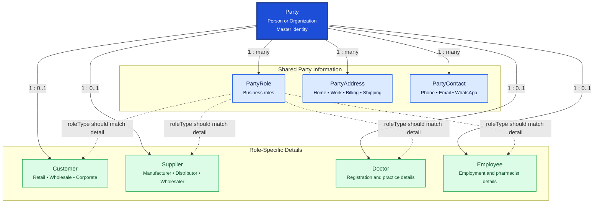

# Party Management

Party Management is the shared master-data area for every person and organization in the Pharmacy ERP. Common identity information is stored once in `Party`; related tables store roles, contact details, addresses, and role-specific data.

## Relationship Diagram

**Legend:** solid arrows show database relationships. Dashed arrows show the application rule that a `PartyRole.roleType` should correspond to the related detail record.
## How the Tables Work Together

- **Party** is the central parent record for a person or organization. It stores shared identity and status information.
- **PartyRole** assigns business roles such as `CUSTOMER`, `SUPPLIER`, `DOCTOR`, `EMPLOYEE`, `ADMIN`, or `OTHER`. A party can have multiple roles.
- **PartyAddress** stores one or more addresses for a party, such as home, work, billing, or shipping addresses.
- **PartyContact** stores phone numbers, email addresses, WhatsApp details, and other contact values.
- **Customer**, **Supplier**, **Doctor**, and **Employee** store attributes specific to those business functions. Each is optional from `Party`, but each record belongs to exactly one party through a unique `partyId`.
- A single person or organization can have multiple business roles. For example, one person may be both a `DOCTOR` and an `EMPLOYEE`.
- `PartyRole` and the detail tables represent related business concepts, but the role-to-detail consistency rule should be enforced by the application service layer.
- All tables use a UUID for synchronization, timestamps for auditing, soft deletion through `deletedAt`, and optimistic locking through `version`.

## Tables

- [[01_party]] — central person or organization master.
- [[02_party_role]] — roles assigned to a party.
- [[03_party_address]] — addresses associated with a party.
- [[04_party_contact]] — contact methods associated with a party.
- [[05_customer]] — customer-specific information.
- [[06_supplier]] — supplier-specific information.
- [[07_doctor]] — doctor-specific professional information.
- [[08_employee]] — employee-specific information.
