# Backend Developer Guide

**Status:** Implemented (backend)  
**Last verified:** 2026-09-10  
**Scope:** All feature modules registered in [`backend/src/app.module.ts`](../../../backend/src/app.module.ts) plus persistence, common, and auth infrastructure.

This is the **primary onboarding and wiring guide** for the NestJS backend: how to run the app, how modules connect, which **non-trivial files** to open (utils, constants, workflow services, persistence hooks), and why they exist. Controllers, generic CRUD services, DTOs, and mappers follow one repeated pattern — documented once in Part 2, not listed per module.

**How to read (new developer):** Start with [Part 0](#part-0--start-here), then follow the reading order table below.

**How to read (module work):**

1. [At-a-glance matrix](#implementation-at-a-glance) + [system diagrams](#part-1--system-context) — big picture.
2. [Cross-cutting expectations](#part-2--cross-cutting-expectations) + [file index](#part-25--cross-cutting-file-index) — read once before any module work.
3. [Module capsules](#part-3--module-capsules) — workflow entry points, non-trivial files, logical dependencies per module.
4. [End-to-end scenarios](#part-4--end-to-end-scenarios) — cross-module flows with files touched.
5. [Find code by concern](#finding-code-by-concern) — jump table when you know the task, not the module.
6. [Appendices](#appendix-a--glossary) — glossary, auth chain, troubleshooting, worked HTTP trace.
7. Full API routes: [backend-route-index.md](./backend-route-index.md) (382 routes, auto-generated).

---

## Table of contents

- [Part 0 — Start here](#part-0--start-here)
- [Implementation at-a-glance](#implementation-at-a-glance)
- [Part 1 — System context](#part-1--system-context)
- [Part 2 — Cross-cutting expectations](#part-2--cross-cutting-expectations)
- [Part 2.5 — Cross-cutting file index](#part-25--cross-cutting-file-index)
- [Part 3 — Module capsules](#part-3--module-capsules)
  - [Infrastructure](#infrastructure)
  - [Audit](#audit)
  - [Security](#security)
  - [Masters (lookup)](#masters-lookup)
  - [Party](#party)
  - [Medicine](#medicine)
  - [Configuration](#configuration)
  - [Settings](#settings)
  - [Pricing](#pricing)
  - [Prescription](#prescription)
  - [Inventory](#inventory)
  - [Purchase](#purchase)
  - [Sales](#sales)
  - [Finance](#finance)
  - [Sync](#sync)
  - [Reporting](#reporting)
  - [Auth](#auth)
- [Part 4 — End-to-end scenarios](#part-4--end-to-end-scenarios)
- [Part 5 — Permissions, API index, find by concern](#part-5--permissions-api-index-and-find-by-concern)
- [Part 6 — Maintenance](#part-6--maintenance)
- [Appendix A — Glossary](#appendix-a--glossary)
- [Appendix B — Auth and permissions chain](#appendix-b--auth-and-permissions-chain)
- [Appendix C — Troubleshooting](#appendix-c--troubleshooting)
- [Appendix D — Worked trace: sales invoice post](#appendix-d--worked-trace-sales-invoice-post)
- [Appendix E — Backend vs UI maturity](#appendix-e--backend-vs-ui-maturity)
- [Known gaps](#known-gaps)

---

## Part 0 — Start here

**Audience:** Developer on day 1.

### Repo layout

| Path | Purpose |
|------|---------|
| [`backend/`](../../../backend/) | NestJS API — all business logic |
| [`db/pharmacy.sqlite`](../../../db/pharmacy.sqlite) | Local SQLite database |
| [`docs/pharmacy_erp_architecture_docs/`](../../) | Architecture knowledge base (this guide lives here) |
| [`src/`](../../../src/) | Angular renderer (login, dashboard, core HTTP) |
| [`electron/`](../../../electron/) | Desktop shell — main process + preload |
| [`.cursor/rules/docs/`](../../../.cursor/rules/docs/) | Per-module API drill-down for agents |

### Reading order

| Step | Document | Why |
|------|----------|-----|
| 1 | This guide — Part 0 + [Part 1](#part-1--system-context) | Big picture and diagrams |
| 2 | [early-foundations.md](./early-foundations.md) | Run locally, login, headers (`x-device-id`), env vars |
| 3 | This guide — [Part 2](#part-2--cross-cutting-expectations) + [2.5](#part-25--cross-cutting-file-index) | Patterns and shared files |
| 4 | [backend/seed/README.md](../../../backend/seed/README.md) | Demo data volumes and seed phases |
| 5 | [Part 4 — retail sale](#41-retail-otc-sale) | One cross-module flow |
| 6 | [Part 3](#part-3--module-capsules) capsule for your task | Domain-specific wiring |
| 7 | [testing.md](./testing.md) | Unit, persistence, and e2e commands |
| — | [backend-memory-map.md](./backend-memory-map.md) | Understand **why** — architectural decisions, ADRs, rejected alternatives |

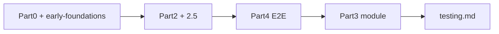

### First-day commands

```bash
# Terminal 1 — API (port 3000)
cd backend
npm run db:seed:fresh
npm run start:dev

# Terminal 2 — Angular (port 4200)
npm start

# Optional — Electron shell
npm run dev
```

### Demo login

After seeding, use the demo users in [early-foundations.md — Demo login](./early-foundations.md#demo-login-seeded-database) (e.g. `admin` / `admin123`). Permissions come from seed role mappings — see [Appendix B](#appendix-b--auth-and-permissions-chain).

---

## Implementation at-a-glance

| Module | Path | Scope | Controllers | Audit+Outbox | Sequence | Inv. ledger | Ledger post | Exported services |
|--------|------|-------|-------------|--------------|----------|-------------|-------------|-------------------|
| **Persistence** | `persistence/` | — | — | — | yes | yes | yes | UoW, RequestContext, Sequence, Outbox, InvLedger, LedgerPost |
| **Audit** | `audit/` | mixed | 2 | write API | — | — | — | `AuditService` |
| **Auth** | `auth/` | — | 1 | login/logout | — | — | — | `AuthService`, `PasswordService` |
| **Security** | `security/` | org | 7 | yes | — | — | — | `UserService` |
| **Masters** | `masters/` | org | 4 | yes | — | — | — | — |
| **Party** | `party/` | org | 8 | yes | — | — | — | Party, Customer, Supplier, Doctor, Employee |
| **Medicine** | `medicine/` | org | 8 | yes | — | — | — | `MedicineService` |
| **Configuration** | `configuration/` | org/co | 6 | yes | CRUD only | — | — | — |
| **Settings** | `settings/` | org | 1 | yes | — | — | — | `SettingsService` |
| **Pricing** | `pricing/` | org/branch | 4 | yes | — | — | — | `PriceListService` |
| **Prescription** | `prescription/` | branch | 2 | yes | — | — | — | `PrescriptionService` |
| **Inventory** | `inventory/` | org/branch | 9 | yes | yes | yes | — | `BatchService` |
| **Purchase** | `purchase/` | branch | 8 | yes | yes | yes | yes | — |
| **Sales** | `sales/` | branch | 5 | yes | yes | yes | yes | — |
| **Finance** | `finance/` | branch | 4 | yes | yes | — | yes | Ledger, Payment, Receipt |
| **Sync** | `sync/` | — | 3 | admin only | — | — | — | — |
| **Reporting** | `reporting/` | branch | 1 | — | — | — | — | `ReportRegistryService` |

**Nest module imports among features:** every mutation module imports `AuditModule`. `PurchaseModule` and `SalesModule` also import `SettingsModule`. `SecurityModule` imports `AuthModule`. No direct Nest imports between party/medicine/inventory/purchase/sales — coupling is via DB FKs and shared persistence services.

---

## Part 1 — System context

### 1.1 AppModule wiring

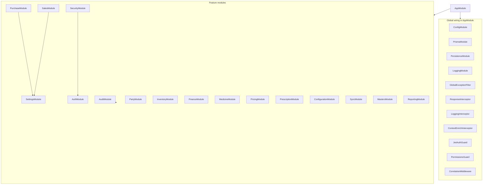

### 1.2 Request pipeline

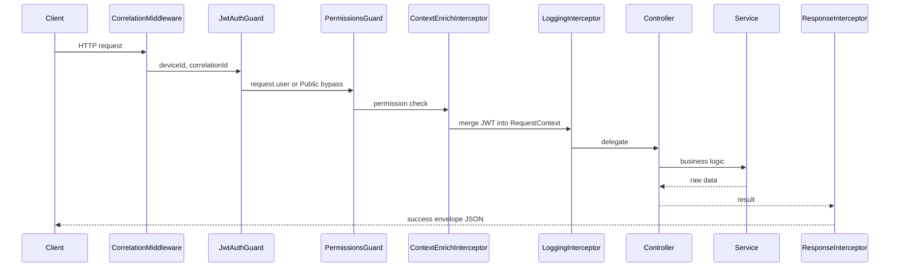

### 1.3 Nest module dependency graph

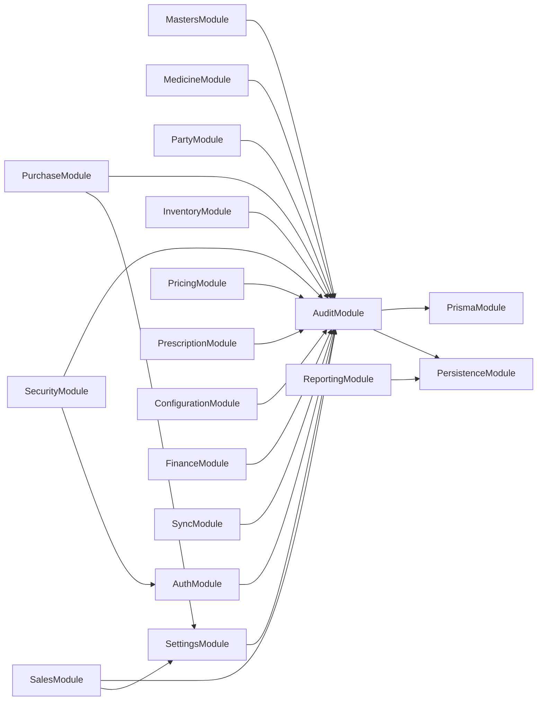

### 1.4 Persistence write-side adoption

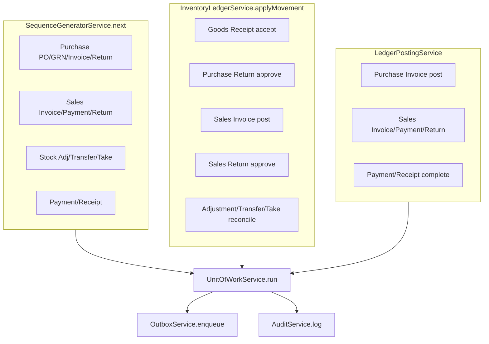

### 1.5 Domain entity relationship map

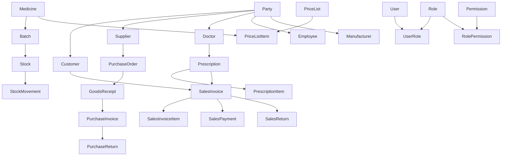

### 1.6 Purchase end-to-end flow

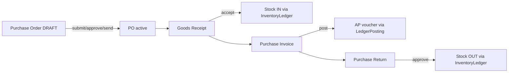

### 1.7 Sales end-to-end flow

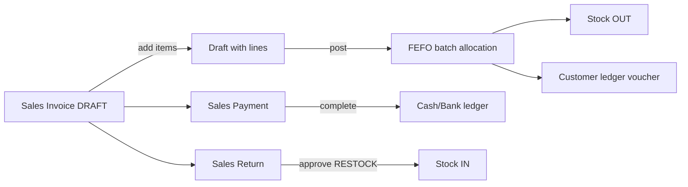

### 1.8 Offline-first sync loop

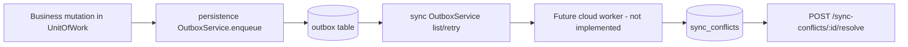

**Naming disambiguation:**

| Service | Path | Role |
|---------|------|------|
| Persistence `OutboxService` | `persistence/outbox/outbox.service.ts` | **Write** — `enqueue(tx, …)` in same transaction as mutation |
| Sync `OutboxService` | `sync/services/outbox.service.ts` | **Read/admin** — list, get, retry failed rows |

---

## Part 2 — Cross-cutting expectations

Every feature module follows the same template (reference: [`party/`](../../../backend/src/party/)).

| Topic | Rule | Source |
|-------|------|--------|
| **Reads** | `PrismaService.client.*` directly | All list/get services |
| **Writes** | `UnitOfWorkService.run(tx => …)` | All mutation services |
| **Tenant scope** | `getTenantScope()` + `withBranchScope()` for branch documents | [`tenant-scope.util.ts`](../../../backend/src/persistence/context/tenant-scope.util.ts) |
| **Audit** | `auditService.log(tx, …)` in same `tx` | [`audit.service.ts`](../../../backend/src/audit/audit.service.ts) |
| **Field history** | `auditAndLogChanges()` on selected UPDATE flows | [`audit.util.ts`](../../../backend/src/audit/utils/audit.util.ts) |
| **Sync** | `outboxService.enqueue(tx, …)` in same `tx` | [`outbox.service.ts`](../../../backend/src/persistence/outbox/outbox.service.ts) |
| **Optimistic lock** | `version` required on update/delete | Module `utils/*.util.ts` |
| **API envelope** | Controllers return raw data; interceptor wraps | [`response.interceptor.ts`](../../../backend/src/common/interceptors/response.interceptor.ts) |
| **Permissions** | `@RequirePermissions('DOMAIN:ENTITY:ACTION')` | All guarded controllers |
| **BIGINT JSON** | Mappers stringify IDs and money | Per-module `mappers/` |
| **Stock** | Never mutate `Stock` directly — `InventoryLedgerService` only | [`inventory-ledger.service.ts`](../../../backend/src/persistence/inventory/inventory-ledger.service.ts) |
| **Finance** | `LedgerPostingService.postVoucher` / `reverseVoucher` | [`ledger-posting.service.ts`](../../../backend/src/persistence/ledger/ledger-posting.service.ts) |

### Canonical mutation pattern

```typescript
return this.unitOfWork.run(async (tx) => {
  const scope = getTenantScope(this.requestContext);

  // 1. Optional document number
  const { documentNumber } = await this.sequences.next(tx, {
    companyId: scope.companyId,
    branchId: scope.branchId,
    documentType: DocumentType.SALES_INVOICE,
  });

  // 2. Business write
  const entity = await tx.salesInvoice.create({ data: { … } });

  // 3. Optional side-effects (same tx)
  await this.inventoryLedger.applyMovement(tx, { direction: 'OUT', … });
  await this.ledgerPosting.postVoucher(tx, { … });

  // 4. Audit + outbox (always for mutations)
  await this.auditService.log(tx, {
    action: AuditAction.CREATE,
    module: AuditModule.SALES,
    entityType: 'sales_invoices',
    entityId: entity.id,
    …
  });
  await this.outboxService.enqueue(tx, {
    entityType: OutboxEntityType.SALES_INVOICE,
    entityUuid: entity.uuid,
    operation: OutboxOperation.CREATE,
    payload: mapToOutboxPayload(entity),
    branchId: scope.branchId,
  });

  return entity;
});
```

### Scoping model summary

| Scope | Modules / entities |
|-------|-------------------|
| **Org-global** | masters, party, medicine (except batch usage), security, tax, discount rules, configuration company |
| **Branch-scoped** | prescription, price lists, purchase, sales, finance payments, stock balances, adjustments, transfers, stock-takes |
| **Mixed** | pricing (tax/discount org; price list branch), inventory (batch org; stock branch), audit logs (branch filter on reads) |

---

## Part 2.5 — Cross-cutting file index

Use this section when you need to know **which shared file to edit** and **who depends on it**. Feature modules import these; they are not duplicated per module.

### Write-path flow

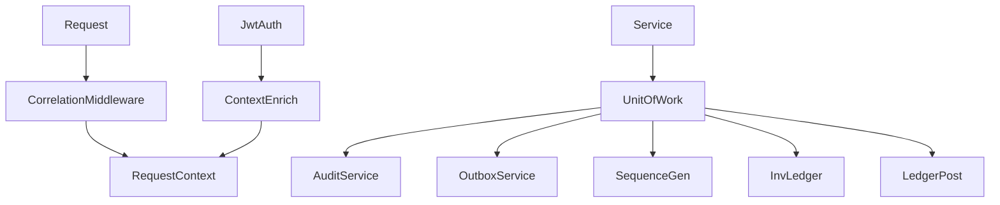

### Persistence (`backend/src/persistence/`)

| File | What it does | When it runs | Who calls it |
|------|--------------|--------------|--------------|
| [`unit-of-work/unit-of-work.service.ts`](../../../backend/src/persistence/unit-of-work/unit-of-work.service.ts) | Wraps `prisma.$transaction`; maps Prisma errors; retries optimistic conflicts | Every create/update/delete/workflow | All mutation services |
| [`context/request-context.service.ts`](../../../backend/src/persistence/context/request-context.service.ts) | AsyncLocalStorage for tenant, user, device, correlation | Entire request async chain | Middleware, interceptors, services |
| [`context/tenant-scope.util.ts`](../../../backend/src/persistence/context/tenant-scope.util.ts) | `getTenantScope`, `withBranchScope`, `withCompanyScope` | List/get/write on branch-scoped data | Purchase, sales, inventory, prescription, finance, pricing, reporting |
| [`sequence/sequence-generator.service.ts`](../../../backend/src/persistence/sequence/sequence-generator.service.ts) | Allocates `documentNumber` with reset policy + optimistic lock | Document header create or post | Purchase, sales, inventory, finance services |
| [`sequence/document-type.constants.ts`](../../../backend/src/persistence/sequence/document-type.constants.ts) | `DocumentType` enum (`SALES_INVOICE`, `GOODS_RECEIPT`, etc.) | Sequence `next()` calls | Workflow services |
| [`sequence/document-number.formatter.ts`](../../../backend/src/persistence/sequence/document-number.formatter.ts) | Formats `{PREFIX}/{BR}/{SEQ}` from config row | Inside sequence service | Sequence service only |
| [`outbox/outbox.service.ts`](../../../backend/src/persistence/outbox/outbox.service.ts) | `enqueue(tx, …)` — sync event in same tx as mutation | Every mutation | All mutation services |
| [`outbox/entity-type.constants.ts`](../../../backend/src/persistence/outbox/entity-type.constants.ts) | `OutboxEntityType` registry | Outbox enqueue | Mutation services |
| [`outbox/outbox-operation.constants.ts`](../../../backend/src/persistence/outbox/outbox-operation.constants.ts) | `CREATE` / `UPDATE` / `DELETE` | Outbox enqueue | Mutation services |
| [`inventory/inventory-ledger.service.ts`](../../../backend/src/persistence/inventory/inventory-ledger.service.ts) | **Only** path to change `Stock` + insert `StockMovement` | GRN accept, sales post, returns, adjustments, transfers, stock-take reconcile | Purchase, sales, inventory workflow services |
| [`ledger/ledger-posting.service.ts`](../../../backend/src/persistence/ledger/ledger-posting.service.ts) | Balanced double-entry vouchers; validates open FY via finance util | Invoice post, payment/receipt complete, sales post/payment/return | Purchase, sales, finance services |
| [`prisma/prisma-error.mapper.ts`](../../../backend/src/persistence/prisma/prisma-error.mapper.ts) | Maps P2002/P2025/P2034 to `ApplicationException` | On transaction failure | UnitOfWork |
| [`prisma/bigint-id-sequence.ts`](../../../backend/src/persistence/prisma/bigint-id-sequence.ts) | In-memory BIGINT PK allocator for SQLite | Prisma `create` when `id` omitted | Prisma client extension |

### Common (`backend/src/common/`)

| File | What it does | When it runs | Who calls it |
|------|--------------|--------------|--------------|
| [`exceptions/application.exception.ts`](../../../backend/src/common/exceptions/application.exception.ts) | Domain errors with code, HTTP status, details | Business rule violations | All services |
| [`exceptions/error-code.ts`](../../../backend/src/common/exceptions/error-code.ts) | Central error code strings | Thrown via `ApplicationException` | All modules — add new codes here |
| [`exceptions/global-exception.filter.ts`](../../../backend/src/common/exceptions/global-exception.filter.ts) | `{ success: false, error }` envelope | Any uncaught exception | Global — `app.module.ts` |
| [`interceptors/response.interceptor.ts`](../../../backend/src/common/interceptors/response.interceptor.ts) | `{ success: true, data }` + pagination | Every successful response | Global |
| [`interceptors/context-enrich.interceptor.ts`](../../../backend/src/common/interceptors/context-enrich.interceptor.ts) | Merges JWT user into `RequestContext` | After auth, before controller | Global |
| [`logging/correlation.middleware.ts`](../../../backend/src/common/logging/correlation.middleware.ts) | Sets `deviceId`, `correlationId` on request | First middleware hit | All HTTP requests |
| [`logging/app-logger.service.ts`](../../../backend/src/common/logging/app-logger.service.ts) | Structured Winston logs (technical, not business audit) | Service-level logging | Any injectable |
| [`dto/pagination-query.dto.ts`](../../../backend/src/common/dto/pagination-query.dto.ts) | Standard `page` / `pageSize` / `search` | List endpoints | All paginated controllers |
| [`dto/delete-entity-query.dto.ts`](../../../backend/src/common/dto/delete-entity-query.dto.ts) | `version` query param for optimistic delete | DELETE endpoints | CRUD modules |
| [`dto/bigint.decorator.ts`](../../../backend/src/common/dto/bigint.decorator.ts) | String → `bigint` coercion in DTOs | Request validation | DTOs with BIGINT fields |
| [`pipes/parse-bigint.pipe.ts`](../../../backend/src/common/pipes/parse-bigint.pipe.ts) | Route `:id` → `bigint` | Param parsing | Controllers with `:id` |
| [`serialization/serialize-for-json.ts`](../../../backend/src/common/serialization/serialize-for-json.ts) | BIGINT/Decimal/Date safe JSON | Response + error serialization | Interceptor, exception filter |

### Auth (`backend/src/auth/`)

| File | What it does | When it runs | Who calls it |
|------|--------------|--------------|--------------|
| [`auth.service.ts`](../../../backend/src/auth/auth.service.ts) | Login, refresh, logout, profile, permission list for JWT | `/auth/*` endpoints | Auth controller |
| [`jwt.strategy.ts`](../../../backend/src/auth/jwt.strategy.ts) | Validates JWT payload → `request.user` | Every guarded request | JwtAuthGuard |
| [`guards/jwt-auth.guard.ts`](../../../backend/src/auth/guards/jwt-auth.guard.ts) | Enforces JWT; `@Public()` bypass | Before controller | Global guard |
| [`guards/permissions.guard.ts`](../../../backend/src/auth/guards/permissions.guard.ts) | Checks `@RequirePermissions` | After JWT | Global guard |
| [`password.service.ts`](../../../backend/src/auth/password.service.ts) | bcrypt hash/verify | Login, user create, reset-password | Auth + security `UserService` |
| [`utils/auth-token.util.ts`](../../../backend/src/auth/utils/auth-token.util.ts) | Access/refresh token pair creation | Login, refresh | Auth service |
| [`utils/auth-config.util.ts`](../../../backend/src/auth/utils/auth-config.util.ts) | JWT secret from env | Module bootstrap | Auth module |
| [`constants/auth.constants.ts`](../../../backend/src/auth/constants/auth.constants.ts) | Token expiry, throttle limits | Auth flows | Auth service |

### Audit write API (`backend/src/audit/`)

| File | What it does | When it runs | Who calls it |
|------|--------------|--------------|--------------|
| [`audit.service.ts`](../../../backend/src/audit/audit.service.ts) | `log(tx)` → `AuditLog`; `logFieldChanges` → `ChangeHistory` | Inside every mutation `tx` | All mutation services |
| [`audit-action.constants.ts`](../../../backend/src/audit/audit-action.constants.ts) | `CREATE`, `UPDATE`, `POST`, `APPROVE`, etc. | Audit log writes | Audit service |
| [`audit-module.constants.ts`](../../../backend/src/audit/audit-module.constants.ts) | `SALES`, `PURCHASE`, `PARTY`, etc. | Audit log writes | Audit service |
| [`utils/audit.util.ts`](../../../backend/src/audit/utils/audit.util.ts) | `buildFieldChanges`, `auditAndLogChanges` for UPDATE diffs | Selected UPDATE flows | Pricing, prescription, party, masters, settings |
| [`utils/audit-query.util.ts`](../../../backend/src/audit/utils/audit-query.util.ts) | Read-side filter helpers | Audit log list | `audit-log.service.ts` |

---

## Part 3 — Module capsules

Each capsule follows: **Snapshot → Domain model → Workflow entry points → Non-trivial files → Logical dependencies → Rules → Not implemented → Pointers**.

Controllers, generic CRUD services, DTOs, and mappers are omitted (same pattern everywhere; see Part 2).

### Infrastructure

| | |
|---|---|
| **Purpose** | DB bootstrap, persistence services, logging, global HTTP pipeline |
| **Nest modules** | `PrismaModule`, `PersistenceModule`, `LoggingModule`, `common/*` wired in `AppModule` |

**Workflow entry points:** None (infrastructure only). All feature writes flow through `UnitOfWorkService` (see [Part 2.5](#part-25--cross-cutting-file-index)).

**Non-trivial files:**

| File | Purpose (plain English) | Used by |
|------|-------------------------|---------|
| [`prisma.service.ts`](../../../backend/src/prisma.service.ts) | Connects SQLite; exposes `client`; syncs BIGINT id sequence on startup | Every module (reads) |
| [`persistence/persistence.module.ts`](../../../backend/src/persistence/persistence.module.ts) | DI wiring for UoW, context, sequence, outbox, ledger services | Imported by all feature modules |
| [`app.module.ts`](../../../backend/src/app.module.ts) | Registers global filter, interceptors, guards, correlation middleware | Application bootstrap |

**Logical dependencies:** Everything depends on infrastructure; no business FKs.

**Pointers:** [persistence-patterns.md](../database/persistence-patterns.md), [logging-and-audit.md](./logging-and-audit.md), [extending-the-backend.md](./extending-the-backend.md)

---

### Audit

| | |
|---|---|
| **Path** | `backend/src/audit/` |
| **Purpose** | Business audit writes (`AuditService`) + read APIs for logs and field changes |
| **Exports** | `AuditService` |
| **Scope** | Audit logs: branch-scoped list; change history: org-global |

**Workflow entry points:**

| Endpoint / method | Service | Side-effects |
|-------------------|---------|--------------|
| `GET /audit-logs` | `audit-log.service.ts` | Read only — Prisma direct |
| `GET /change-histories` | `change-history.service.ts` | Read only — org-global |

Writes happen inside other modules via `AuditService.log(tx, …)` — not via audit HTTP API.

**Non-trivial files:**

| File | Purpose (plain English) | Used by |
|------|-------------------------|---------|
| [`audit.service.ts`](../../../backend/src/audit/audit.service.ts) | Creates `AuditLog` + optional `ChangeHistory` in same tx as mutation | Every mutation service |
| [`audit-action.constants.ts`](../../../backend/src/audit/audit-action.constants.ts) | Allowed actions (`POST`, `APPROVE`, `LOGIN`, …) | Audit service validation |
| [`audit-module.constants.ts`](../../../backend/src/audit/audit-module.constants.ts) | Domain tag per module (`SALES`, `PARTY`, …) | Audit service validation |
| [`utils/audit.util.ts`](../../../backend/src/audit/utils/audit.util.ts) | Diff before/after for UPDATE field history | Pricing, prescription, party, masters, settings |
| [`utils/audit-query.util.ts`](../../../backend/src/audit/utils/audit-query.util.ts) | Branch/date filters for audit log reads | `audit-log.service.ts` |

**Logical dependencies:** Imported by every feature module that mutates data. Reads `RequestContext` for user/branch/correlation. Not the same as Winston `AppLogger` (technical logs).

**Pointers:** [audit-module.md](../../../.cursor/rules/docs/audit-module.md), [audit.md](../database/tables/audit/audit.md)

---

### Security

| | |
|---|---|
| **Path** | `backend/src/security/` |
| **Purpose** | RBAC admin — users, roles, permissions, branch access, sessions |
| **Exports** | `UserService` |
| **Nest imports** | `AuditModule`, `AuthModule` |

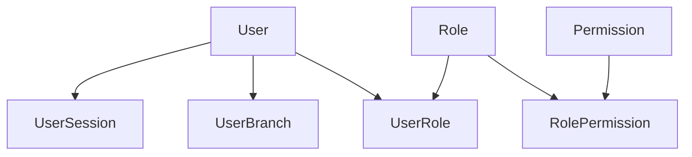

**Workflow entry points:**

| Endpoint | Service | Side-effects |
|----------|---------|--------------|
| `POST /users/:id/reset-password` | `user.service.ts` | Password hash update; audit + outbox |
| `POST /users/:id/unlock` | `user.service.ts` | Clears lockout flags |
| `PUT /users/:userId/roles/replace` | `user-role.service.ts` | Replaces all roles; **invalidates user sessions** |
| `PUT /roles/:roleId/permissions/replace` | `role-permission.service.ts` | Replaces permissions; **invalidates sessions for all users with role** |
| `POST /user-sessions/:id/force-logout` | `user-session.service.ts` | Marks session revoked |

**Non-trivial files:**

| File | Purpose (plain English) | Used by |
|------|-------------------------|---------|
| [`utils/session.util.ts`](../../../backend/src/security/utils/session.util.ts) | `invalidateUserSessions` / `invalidateSessionsForRole` — forces re-login after permission change | User-role, role-permission services |
| [`utils/security.util.ts`](../../../backend/src/security/utils/security.util.ts) | Serializers, not-found/conflict helpers, optimistic update | All security services |
| [`constants/security.constants.ts`](../../../backend/src/security/constants/security.constants.ts) | `LogoutReason` enum for session records | Session invalidation, auth logout |

**Logical dependencies:** Uses `PasswordService` from auth (not duplicated). Login/logout HTTP stays in `auth/`. `Employee` FK on user create links to party module.

**Rules:** Never return `passwordHash`. Junction `userId`/`roleId` from route param, not body.

**Pointers:** [security-module.md](../../../.cursor/rules/docs/security-module.md), [user_and_security.md](../database/tables/user_and_security/user_and_security.md), [security.md](./security.md)

---

### Masters (lookup)

| | |
|---|---|
| **Path** | `backend/src/masters/` |
| **Purpose** | Geographic hierarchy: Country → State → City → Area |
| **Scope** | Org-global |

**Workflow entry points:** None — flat CRUD only (`/countries`, `/states`, `/cities`, `/areas`).

**Non-trivial files:**

| File | Purpose (plain English) | Used by |
|------|-------------------------|---------|
| [`utils/masters.util.ts`](../../../backend/src/masters/utils/masters.util.ts) | Validates parent FK (state→country, etc.); delete guards when child geo rows or `PartyAddress` refs exist; `auditAndLogChanges` on UPDATE | All four geo services |

**Logical dependencies:** `PartyAddress` FKs to country/state/city — delete blocked if party addresses reference a row.

**Not implemented:** Nested routes (`/countries/:id/states`), Angular admin UI.

**Pointers:** [masters-module.md](../../../.cursor/rules/docs/masters-module.md), [masters.md](../database/tables/masters/masters.md)

---

### Party

| | |
|---|---|
| **Path** | `backend/src/party/` |
| **Purpose** | Org-global party master — **reference CRUD template** for the entire backend |
| **Exports** | Party, Customer, Supplier, Doctor, Employee services |

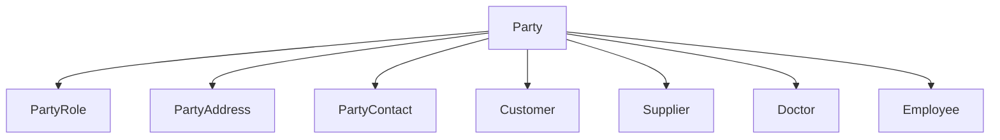

**Workflow entry points:** No status machine. Important guarded operations:

| Operation | Service | Side-effects |
|-----------|---------|--------------|
| `DELETE /parties/:id` | `party.service.ts` | Blocked if any active child exists |
| `POST /customers` (etc.) | `customer.service.ts` | `ensurePartyRole(CUSTOMER)`; may restore soft-deleted row |

**Non-trivial files:**

| File | Purpose (plain English) | Used by |
|------|-------------------------|---------|
| [`utils/party.util.ts`](../../../backend/src/party/utils/party.util.ts) | `ensurePartyRole`, `assertUniqueBusinessCode`, `optimisticUpdate`, soft-delete filters, default address clearing | All party services |
| [`constants/party.constants.ts`](../../../backend/src/party/constants/party.constants.ts) | `PartyType`, `PartyRoleType`, `AddressType`, `CustomerType`, etc. | DTOs + service guards |
| [`reporting/providers/party/party-reports.provider.ts`](../../../backend/src/reporting/providers/party/party-reports.provider.ts) | Registers party list reports into global registry | Reporting module startup |

**Logical dependencies:** Referenced by purchase (supplier), sales (customer), prescription (doctor), medicine (manufacturer `partyId`). No Nest import — FK only.

**Rules:** Nested children get `partyId` from route; role details get `partyId` in create body. `party-contact.service.ts` is an audit convention exception (see [Known gaps](#known-gaps)).

**Pointers:** [party-module.md](../../../.cursor/rules/docs/party-module.md), [party_management.md](../database/tables/party_management/party_management.md)

---

### Medicine

| | |
|---|---|
| **Path** | `backend/src/medicine/` |
| **Purpose** | Org-global medicine master data |
| **Exports** | `MedicineService` |

**Workflow entry points:**

| Endpoint | Service | Side-effects |
|----------|---------|--------------|
| `PUT /medicines/:medicineId/salts/replace` | `medicine-salt.service.ts` | Hard-deletes all salts + inserts new set in one tx |

**Non-trivial files:**

| File | Purpose (plain English) | Used by |
|------|-------------------------|---------|
| [`utils/medicine.util.ts`](../../../backend/src/medicine/utils/medicine.util.ts) | Category cycle guard; manufacturer/party link asserts; delete-in-use checks for batches and line items | All medicine services |
| [`constants/medicine.constants.ts`](../../../backend/src/medicine/constants/medicine.constants.ts) | `UnitType`, `CATEGORY_HIERARCHY_MAX_DEPTH` | DTOs + category service |

**Logical dependencies:** `Manufacturer.partyId` → party (no Nest import). `Medicine` → inventory `Batch`, purchase/sales line items. Sales/purchase call `assertMedicineExists` via their own utils.

**Not implemented:** Category tree endpoint, medicine code auto-sequence, unit/e2e tests.

**Pointers:** [medicine-module.md](../../../.cursor/rules/docs/medicine-module.md), [medicine_master.md](../database/tables/medicine_master/medicine_master.md)

---

### Configuration

| | |
|---|---|
| **Path** | `backend/src/configuration/` |
| **Purpose** | Company, branch, financial year, sequence **config**, printer/barcode config |

**Workflow entry points:**

| Endpoint | Service | Side-effects |
|----------|---------|--------------|
| `POST /financial-years/:id/close` | `financial-year.service.ts` | OPEN → CLOSED; blocks further edit/delete |

**Non-trivial files:**

| File | Purpose (plain English) | Used by |
|------|-------------------------|---------|
| [`utils/configuration.util.ts`](../../../backend/src/configuration/utils/configuration.util.ts) | Clears sibling `isDefault` / `isHeadOffice` / `isCurrent` flags; FY close guards | Company, branch, FY, printer, barcode services |
| [`constants/configuration.constants.ts`](../../../backend/src/configuration/constants/configuration.constants.ts) | Financial year status, sequence reset policy enums | DTOs + services |
| [`services/sequence-generator.service.ts`](../../../backend/src/configuration/services/sequence-generator.service.ts) | **Admin CRUD** on sequence config rows | Configuration API only |
| [`persistence/sequence/sequence-generator.service.ts`](../../../backend/src/persistence/sequence/sequence-generator.service.ts) | **Runtime** `next(tx)` for document numbers | Purchase, sales, inventory, finance |

**Logical dependencies:** Branch/company scope flows into `getTenantScope`. Sequence config rows are read by persistence `SequenceGeneratorService` at runtime.

**Not implemented:** Enforcing closed FY on all transaction modules.

**Pointers:** [configuration-module.md](../../../.cursor/rules/docs/configuration-module.md), [configuration.md](../database/tables/configuration/configuration.md)

---

### Settings

| | |
|---|---|
| **Path** | `backend/src/settings/` |
| **Purpose** | Key-value `AppSetting` CRUD + cached reads for runtime toggles |
| **Exports** | `SettingsService` |

**Workflow entry points:** CRUD on `/settings` only. Runtime reads via `SettingsService.getBoolean()` / `getString()` inside other modules.

**Non-trivial files:**

| File | Purpose (plain English) | Used by |
|------|-------------------------|---------|
| [`setting-keys.constants.ts`](../../../backend/src/settings/setting-keys.constants.ts) | Canonical setting key strings | Settings service + consumers |
| [`settings.service.ts`](../../../backend/src/settings/settings.service.ts) | 60s in-memory cache per key; audit + outbox on create/update/delete | Purchase GRN, sales post |

**Runtime settings reference:**

| Key constant | Stored key | Read by | Effect |
|--------------|------------|---------|--------|
| `PURCHASE_ALLOW_GRN_WITHOUT_PO` | `purchase.allow_grn_without_po` | `goods-receipt.service.ts` | Allows GRN without linked PO when true |
| `SALES_ENFORCE_MRP_CAP` | `sales.enforce_mrp_cap` | `sales.util.ts` → `resolvePriceListItem` | Caps unit price at MRP on invoice post |
| `SALES_ALLOW_EXPIRED_SALE` | `sales.allow_expired_sale` | `sales.util.ts` → `allocateFefoBatches` | FEFO may pick expired batches |
| `SALES_ALLOW_EXPIRED_CUSTOMER_RETURN` | `sales.allow_expired_customer_return` | `sales.util.ts` → return validation | Allows return of expired batch stock |
| `GST_DEFAULT_RATE` | `gst.default_rate` | (seed / future tax calc) | Default GST rate |
| `INVOICE_TEMPLATE_ID` | `invoice.template_id` | (future printing) | Invoice template selection |
| `BARCODE_FORMAT` | `barcode.format` | (future barcode) | Barcode format config |
| `PRINTER_RECEIPT_MAPPING` | `printer.receipt_mapping` | (future printing) | Printer mapping JSON |
| `STORE_DISPLAY_NAME` | `store.display_name` | (future UI) | Store display name |

**Logical dependencies:** Imported by `PurchaseModule` and `SalesModule` (Nest). Not imported by pricing — sales reads price lists directly.

**Pointers:** [early-foundations.md](./early-foundations.md) (settings overview)

---

### Pricing

| | |
|---|---|
| **Path** | `backend/src/pricing/` |
| **Purpose** | Tax, discount rules, branch price lists and items |
| **Exports** | `PriceListService` |

**Workflow entry points:**

| Endpoint | Service | Side-effects |
|----------|---------|--------------|
| `PUT /price-lists/:priceListId/items/replace` | `price-list-item.service.ts` | Bulk replace items in one tx |

**Non-trivial files:**

| File | Purpose (plain English) | Used by |
|------|-------------------------|---------|
| [`utils/pricing.util.ts`](../../../backend/src/pricing/utils/pricing.util.ts) | `buildPriceListBranchFilter` (branch + org-wide lists); clears other defaults when `isDefault=true` | Price list services |
| [`constants/pricing.constants.ts`](../../../backend/src/pricing/constants/pricing.constants.ts) | `DiscountType`, `AppliesTo`, `TaxType`, `PriceListType` | DTOs + services |

**Logical dependencies:** **Consumer:** `sales.util.ts` → `resolvePriceListItem` at invoice **post** (no Nest import of `PricingModule`). Tax rows referenced by price list items and invoice lines — delete blocked.

**Pointers:** [pricing-module.md](../../../.cursor/rules/docs/pricing-module.md), [pricing.md](../database/tables/pricing/pricing.md)

---

### Prescription

| | |
|---|---|
| **Path** | `backend/src/prescription/` |
| **Purpose** | Branch-scoped prescription documents with workflow |
| **Exports** | `PrescriptionService` |

**Workflow:** `DRAFT` → `ACTIVE` → `PARTIALLY_DISPENSED` / `DISPENSED` / `EXPIRED` / `CANCELLED`

**Workflow entry points:**

| Endpoint | Service | Side-effects |
|----------|---------|--------------|
| `POST /prescriptions/:id/activate` | `prescription.service.ts` | DRAFT → ACTIVE |
| `POST /prescriptions/:id/cancel` | `prescription.service.ts` | → CANCELLED |
| `POST /prescriptions/:id/expire` | `prescription.service.ts` | → EXPIRED |
| `PUT .../items/replace` | `prescription-item.service.ts` | DRAFT only |

**Non-trivial files:**

| File | Purpose (plain English) | Used by |
|------|-------------------------|---------|
| [`utils/prescription.util.ts`](../../../backend/src/prescription/utils/prescription.util.ts) | `assertPrescriptionDraft`; status transition guards | Prescription + item services |
| [`constants/prescription.constants.ts`](../../../backend/src/prescription/constants/prescription.constants.ts) | `PrescriptionStatus`, `PrescriptionItemStatus` | Workflow + DTOs |

**Logical dependencies:** **Consumer:** `sales-invoice.service.ts` validates `prescriptionId` and updates dispensed qty on **post** (FK only, no Nest import). Doctor FK → party.

**Pointers:** [prescription-module.md](../../../.cursor/rules/docs/prescription-module.md), [prescription.md](../database/tables/prescription/prescription.md)

---

### Inventory

| | |
|---|---|
| **Path** | `backend/src/inventory/` |
| **Purpose** | Batch master (org); stock balances, movements, adjustments, transfers, stock-takes (branch) |
| **Exports** | `BatchService` |

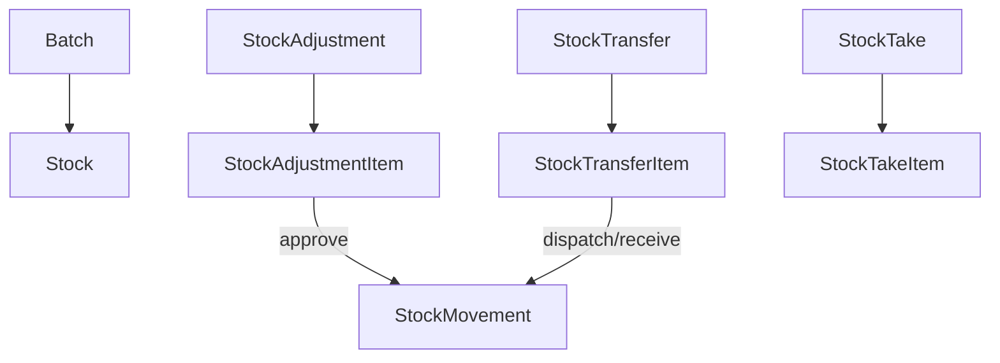

**Workflow entry points:**

| Endpoint | Service | Side-effects |
|----------|---------|--------------|
| `POST /stock-adjustments/:id/approve` | `stock-adjustment.service.ts` | `InventoryLedgerService` per line; ADJUSTMENT_GAIN/LOSS |
| `POST /stock-transfers/:id/dispatch` | `stock-transfer.service.ts` | TRANSFER_OUT at source branch |
| `POST /stock-transfers/:id/receive` | `stock-transfer.service.ts` | TRANSFER_IN at destination |
| `POST /stock-takes/:id/reconcile` | `stock-take.service.ts` | Creates approved adjustment + ledger for variances |

**Non-trivial files:**

| File | Purpose (plain English) | Used by |
|------|-------------------------|---------|
| [`utils/inventory.util.ts`](../../../backend/src/inventory/utils/inventory.util.ts) | `assertDraftStatus`; `computeVarianceType` for stock-take; optimistic update helpers | All document services |
| [`constants/inventory.constants.ts`](../../../backend/src/inventory/constants/inventory.constants.ts) | `StockMovementType`, adjustment/transfer/take status enums | Inventory + **imported by purchase/sales** for movement types |

**Logical dependencies:** **Called by** purchase (GRN accept, return approve) and sales (invoice post, return approve) via `InventoryLedgerService`. `/stocks` and `/stock-movements` are read-only.

**Not implemented:** Reserved/in-transit quantity buckets, inventory reporting providers, E2E tests.

**Pointers:** [inventory-module.md](../../../.cursor/rules/docs/inventory-module.md), [inventory-flow.md](../workflows/inventory-flow.md), [inventory.md](../database/tables/inventory/inventory.md)

---

### Purchase

| | |
|---|---|
| **Path** | `backend/src/purchase/` |
| **Purpose** | Procurement: PO → GRN → Invoice → Return |
| **Nest imports** | `SettingsModule` |

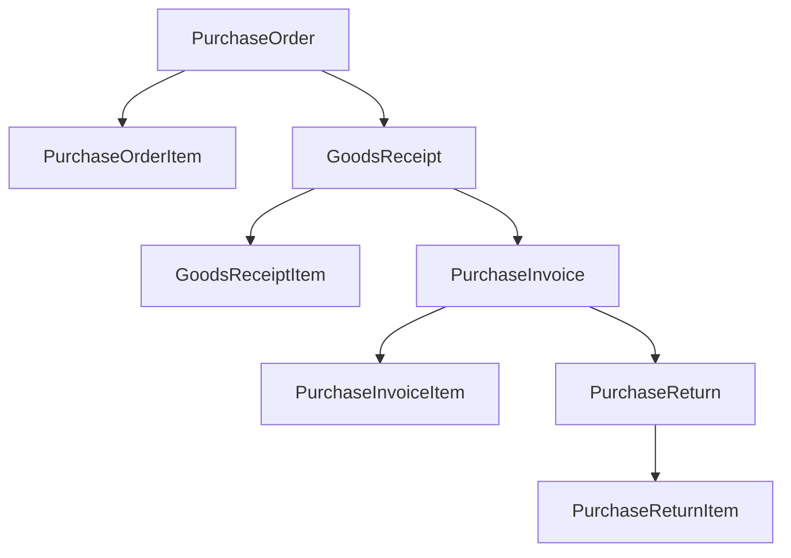

**Workflow entry points:**

| Endpoint | Service | Side-effects |
|----------|---------|--------------|
| `POST /purchase-orders/:id/approve` | `purchase-order.service.ts` | Status machine only — **no stock** |
| `POST /goods-receipts/:id/accept` | `goods-receipt.service.ts` | **Stock IN** via `InventoryLedgerService`; `resolveOrCreateBatch`; `PURCHASE_GRN` movement |
| `POST /purchase-invoices/:id/post` | `purchase-invoice.service.ts` | **AP voucher** via `LedgerPostingService` + `buildPurchaseInvoiceLedgerLines` — **no stock** |
| `POST /purchase-returns/:id/approve` | `purchase-return.service.ts` | **Stock OUT**; `PURCHASE_RETURN` movement |

**Non-trivial files:**

| File | Purpose (plain English) | Used by |
|------|-------------------------|---------|
| [`utils/purchase.util.ts`](../../../backend/src/purchase/utils/purchase.util.ts) | `resolveOrCreateBatch` on GRN accept; `rollupPurchaseOrderTotals/Status`; `grnStockQuantity`; line amount math; status asserts | PO, GRN, invoice, return services |
| [`constants/purchase.constants.ts`](../../../backend/src/purchase/constants/purchase.constants.ts) | PO/GRN/invoice/return status enums | Workflow guards |
| [`goods-receipt.service.ts`](../../../backend/src/purchase/services/goods-receipt.service.ts) | **Stock inbound boundary** — only accept changes inventory | GRN workflow |
| [`purchase-invoice.service.ts`](../../../backend/src/purchase/services/purchase-invoice.service.ts) | **Finance boundary** — post builds AP voucher | Invoice workflow |

**Logical dependencies:**

| Import | Why |
|--------|-----|
| `finance/utils/finance.util.ts` | `buildPurchaseInvoiceLedgerLines`, supplier outstanding |
| `inventory/constants/inventory.constants.ts` | `StockMovementType.PURCHASE_GRN`, `PURCHASE_RETURN` |
| `SettingsService` | `purchase.allow_grn_without_po` on GRN create |
| Party (FK) | `supplierId` on PO/GRN/invoice |

**Rules:** PO and invoice never touch stock. GRN accept is the inbound boundary.

**Pointers:** [purchase-module.md](../../../.cursor/rules/docs/purchase-module.md), [purchase-flow.md](../workflows/purchase-flow.md), [purchase.md](../database/tables/purchase/purchase.md)

---

### Sales

| | |
|---|---|
| **Path** | `backend/src/sales/` |
| **Purpose** | Sales invoice, payments, returns |
| **Nest imports** | `SettingsModule` |

**Workflow entry points:**

| Endpoint | Service | Side-effects |
|----------|---------|--------------|
| `POST /sales-invoices/:id/post` | `sales-invoice.service.ts` | FEFO batch allocation; **stock OUT**; customer AR voucher; prescription dispense update; sequence at post |
| `POST /sales-invoices/:id/cancel` | `sales-invoice.service.ts` | Reverses posted invoice (stock IN + ledger reversal) |
| `POST .../payments/:id/complete` | `sales-payment.service.ts` | Cash/bank ledger; settlement recompute |
| `POST /sales-returns/:id/approve` | `sales-return.service.ts` | **Stock IN** (RESTOCK); proportional ledger reversal |

**Non-trivial files:**

| File | Purpose (plain English) | Used by |
|------|-------------------------|---------|
| [`utils/sales.util.ts`](../../../backend/src/sales/utils/sales.util.ts) | **`allocateFefoBatches`** — picks batches by expiry; **`resolvePriceListItem`** — price/MRP from active list; `readSalesSettings`; return qty guards; line amounts | Invoice post, item create, return approve |
| [`constants/sales.constants.ts`](../../../backend/src/sales/constants/sales.constants.ts) | Invoice/payment/return status; `SalesType`; `SalesReturnDisposition` | Workflow + DTOs |
| [`sales-invoice.service.ts`](../../../backend/src/sales/services/sales-invoice.service.ts) | Orchestrates post: FEFO + ledger + prescription FK | Main sales workflow |

**Logical dependencies:**

| Import | Why |
|--------|-----|
| `finance/utils/finance.util.ts` | `buildSalesInvoiceLedgerLines`, `buildSalesPaymentLedgerLines`, `buildSalesReturnLedgerLines`, outstanding adjust |
| `inventory/constants/inventory.constants.ts` | `SALES`, `SALES_RETURN` movement types |
| `SettingsService` | MRP cap, expired sale/return flags via `readSalesSettings` |
| Pricing (logical) | `resolvePriceListItem` queries price list tables directly |
| Prescription (FK) | `prescriptionId` validated on post |

**Not implemented:** Loyalty, non-RESTOCK dispositions.

**Pointers:** [sales-module.md](../../../.cursor/rules/docs/sales-module.md), [sales-flow.md](../workflows/sales-flow.md), [sales.md](../database/tables/sales/sales.md)

---

### Finance

| | |
|---|---|
| **Path** | `backend/src/finance/` |
| **Purpose** | Chart of accounts, ledger entries (read-only), payment, receipt |
| **Exports** | `LedgerService`, `PaymentService`, `ReceiptService` |

**Workflow entry points:**

| Endpoint | Service | Side-effects |
|----------|---------|--------------|
| `POST /payments/:id/complete` | `payment.service.ts` | Supplier payment voucher; may update purchase invoice paid amounts |
| `POST /receipts/:id/complete` | `receipt.service.ts` | Customer receipt voucher; may update sales invoice settlement |
| `POST /payments/:id/cancel` | `payment.service.ts` | Reversal voucher |

**Non-trivial files:**

| File | Purpose (plain English) | Used by |
|------|-------------------------|---------|
| [`utils/finance.util.ts`](../../../backend/src/finance/utils/finance.util.ts) | **Central ledger line builders** for purchase/sales vouchers; `assertTransactionDateInOpenYear`; `resolveSystemLedger`; outstanding adjust helpers | Finance services + **purchase + sales** + `LedgerPostingService` |
| [`constants/finance.constants.ts`](../../../backend/src/finance/constants/finance.constants.ts) | `VoucherType`, `SystemLedgerCode` (`CASH001`, `SUP001`, `CUST001`, `PUR001`, `GSTIN001`), `NormalBalance` | All voucher posting |

**Shared util — callers outside finance module:**

| Caller | Functions used |
|--------|----------------|
| `purchase-invoice.service.ts` | `buildPurchaseInvoiceLedgerLines`, `adjustSupplierOutstanding` |
| `sales-invoice.service.ts` | `buildSalesInvoiceLedgerLines`, `adjustCustomerOutstanding`, `recomputeSalesInvoiceSettlement` |
| `sales-payment.service.ts` | `buildSalesPaymentLedgerLines` |
| `sales-return.service.ts` | `buildSalesReturnLedgerLines` |
| `ledger-posting.service.ts` | `assertTransactionDateInOpenYear` |

**Rules:** Ledger balance never stored — derived from `LedgerEntry`. Entries immutable after post.

**Not implemented:** Manual journal API, trial balance/P&L reports, expense CRUD.

**Pointers:** [finance-module.md](../../../.cursor/rules/docs/finance-module.md), [financial.md](../database/tables/financial/financial.md)

---

### Sync

| | |
|---|---|
| **Path** | `backend/src/sync/` |
| **Purpose** | Outbox admin, sync log read, conflict resolve |

**Workflow entry points:**

| Endpoint | Service | Side-effects |
|----------|---------|--------------|
| `POST /outbox/:id/retry` | `sync/services/outbox.service.ts` | FAILED/PROCESSING → PENDING |
| `POST /sync-conflicts/:id/resolve` | `sync-conflict.service.ts` | Metadata only — does not apply payload to business tables |

**Non-trivial files:**

| File | Purpose (plain English) | Used by |
|------|-------------------------|---------|
| [`utils/sync.util.ts`](../../../backend/src/sync/utils/sync.util.ts) | Retry eligibility checks; conflict resolve helpers | Sync admin services |
| [`constants/sync.constants.ts`](../../../backend/src/sync/constants/sync.constants.ts) | Outbox/sync status enums | DTOs + services |
| [`sync/services/outbox.service.ts`](../../../backend/src/sync/services/outbox.service.ts) | **Admin read/retry** — not the write enqueue API | Sync controller |

**Outbox naming (critical):**

| Service | Path | Role |
|---------|------|------|
| Persistence `OutboxService` | `persistence/outbox/outbox.service.ts` | **Write** — `enqueue(tx)` in mutation tx |
| Sync `OutboxService` | `sync/services/outbox.service.ts` | **Read/admin** — list, get, retry |

**Not implemented:** Cloud sync worker, applying conflict resolution to business entities.

**Pointers:** [sync-module.md](../../../.cursor/rules/docs/sync-module.md), [synchronization.md](../database/tables/synchronization/synchronization.md)

---

### Reporting

| | |
|---|---|
| **Path** | `backend/src/reporting/` |
| **Purpose** | Read-only report registry and export |
| **Global module** | `@Global()` — `ReportRegistryService` exported |

**Workflow entry points:**

| Endpoint | Service | Side-effects |
|----------|---------|--------------|
| `GET /reports` | `report-registry.service.ts` | Lists reports user has permission for |
| `GET /reports/:reportId?format=csv` | `report-exporter.service.ts` | Runs provider query; exports JSON/CSV/XLSX/PDF |

**Non-trivial files:**

| File | Purpose (plain English) | Used by |
|------|-------------------------|---------|
| [`core/report-registry.service.ts`](../../../backend/src/reporting/core/report-registry.service.ts) | Providers register `ReportDefinition` at startup; permission filter | `ReportController` |
| [`core/report-definition.interface.ts`](../../../backend/src/reporting/core/report-definition.interface.ts) | Contract for new reports: `id`, `permission`, `run(params, ctx)` | All providers |
| [`providers/party/party-reports.provider.ts`](../../../backend/src/reporting/providers/party/party-reports.provider.ts) | Example: party list reports — **copy this pattern for new reports** | Registered in `reporting.module.ts` |
| [`export/report-exporter.service.ts`](../../../backend/src/reporting/export/report-exporter.service.ts) | Delegates to csv/xlsx/pdf exporters | Report controller |
| [`utils/report.util.ts`](../../../backend/src/reporting/utils/report.util.ts) | Date range validation; `Content-Disposition` header | Report controller |

**Logical dependencies:** Prisma reads only — **no** `UnitOfWork`, audit, or outbox. Uses `getTenantScope` for branch filtering.

**Pointers:** [reporting.md](./reporting.md)

---

### Auth

| | |
|---|---|
| **Path** | `backend/src/auth/` |
| **Purpose** | Login, logout, refresh, profile, change-password (not RBAC admin) |
| **Exports** | `AuthService`, `JwtModule`, `PasswordService` |

**Workflow entry points:**

| Endpoint | Service | Side-effects |
|----------|---------|--------------|
| `POST /auth/login` | `auth.service.ts` | Creates session; returns JWT + permission list; audit LOGIN |
| `POST /auth/logout` | `auth.service.ts` | Revokes session; audit LOGOUT |
| `POST /auth/refresh` | `auth.service.ts` | New access token from refresh token |

**Non-trivial files:**

| File | Purpose (plain English) | Used by |
|------|-------------------------|---------|
| [`auth.service.ts`](../../../backend/src/auth/auth.service.ts) | Assembles flat permission list from role joins at login | Login, `/auth/me` |
| [`jwt.strategy.ts`](../../../backend/src/auth/jwt.strategy.ts) | Validates JWT → `AuthenticatedUser` on `request.user` | Every guarded route |
| [`password.service.ts`](../../../backend/src/auth/password.service.ts) | bcrypt — shared with security user admin | Auth + `UserService` |
| [`utils/auth-token.util.ts`](../../../backend/src/auth/utils/auth-token.util.ts) | Issues access + refresh token pair | Login, refresh |
| [`constants/auth.constants.ts`](../../../backend/src/auth/constants/auth.constants.ts) | Token TTL, throttle config | Auth module bootstrap |

**Logical dependencies:** Reads security tables (user, role, permission) at login. RBAC CRUD is in `security/`.

**Split:** User/role/permission admin → `security/`. Token lifecycle → `auth/`.

**Pointers:** [early-foundations.md](./early-foundations.md), [security.md](./security.md)

---

## Part 4 — End-to-end scenarios

### 4.1 Retail OTC sale

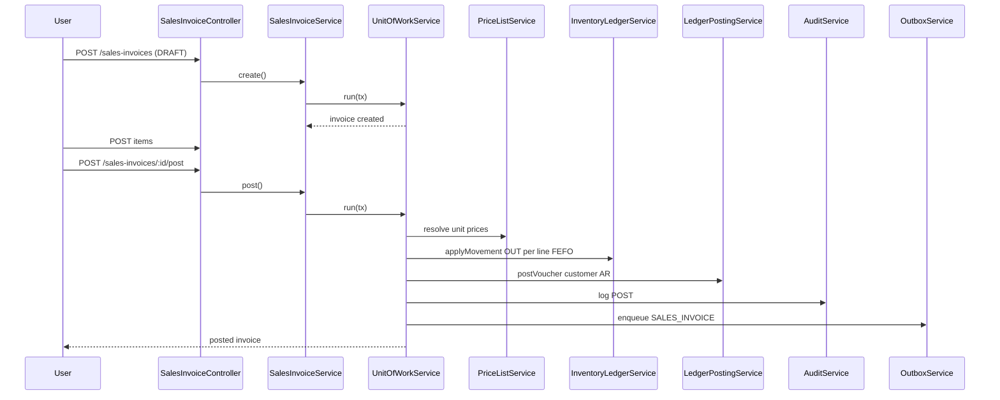

**Narrative:** Cashier creates a draft sales invoice for a walk-in customer. Line items are added while status is `DRAFT`. On **post**, the service resolves prices from the active branch price list (optional MRP cap from settings), allocates batches using FEFO, decrements stock via `InventoryLedgerService`, posts a customer ledger voucher, writes audit + outbox, and assigns `invoiceNumber` from sequence.

**Files touched:**

- `sales-invoice.service.ts` — `create()`, `post()`
- `sales-invoice-item.service.ts` — line CRUD in DRAFT
- `sales.util.ts` — `resolvePriceListItem`, `allocateFefoBatches`, `readSalesSettings`, `computeLineAmounts`
- `persistence/sequence/sequence-generator.service.ts` — `SALES_INVOICE` number at post
- `persistence/inventory/inventory-ledger.service.ts` — stock OUT per allocated batch
- `finance/utils/finance.util.ts` — `buildSalesInvoiceLedgerLines`, `adjustCustomerOutstanding`
- `persistence/ledger/ledger-posting.service.ts` — `postVoucher`
- `audit/audit.service.ts` + `persistence/outbox/outbox.service.ts` — same tx

See [sales-flow.md](../workflows/sales-flow.md).

---

### 4.2 Prescription sale

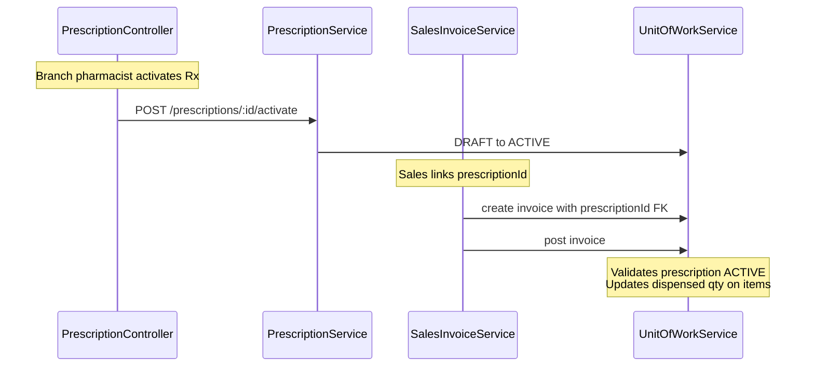

**Narrative:** Doctor prescription is created in `DRAFT`, items added, then **activated**. Sales invoice references `prescriptionId`; on post, sales service validates prescription status and updates `PrescriptionItem.dispensedQuantity` / header status (`PARTIALLY_DISPENSED` or `DISPENSED`). Stock and ledger side-effects match retail sale.

**Gap:** Full dispense-status sync is implemented in sales post path; prescription module does not auto-expire by date (manual `expire` endpoint).

**Files touched:**

- `prescription.service.ts` — `activate()` (DRAFT → ACTIVE)
- `prescription.util.ts` — status transition guards
- `sales-invoice.service.ts` — `create()` with `prescriptionId`; `post()` validates ACTIVE + updates dispensed qty
- `sales.util.ts` — `assertPrescriptionExists`
- (On post) same stock/ledger/audit chain as retail sale above

See [prescription.md](../database/tables/prescription/prescription.md).

---

### 4.3 Procure-to-pay

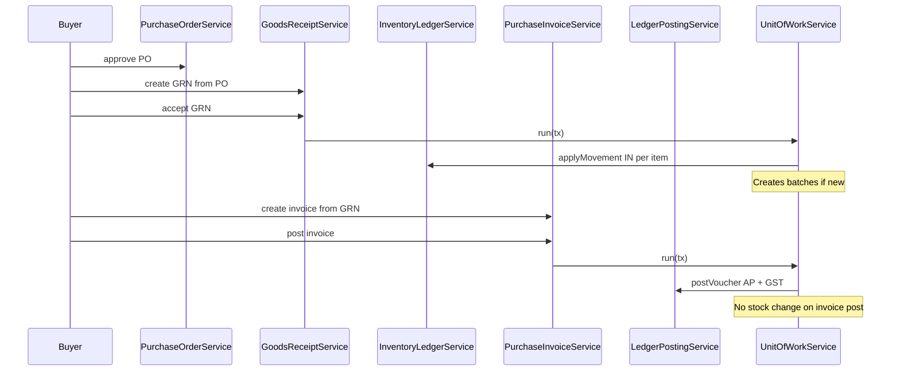

**Narrative:** Approved PO leads to GRN. **GRN accept** is the stock inbound boundary (creates/updates batches, stock IN). Purchase invoice records supplier AP; **post** creates accounting voucher (purchase + GST + supplier payable) without touching stock. Optional purchase return **approve** posts stock OUT.

**Files touched:**

- `purchase-order.service.ts` — `approve()`
- `goods-receipt.service.ts` — `accept()`; reads `SettingsService` for `purchase.allow_grn_without_po`
- `purchase.util.ts` — `resolveOrCreateBatch`, `grnStockQuantity`, `rollupPurchaseOrderStatus`
- `persistence/inventory/inventory-ledger.service.ts` — stock IN (`PURCHASE_GRN`)
- `inventory/constants/inventory.constants.ts` — `StockMovementType`
- `purchase-invoice.service.ts` — `post()`
- `finance/utils/finance.util.ts` — `buildPurchaseInvoiceLedgerLines`, `adjustSupplierOutstanding`
- `persistence/ledger/ledger-posting.service.ts` — AP voucher
- `purchase-return.service.ts` — `approve()` → stock OUT if return path taken

See [purchase-flow.md](../workflows/purchase-flow.md).

---

## Part 5 — Permissions, API index, and find by concern

### Finding code by concern

| I need to… | Start here |
|------------|------------|
| Change how stock moves (IN/OUT, negative guard) | [`inventory-ledger.service.ts`](../../../backend/src/persistence/inventory/inventory-ledger.service.ts) |
| Change FEFO or sale pricing at post | [`sales.util.ts`](../../../backend/src/sales/utils/sales.util.ts) |
| Change GRN batch creation on receive | [`purchase.util.ts`](../../../backend/src/purchase/utils/purchase.util.ts) → `resolveOrCreateBatch` |
| Change voucher / ledger lines for sales or purchase | [`finance.util.ts`](../../../backend/src/finance/utils/finance.util.ts) |
| Add a new document number type | [`document-type.constants.ts`](../../../backend/src/persistence/sequence/document-type.constants.ts) + seed `sequence-generator.json` |
| Add sync outbox entity type | [`entity-type.constants.ts`](../../../backend/src/persistence/outbox/entity-type.constants.ts) |
| Add a new permission | `backend/seed/data/security/permission.json` |
| Add a new report | [`report-definition.interface.ts`](../../../backend/src/reporting/core/report-definition.interface.ts) + new provider + register in `reporting.module.ts` |
| Change branch/tenant filtering | [`tenant-scope.util.ts`](../../../backend/src/persistence/context/tenant-scope.util.ts) |
| Change audit field history on UPDATE | [`audit.util.ts`](../../../backend/src/audit/utils/audit.util.ts) |
| Invalidate sessions after role change | [`session.util.ts`](../../../backend/src/security/utils/session.util.ts) |
| Add runtime toggle read by other modules | [`setting-keys.constants.ts`](../../../backend/src/settings/setting-keys.constants.ts) + `settings.service.ts` |
| Change CRUD template / nested routes pattern | [`party/`](../../../backend/src/party/) — reference module |

### Permission namespaces

| Namespace | Module | Example |
|-----------|--------|---------|
| `AUDIT` | audit | `AUDIT:AUDIT_LOG:READ` |
| `LOOKUP` | masters | `LOOKUP:COUNTRY:CREATE` |
| `MASTER` | medicine | `MASTER:MEDICINE:UPDATE` |
| `PARTY` | party | `PARTY:CUSTOMER:READ` |
| `SECURITY` | security | `SECURITY:USER:RESET_PASSWORD` |
| `CONFIGURATION` | configuration, settings | `CONFIGURATION:BRANCH:CREATE` |
| `PRICING` | pricing | `PRICING:PRICE_LIST:READ` |
| `PRESCRIPTION` | prescription | `PRESCRIPTION:PRESCRIPTION:ACTIVATE` |
| `INVENTORY` | inventory | `INVENTORY:STOCK_TRANSFER:DISPATCH` |
| `PURCHASE` | purchase | `PURCHASE:GOODS_RECEIPT:ACCEPT` |
| `SALES` | sales | `SALES:SALES_INVOICE:POST` |
| `FINANCE` | finance | `FINANCE:PAYMENT:COMPLETE` |
| `SYNC` | sync | `SYNC:OUTBOX:RETRY` |
| `REPORT_VIEW` | reporting | Global + per-report permission |

Permissions are seeded in `backend/seed/data/security/permission.json` and composed at login in `auth.service.ts`.

### Full API route index

**382 routes** — see [backend-route-index.md](./backend-route-index.md).

Regenerate after controller changes:

```bash
cd backend
npx ts-node scripts/generate-route-index.ts
```

---

## Part 6 — Maintenance

### When to update this document

- New feature module or controller added to `AppModule`
- New workflow endpoint (post, approve, dispatch, etc.)
- New persistence side-effect (sequence type, ledger movement type, outbox entity type)
- Scoping or permission namespace change

### When to add an architectural decision record

If you make a non-trivial design choice (alternatives discussed, cross-module impact, or hard to rediscover later), add an ADR:

1. Copy [`templates/adr-template.md`](./templates/adr-template.md) → `adrs/ADR-NNN-slug.md`
2. Add a row to the index in [`backend-memory-map.md`](./backend-memory-map.md)
3. Optionally add a **Key decisions** bullet in the relevant Part 3 module capsule (link only — detail stays in the ADR)

### Verification checklist

1. Regenerate route index: `npx ts-node scripts/generate-route-index.ts`
2. Spot-check workflow permissions in controllers vs module capsule tables
3. Confirm at-a-glance matrix matches `*.module.ts` controller counts
4. Run `npm run lint` if scripts or docs tooling changed

### Relationship to other docs

| Doc | Role |
|-----|------|
| **This file** | Backend developer guide: onboarding, wiring, non-trivial files, E2E flows, appendices |
| [`backend-memory-map.md`](./backend-memory-map.md) | Architectural decision history — why, not how |
| `.cursor/rules/docs/*-module.md` | Per-module API catalog and file map for agents |
| `database/tables/*` | Table design and business rules |
| `workflows/*` | Narrative business process docs |
| `extending-the-backend.md` | How to add a new module |

---

## Appendix A — Glossary

| Term | Meaning in this codebase |
|------|------------------------|
| **Party** | Shared person or organization identity; customer, supplier, doctor, and employee are role-specific details on the same `Party` |
| **GRN** | Goods Receipt Note — procurement document; **accept** is the stock **inbound** boundary |
| **FEFO** | First-expiry-first-out — batch allocation at sales invoice **post** (`allocateFefoBatches` in `sales.util.ts`) |
| **Post** | Workflow action that commits side-effects (stock, ledger, document number) — e.g. sales/purchase invoice post |
| **Unit of Work** | `UnitOfWorkService.run(tx => …)` — single SQLite transaction for all writes in a business operation |
| **Outbox** | `outbox` table row enqueued in the **same transaction** as the business mutation for offline-first sync |
| **Audit log** | Immutable business trail in `audit_logs` — distinct from Winston technical logs |
| **Branch-scoped** | Data filtered by JWT `branchId` via `withBranchScope` (sales, purchase, stock, prescription) |
| **Org-global** | No branch filter on list/get (party, medicine master, security admin, geo lookup) |
| **Batch** | Org-global lot record (medicine + batch number + expiry + MRP); stock is per branch per batch |
| **Stock movement** | Immutable ledger row created only by `InventoryLedgerService` — never insert directly |
| **Voucher** | Balanced set of `ledger_entries` posted by `LedgerPostingService` |
| **Price list** | Branch (or org-wide) set of medicine prices; resolved at sales **post** |
| **Prescription** | Branch-scoped doctor order; linked from sales invoice via `prescriptionId` FK |
| **Optimistic lock** | `version` column — update/delete fails with `ENTITY_VERSION_CONFLICT` if stale |
| **Sequence** | Config row + runtime `next()` that produces human-readable document numbers (INV/GRN/PO) |
| **Tenant scope** | `{ companyId, branchId }` from JWT-enriched `RequestContext` |
| **RESTOCK** | Sales return disposition that puts quantity back into stock on **approve** |
| **System ledger** | Pre-seeded COA codes (`CASH001`, `CUST001`, `SUP001`, `PUR001`, `GSTIN001`) used in vouchers |

---

## Appendix B — Auth and permissions chain

How a permission string on a controller ends up allowing or denying a request:

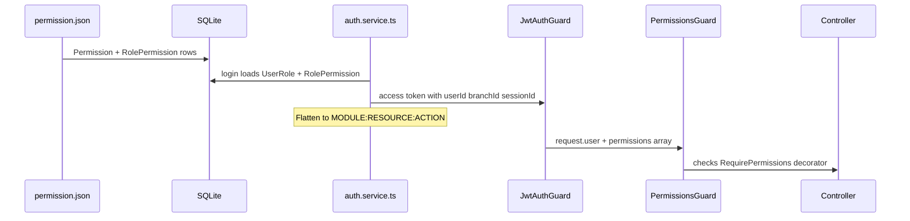

| Step | File | What happens |
|------|------|--------------|
| 1. Define permissions | [`backend/seed/data/security/permission.json`](../../../backend/seed/data/security/permission.json) | `module`, `resource`, `action` per row |
| 2. Map roles | Seed security JSON (`role.json`, role-permission links) | Administrator gets broad access; Cashier/Pharmacist subsets |
| 3. Login | [`auth.service.ts`](../../../backend/src/auth/auth.service.ts) `loadRolesAndPermissions` | Joins `UserRole` → `RolePermission` → `Permission`; builds strings like `SALES:SALES_INVOICE:POST` |
| 4. JWT | [`jwt.strategy.ts`](../../../backend/src/auth/jwt.strategy.ts) | Validates token; attaches `AuthenticatedUser` to request |
| 5. Guard | [`permissions.guard.ts`](../../../backend/src/auth/guards/permissions.guard.ts) | Compares `@RequirePermissions(...)` with `user.permissions` |
| 6. Route | Controller | Business logic runs if guard passes |

**403 debugging:**

1. Call `GET /auth/me` — inspect `permissions` array.
2. Find route in [backend-route-index.md](./backend-route-index.md) — note required permission.
3. If missing, update seed role mapping and re-seed, or use `admin` for full access during development.

---

## Appendix C — Troubleshooting

| Symptom | Likely cause | Where to check |
|---------|--------------|----------------|
| **403 Forbidden** | User lacks permission for route | `/auth/me` vs [route index](./backend-route-index.md); seed role mappings |
| **401 Unauthorized** | Missing/expired JWT | Re-login; `POST /auth/refresh`; ensure `Authorization: Bearer` header |
| **`ENTITY_VERSION_CONFLICT`** | Stale `version` on PATCH/DELETE | Client must send current `version` from last GET |
| **`STOCK_INSUFFICIENT`** | Not enough sellable quantity | `stocks` table; FEFO allocation in `sales.util.ts`; batch expiry settings |
| **Outbox / device errors** | `deviceId` not in `RequestContext` | `x-device-id` header; [`correlation.middleware.ts`](../../../backend/src/common/logging/correlation.middleware.ts) |
| **Wrong branch data** | JWT `branchId` mismatch | Login branch; `tenant-scope.util.ts`; list query `branchId` override |
| **Prisma P2002** | Unique constraint violation | Duplicate business code, batch number, or outbox `operationId` |
| **`INVALID_DOCUMENT_STATUS`** | Workflow called in wrong status | Module `constants/*.constants.ts` status enums; capsule workflow table |
| **`AUTH_PERMISSION_DENIED` on report** | Missing per-report permission | `REPORT_VIEW` plus report-specific permission in provider |
| **Empty list but data in DB** | Branch scope or soft-delete filter | `deletedAt: null`; `withBranchScope`; wrong branch JWT |

---

## Appendix D — Worked trace: sales invoice post

**Request:** `POST /sales-invoices/:id/post` with `SalesWorkflowDto` (optional remarks).

**Preconditions:** Invoice `DRAFT`, at least one line item, credit sales require `customerId`.

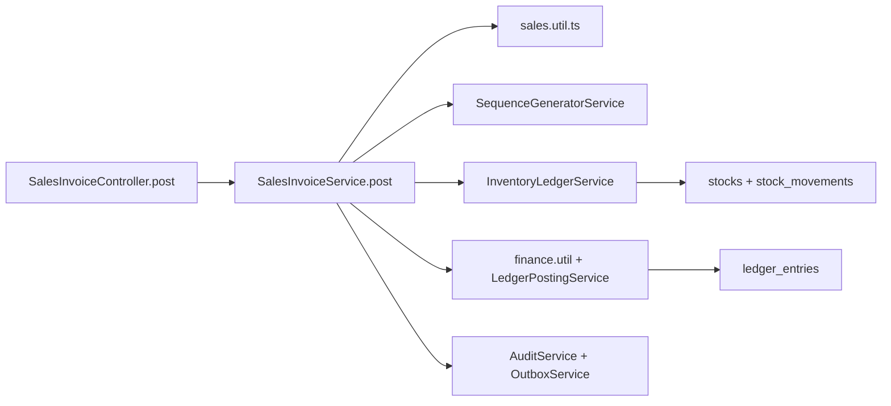

| Step | Layer | Action |
|------|-------|--------|
| 1 | Controller | `SalesInvoiceController.post` → `SalesInvoiceService.post` |
| 2 | Guards | JWT + `SALES:SALES_INVOICE:POST` |
| 3 | Transaction | `unitOfWork.run(tx => …)` |
| 4 | Validate | Status `DRAFT`, items exist, branch exists |
| 5 | Settings | `readSalesSettings` — MRP cap, expired batch rules |
| 6 | FEFO | `reallocateItemsForPost` / `allocateFefoBatches` — assign `batchId` per line |
| 7 | Pricing | `resolvePriceListItem` per line; `computeLineAmounts`; update `sales_invoice_items` |
| 8 | Sequence | `SALES_INVOICE` document number assigned at post |
| 9 | Stock | `inventoryLedger.applyMovement` OUT per line → `stocks`, `stock_movements` |
| 10 | Ledger | `buildSalesInvoiceLedgerLines` → `ledgerPosting.postVoucher` → `ledger_entries` |
| 11 | Outstanding | `adjustCustomerOutstanding` on customer party |
| 12 | Header | `sales_invoices` → `POSTED`, totals, `invoiceNumber` |
| 13 | Prescription | If `prescriptionId` set — update dispensed qty on `prescription_items` |
| 14 | Audit | `auditService.log` action `POST`, module `SALES` |
| 15 | Outbox | `outboxService.enqueue` entity `SALES_INVOICE`, operation `UPDATE` |

**Response:** Mapped `SalesInvoiceResponse` wrapped by `ResponseInterceptor` as `{ success: true, data: … }`.

See also: [Part 4.1](#41-retail-otc-sale), [Sales capsule](#sales), [sales-flow.md](../workflows/sales-flow.md).

---

## Appendix E — Backend vs UI maturity

| Layer | Status | Location |
|-------|--------|----------|
| **NestJS API** | Implemented — 16 feature modules, 382 routes | `backend/src/` — this guide |
| **SQLite + seed** | Rich demo data (~100 sales invoices, parties, stock, etc.) | `db/`, [seed README](../../../backend/seed/README.md) |
| **Angular UI** | Foundations only — login, dashboard, core HTTP client | `src/app/core/`, `src/app/features/auth/` |
| **Electron** | Shell + secure token storage + device id | [`electron/`](../../../electron/), [early-foundations.md](./early-foundations.md) |
| **Business screens** | Not built yet (no sales/purchase/inventory UI modules) | Future `src/app/features/*` |

**Implication for new developers:** Treat this guide and [backend-route-index.md](./backend-route-index.md) as the API contract. Test workflows via HTTP (e2e tests under `backend/test/`, Postman, or inspecting seeded SQLite). Angular will consume the same endpoints when feature UIs are added.

---

## Known gaps

| Gap | Notes |
|-----|-------|
| `party-contact` service | No `auditService.log` on mutations (exception to convention) |
| Closed financial year | Configuration can close FY; not enforced on all transaction modules yet |
| Sync worker | Outbox enqueue implemented; cloud upload worker not built |
| Conflict resolution | Metadata-only; does not apply payloads to business tables |
| Reporting | Only party reports registered; financial/inventory reports pending |
| Prescription auto-expire | Manual `expire` endpoint only |
| Agent memory README | Updated — see [`.cursor/rules/docs/README.md`](../../../.cursor/rules/docs/README.md) |

---

*Backend Developer Guide. Module API drill-down: [`.cursor/rules/docs/`](../../../.cursor/rules/docs/README.md).*
