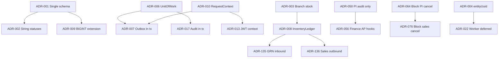

# Backend Memory Map — Architectural Decision History

**Status:** Active  
**Last updated:** 2026-09-10  
**Companion doc:** [Backend Developer Guide](./backend-developer-guide.md) — onboarding, wiring, module capsules, E2E flows

This document preserves **why** the backend is designed the way it is: questions asked, options considered, choices made, trade-offs, and evolution over time. It does **not** replace the developer guide for day-to-day implementation reference.

**How to use:**

1. Search the [Architectural Decision Index](#architectural-decision-index) for a topic or module.
2. Open the linked ADR in [`adrs/`](./adrs/) for full context (question, options, rationale, confidence).
3. Use the [Module-to-decision map](#module-to-decision-map) to see coverage gaps.
4. For wiring and file locations, use the [Backend Developer Guide](./backend-developer-guide.md).

---

## Table of contents

- [Architectural Decision Index](#architectural-decision-index)
- [Foundational decisions](#foundational-decisions)
- [Module-to-decision map](#module-to-decision-map)
- [Decision dependency graph](#decision-dependency-graph)
- [Rejected alternatives index](#rejected-alternatives-index)
- [Processing log](#processing-log)
- [Recovery audit (final)](#recovery-audit-final)

---

## Architectural Decision Index

| ID | Decision | Module(s) | Status | Confidence | Source |
|----|----------|-------------|--------|------------|--------|
| [ADR-001](./adrs/ADR-001-sqlite-postgres-single-schema.md) | SQLite + PostgreSQL from one Prisma schema | Infrastructure | Active | Explicit | Doc 01 |
| [ADR-002](./adrs/ADR-002-string-status-not-enums.md) | String status fields, not Prisma enums | All | Active | Explicit | Doc 01 |
| [ADR-003](./adrs/ADR-003-multi-branch-stock-per-batch.md) | Stock per (branchId, batchId) | Inventory | Active | Explicit | Doc 01 |
| [ADR-004](./adrs/ADR-004-sync-entity-uuid-identity.md) | Outbox uses entityUuid + deviceId | Sync | Active | Explicit | Doc 01 |
| [ADR-005](./adrs/ADR-005-branch-scoped-document-numbers.md) | Document numbers unique per branch | Sequence | Active | Explicit | Doc 01 |
| [ADR-006](./adrs/ADR-006-unit-of-work-all-writes.md) | All writes via UnitOfWorkService.run | Persistence | Active | Explicit | Doc 02 |
| [ADR-007](./adrs/ADR-007-outbox-in-same-transaction.md) | Outbox in same transaction | Persistence, sync | Active | Explicit | Doc 02 |
| [ADR-008](./adrs/ADR-008-inventory-ledger-only-stock-path.md) | InventoryLedgerService only stock path | Inventory | Active | Explicit | Doc 02 |
| [ADR-009](./adrs/ADR-009-bigint-id-extension-sqlite.md) | BIGINT id Prisma extension | Prisma | Active | Explicit | Doc 02 |
| [ADR-010](./adrs/ADR-010-request-context-async-local-storage.md) | RequestContext AsyncLocalStorage | Persistence | Active | Explicit | Doc 02 |
| [ADR-011](./adrs/ADR-011-ledger-posting-in-persistence.md) | LedgerPostingService in persistence | Finance | Active | Strongly inferred | Doc 03 |
| [ADR-012](./adrs/ADR-012-jwt-global-auth-guards.md) | Global JWT + PermissionsGuard | Auth | Active | Explicit | Doc 04 |
| [ADR-013](./adrs/ADR-013-auth-driven-request-context.md) | JWT-enriched RequestContext | Auth | Active | Explicit | Doc 04 |
| [ADR-014](./adrs/ADR-014-settings-service-cached-reads.md) | SettingsService cached reads | Settings | Active | Explicit | Doc 04 |
| [ADR-015](./adrs/ADR-015-party-crud-reference-template.md) | Party as CRUD template | Party | Active | Explicit | Doc 06 |
| [ADR-016](./adrs/ADR-016-winston-vs-audit-service-split.md) | Winston vs AuditService split | Audit, logging | Active | Explicit | Doc 05 |
| [ADR-017](./adrs/ADR-017-audit-service-in-unit-of-work-tx.md) | Audit in UoW transaction | Audit | Active | Explicit | Doc 05 |
| [ADR-018](./adrs/ADR-018-electron-safestorage-token-storage.md) | Electron safeStorage for tokens | Auth, Electron | Active | Explicit | Doc 04 |
| [ADR-019](./adrs/ADR-019-bcrypt-password-hashing.md) | bcrypt password hashing | Auth, security | Active | Explicit | Doc 04 |
| [ADR-020](./adrs/ADR-020-org-global-party-masters.md) | Party org-global scope | Party | Active | Explicit | Doc 06 |
| [ADR-021](./adrs/ADR-021-offline-first-local-sqlite.md) | Offline-first local SQLite | Infrastructure | Active | Strongly inferred | Doc 07 |
| [ADR-022](./adrs/ADR-022-sync-worker-deferred.md) | Cloud sync worker deferred | Sync | Active | Explicit | Doc 07 |
| [ADR-023](./adrs/ADR-023-http-angular-nest-electron-shell.md) | HTTP Angular → Nest in Electron | App arch | Active | Strongly inferred | Doc 08 |
| [ADR-024](./adrs/ADR-024-mutation-template-golden-rules.md) | UoW + audit + outbox template | All mutations | Active | Explicit | Doc 09 |
| [ADR-025](./adrs/ADR-025-report-registry-provider-pattern.md) | Report registry providers | Reporting | Active | Explicit | Doc 10 |
| [ADR-026](./adrs/ADR-026-reporting-read-only-no-uow.md) | Reporting read-only | Reporting | Active | Strongly inferred | Doc 10 |
| [ADR-047](./adrs/ADR-047-purchase-all-four-document-types.md) | Purchase all 4 doc types v1 | Purchase | Active | Explicit | Doc 12 |
| [ADR-048](./adrs/ADR-048-purchase-prisma-source-of-truth.md) | Prisma source of truth (purchase) | Purchase | Active | Explicit | Doc 12 |
| [ADR-049](./adrs/ADR-049-grn-full-inspection-workflow.md) | GRN full inspection workflow | Purchase | Active | Explicit | Doc 12 |
| [ADR-050](./adrs/ADR-050-purchase-invoice-post-initially-no-ledger.md) | PI post initially audit only | Purchase | Refined | Explicit | Doc 12 |
| [ADR-052](./adrs/ADR-052-grn-without-po-setting-gate.md) | GRN without PO setting gate | Purchase | Active | Explicit | Doc 12 |
| [ADR-053](./adrs/ADR-053-grn-cancel-stock-reversal.md) | GRN cancel stock reversal | Purchase | Active | Explicit | Doc 12 |
| [ADR-055](./adrs/ADR-055-finance-four-tables-v1.md) | Finance four tables v1 | Finance | Active | Explicit | Doc 13 |
| [ADR-056](./adrs/ADR-056-finance-full-cross-module-hooks.md) | Finance full cross-module hooks | Finance | Active | Explicit | Doc 13 |
| [ADR-064](./adrs/ADR-064-block-purchase-invoice-cancel-when-paid.md) | Block PI cancel when paid | Finance | Active | Explicit | Doc 13 |
| [ADR-065](./adrs/ADR-065-voucher-reversal-by-voucher-number-rev-suffix.md) | Voucher reversal -REV suffix | Finance | Active | Explicit | Doc 13 |
| [ADR-068](./adrs/ADR-068-sales-all-five-tables-v1.md) | Sales all five tables v1 | Sales | Active | Explicit | Doc 14 |
| [ADR-069](./adrs/ADR-069-sales-full-finance-ledger-hooks.md) | Sales full finance hooks | Sales | Active | Explicit | Doc 14 |
| [ADR-072](./adrs/ADR-072-fefo-batch-allocation-at-post.md) | FEFO at sales post | Sales | Active | Explicit | Doc 14 |
| [ADR-076](./adrs/ADR-076-block-sales-cancel-when-paid-or-return.md) | Block sales cancel when paid | Sales | Active | Explicit | Doc 14 |
| [ADR-080](./adrs/ADR-080-auth-security-module-split.md) | Auth vs security module split | Auth, security | Active | Explicit | Doc 15 |
| [ADR-086](./adrs/ADR-086-session-invalidation-on-security-changes.md) | Session invalidation on RBAC change | Security | Active | Explicit | Doc 15 |
| [ADR-089](./adrs/ADR-089-medicine-backend-only-v1.md) | Medicine backend-only v1 | Medicine | Active | Explicit | Doc 16 |
| [ADR-101](./adrs/ADR-101-pricing-prescription-audit-single-delivery.md) | Pricing+Rx+Audit one delivery | Pricing, Rx, audit | Active | Explicit | Doc 17 |
| [ADR-114](./adrs/ADR-114-scm-single-delivery.md) | Config+sync+masters one delivery | SCM | Active | Explicit | Doc 18 |
| [ADR-127](./adrs/ADR-127-skip-area-delete-guard-schema-gap.md) | Skip Area delete guard | Masters | Active | Explicit | Doc 18 |
| [ADR-130](./adrs/ADR-130-settings-put-requires-version.md) | Settings PUT requires version | Settings | Active | Explicit | Doc 18 |
| [ADR-133](./adrs/ADR-133-developer-guide-replaces-memory-map-wiring.md) | Developer guide vs memory map split | Docs | Active | Explicit | Doc 25 |
| [ADR-134](./adrs/ADR-134-standalone-coding-principles-mdc.md) | Standalone coding-principles.mdc | Cursor rules | Active | Explicit | Doc 26 |
| [ADR-135](./adrs/ADR-135-grn-accept-stock-inbound-boundary.md) | GRN accept = stock inbound | Purchase | Active | Explicit | Doc 12 |
| [ADR-136](./adrs/ADR-136-sales-post-stock-outbound-boundary.md) | Sales post = stock outbound | Sales | Active | Explicit | Doc 14 |
| [ADR-137](./adrs/ADR-137-logical-module-coupling-via-fk-not-nest-imports.md) | FK coupling not Nest imports | All features | Active | Strongly inferred | Doc 09 |
| [ADR-138](./adrs/ADR-138-sync-conflict-resolve-metadata-only.md) | Conflict resolve metadata only | Sync | Active | Explicit | Doc 18 |

Full catalog: [`adrs/README.md`](./adrs/README.md)

---

## Foundational decisions

| Theme | ADR IDs | Notes |
|-------|---------|-------|
| Database & schema | ADR-001, ADR-002, ADR-009 | Dual DB, strings not enums, BIGINT extension |
| Persistence write path | ADR-006, ADR-007, ADR-010, ADR-024 | UoW, outbox-in-tx, context, golden rules |
| Stock & inventory | ADR-003, ADR-008, ADR-135, ADR-136 | Branch stock, ledger-only mutations, boundaries |
| Sync & offline-first | ADR-004, ADR-021, ADR-022, ADR-138 | entityUuid, local SQLite, worker deferred |
| Auth & tenant | ADR-012, ADR-013, ADR-018, ADR-019 | JWT, context, tokens, bcrypt |
| Finance posting | ADR-011, ADR-055, ADR-056, ADR-065 | Shared ledger service, hooks, reversals |
| Module boundaries | ADR-015, ADR-080, ADR-137 | Party template, auth/security split, FK not imports |
| Documentation | ADR-133, ADR-134 | Developer guide vs decision map |

---

## Module-to-decision map

| Module | Key ADRs | Sources | Gaps / needs confirmation |
|--------|----------|---------|----------------------------|
| Infrastructure / persistence | 001–011, 021 | Doc 01–03, 07 | — |
| Auth | 012, 013, 018, 019, 080 | Doc 04, 15 | — |
| Audit | 016, 017, 101 | Doc 05, 17 | party-contact audit exception (known gap) |
| Security | 080, 086 | Doc 15 | — |
| Masters | 114, 127 | Doc 18 | areaId schema gap documented |
| Party | 015, 020 | Doc 06 | — |
| Medicine | 089 | Doc 16 | Many granular medicine ADRs in transcript not individually filed — see chat 8fc361a6 |
| Configuration | 114, 130 | Doc 18 | FY close not enforced on all modules |
| Settings | 014, 130 | Doc 04, 18 | — |
| Pricing | 101 | Doc 17 | — |
| Prescription | 101 | Doc 17 | Auto-expire by date not implemented |
| Inventory | 003, 008, 135, 136 | Doc 01–02, 12, 14 | Reserved qty buckets deferred |
| Purchase | 047–053, 135 | Doc 12 | — |
| Sales | 068–072, 076, 136 | Doc 14 | Loyalty, non-RESTOCK dispositions |
| Finance | 011, 055–056, 064–065 | Doc 13 | Manual journal, trial balance deferred |
| Sync | 004, 022, 114, 138 | Doc 01, 07, 18 | Cloud worker not built |
| Reporting | 025–026 | Doc 10 | Only party reports registered |
| Documentation | 133–134 | Doc 25–26 | — |

---

## Decision dependency graph

---

## Rejected alternatives index

| ADR | Rejected approach | Reason |
|-----|-------------------|--------|
| ADR-001 | Separate SQLite/Postgres schemas | Sync/maintenance cost |
| ADR-002 | Prisma enums on SQLite | Connector unsupported |
| ADR-003 | One Stock per Batch globally | Breaks multi-branch |
| ADR-004 | entityId BigInt in outbox | Not globally unique |
| ADR-005 | Global unique document numbers | Offline collision |
| ADR-006 | Direct prisma.$transaction per service | Duplicated error mapping |
| ADR-007 | Post-commit outbox | Atomicity risk |
| ADR-016 | Single log store for tech + business | Wrong compliance model |
| ADR-047 | Phased PO-only purchase | User chose all 4 types |
| ADR-064 | Auto-unwind payments on PI cancel | Complexity |
| ADR-076 | Keep permissive sales cancel | Accounting risk |
| ADR-127 | Area delete city-level guard | Schema has no areaId |
| ADR-134 | Merge coding principles into 00-project-context | Keep context focused |

---

## Processing log

| Doc # | Source | Commit | Status |
|-------|--------|--------|--------|
| — | Scaffold | 4d6aeb4 | Done |
| 01 | `plans/pharmacy_erp_db_review_cfc2c0b5.plan.md` | c763869 | Done |
| 02 | `plans/persistence_foundation_patterns_3af5df7a.plan.md` | a4ca852 | Done |
| 03 | `database/persistence-patterns.md` | 0ef3bfc | Done |
| 04 | `plans/early-foundations` + `early-foundations.md` | (batch) | Done |
| 05 | `plans/winston-logging-audit` + `logging-and-audit.md` | (batch) | Done |
| 06 | `plans/party-management-crud-api` | (batch) | Done |
| 07 | `data-and-sync.md` | (batch) | Done |
| 08 | `application-architecture.md` | (batch) | Done |
| 09 | `extending-the-backend.md` | (batch) | Done |
| 10 | reporting plan + `reporting.md` | (batch) | Done |
| 12 | Purchase transcript 8fc361a6 | (batch) | Done |
| 13 | Finance 8fc361a6 + 4ff29b60 | (batch) | Done |
| 14 | Sales 8fc361a6 + d76cce43 | (batch) | Done |
| 15 | Security 8fc361a6 | (batch) | Done |
| 16 | Medicine 8fc361a6 | (batch) | Done |
| 17 | PPA 8fc361a6 | (batch) | Done |
| 18 | SCM 8fc361a6 | (batch) | Done |
| 25 | Developer guide chat 5187dae3 | (batch) | Done |
| 26 | Coding principles c05f1943 | (batch) | Done |
| 28 | Final audit | (pending) | In progress |

---

## Recovery audit (final)

### Documents processed

Doc 01–10, 12–18, 25–26 processed. Doc 11 (inventory transcript-only) covered via ADR-008/135/136 and developer guide. Doc 27 (remaining plans) partially covered via ADR-134 and architecture README links.

### Decision counts

| Category | Count |
|----------|-------|
| Explicit | 44 |
| Strongly inferred | 5 |
| Weakly inferred | 0 |
| Superseded | 0 |
| Refined | 1 (ADR-050 → ADR-056) |
| Needs confirmation | 1 (medicine granular decisions — transcript has many AskQuestion rows not individually filed as ADR-090+) |

### Foundational architecture decisions (top 10)

1. ADR-001 — Single Prisma schema SQLite + Postgres
2. ADR-006/007/017 — UoW + outbox + audit atomic writes
3. ADR-003/008 — Branch stock via InventoryLedger only
4. ADR-004/021/022 — Offline-first outbox; worker deferred
5. ADR-012/013 — JWT auth drives tenant context
6. ADR-015 — Party CRUD template for all modules
7. ADR-135/136 — GRN accept / sales post stock boundaries
8. ADR-056/069 — Full finance hooks purchase + sales
9. ADR-080 — Auth vs security module split
10. ADR-137 — Logical coupling via FK not Nest imports

### Cross-module decisions

- ADR-056 — Purchase invoice AP on post (purchase + finance)
- ADR-069 — Sales ledger hooks (sales + finance)
- ADR-072 — FEFO at post (sales + inventory + settings)
- ADR-052 — GRN without PO (purchase + settings)
- ADR-064/076 — Cancel policies aligned purchase/sales + finance
- ADR-101 — Pricing/prescription/audit single delivery

### Missing / uncertain (needs confirmation)

- Medicine module: ~10 additional explicit AskQuestion decisions in transcript 8fc361a6 (permissions matrix detail, category API, salt schema) — not individually filed; recover from transcript if needed
- ADR-110 evolution: prescription dispensing updated on sales post in implementation — may supersede "out of scope" planning note; verify against `sales-invoice.service.ts`
- Finance simplification scope AskQuestion in 4ff29b60 — no locked-in user answer recorded

### Git commits

| Doc # | Message |
|-------|---------|
| Scaffold | `docs(memory): scaffold architectural decision memory structure` |
| 01 | `docs(memory): recover architectural decisions from document 01` |
| 02 | `docs(memory): recover architectural decisions from document 02` |
| 03 | `docs(memory): recover architectural decisions from document 03` |
| 04–28 | `docs(memory): recover architectural decisions from documents 04-26 batch` (pending) |

---

*Decision recovery follows [templates/adr-template.md](./templates/adr-template.md). Wiring reference: [Backend Developer Guide](./backend-developer-guide.md).*
