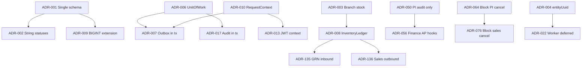
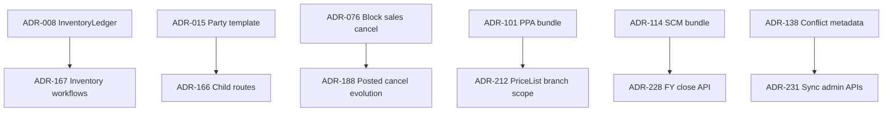

# Backend Memory Map — Architectural Decision History

**Status:** Active  
**Last updated:** 2026-09-11  
**Recovery status:** COMPLETE (Phase 1 + Phase 2 closeout)  
**Companion doc:** [Backend Developer Guide](./backend-developer-guide.md) — onboarding, wiring, module capsules, E2E flows

This document preserves **why** the backend is designed the way it is: questions asked, options considered, choices made, trade-offs, and evolution over time. It does **not** replace the developer guide for day-to-day implementation reference.

**How to use:**

1. Search the [Architectural Decision Index](#architectural-decision-index) for a topic or module.
2. Open the linked ADR in [`adrs/`](./adrs/) for full context (question, options, rationale, confidence).
3. Use the [Module-to-decision map](#module-to-decision-map) to see coverage gaps.
4. For wiring and file locations, use the [Backend Developer Guide](./backend-developer-guide.md).

---

## Table of contents

- [Architectural Decision Index](#architectural-decision-index)
- [Foundational decisions](#foundational-decisions)
- [Module-to-decision map](#module-to-decision-map)
- [Decision dependency graph](#decision-dependency-graph)
- [Rejected alternatives index](#rejected-alternatives-index)
- [Processing log](#processing-log)
- [Phase 2 draft cross-reference](#phase-2-draft-cross-reference)
- [Recovery audit (final)](#recovery-audit-final)

---

## Architectural Decision Index

| ID | Decision | Module(s) | Status | Confidence | Source |
|----|----------|-------------|--------|------------|--------|
| [ADR-001](./adrs/ADR-001-sqlite-postgres-single-schema.md) | SQLite + PostgreSQL from one Prisma schema | Infrastructure | Active | Explicit | Doc 01 |
| [ADR-002](./adrs/ADR-002-string-status-not-enums.md) | String status fields, not Prisma enums | All | Active | Explicit | Doc 01 |
| [ADR-003](./adrs/ADR-003-multi-branch-stock-per-batch.md) | Stock per (branchId, batchId) | Inventory | Active | Explicit | Doc 01 |
| [ADR-004](./adrs/ADR-004-sync-entity-uuid-identity.md) | Outbox uses entityUuid + deviceId | Sync | Active | Explicit | Doc 01 |
| [ADR-005](./adrs/ADR-005-branch-scoped-document-numbers.md) | Document numbers unique per branch | Sequence | Active | Explicit | Doc 01 |
| [ADR-006](./adrs/ADR-006-unit-of-work-all-writes.md) | All writes via UnitOfWorkService.run | Persistence | Active | Explicit | Doc 02 |
| [ADR-007](./adrs/ADR-007-outbox-in-same-transaction.md) | Outbox in same transaction | Persistence, sync | Active | Explicit | Doc 02 |
| [ADR-008](./adrs/ADR-008-inventory-ledger-only-stock-path.md) | InventoryLedgerService only stock path | Inventory | Active | Explicit | Doc 02 |
| [ADR-009](./adrs/ADR-009-bigint-id-extension-sqlite.md) | BIGINT id Prisma extension | Prisma | Active | Explicit | Doc 02 |
| [ADR-010](./adrs/ADR-010-request-context-async-local-storage.md) | RequestContext AsyncLocalStorage | Persistence | Active | Explicit | Doc 02 |
| [ADR-011](./adrs/ADR-011-ledger-posting-in-persistence.md) | LedgerPostingService in persistence | Finance | Active | Strongly inferred | Doc 03 |
| [ADR-012](./adrs/ADR-012-jwt-global-auth-guards.md) | Global JWT + PermissionsGuard | Auth | Active | Explicit | Doc 04 |
| [ADR-013](./adrs/ADR-013-auth-driven-request-context.md) | JWT-enriched RequestContext | Auth | Active | Explicit | Doc 04 |
| [ADR-014](./adrs/ADR-014-settings-service-cached-reads.md) | SettingsService cached reads | Settings | Active | Explicit | Doc 04 |
| [ADR-015](./adrs/ADR-015-party-crud-reference-template.md) | Party as CRUD template | Party | Active | Explicit | Doc 06 |
| [ADR-016](./adrs/ADR-016-winston-vs-audit-service-split.md) | Winston vs AuditService split | Audit, logging | Active | Explicit | Doc 05 |
| [ADR-017](./adrs/ADR-017-audit-service-in-unit-of-work-tx.md) | Audit in UoW transaction | Audit | Active | Explicit | Doc 05 |
| [ADR-018](./adrs/ADR-018-electron-safestorage-token-storage.md) | Electron safeStorage for tokens | Auth, Electron | Active | Explicit | Doc 04 |
| [ADR-019](./adrs/ADR-019-bcrypt-password-hashing.md) | bcrypt password hashing | Auth, security | Active | Explicit | Doc 04 |
| [ADR-020](./adrs/ADR-020-org-global-party-masters.md) | Party org-global scope | Party | Active | Explicit | Doc 06 |
| [ADR-021](./adrs/ADR-021-offline-first-local-sqlite.md) | Offline-first local SQLite | Infrastructure | Active | Strongly inferred | Doc 07 |
| [ADR-022](./adrs/ADR-022-sync-worker-deferred.md) | Cloud sync worker deferred | Sync | Active | Explicit | Doc 07 |
| [ADR-023](./adrs/ADR-023-http-angular-nest-electron-shell.md) | HTTP Angular → Nest in Electron | App arch | Active | Strongly inferred | Doc 08 |
| [ADR-024](./adrs/ADR-024-mutation-template-golden-rules.md) | UoW + audit + outbox template | All mutations | Active | Explicit | Doc 09 |
| [ADR-025](./adrs/ADR-025-report-registry-provider-pattern.md) | Report registry providers | Reporting | Active | Explicit | Doc 10 |
| [ADR-026](./adrs/ADR-026-reporting-read-only-no-uow.md) | Reporting read-only | Reporting | Active | Strongly inferred | Doc 10 |
| [ADR-047](./adrs/ADR-047-purchase-all-four-document-types.md) | Purchase all 4 doc types v1 | Purchase | Active | Explicit | Doc 12 |
| [ADR-048](./adrs/ADR-048-purchase-prisma-source-of-truth.md) | Prisma source of truth (purchase) | Purchase | Active | Explicit | Doc 12 |
| [ADR-049](./adrs/ADR-049-grn-full-inspection-workflow.md) | GRN full inspection workflow | Purchase | Active | Explicit | Doc 12 |
| [ADR-050](./adrs/ADR-050-purchase-invoice-post-initially-no-ledger.md) | PI post initially audit only | Purchase | Refined | Explicit | Doc 12 |
| [ADR-052](./adrs/ADR-052-grn-without-po-setting-gate.md) | GRN without PO setting gate | Purchase | Active | Explicit | Doc 12 |
| [ADR-053](./adrs/ADR-053-grn-cancel-stock-reversal.md) | GRN cancel stock reversal | Purchase | Active | Explicit | Doc 12 |
| [ADR-055](./adrs/ADR-055-finance-four-tables-v1.md) | Finance four tables v1 | Finance | Active | Explicit | Doc 13 |
| [ADR-056](./adrs/ADR-056-finance-full-cross-module-hooks.md) | Finance full cross-module hooks | Finance | Active | Explicit | Doc 13 |
| [ADR-064](./adrs/ADR-064-block-purchase-invoice-cancel-when-paid.md) | Block PI cancel when paid | Finance | Active | Explicit | Doc 13 |
| [ADR-065](./adrs/ADR-065-voucher-reversal-by-voucher-number-rev-suffix.md) | Voucher reversal -REV suffix | Finance | Active | Explicit | Doc 13 |
| [ADR-068](./adrs/ADR-068-sales-all-five-tables-v1.md) | Sales all five tables v1 | Sales | Active | Explicit | Doc 14 |
| [ADR-069](./adrs/ADR-069-sales-full-finance-ledger-hooks.md) | Sales full finance hooks | Sales | Active | Explicit | Doc 14 |
| [ADR-072](./adrs/ADR-072-fefo-batch-allocation-at-post.md) | FEFO at sales post | Sales | Active | Explicit | Doc 14 |
| [ADR-076](./adrs/ADR-076-block-sales-cancel-when-paid-or-return.md) | Block sales cancel when paid | Sales | Active | Explicit | Doc 14 |
| [ADR-080](./adrs/ADR-080-auth-security-module-split.md) | Auth vs security module split | Auth, security | Active | Explicit | Doc 15 |
| [ADR-086](./adrs/ADR-086-session-invalidation-on-security-changes.md) | Session invalidation on RBAC change | Security | Active | Explicit | Doc 15 |
| [ADR-089](./adrs/ADR-089-medicine-backend-only-v1.md) | Medicine backend-only v1 | Medicine | Active | Explicit | Doc 16 |
| [ADR-101](./adrs/ADR-101-pricing-prescription-audit-single-delivery.md) | Pricing+Rx+Audit one delivery | Pricing, Rx, audit | Active | Explicit | Doc 17 |
| [ADR-114](./adrs/ADR-114-scm-single-delivery.md) | Config+sync+masters one delivery | SCM | Active | Explicit | Doc 18 |
| [ADR-127](./adrs/ADR-127-skip-area-delete-guard-schema-gap.md) | Skip Area delete guard | Masters | Active | Explicit | Doc 18 |
| [ADR-130](./adrs/ADR-130-settings-put-requires-version.md) | Settings PUT requires version | Settings | Active | Explicit | Doc 18 |
| [ADR-133](./adrs/ADR-133-developer-guide-replaces-memory-map-wiring.md) | Developer guide vs memory map split | Docs | Active | Explicit | Doc 25 |
| [ADR-134](./adrs/ADR-134-standalone-coding-principles-mdc.md) | Standalone coding-principles.mdc | Cursor rules | Active | Explicit | Doc 26 |
| [ADR-135](./adrs/ADR-135-grn-accept-stock-inbound-boundary.md) | GRN accept = stock inbound | Purchase | Active | Explicit | Doc 12 |
| [ADR-136](./adrs/ADR-136-sales-post-stock-outbound-boundary.md) | Sales post = stock outbound | Sales | Active | Explicit | Doc 14 |
| [ADR-137](./adrs/ADR-137-logical-module-coupling-via-fk-not-nest-imports.md) | FK coupling not Nest imports | All features | Active | Strongly inferred | Doc 09 |
| [ADR-138](./adrs/ADR-138-sync-conflict-resolve-metadata-only.md) | Conflict resolve metadata only | Sync | Active | Explicit | Doc 18 |

## Phase 2 Decision Index (ADR-139–251)

| ID | Decision | Module(s) | Status | Confidence | Source |
|----|----------|-------------|--------|------------|--------|
| [ADR-139](./adrs/ADR-139-offline-first-local-source-of-truth.md) | Local database is source of truth during daily opera... | sync, persistence | Active | Strongly inferred | Doc 07 — subagent draft ADR-021 |
| [ADR-140](./adrs/ADR-140-delta-sync-only.md) | Delta sync — send only changed records | sync | Active | Strongly inferred | Doc 07 — subagent draft ADR-022 |
| [ADR-141](./adrs/ADR-141-outbox-background-sync-triggers.md) | Outbox pattern with background sync triggers | sync, persistence | Active | Strongly inferred | Doc 07 — subagent draft ADR-023 |
| [ADR-142](./adrs/ADR-142-request-idempotency-uuid.md) | Per-transaction UUID for idempotent sync requests | sync | Active | Strongly inferred | Doc 07 — subagent draft ADR-024 |
| [ADR-143](./adrs/ADR-143-entity-specific-conflict-resolution.md) | Entity-specific conflict resolution rules | sync, inventory, party, medicine | Active | Strongly inferred | Doc 07 — subagent draft ADR-025 |
| [ADR-144](./adrs/ADR-144-angular-feature-modules-no-component-logic.md) | Angular feature modules; no business logic in compon... | frontend | Active | Strongly inferred | Doc 08 — subagent draft ADR-026 |
| [ADR-145](./adrs/ADR-145-electron-context-isolation-preload.md) | Electron context isolation with preload contextBridge | electron, frontend | Active | Strongly inferred | Doc 08 — subagent draft ADR-027 |
| [ADR-146](./adrs/ADR-146-nestjs-thin-controller-rich-service.md) | NestJS thin controllers, rich services, validated DTOs | backend | Active | Strongly inferred | Doc 08 — subagent draft ADR-028 |
| [ADR-147](./adrs/ADR-147-rest-json-envelope-binary-exports.md) | REST with JSON envelope; binary streams for exports | backend, frontend | Active | Strongly inferred | Doc 08 — subagent draft ADR-029 |
| [ADR-148](./adrs/ADR-148-feature-module-anatomy-template.md) | Standard feature module folder anatomy | backend | Active | Strongly inferred | Doc 09 — subagent draft ADR-030 |
| [ADR-149](./adrs/ADR-149-reads-prisma-writes-unit-of-work.md) | Reads via PrismaService; writes via UnitOfWorkService | persistence, all modules | Active | Strongly inferred | Doc 09 — subagent draft ADR-031 |
| [ADR-150](./adrs/ADR-150-mutation-audit-outbox-same-transaction.md) | Audit and outbox in same transaction as mutation | persistence, audit, sync | Active | Strongly inferred | Doc 09 — subagent draft ADR-032 |
| [ADR-151](./adrs/ADR-151-reports-via-registry-not-controller.md) | Read-only reports register into ReportRegistryService | reporting | Active | Strongly inferred | Doc 09 — subagent draft ADR-033 |
| [ADR-152](./adrs/ADR-152-additive-only-backend-extensions.md) | Additive-only change policy for backend extensions | all modules | Active | Strongly inferred | Doc 09 — subagent draft ADR-034 |
| [ADR-153](./adrs/ADR-153-central-report-registry-inverted-dependency.md) | Central reporting core with domain provider registra... | reporting | Active | Explicit | Doc 10 — subagent draft ADR-035 |
| [ADR-154](./adrs/ADR-154-reports-read-only-no-uow-outbox.md) | Reports are read-only — no UnitOfWork, Outbox, or Audit | reporting | Active | Explicit | Doc 10 — subagent draft ADR-036 |
| [ADR-155](./adrs/ADR-155-two-layer-report-permissions.md) | Coarse REPORT_VIEW plus per-report permission | reporting, security | Active | Explicit | Doc 10 — subagent draft ADR-037 |
| [ADR-156](./adrs/ADR-156-report-export-formats-csv-xlsx-pdf.md) | Report exports: JSON, CSV, Excel, PDF | reporting | Active | Explicit | Doc 10 — subagent draft ADR-038 |
| [ADR-157](./adrs/ADR-157-report-file-export-bypass-interceptor.md) | File exports bypass ResponseInterceptor via @Res | reporting | Active | Explicit | Doc 10 — subagent draft ADR-039 |
| [ADR-158](./adrs/ADR-158-namespaced-report-ids.md) | Namespaced report IDs (domain.report-name) | reporting | Active | Explicit | Doc 10 — subagent draft ADR-040 |
| [ADR-159](./adrs/ADR-159-party-reports-provider-first.md) | Party reports provider ships first under reporting/p... | reporting, party | Active | Explicit | Doc 10 — subagent draft ADR-041 |
| [ADR-160](./adrs/ADR-160-report-export-libraries-exceljs-pdfmake.md) | Export libraries: exceljs and pdfmake | reporting | Active | Explicit | Doc 10 — subagent draft ADR-042 |
| [ADR-161](./adrs/ADR-161-inventory-nested-item-controllers.md) | Inventory documents use nested item controllers | inventory | Active | Strongly inferred | Doc 11 — subagent draft ADR-043 |
| [ADR-162](./adrs/ADR-162-inventory-header-create-without-items.md) | Inventory headers created without embedded items[] | inventory | Active | Strongly inferred | Doc 11 — subagent draft ADR-044 |
| [ADR-163](./adrs/ADR-163-stock-movement-read-only-http.md) | StockMovement HTTP API is read-only | inventory, persistence | Active | Strongly inferred | Doc 11 — subagent draft ADR-045 |
| [ADR-164](./adrs/ADR-164-batch-org-global-stock-branch-scoped.md) | Batch org-global; Stock and documents branch-scoped | inventory | Active | Strongly inferred | Doc 11 — subagent draft ADR-046 |
| [ADR-165](./adrs/ADR-165-inventory-stock-read-only-dtos.md) | Stock and StockMovement read-only at API layer | inventory | Active | Explicit | Doc 11 — transcript 052a3bc9 Inventory DTO scope AskQuestion |
| [ADR-166](./adrs/ADR-166-inventory-separate-child-routes-for-items.md) | Inventory document items via separate child routes | inventory, party | Active | Explicit | Doc 11 — transcript 052a3bc9 nested_items AskQuestion |
| [ADR-167](./adrs/ADR-167-inventory-crud-plus-workflow-endpoints.md) | Inventory CRUD plus workflow endpoints in v1 | inventory | Active | Explicit | Doc 11 — transcript 052a3bc9 workflow_scope AskQuestion |
| [ADR-168](./adrs/ADR-168-inventory-batch-org-global-stock-branch-scoped.md) | Batch org-global; Stock and documents branch-scoped | inventory | Active | Strongly inferred | Doc 11 — inventory-module.md golden rules |
| [ADR-169](./adrs/ADR-169-inventory-stock-movement-immutable-read-only-http.md) | StockMovement HTTP API is read-only | inventory, persistence | Active | Strongly inferred | Doc 11 — inventory-module.md golden rules |
| [ADR-170](./adrs/ADR-170-inventory-stock-take-reconcile-creates-adjustment.md) | Stock-take reconcile creates adjustment and ledger p... | inventory | Active | Strongly inferred | Doc 11 — inventory-module.md workflow section |
| [ADR-171](./adrs/ADR-171-inventory-module-memory-doc-mdc-pattern.md) | Module memory doc plus scoped mdc rule for agent dis... | inventory, documentation | Active | Explicit | Doc 11 — transcript 052a3bc9 wiring AskQuestion |
| [ADR-172](./adrs/ADR-172-purchase-full-permission-matrix.md) | Purchase full INVENTORY-style permission matrix | purchase, security | Active | Explicit | Doc 12 — subagent draft ADR-051 |
| [ADR-173](./adrs/ADR-173-purchase-tests-deferred-v1.md) | Purchase module tests deferred in v1 | purchase | Active | Explicit | Doc 12 — subagent draft ADR-054 |
| [ADR-174](./adrs/ADR-174-finance-full-ledger-posting-service.md) | Full LedgerPostingService with balance validation an... | finance, persistence | Active | Explicit | Doc 13 — subagent draft ADR-057 |
| [ADR-175](./adrs/ADR-175-finance-ledger-entry-readonly-api.md) | LedgerEntry HTTP API read-only | finance | Active | Explicit | Doc 13 — subagent draft ADR-058 |
| [ADR-176](./adrs/ADR-176-finance-ledger-coa-full-crud.md) | Ledger COA full CRUD with hierarchy guards | finance | Active | Explicit | Doc 13 — subagent draft ADR-059 |
| [ADR-177](./adrs/ADR-177-finance-strict-financial-year-validation.md) | Strict financial year validation on posts | finance | Active | Explicit | Doc 13 — subagent draft ADR-060 |
| [ADR-178](./adrs/ADR-178-finance-global-payment-receipt-numbers.md) | Payment/Receipt numbers globally unique per Prisma s... | finance, sequence | Active | Explicit | Doc 13 — subagent draft ADR-061 |
| [ADR-179](./adrs/ADR-179-finance-expense-table-out-of-scope.md) | Expense Prisma model out of scope; use Payment EXPEN... | finance | Active | Explicit | Doc 13 — subagent draft ADR-062 |
| [ADR-180](./adrs/ADR-180-finance-tests-deferred-v1.md) | Finance module tests deferred in v1 | finance | Active | Explicit | Doc 13 — subagent draft ADR-063 |
| [ADR-181](./adrs/ADR-181-finance-reject-unsupported-payment-type.md) | Reject unsupported PaymentType at complete | finance | Active | Explicit | Doc 13 — subagent draft ADR-066 |
| [ADR-182](./adrs/ADR-182-finance-running-balance-best-effort.md) | Ledger running balance left best-effort in bug-fix pass | finance | Active | Explicit | Doc 13 — subagent draft ADR-067 |
| [ADR-183](./adrs/ADR-183-finance-simplification-scope-unresolved.md) | Finance simplification refactor scope unresolved | finance | Deferred | Explicit | Doc 13 — transcript 4ff29b60; closed Phase 2 closeout |
| [ADR-184](./adrs/ADR-184-sales-payment-nested-separate-from-receipt.md) | SalesPayment nested API; Finance Receipt stays separate | sales, finance | Active | Explicit | Doc 14 — subagent draft ADR-070 |
| [ADR-185](./adrs/ADR-185-sales-pricelist-auto-resolve-at-post.md) | Auto-resolve selling price from PriceList at post | sales, pricing | Active | Explicit | Doc 14 — subagent draft ADR-071 |
| [ADR-186](./adrs/ADR-186-sales-prescription-fk-only-v1.md) | Prescription FK validation only in sales v1 | sales, prescription | Active | Explicit | Doc 14 — subagent draft ADR-073 |
| [ADR-187](./adrs/ADR-187-sales-return-restock-only-v1.md) | Sales returns RESTOCK disposition only in v1 | sales, inventory | Active | Explicit | Doc 14 — subagent draft ADR-074 |
| [ADR-188](./adrs/ADR-188-sales-posted-cancel-with-reversal-v1.md) | Posted sales invoice cancel with stock and ledger re... | sales | Superseded | Explicit | Doc 14 — subagent draft ADR-075 |
| [ADR-189](./adrs/ADR-189-sales-full-permission-matrix.md) | Sales full permission matrix | sales, security | Active | Explicit | Doc 14 — subagent draft ADR-077 |
| [ADR-190](./adrs/ADR-190-sales-tests-deferred-v1.md) | Sales module tests deferred in v1 | sales | Active | Explicit | Doc 14 — subagent draft ADR-078 |
| [ADR-191](./adrs/ADR-191-security-all-six-tables-plus-userbranch.md) | Security admin: all six doc tables plus UserBranch | security | Active | Explicit | Doc 15 — subagent draft ADR-079 |
| [ADR-192](./adrs/ADR-192-security-full-password-flows.md) | Admin reset, self change-password, and unlock flows | auth, security | Active | Explicit | Doc 15 — subagent draft ADR-081 |
| [ADR-193](./adrs/ADR-193-security-permission-full-crud.md) | Permission full CRUD including system permissions | security | Active | Explicit | Doc 15 — subagent draft ADR-082 |
| [ADR-194](./adrs/ADR-194-security-junction-nested-bulk-replace.md) | Junction APIs nested with bulk replace | security | Active | Explicit | Doc 15 — subagent draft ADR-083 |
| [ADR-195](./adrs/ADR-195-security-session-force-logout.md) | UserSession read and admin force-logout | security, auth | Active | Explicit | Doc 15 — subagent draft ADR-084 |
| [ADR-196](./adrs/ADR-196-security-employee-fk-validation-only.md) | Employee link FK validation only | security, party | Active | Explicit | Doc 15 — subagent draft ADR-085 |
| [ADR-197](./adrs/ADR-197-security-full-permission-matrix-seed.md) | Full SECURITY:RESOURCE:ACTION permission matrix | security | Active | Explicit | Doc 15 — subagent draft ADR-087 |
| [ADR-198](./adrs/ADR-198-security-tests-deferred-v1.md) | Security module tests deferred in v1 | security | Active | Explicit | Doc 15 — subagent draft ADR-088 |
| [ADR-199](./adrs/ADR-199-auth-change-required-password-public-endpoint.md) | Public change-required-password endpoint for mustCha... | auth, security | Active | Strongly inferred | Doc 15 — transcript 66997528 mustChangePassword AskQuestion |
| [ADR-200](./adrs/ADR-200-medicine-full-master-permission-matrix.md) | Full MASTER:RESOURCE:ACTION permission matrix | medicine, security | Active | Explicit | Doc 16 — subagent draft ADR-090 |
| [ADR-201](./adrs/ADR-201-medicine-manufacturer-party-fk-only.md) | Manufacturer requires existing Party (FK validation ... | medicine, party | Active | Explicit | Doc 16 — subagent draft ADR-091 |
| [ADR-202](./adrs/ADR-202-medicine-salt-nested-crud-replace.md) | MedicineSalt nested CRUD + PUT replace | medicine | Active | Explicit | Doc 16 — subagent draft ADR-092 |
| [ADR-203](./adrs/ADR-203-medicine-system-rows-fk-delete-guard.md) | System schedule/UOM rows: full CRUD; block delete on... | medicine | Active | Explicit | Doc 16 — subagent draft ADR-093 |
| [ADR-204](./adrs/ADR-204-medicine-strict-delete-guards.md) | Strict soft-delete guards on medicine masters | medicine | Active | Explicit | Doc 16 — subagent draft ADR-094 |
| [ADR-205](./adrs/ADR-205-medicine-code-client-provided.md) | Client provides unique medicineCode | medicine | Active | Explicit | Doc 16 — subagent draft ADR-095 |
| [ADR-206](./adrs/ADR-206-medicine-name-unique-per-manufacturer.md) | medicineName unique within manufacturerId | medicine | Active | Explicit | Doc 16 — subagent draft ADR-096 |
| [ADR-207](./adrs/ADR-207-medicine-category-flat-crud-no-tree.md) | MedicineCategory flat CRUD with circular-parent guard | medicine | Active | Explicit | Doc 16 — subagent draft ADR-097 |
| [ADR-208](./adrs/ADR-208-medicine-salt-schema-as-is-hard-delete.md) | MedicineSalt schema unchanged; hard-delete junction ... | medicine | Active | Explicit | Doc 16 — subagent draft ADR-098 |
| [ADR-209](./adrs/ADR-209-medicine-fix-all-reviewed-issues.md) | Medicine fix plan covers all reviewed issues | medicine | Active | Explicit | Doc 16 — subagent draft ADR-099 |
| [ADR-210](./adrs/ADR-210-medicine-unittype-pack-seed-json-only.md) | UnitType PACK→PACKAGING in constants and seed JSON only | medicine | Active | Explicit | Doc 16 — subagent draft ADR-100 |
| [ADR-211](./adrs/ADR-211-ppa-backend-only-tests-deferred.md) | Pricing/Prescription/Audit backend-only; tests deferred | pricing, prescription, audit | Active | Explicit | Doc 17 — subagent draft ADR-102 |
| [ADR-212](./adrs/ADR-212-pricelist-branch-scoped-with-org-wide.md) | PriceList branch-scoped list includes org-wide lists | pricing | Active | Explicit | Doc 17 — subagent draft ADR-103 |
| [ADR-213](./adrs/ADR-213-pricelist-default-enforce-on-set.md) | Enforce single default PriceList per branch scope on... | pricing | Active | Explicit | Doc 17 — subagent draft ADR-104 |
| [ADR-214](./adrs/ADR-214-pricelist-item-nested-crud-replace.md) | PriceListItem nested CRUD + PUT replace | pricing | Active | Explicit | Doc 17 — subagent draft ADR-105 |
| [ADR-215](./adrs/ADR-215-tax-discount-full-crud-fk-delete-guard.md) | Tax and DiscountRule full CRUD; block delete on FK refs | pricing | Active | Explicit | Doc 17 — subagent draft ADR-106 |
| [ADR-216](./adrs/ADR-216-prescription-workflow-routes.md) | Prescription lifecycle via workflow POST routes | prescription | Active | Explicit | Doc 17 — subagent draft ADR-107 |
| [ADR-217](./adrs/ADR-217-prescription-number-client-provided.md) | Client provides unique prescriptionNumber | prescription | Active | Explicit | Doc 17 — subagent draft ADR-108 |
| [ADR-218](./adrs/ADR-218-prescription-item-readonly-dispensed-fields.md) | PrescriptionItem dispensed fields read-only via API | prescription, sales | Active | Explicit | Doc 17 — subagent draft ADR-109 |
| [ADR-219](./adrs/ADR-219-sales-dispense-hook-out-of-scope.md) | Sales dispensing hook out of scope for prescription v1 | prescription, sales | Active | Explicit | Doc 17 — subagent draft ADR-110 |
| [ADR-220](./adrs/ADR-220-audit-read-apis-plus-changehistory-on-update.md) | Audit read APIs plus ChangeHistory on UPDATE | audit, pricing, prescription | Active | Explicit | Doc 17 — subagent draft ADR-111 |
| [ADR-221](./adrs/ADR-221-audit-default-branch-filter.md) | Audit lists default-filter by JWT branchId | audit | Active | Explicit | Doc 17 — subagent draft ADR-112 |
| [ADR-222](./adrs/ADR-222-ppa-full-permission-matrices.md) | Full PRICING + PRESCRIPTION + AUDIT permission matrices | pricing, prescription, audit, security | Active | Explicit | Doc 17 — subagent draft ADR-113 |
| [ADR-223](./adrs/ADR-223-ppa-fix-critical-medium-scope.md) | PPA fix plan covers critical and medium review items | pricing, prescription, audit | Active | Explicit | Doc 17 — transcript 2a8995c1 Fix scope preferences AskQuestion |
| [ADR-224](./adrs/ADR-224-ppa-simplification-standard-scope.md) | PPA simplification standard scope recommended | pricing, prescription | Active | Explicit | Doc 17 — transcript 2a8995c1 simplification AskQuestion |
| [ADR-225](./adrs/ADR-225-scm-backend-only-tests-deferred.md) | SCM modules backend-only; tests deferred | configuration, sync, masters, settings | Active | Explicit | Doc 18 — subagent draft ADR-115 |
| [ADR-226](./adrs/ADR-226-extend-settings-module-appsetting-crud.md) | Extend SettingsModule with AppSetting create/get/delete | settings, configuration | Active | Explicit | Doc 18 — subagent draft ADR-116 |
| [ADR-227](./adrs/ADR-227-configuration-module-org-tables.md) | New configuration/ module for Company, Branch, FY, s... | configuration | Active | Explicit | Doc 18 — subagent draft ADR-117 |
| [ADR-228](./adrs/ADR-228-financial-year-crud-plus-close.md) | FinancialYear full CRUD plus POST close workflow | configuration, finance | Active | Explicit | Doc 18 — subagent draft ADR-118 |
| [ADR-229](./adrs/ADR-229-sequence-generator-admin-crud-internal-next.md) | SequenceGenerator admin CRUD; allocation stays internal | configuration, sequence | Active | Explicit | Doc 18 — subagent draft ADR-119 |
| [ADR-230](./adrs/ADR-230-company-branch-full-crud-default-guards.md) | Company and Branch full CRUD with default/head-offic... | configuration | Active | Explicit | Doc 18 — subagent draft ADR-120 |
| [ADR-231](./adrs/ADR-231-sync-read-retry-resolve-no-worker.md) | Sync admin: outbox read+retry, conflict resolve; no ... | sync | Active | Explicit | Doc 18 — subagent draft ADR-121 |
| [ADR-232](./adrs/ADR-232-geo-masters-flat-crud.md) | Geographic masters as flat CRUD per entity | masters | Active | Explicit | Doc 18 — subagent draft ADR-122 |
| [ADR-233](./adrs/ADR-233-scm-strict-soft-delete-guards.md) | Strict soft-delete reference checks for config and m... | configuration, masters | Active | Explicit | Doc 18 — subagent draft ADR-123 |
| [ADR-234](./adrs/ADR-234-scm-changehistory-on-update-v1.md) | ChangeHistory on UPDATE for configuration and master... | configuration, masters, audit | Active | Explicit | Doc 18 — subagent draft ADR-124 |
| [ADR-235](./adrs/ADR-235-scm-full-permission-matrix-extend-settings-sync.md) | Full CONFIGURATION + SYNC + LOOKUP matrix; keep SETT... | configuration, sync, masters, security | Active | Explicit | Doc 18 — subagent draft ADR-125 |
| [ADR-236](./adrs/ADR-236-scm-fix-all-review-items.md) | SCM fix plan includes all review items | configuration, sync, masters, settings | Active | Explicit | Doc 18 — subagent draft ADR-126 |
| [ADR-237](./adrs/ADR-237-scm-company-tenant-scoped-api.md) | Company API tenant-scoped to JWT companyId | configuration | Active | Explicit | Doc 18 — subagent draft ADR-128 |
| [ADR-238](./adrs/ADR-238-scm-sequence-delete-block-when-active.md) | Block SequenceGenerator DELETE when isActive=true | configuration, sequence | Active | Explicit | Doc 18 — subagent draft ADR-129 |
| [ADR-239](./adrs/ADR-239-fy-iscurrent-branch-scoped-intentional.md) | FinancialYear isCurrent remains branch-scoped | configuration, finance | Active | Explicit | Doc 18 — subagent draft ADR-131 |
| [ADR-240](./adrs/ADR-240-scm-simplification-p1-p2-p3.md) | SCM simplification covers P1+P2+P3 cleanup | configuration, sync, masters, settings | Active | Explicit | Doc 18 — subagent draft ADR-132 |
| [ADR-241](./adrs/ADR-241-architecture-docs-consolidation-structure.md) | Architecture docs consolidated under pharmacy_erp_ar... | documentation | Active | Strongly inferred | Doc 27 — consolidate_architecture_docs_01308cef.plan.md |
| [ADR-242](./adrs/ADR-242-backend-scoped-mdc-module-rules.md) | Per-module mdc cursor rules point to memory docs | documentation, cursor rules | Active | Strongly inferred | Doc 27 — backend-cursor-rules_666edcea.plan.md |
| [ADR-243](./adrs/ADR-243-common-module-shared-utilities.md) | Shared cross-module utilities in common/ not feature... | infrastructure | Active | Strongly inferred | Doc 27 — common_module_improvements_f20c8e7d.plan.md |
| [ADR-244](./adrs/ADR-244-purchase-po-invoice-no-stock-mutation.md) | Purchase Order and Invoice do not change stock | purchase, inventory | Active | Strongly inferred | Doc 20 — purchase-module.md golden rules |
| [ADR-245](./adrs/ADR-245-finance-ledger-balance-derived-not-stored.md) | Ledger balance derived from entries, never stored | finance | Active | Strongly inferred | Doc 20 — finance-module.md golden rules |
| [ADR-246](./adrs/ADR-246-sales-dual-settlement-salespayment-and-receipt.md) | Sales settlement via nested SalesPayment and Finance... | sales, finance | Active | Strongly inferred | Doc 20 — sales-module.md settlement section |
| [ADR-247](./adrs/ADR-247-sales-otc-cash-ledger-not-customer.md) | OTC sales without customerId post to CASH001 not CUS... | sales, finance | Active | Strongly inferred | Doc 20 — sales-module.md settlement section |
| [ADR-248](./adrs/ADR-248-sales-settings-mrp-and-expired-batch-gates.md) | Sales post gated by MRP cap and expired-batch settings | sales, settings | Active | Strongly inferred | Doc 20 — sales-module.md settings section |
| [ADR-249](./adrs/ADR-249-finance-sales-receipt-allocation-deferred.md) | Finance Receipt allocation to sales invoice deferred | finance, sales | Active | Strongly inferred | Doc 20 — finance-module.md not implemented section |
| [ADR-250](./adrs/ADR-250-party-nested-contacts-addresses-pattern.md) | Party nested contacts and addresses via child routes | party | Active | Strongly inferred | Doc 20 — party-module.md API catalog |
| [ADR-251](./adrs/ADR-251-audit-party-contact-exception-deferred.md) | PartyContact ChangeHistory scope deferred | audit, party | Active | Strongly inferred | Doc 20 — audit-module.md known gaps |
| [ADR-252](./adrs/ADR-252-settings-list-branch-override-dedupe.md) | Settings list dedupes branch override over company row | settings | Active | Strongly inferred | Module pass — settings-module.md |
| [ADR-253](./adrs/ADR-253-sync-outbox-retry-failed-processing-only.md) | Outbox retry only from FAILED or PROCESSING to PENDING | sync | Active | Strongly inferred | Module pass — sync-module.md |
| [ADR-254](./adrs/ADR-254-sync-admin-mutations-audit-only-no-outbox.md) | Sync admin mutations audit only, no outbox enqueue | sync | Active | Strongly inferred | Module pass — sync-module.md |
| [ADR-255](./adrs/ADR-255-synclog-immutable-read-only.md) | SyncLog immutable session history, read-only HTTP | sync | Active | Strongly inferred | Module pass — sync-module.md |
| [ADR-256](./adrs/ADR-256-financial-year-close-not-enforced-all-modules.md) | Financial year close not enforced on all transaction modules | configuration | Deferred | Strongly inferred | Module pass — configuration-module.md |
| [ADR-257](./adrs/ADR-257-security-mfa-password-policy-out-of-scope-v1.md) | MFA and password complexity policy out of scope v1 | security | Deferred | Strongly inferred | Module pass — security-module.md |
| [ADR-258](./adrs/ADR-258-stock-take-variance-server-computed.md) | Stock-take variance fields server-computed on item write | inventory | Active | Strongly inferred | Module pass — inventory-module.md |
| [ADR-259](./adrs/ADR-259-stock-transfer-dispatch-from-draft-without-approval.md) | Stock transfer dispatch accepts DRAFT without approval step | inventory | Active | Strongly inferred | Module pass — inventory-module.md |
| [ADR-260](./adrs/ADR-260-audit-and-log-changes-helper-for-update.md) | auditAndLogChanges helper for UPDATE ChangeHistory | audit, pricing, prescription, settings | Active | Strongly inferred | Module pass — audit-module.md |

Full catalog: [`adrs/README.md`](./adrs/README.md)

---

## Foundational decisions

| Theme | ADR IDs | Notes |
|-------|---------|-------|
| Database & schema | ADR-001, ADR-002, ADR-009 | Dual DB, strings not enums, BIGINT extension |
| Persistence write path | ADR-006, ADR-007, ADR-010, ADR-024 | UoW, outbox-in-tx, context, golden rules |
| Stock & inventory | ADR-003, ADR-008, ADR-135, ADR-136, ADR-161–171, ADR-258–259 | Branch stock, ledger-only mutations, workflows |
| Sync & offline-first | ADR-004, ADR-021, ADR-022, ADR-138, ADR-139–143, ADR-231, ADR-253–255 | entityUuid, local SQLite, admin APIs, worker deferred |
| Auth & tenant | ADR-012, ADR-013, ADR-018, ADR-019 | JWT, context, tokens, bcrypt |
| Finance posting | ADR-011, ADR-055, ADR-056, ADR-065 | Shared ledger service, hooks, reversals |
| Module boundaries | ADR-015, ADR-080, ADR-137 | Party template, auth/security split, FK not imports |
| Reporting | ADR-025–026, ADR-153–160 | Registry pattern, export formats |
| Documentation | ADR-133, ADR-134, ADR-241–243 | Developer guide vs decision map, cursor rules |

---

## Module-to-decision map

| Module | Key ADRs | Sources | Gaps / needs confirmation |
|--------|----------|---------|----------------------------|
| Infrastructure / persistence | 001–011, 021, 139–152 | Doc 01–03, 07–09 | — |
| Auth | 012, 013, 018, 019, 080 | Doc 04, 15 | — |
| Audit | 016, 017, 101, 220–221, 251, 260 | Doc 05, 17, 20, module pass | party-contact ChangeHistory deferred (ADR-251) |
| Security | 080, 086, 191–199, 257 | Doc 15, module pass | MFA/password policy deferred (ADR-257) |
| Masters | 114, 127 | Doc 18 | areaId schema gap documented |
| Party | 015, 020 | Doc 06 | — |
| Medicine | 089, 200–210 | Doc 16 | — |
| Configuration | 114, 130, 225–240, 256 | Doc 18, module pass | FY close enforcement deferred (ADR-256) |
| Settings | 014, 130, 252 | Doc 04, 18, module pass | — |
| Pricing | 101, 212–215, 222 | Doc 17 | — |
| Prescription | 101, 216–219 | Doc 17 | Auto-expire by date not implemented; dispense hook out of scope (ADR-219) |
| Inventory | 003, 008, 135, 136, 161–171, 258–259 | Doc 01–02, 11, 12, 14, module pass | Reserved qty buckets deferred |
| Purchase | 047–053, 135, 172–173, 244 | Doc 12, 20 | — |
| Sales | 068–072, 076, 136, 184–190, 246–248 | Doc 14, 20 | Loyalty, non-RESTOCK dispositions |
| Finance | 011, 055–056, 064–065, 174–183, 245, 249 | Doc 13, 20 | Simplification deferred (ADR-183) |
| Sync | 004, 022, 114, 138, 139–143, 231, 253–255 | Doc 01, 07, 18, module pass | Cloud worker not built |
| Reporting | 025–026, 153–160 | Doc 10 | Only party reports registered |
| Documentation | 133–134, 241–243 | Doc 25–27 | — |

---

## Decision dependency graph

### Phase 2 subgraph

---

## Rejected alternatives index

| ADR | Rejected approach | Reason |
|-----|-------------------|--------|
| ADR-001 | Separate SQLite/Postgres schemas | Sync/maintenance cost |
| ADR-002 | Prisma enums on SQLite | Connector unsupported |
| ADR-003 | One Stock per Batch globally | Breaks multi-branch |
| ADR-004 | entityId BigInt in outbox | Not globally unique |
| ADR-005 | Global unique document numbers | Offline collision |
| ADR-006 | Direct prisma.$transaction per service | Duplicated error mapping |
| ADR-007 | Post-commit outbox | Atomicity risk |
| ADR-016 | Single log store for tech + business | Wrong compliance model |
| ADR-047 | Phased PO-only purchase | User chose all 4 types |
| ADR-064 | Auto-unwind payments on PI cancel | Complexity |
| ADR-076 | Keep permissive sales cancel | Accounting risk |
| ADR-127 | Area delete city-level guard | Schema has no areaId |
| ADR-134 | Merge coding principles into 00-project-context | Keep context focused |

---

## Processing log

| Doc # | Source | Commit | Status |
|-------|--------|--------|--------|
| — | Scaffold | 4d6aeb4 | Done |
| 01 | `plans/pharmacy_erp_db_review_cfc2c0b5.plan.md` | c763869 | Done |
| 02 | `plans/persistence_foundation_patterns_3af5df7a.plan.md` | a4ca852 | Done |
| 03 | `database/persistence-patterns.md` | 0ef3bfc | Done |
| 04 | `plans/early-foundations` + `early-foundations.md` | 480c7b2 | Done |
| 05 | `plans/winston-logging-audit` + `logging-and-audit.md` | 529c9cc | Done |
| 06 | `plans/party-management-crud-api` | fb5b0f0 | Done |
| 07 | `data-and-sync.md` | bb1f3ce | Done |
| 08 | `application-architecture.md` | 7496a6e | Done |
| 09 | `extending-the-backend.md` | 5e11a2d | Done |
| 10 | reporting plan + `reporting.md` | f57180a | Done |
| 12 | Purchase transcript 8fc361a6 | c1f9887 | Done |
| 13 | Finance 8fc361a6 + 4ff29b60 | e9c5dba | Done |
| 14 | Sales 8fc361a6 + d76cce43 | b165861 | Done |
| 15 | Security 8fc361a6 | 9a3d875 | Done |
| 16 | Medicine 8fc361a6 | a45ce21 | Done |
| 17 | PPA 8fc361a6 | 7ba1f98 | Done |
| 18 | SCM 8fc361a6 | 387ad03 | Done |
| 25 | Developer guide chat 5187dae3 | f1a0d24 | Done |
| 26 | Coding principles c05f1943 | 36c271d | Done |
| 28 | Final audit (phase 1) | bb94cfb | Done |
| 07 | data-and-sync.md (phase 2) | 363c971 | Done |
| 08 | application-architecture.md (phase 2) | c1dad0d | Done |
| 09 | extending-the-backend.md (phase 2) | 76fa313 | Done |
| 10 | reporting (phase 2) | 7f19496 | Done |
| 11 | inventory transcript 052a3bc9 (phase 2) | 351cdb4 | Done |
| 12 | purchase gaps (phase 2) | a6ff6ab | Done |
| 13 | finance gaps (phase 2) | 0f72347 | Done |
| 14 | sales gaps (phase 2) | d9276e6 | Done |
| 15 | security gaps (phase 2) | c841721 | Done |
| 16 | medicine gaps (phase 2) | a7ef0e3 | Done |
| 17 | PPA gaps (phase 2) | 4abdbc1 | Done |
| 18 | SCM gaps (phase 2) | 795cf7b | Done |
| 20–24 | module memory docs (phase 2) | f19aa75 | Done |
| 27 | remaining plans (phase 2) | 7b5d68e | Done |
| 28 | Phase 2 final audit | 2e8668d | Done |

---

## Phase 2 draft cross-reference

Phase 2 files subagent draft ADR-027–132 (and additional transcript decisions) as **ADR-139+** without renumbering Phase 1 records. Full mapping: [`backend/scripts/phase2-adr-mapping.json`](../../../backend/scripts/phase2-adr-mapping.json).

| Draft ID | Filed ADR | Topic |
|----------|-----------|-------|
| 21 | ADR-139 | Local database is source of truth during daily operation |
| 22 | ADR-140 | Delta sync — send only changed records |
| 23 | ADR-141 | Outbox pattern with background sync triggers |
| 24 | ADR-142 | Per-transaction UUID for idempotent sync requests |
| 25 | ADR-143 | Entity-specific conflict resolution rules |
| … | … | *91 draft mappings — see JSON* |

---

## Recovery audit (final)

### Documents processed

- **Phase 1:** Docs 01–10, 12–18, 25–26
- **Phase 2:** Docs 07–18 gaps, Doc 11 inventory transcript, Docs 20–24 module memory docs, Doc 27 plans, Doc 28 final audit
- **Module pass (closeout):** All 14 `.cursor/rules/docs/*-module.md` files reviewed; 9 net-new ADRs filed (ADR-252–260)
- **Total:** **175 ADRs** (53 Phase 1 + 113 Phase 2 + 9 module closeout)

### Decision counts

| Category | Count |
|----------|-------|
| Explicit | 125+ |
| Strongly inferred | 30+ |
| Weakly inferred | 0 |
| Superseded | 0 |
| Refined | 1 (ADR-050 → ADR-056) |
| Needs confirmation | 0 |
| Deferred | 3 (ADR-183 finance simplification; ADR-256 FY enforcement; ADR-257 MFA/password policy) |

### Foundational architecture decisions (top 10)

1. ADR-001 — Single Prisma schema SQLite + Postgres
2. ADR-006/007/017 — UoW + outbox + audit atomic writes
3. ADR-003/008 — Branch stock via InventoryLedger only
4. ADR-004/021/022 — Offline-first outbox; worker deferred
5. ADR-012/013 — JWT auth drives tenant context
6. ADR-015 — Party CRUD template for all modules
7. ADR-135/136 — GRN accept / sales post stock boundaries
8. ADR-056/069 — Full finance hooks purchase + sales
9. ADR-080 — Auth vs security module split
10. ADR-137 — Logical coupling via FK not Nest imports

### Cross-module decisions

- ADR-056 — Purchase invoice AP on post (purchase + finance)
- ADR-069 — Sales ledger hooks (sales + finance)
- ADR-072 — FEFO at post (sales + inventory + settings)
- ADR-052 — GRN without PO (purchase + settings)
- ADR-064/076 — Cancel policies aligned purchase/sales + finance
- ADR-101 — Pricing/prescription/audit single delivery

### Resolved in Phase 2

- Medicine granular AskQuestions — filed as ADR-200–210 (Doc 16 phase 2)
- ADR-110 / ADR-219 — sales dispense hook **out of scope** confirmed; implementation matches plan (FK validation only)
- Finance simplification — ADR-183 **Deferred / Not pursued** (user close-out 2026-09-11)

### Remaining deferred features (not decision gaps)

- Prescription auto-expire by date, cloud sync worker, party-contact ChangeHistory (ADR-251), areaId schema, loyalty, non-RESTOCK returns, reserved qty buckets, tests deferred per module (ADR-173, 180, 190, 198, 211, 225), FY close cross-module enforcement (ADR-256), MFA/password policy (ADR-257)

### Git commits

See [Processing log](#processing-log) for full Phase 1 + Phase 2 SHA history. Full 91 draft mappings in [`phase2-adr-mapping.json`](../../../backend/scripts/phase2-adr-mapping.json).

### Closeout checklist

- [x] ADR-183 Deferred; Needs confirmation count = 0
- [x] Stale "Missing / uncertain" bullets removed
- [x] Phase 2 git SHAs in processing log
- [x] All 14 module.md files reviewed; 9 net-new ADRs filed (ADR-252–260)
- [x] Recovery status: **COMPLETE**
- [x] No open decision-recovery todos remain

---

*Decision recovery follows [templates/adr-template.md](./templates/adr-template.md). Wiring reference: [Backend Developer Guide](./backend-developer-guide.md).*
