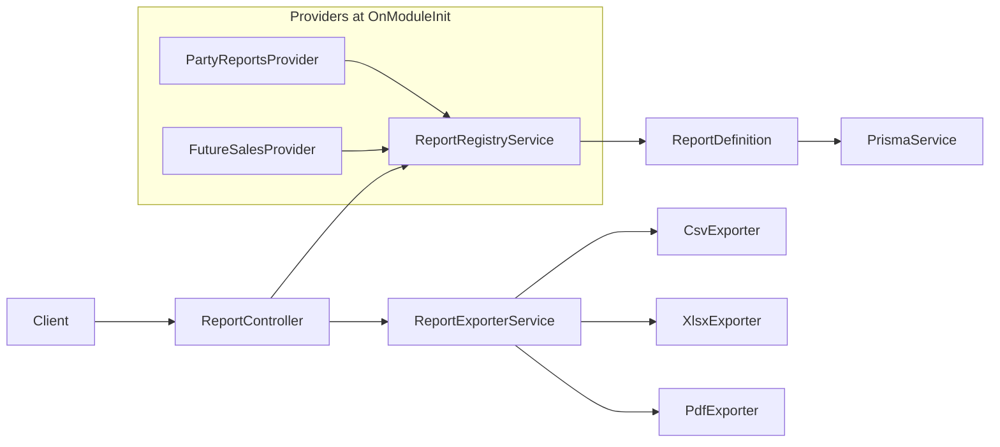

# Reporting

**Status: implemented (backend)** — central read-only reporting module with a plugin-style registry, party reports, and JSON / CSV / Excel / PDF export.

Domain modules contribute report definitions at startup. The reporting core handles execution, pagination, permissions, and export. Future modules (sales, inventory, purchase, finance) add providers without changing the controller or exporters.

---

## Quick start

### Prerequisites

1. Backend running (`cd backend && npm run start:dev`).
2. Seeded database with permissions (`npm run db:seed` or `npm run db:seed:fresh`).
3. JWT from login (see [Early foundations — demo login](./early-foundations.md#demo-login-seeded-database)).

The seeded **Administrator** role has `REPORT_VIEW` and `REPORT_PARTY_VIEW`.

### List available reports

```http
GET /reports
Authorization: Bearer <access_token>
```

Response:

```json
{
  "success": true,
  "data": [
    {
      "id": "party.customer-list",
      "name": "Customer List",
      "category": "party",
      "permission": "REPORT_PARTY_VIEW"
    }
  ]
}
```

Only reports whose `permission` is present on the user are returned.

### Run a report (JSON)

```http
GET /reports/party.customer-list?page=1&pageSize=20&search=alice
Authorization: Bearer <access_token>
```

Paginated JSON response:

```json
{
  "success": true,
  "data": [
    {
      "customerCode": "C001",
      "displayName": "Alice Customer",
      "customerType": "RETAIL",
      "creditLimit": "5000",
      "outstandingAmount": "120.5",
      "isActive": true
    }
  ],
  "pagination": {
    "page": 1,
    "pageSize": 20,
    "total": 1,
    "totalPages": 1
  }
}
```

### Export (CSV, Excel, PDF)

Add `format` to the same URL:

```http
GET /reports/party.customer-list?format=pdf
GET /reports/party.supplier-list?format=xlsx&fromDate=2026-01-01&toDate=2026-01-31
GET /reports/party.customer-outstanding?format=csv
```

Exports return a binary file with `Content-Disposition: attachment` (not the JSON envelope). Use `StreamableFile` on the server; on the client, treat the response as a download blob.

### curl example

```bash
# Login
TOKEN=$(curl -s -X POST http://localhost:3000/auth/login \
  -H "Content-Type: application/json" \
  -d '{"username":"admin","password":"admin123"}' | jq -r '.data.accessToken')

# List reports
curl -s http://localhost:3000/reports -H "Authorization: Bearer $TOKEN" | jq

# Run customer list
curl -s "http://localhost:3000/reports/party.customer-list?page=1&pageSize=10" \
  -H "Authorization: Bearer $TOKEN" | jq

# Download PDF
curl -s "http://localhost:3000/reports/party.customer-outstanding?format=pdf" \
  -H "Authorization: Bearer $TOKEN" -o customer-outstanding.pdf
```

Report ids use dots (e.g. `party.customer-list`). No URL encoding is required for dots in the path segment.

---

## Architecture



### Source layout

```text
backend/src/reporting/
  constants/reporting.constants.ts    # ReportFormat, ReportPermission, ReportCategory
  core/
    report-definition.interface.ts    # ReportDefinition, ReportResult, ReportContext
    report-registry.service.ts        # register / get / list / listForUser
  dto/report-query.dto.ts             # extends PaginationQueryDto
  export/
    csv.exporter.ts
    xlsx.exporter.ts                  # exceljs
    pdf.exporter.ts                   # pdfmake
    report-exporter.service.ts
  providers/party/party-reports.provider.ts
  report.controller.ts
  reporting.module.ts                 # @Global(), exports ReportRegistryService
```

### Design rules

| Rule | Detail |
|------|--------|
| Read-only | Use `PrismaService.client` directly — no `UnitOfWorkService`, `OutboxService`, or `AuditService` |
| Tenant context | `ReportContext.scope` from `getTenantScope(RequestContextService)` — use `withBranchScope` / `withCompanyScope` for transactional reports |
| Soft delete | Always filter `deletedAt: null` on queried entities |
| Serialization | `Decimal` and `bigint` → string in row objects (reuse `serializeDecimal` from party utils) |
| Pagination | Return `pagination` via `buildPagination(total, page, pageSize)` for tabular reports |
| Permissions | Coarse gate on route + per-report permission on run |

---

## Permissions

Two layers:

| Layer | Permission | When checked |
|-------|------------|--------------|
| Route | `REPORT_VIEW` | `@RequirePermissions` on `GET /reports` and `GET /reports/:reportId` |
| Report | e.g. `REPORT_PARTY_VIEW` | Controller checks `user.permissions` before `definition.run()` |
| Catalog | Same per-report permission | `GET /reports` uses `listForUser()` so users only see reports they can run |

### Seeded permissions (party)

| Code | Purpose |
|------|---------|
| `REPORT_VIEW` | Access reporting endpoints |
| `REPORT_PARTY_VIEW` | Run party reports (`party.*`) |

Add new codes in `backend/seed/data/security/permission.json` and grant them in `role-permission.json`. Re-seed or migrate seed data so roles receive the new permission.

### Adding a category permission (example)

```json
{
  "uuid": "bbbbbbbb-bbbb-4bbb-8bbb-bbbbbbbbbb33",
  "permissionCode": "REPORT_SALES_VIEW",
  "permissionName": "View Sales Reports",
  "module": "REPORT",
  "resource": "SALES_REPORT",
  "action": "READ",
  "isSystemPermission": true,
  "isActive": true
}
```

Use the same `permission` string in the `ReportDefinition` and in seed data.

---

## API reference

| Endpoint | Auth | Description |
|----------|------|-------------|
| `GET /reports` | `REPORT_VIEW` | Metadata for reports the user may access |
| `GET /reports/:reportId` | `REPORT_VIEW` + report permission | Execute report |

### Query parameters (`ReportQueryDto`)

| Parameter | Type | Default | Description |
|-----------|------|---------|-------------|
| `page` | int | `1` | Page number (≥ 1) |
| `pageSize` | int | `20` | Rows per page (1–100) |
| `search` | string | — | Free-text filter (report-specific) |
| `fromDate` | ISO date string | — | Start of date range |
| `toDate` | ISO date string | — | End of date range; must be ≥ `fromDate` |
| `branchId` | int | — | Optional branch override (transactional reports; shown in export header) |
| `format` | `json` \| `csv` \| `xlsx` \| `pdf` | `json` | Output format |

Validation uses the global `ValidationPipe` (`whitelist`, `transform`, `forbidNonWhitelisted`).

### JSON response shapes

**Paginated tabular report** — controller returns `PaginatedResult`; interceptor adds envelope:

```json
{ "success": true, "data": [ /* rows */ ], "pagination": { "page", "pageSize", "total", "totalPages" } }
```

**Aggregate with totals but no pagination** — plain object in `data`:

```json
{
  "success": true,
  "data": {
    "columns": [ { "key", "label", "type" } ],
    "rows": [ /* ... */ ],
    "totals": { "grandTotal": "1500" }
  }
}
```

**File export** — binary body; `Content-Type` and `Content-Disposition` set by `StreamableFile`.

### Error codes

| Code | HTTP | When |
|------|------|------|
| `REPORT_NOT_FOUND` | 404 | Unknown `reportId` |
| `REPORT_INVALID_DATE_RANGE` | 400 | `fromDate` after `toDate` |
| `REPORT_UNSUPPORTED_FORMAT` | 400 | Invalid `format` value |
| `AUTH_PERMISSION_DENIED` | 403 | User lacks report-specific permission |
| `VALIDATION_ERROR` | 400 | Invalid query params |

---

## Implemented reports (party)

Party master data is **company-wide** (no `branchId` on `Customer` / `Supplier`). `fromDate` / `toDate` filter on `createdAt` for list reports. `branchId` appears in export headers for future transactional reports.

| Report id | Name | Columns (summary) | Notes |
|-----------|------|-------------------|-------|
| `party.customer-list` | Customer List | code, name, type, credit limit, outstanding, active | Paginated; `search` on code / name |
| `party.supplier-list` | Supplier List | code, name, type, credit limit, outstanding, active | Same pattern |
| `party.customer-outstanding` | Customer Outstanding | code, name, outstanding | `outstandingAmount > 0`; `totals.grandTotal` |

Provider: `backend/src/reporting/providers/party/party-reports.provider.ts`.

---

## Export formats

| Format | Content-Type | Library | Notes |
|--------|--------------|---------|-------|
| `json` | `application/json` | — | Standard API envelope |
| `csv` | `text/csv; charset=utf-8` | built-in | Header row from column labels |
| `xlsx` | `application/vnd.openxmlformats-officedocument.spreadsheetml.sheet` | exceljs | Title, optional period/branch lines, data, totals |
| `pdf` | `application/pdf` | pdfmake | Tabular layout; Roboto fonts from pdfmake package |

Filename pattern: `{reportId}.{ext}` (e.g. `party.customer-list.pdf`).

---

## How to extend — add a new report

### Checklist

1. **Choose a namespaced id** — `{domain}.{report-name}` (e.g. `sales.daily-summary`). ids are unique across the registry.
2. **Add permission** — new code in `permission.json` (e.g. `REPORT_SALES_VIEW`) and grant to roles in `role-permission.json`.
3. **Create provider** — `<domain>-reports.provider.ts` implementing `OnModuleInit`.
4. **Register definitions** — `this.registry.register({ id, name, category, permission, run })` in `onModuleInit()`.
5. **Wire provider** — add to `providers` in the domain module (preferred) or `ReportingModule` until the domain module exists.
6. **Tests** — unit spec for query filters, scoping, and row shape.
7. **Docs** — add the report to the table in this file.

No changes to `ReportController`, `ReportExporterService`, or exporters are required unless you add a new export format.

### ReportDefinition contract

```typescript
interface ReportDefinition {
  id: string;           // namespaced, e.g. party.customer-list
  name: string;         // display name for UI / export title
  category: string;     // grouping key, e.g. party, sales
  permission: string;   // must match seeded permissionCode
  run(params: ReportParams, ctx: ReportContext): Promise<ReportResult>;
}

interface ReportResult {
  columns: ReportColumn[];
  rows: Record<string, unknown>[];
  totals?: Record<string, unknown>;   // optional footer aggregates
  pagination?: Pagination;              // omit for non-paginated aggregates
}

interface ReportContext {
  scope: { companyId: bigint; branchId: bigint };
  userId?: bigint;
}
```

### Column types

Use `ReportColumnTypes` from `report-definition.interface.ts`:

| Type | Use for |
|------|---------|
| `string` | Text, codes, ids as strings |
| `number` | Integer counts |
| `decimal` | Money, quantities (serialize as string in rows) |
| `date` / `datetime` | ISO strings in rows |
| `boolean` | Flags |

Optional `align`: `left` | `center` | `right` (used by exporters).

### Example — sales daily summary (transactional, branch-scoped)

```typescript
import { Injectable, OnModuleInit } from '@nestjs/common';
import { Prisma } from '@prisma/client';
import { buildPagination } from '../../common/response/paginated-result';
import { serializeDecimal } from '../../party/utils/party.util';
import {
  getTenantScope,
  withBranchScope,
} from '../../persistence/context/tenant-scope.util';
import { PrismaService } from '../../prisma.service';
import {
  ReportColumnTypes,
  type ReportParams,
  type ReportContext,
  type ReportResult,
} from '../../reporting/core/report-definition.interface';
import { ReportRegistryService } from '../../reporting/core/report-registry.service';

@Injectable()
export class SalesReportsProvider implements OnModuleInit {
  constructor(
    private readonly registry: ReportRegistryService,
    private readonly prisma: PrismaService,
  ) {}

  onModuleInit(): void {
    this.registry.register({
      id: 'sales.daily-summary',
      name: 'Daily Sales Summary',
      category: 'sales',
      permission: 'REPORT_SALES_VIEW',
      run: (params, ctx) => this.runDailySummary(params, ctx),
    });
  }

  private async runDailySummary(
    params: ReportParams,
    ctx: ReportContext,
  ): Promise<ReportResult> {
    const branchId =
      params.branchId != null ? BigInt(params.branchId) : ctx.scope.branchId;
    const scoped = withBranchScope({ ...ctx.scope, branchId }, {});

    const where: Prisma.SalesInvoiceWhereInput = {
      branchId: scoped.branchId,
      deletedAt: null,
      status: 'POSTED',
      ...(params.fromDate || params.toDate
        ? {
            invoiceDate: {
              ...(params.fromDate ? { gte: new Date(params.fromDate) } : {}),
              ...(params.toDate ? { lte: new Date(params.toDate) } : {}),
            },
          }
        : {}),
    };

    const grouped = await this.prisma.client.salesInvoice.groupBy({
      by: ['paymentStatus'],
      where,
      _sum: { netAmount: true },
      _count: { _all: true },
    });

    const columns = [
      { key: 'paymentStatus', label: 'Payment Status', type: ReportColumnTypes.STRING },
      { key: 'invoiceCount', label: 'Count', type: ReportColumnTypes.NUMBER },
      { key: 'netAmount', label: 'Net Amount', type: ReportColumnTypes.DECIMAL, align: 'right' as const },
    ];

    const rows = grouped.map((row) => ({
      paymentStatus: row.paymentStatus,
      invoiceCount: row._count._all,
      netAmount: serializeDecimal(row._sum.netAmount) ?? '0',
    }));

    return { columns, rows };
  }
}
```

Register `SalesReportsProvider` in `SalesModule` (or `ReportingModule` temporarily):

```typescript
@Module({
  imports: [ReportingModule, PrismaModule],
  providers: [SalesReportsProvider],
})
export class SalesModule {}
```

`ReportingModule` is `@Global()` and exports `ReportRegistryService`, so domain modules only need to list the provider.

### Paginated list report pattern

Mirror `CustomerService.list` and `PartyReportsProvider.runCustomerList`:

```typescript
const page = params.page ?? 1;
const pageSize = params.pageSize ?? 20;

const [total, rows] = await Promise.all([
  this.prisma.client.customer.count({ where }),
  this.prisma.client.customer.findMany({
    where,
    skip: (page - 1) * pageSize,
    take: pageSize,
    orderBy: { customerCode: 'asc' },
  }),
]);

return {
  columns,
  rows: rows.map(mapRow),
  pagination: buildPagination(total, page, pageSize),
};
```

### Raw SQL (advanced)

For complex joins or running balances, use parameterized `$queryRaw` inside `run()` only when Prisma `groupBy` is insufficient. Keep SQL portable (SQLite local / PostgreSQL cloud). Isolate raw SQL in the provider file.

---

## Angular / Electron client (guidance)

Not implemented in this repo yet; recommended approach:

1. **Report picker** — `GET /reports` → build menu by `category`.
2. **Parameter form** — date range, search, page size; map to query params.
3. **Preview** — `format=json` (default); bind `data` + `pagination` to a data grid using `columns` for headers.
4. **Download** — same URL with `format=pdf|xlsx|csv`; `HttpClient` with `responseType: 'blob'` and save via browser or Electron.
5. **Permissions** — hide reports the user cannot run (already filtered by API); still handle 403 on run.

Feature module layout suggestion: `reports/` under Angular (see [Application architecture](./application-architecture.md)).

---

## Testing

```bash
cd backend
npm run test -- --testPathPatterns=reporting
npm run test -- reporting/core/report-registry.service.spec.ts
```

Full command reference: [Testing](../architecture/testing.md).

---

## Planned reports (not yet implemented)

Aligns with [Integrations — reporting](./integrations.md#reporting) product list. Each will be a new provider + permission when the write module exists.

| Category | Example reports | Primary tables |
|----------|-----------------|----------------|
| Sales | Daily summary, register, GST | `SalesInvoice`, `SalesInvoiceItem` |
| Purchase | PO status, purchase register | `PurchaseOrder`, `PurchaseInvoice` |
| Inventory | Stock on hand, expiry, movement | `Stock`, `Batch`, `StockMovement` |
| Finance | Day book, trial balance | `LedgerEntry`, `Receipt`, `Payment` |

---

## Related

- [Testing](./testing.md) — unit test commands for reporting
- [Persistence patterns](../database/persistence-patterns.md) — `getTenantScope`, `withBranchScope`, read vs write paths
- [Early foundations](./early-foundations.md) — auth, JWT, demo login
- [Application architecture](./application-architecture.md) — REST conventions, Angular `reports/` module
- [Integrations](./integrations.md) — printing and export UX
- [Logging and audit](./logging-and-audit.md) — reporting is read-only; no audit log on run
