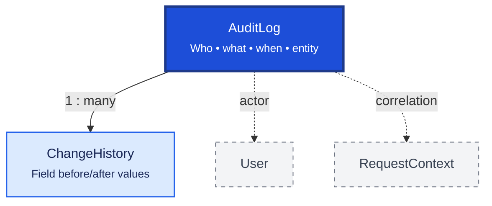

# Audit

Audit provides regulatory and operational traceability for business actions and field-level data changes. `AuditLog` records who did what; `ChangeHistory` stores before/after values for important fields.

## Relationship Diagram



**Legend:** `AuditLog` is written inside the same `UnitOfWork` transaction as the business mutation. Technical logs use Winston (`AppLogger`) — not this table.

## How the Tables Work Together

- **AuditLog** records significant business actions: CREATE, UPDATE, DELETE, LOGIN, POST, APPROVE, SYNC.
- Each entry captures `entityType`, `entityId`, `entityUuid`, action, module, user, device, and `correlationId`.
- **ChangeHistory** stores field-level before/after values linked to an audit or entity change.
- Stock quantity deltas belong in `StockMovement` — not `AuditLog`.
- Sync payloads belong in `Outbox` — not a durable audit trail.
- Use `AuditAction` and `AuditModule` constants — not scattered string literals.
- Implemented via `AuditService.log(tx, …)` — see [Logging and audit](../../../architecture/logging-and-audit.md).

## Tables

- [audit log](#auditlog) — business action audit trail.
- [change history](#changehistory) — field-level change history.

---

## Table Specifications

## AuditLog

> Prisma model: `backend/prisma/schema.prisma` (`AuditLog`)

## Purpose

The AuditLog table records every significant action performed within the Pharmacy ERP.

It provides a complete audit trail of user activities, business transactions, security events, and system operations. Unlike **ChangeHistory**, which records field-level data changes, AuditLog records **who performed what action, when, where, and why**.

Typical audited events include:

- User Login / Logout
- Record Creation
- Record Update
- Record Deletion
- Approval / Rejection
- Stock Adjustment
- Sales Posting
- Purchase Posting
- Synchronization
- Configuration Changes

---

## Business Rules

- Every auditable action creates one AuditLog record.
- Audit records are immutable after creation.
- Audit records must never be physically deleted.
- Every audit record should identify the acting user.
- Every audit record should reference the affected business entity.
- Security events should always be audited.
- UUID is used for synchronization.
- BIGINT is used as the internal primary key.
- Optimistic locking is maintained using the version column.

---

## Relationships

```
User
   │
   ▼
AuditLog
   │
   ├────────► Party
   ├────────► Medicine
   ├────────► SalesInvoice
   ├────────► PurchaseInvoice
   ├────────► StockMovement
   ├────────► Configuration
   └────────► ChangeHistory
```

---

## Columns

| Category | Column | SQLite | PostgreSQL | Nullable | Description |
|----------|--------|---------|------------|----------|-------------|
| Primary Key | id | INTEGER | BIGINT | No | Auto increment primary key |
| Identifier | uuid | TEXT | UUID | No | Global unique identifier |
| Foreign Key | userId | INTEGER | BIGINT | Yes | User performing the action |
| Business | entityType | TEXT | VARCHAR(100) | No | Business entity name |
| Business | entityId | INTEGER | BIGINT | Yes | Local business entity ID (not synced) |
| Business | entityUuid | TEXT | UUID | Yes | Global business entity UUID (sync-safe reference) |
| Business | action | TEXT | VARCHAR(30) | No | CREATE, UPDATE, DELETE, LOGIN, LOGOUT, APPROVE, POST |
| Business | module | TEXT | VARCHAR(50) | No | ERP module |
| Business | description | TEXT | TEXT | Yes | Human-readable description |
| Security | ipAddress | TEXT | VARCHAR(45) | Yes | Client IP address |
| Security | deviceId | TEXT | VARCHAR(100) | Yes | Client device identifier |
| Security | sessionId | TEXT | VARCHAR(100) | Yes | User session identifier |
| Audit | actionTimestamp | DATETIME | TIMESTAMP | No | Action timestamp |
| Audit | correlationId | TEXT | UUID | Yes | Request/transaction correlation ID |
| Audit | createdAt | DATETIME | TIMESTAMP | No | Record creation timestamp |
| Audit | version | INTEGER | INTEGER | No | Optimistic locking version |

---

## Constraints

- Primary Key (id)
- Unique (uuid)
- CHECK (action IN ('CREATE','UPDATE','DELETE','LOGIN','LOGOUT','APPROVE','REJECT','POST','SYNC'))
- CHECK (version >= 1)

---

## Indexes

- PK_AuditLog
- UK_AuditLog_UUID
- IDX_AuditLog_User
- IDX_AuditLog_Entity
- IDX_AuditLog_EntityUuid
- IDX_AuditLog_Action
- IDX_AuditLog_Module
- IDX_AuditLog_Timestamp
- IDX_AuditLog_Correlation

---

## Sample Records

| id | userId | entityType | entityId | action | module | actionTimestamp |
|----|-------:|------------|---------:|--------|--------|-----------------|
| 1 | 10 | SalesInvoice | 501 | CREATE | Sales | 2026-08-04 10:15 |
| 2 | 10 | SalesInvoice | 501 | POST | Sales | 2026-08-04 10:17 |
| 3 | 15 | User | 15 | LOGIN | Security | 2026-08-04 09:00 |

---


---

## Notes

- Records **who performed the action**, **what action occurred**, **when it occurred**, and **where it originated**.
- Stores operational audit information rather than field-level value changes.
- Field-level modifications should be stored in **ChangeHistory**.
- AuditLog entries should be created automatically by middleware or interceptors rather than business logic.
- Audit records should be retained according to regulatory requirements.
- Supports offline-first synchronization using UUID.
- Compatible with both SQLite and PostgreSQL.

---

## ChangeHistory

> Prisma model: `backend/prisma/schema.prisma` (`ChangeHistory`)

## Purpose

The ChangeHistory table stores **field-level changes** made to business entities within the Pharmacy ERP.

Unlike **AuditLog**, which records *who performed an action*, ChangeHistory records **exactly what data changed**, including old values and new values.

It enables:

- Regulatory compliance
- Complete audit trail
- Data recovery
- Troubleshooting
- Historical record reconstruction
- Forensic investigation

Every UPDATE operation may generate one or more ChangeHistory records.

---

## Business Rules

- Every ChangeHistory record belongs to one AuditLog.
- Every record references one business entity.
- Each record tracks exactly one field change.
- Old Value and New Value must be preserved.
- ChangeHistory records are immutable.
- Records must never be physically deleted.
- UUID is used for synchronization.
- BIGINT is used as the internal primary key.
- Optimistic locking is maintained using the version column.

---

## Relationships

```
AuditLog
    │
    └────────< ChangeHistory
                    │
                    ├────────► Party
                    ├────────► Medicine
                    ├────────► Batch
                    ├────────► Stock
                    ├────────► SalesInvoice
                    ├────────► PurchaseInvoice
                    └────────► Configuration
```

---

## Columns

| Category | Column | SQLite | PostgreSQL | Nullable | Description |
|----------|--------|---------|------------|----------|-------------|
| Primary Key | id | INTEGER | BIGINT | No | Auto increment primary key |
| Identifier | uuid | TEXT | UUID | No | Global unique identifier |
| Foreign Key | auditLogId | INTEGER | BIGINT | No | References AuditLog.id |
| Business | entityType | TEXT | VARCHAR(100) | No | Entity name |
| Business | entityId | INTEGER | BIGINT | No | Local business entity ID (not synced) |
| Business | entityUuid | TEXT | UUID | Yes | Global business entity UUID (sync-safe reference) |
| Business | fieldName | TEXT | VARCHAR(100) | No | Modified field name |
| Business | oldValue | TEXT | TEXT | Yes | Previous value |
| Business | newValue | TEXT | TEXT | Yes | Updated value |
| Business | dataType | TEXT | VARCHAR(30) | Yes | STRING, NUMBER, DATE, BOOLEAN, JSON |
| Business | changeType | TEXT | VARCHAR(20) | No | CREATE, UPDATE, DELETE |
| Audit | changedAt | DATETIME | TIMESTAMP | No | Change timestamp |
| Audit | version | INTEGER | INTEGER | No | Optimistic locking version |

---

## Constraints

- Primary Key (id)
- Unique (uuid)
- Foreign Key (auditLogId → AuditLog.id)
- CHECK (changeType IN ('CREATE','UPDATE','DELETE'))
- CHECK (dataType IN ('STRING','NUMBER','DATE','BOOLEAN','JSON') OR dataType IS NULL)
- CHECK (version >= 1)

---

## Indexes

- PK_ChangeHistory
- UK_ChangeHistory_UUID
- IDX_ChangeHistory_AuditLog
- IDX_ChangeHistory_Entity
- IDX_ChangeHistory_EntityUuid
- IDX_ChangeHistory_Field
- IDX_ChangeHistory_ChangedAt

---

## Sample Records

| id | entityType | entityId | fieldName | oldValue | newValue |
|----|------------|---------:|-----------|----------|----------|
| 1 | Medicine | 101 | salePrice | 145.00 | 150.00 |
| 2 | Customer | 205 | mobileNumber | 9876543210 | 9876543211 |
| 3 | Batch | 502 | expiryDate | 2027-06-30 | 2027-09-30 |

---


---

## Notes

- Stores **field-level modifications** only.
- One UPDATE affecting multiple fields creates multiple ChangeHistory records.
- CREATE operations may store only `newValue`.
- DELETE operations may store only `oldValue`.
- Large JSON fields should be truncated or stored separately if required for performance.
- Historical records should never be updated or deleted.
- Supports offline-first synchronization using UUID.
- Compatible with both SQLite and PostgreSQL.
