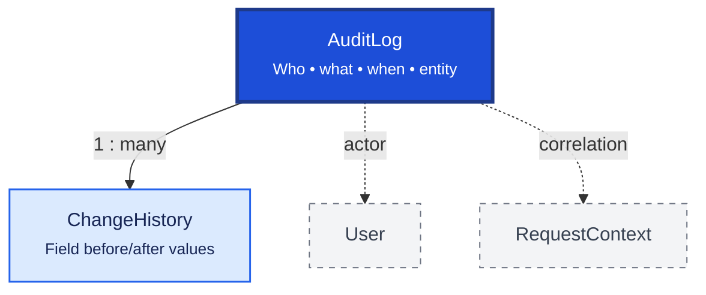

# Audit

Audit provides regulatory and operational traceability for business actions and field-level data changes. `AuditLog` records who did what; `ChangeHistory` stores before/after values for important fields.

## Relationship Diagram

**Legend:** `AuditLog` is written inside the same `UnitOfWork` transaction as the business mutation. Technical logs use Winston (`AppLogger`) — not this table.

## How the Tables Work Together

- **AuditLog** records significant business actions: CREATE, UPDATE, DELETE, LOGIN, POST, APPROVE, SYNC.
- Each entry captures `entityType`, `entityId`, `entityUuid`, action, module, user, device, and `correlationId`.
- **ChangeHistory** stores field-level before/after values linked to an audit or entity change.
- Stock quantity deltas belong in `StockMovement` — not `AuditLog`.
- Sync payloads belong in `Outbox` — not a durable audit trail.
- Use `AuditAction` and `AuditModule` constants — not scattered string literals.
- Implemented via `AuditService.log(tx, …)` — see [Logging and audit](../../../architecture/logging-and-audit.md).

## Tables

- [[58_audit_log]] — business action audit trail.
- [[59_change_history]] — field-level change history.
