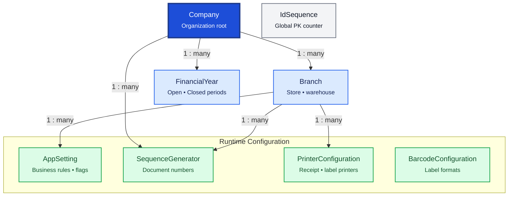

# Configuration

Configuration stores org structure, document numbering, runtime settings, and device preferences. These are reference tables — changed infrequently but referenced by almost every module.

## Relationship Diagram



**Legend:** `AppSetting` resolves branch-scoped row → company-wide row. See `SettingsService` in early foundations. `IdSequence` is persistence infrastructure (not FK-linked to Company); see [IdSequence](#idsequence) below.

## How the Tables Work Together

- **Company** is the tenant root — legal name, GSTIN, drug license, and statutory details for documents.
- **Branch** represents each pharmacy location with independent inventory and document numbering.
- **FinancialYear** defines accounting periods for reports, GST filings, and year-end closing.
- **SequenceGenerator** produces branch-scoped document numbers (invoice, PO, GRN, etc.).
- **AppSetting** holds configurable business rules — GST defaults, sync interval, receipt prefix — without code changes.
- **PrinterConfiguration** maps document types to printers and templates per branch.
- **BarcodeConfiguration** defines barcode formats, label sizes, and print layouts.
- Configuration changes should be audited via `AuditService` when exposed in admin UI.

## Tables

- [company](#company) — organization / company master.
- [branch](#branch) — pharmacy branch or location.
- [financial year](#financialyear) — accounting financial year.
- [id sequence](#idsequence) — global BIGINT primary key counter.
- [sequence generator](#sequencegenerator) — document number sequences.
- [app setting](#appsetting) — application settings and business rules.
- [printer configuration](#printerconfiguration) — printer mappings and templates.
- [barcode configuration](#barcodeconfiguration) — barcode generation settings.

---

## Table Specifications

## Company

> Prisma model: `backend/prisma/schema.prisma` (`Company`)

## Purpose

The Company table stores the master information of the organization operating the Pharmacy ERP.

It contains legal, tax, licensing, contact, and branding information used throughout the application, including invoices, purchase documents, reports, taxation, and regulatory compliance.

Normally, a Pharmacy ERP contains **one Company** with one or more Branches.

---

## Business Rules

- Every Company has a unique Company Code.
- Company Name must be unique.
- A Company can have multiple Branches.
- Only one Company can be marked as the Default Company.
- GST Number and Drug License Number should be unique where applicable.
- Company records are rarely modified and should be audited.
- UUID is used for synchronization.
- BIGINT is used as the internal primary key.
- Optimistic locking is maintained using the version column.

---

## Relationships

```
Company
    │
    ├────────► Branch
    ├────────► FinancialYear
    ├────────► SequenceGenerator
    ├────────► AppSetting
    └────────► PrinterConfiguration
```

---

## Columns

| Category | Column | SQLite | PostgreSQL | Nullable | Description |
|----------|--------|---------|------------|----------|-------------|
| Primary Key | id | INTEGER | BIGINT | No | Auto increment primary key |
| Identifier | uuid | TEXT | UUID | No | Global unique identifier |
| Business | companyCode | TEXT | VARCHAR(20) | No | Unique company code |
| Business | companyName | TEXT | VARCHAR(200) | No | Legal company name |
| Business | displayName | TEXT | VARCHAR(200) | No | Display name used in reports |
| Business | gstNumber | TEXT | VARCHAR(30) | Yes | GST registration number |
| Business | panNumber | TEXT | VARCHAR(20) | Yes | PAN number |
| Business | drugLicenseNumber | TEXT | VARCHAR(50) | Yes | Drug license number |
| Business | email | TEXT | VARCHAR(100) | Yes | Company email |
| Business | phoneNumber | TEXT | VARCHAR(30) | Yes | Contact number |
| Business | website | TEXT | VARCHAR(200) | Yes | Website URL |
| Business | logoPath | TEXT | VARCHAR(500) | Yes | Company logo |
| Address | addressLine1 | TEXT | VARCHAR(200) | Yes | Address line 1 |
| Address | addressLine2 | TEXT | VARCHAR(200) | Yes | Address line 2 |
| Address | city | TEXT | VARCHAR(100) | Yes | City |
| Address | state | TEXT | VARCHAR(100) | Yes | State |
| Address | country | TEXT | VARCHAR(100) | Yes | Country |
| Address | pinCode | TEXT | VARCHAR(20) | Yes | Postal code |
| Status | isDefault | INTEGER | BOOLEAN | No | Default company |
| Status | isActive | INTEGER | BOOLEAN | No | Active status |
| Audit | createdAt | DATETIME | TIMESTAMP | No | Record creation timestamp |
| Audit | updatedAt | DATETIME | TIMESTAMP | No | Last update timestamp |
| Audit | deletedAt | DATETIME | TIMESTAMP | Yes | Soft delete timestamp |
| Audit | version | INTEGER | INTEGER | No | Optimistic locking version |

---

## Constraints

- Primary Key (id)
- Unique (uuid)
- Unique (companyCode)
- Unique (companyName)
- Unique (gstNumber)
- CHECK (version >= 1)

---

## Indexes

- PK_Company
- UK_Company_UUID
- UK_Company_Code
- UK_Company_Name
- IDX_Company_GST
- IDX_Company_Active

---

## Sample Records

| id | companyCode | companyName | gstNumber | isDefault |
|----|-------------|-------------|-----------|-----------|
| 1 | CMP001 | ABC Pharma Pvt. Ltd. | 27ABCDE1234F1Z5 | Yes |

---


---

## Notes

- Represents the **legal organization** owning the ERP.
- Branches operate under a single Company.
- Company information is printed on invoices, purchase orders, receipts, reports, GST documents, and statutory forms.
- Changes to Company details should be restricted to administrators and fully audited.
- Company records should rarely change after implementation.
- Supports offline-first synchronization using UUID.
- Compatible with both SQLite and PostgreSQL.

---

## Branch

> Prisma model: `backend/prisma/schema.prisma` (`Branch`)

## Purpose

The Branch table stores information about individual pharmacy locations operated by a Company.

A Branch represents a physical or virtual operating unit responsible for:

- Inventory
- Sales
- Purchases
- Financial Transactions
- Users
- Printers
- Daily Operations

Each Branch maintains its own inventory balances via the **Stock** table (`branchId` + `batchId`) while sharing org-global master data (Medicine, Batch) from the Company.

---

## Business Rules

- Every Branch belongs to exactly one Company.
- Branch Code must be unique within the Company.
- Only active branches can perform business transactions.
- Each transaction (Sales, Purchase, StockMovement, Payment) belongs to one Branch.
- Per-branch inventory is stored in **Stock** rows keyed by `(branchId, batchId)` — one Batch can have Stock at many branches.
- Branch GST Registration may differ depending on business requirements.
- Branch records are rarely deleted and should be audited.
- UUID is used for synchronization.
- BIGINT is used as the internal primary key.
- Optimistic locking is maintained using the version column.

---

## Relationships

```
Company (1)
      │
      └──────< Branch (Many)
                    │
                    ├────────► Stock (Many — one per batch per branch)
                    ├────────► StockMovement
                    ├────────► StockAdjustment
                    ├────────► User
                    ├────────► PurchaseInvoice
                    ├────────► SalesInvoice
                    ├────────► FinancialYear
                    ├────────► PrinterConfiguration
                    ├────────► BarcodeConfiguration
                    └────────► SequenceGenerator
```

---

## Columns

| Category | Column | SQLite | PostgreSQL | Nullable | Description |
|----------|--------|---------|------------|----------|-------------|
| Primary Key | id | INTEGER | BIGINT | No | Auto increment primary key |
| Identifier | uuid | TEXT | UUID | No | Global unique identifier |
| Foreign Key | companyId | INTEGER | BIGINT | No | References Company.id |
| Business | branchCode | TEXT | VARCHAR(20) | No | Unique branch code |
| Business | branchName | TEXT | VARCHAR(150) | No | Branch name |
| Business | displayName | TEXT | VARCHAR(150) | No | Display name |
| Business | gstNumber | TEXT | VARCHAR(30) | Yes | Branch GST registration |
| Business | drugLicenseNumber | TEXT | VARCHAR(50) | Yes | Drug license number |
| Business | email | TEXT | VARCHAR(100) | Yes | Email address |
| Business | phoneNumber | TEXT | VARCHAR(30) | Yes | Contact number |
| Address | addressLine1 | TEXT | VARCHAR(200) | Yes | Address line 1 |
| Address | addressLine2 | TEXT | VARCHAR(200) | Yes | Address line 2 |
| Address | city | TEXT | VARCHAR(100) | Yes | City |
| Address | state | TEXT | VARCHAR(100) | Yes | State |
| Address | country | TEXT | VARCHAR(100) | Yes | Country |
| Address | pinCode | TEXT | VARCHAR(20) | Yes | Postal code |
| Business | managerName | TEXT | VARCHAR(100) | Yes | Branch manager |
| Business | openingDate | DATE | DATE | Yes | Branch operational date |
| Status | isHeadOffice | INTEGER | BOOLEAN | No | Head office branch |
| Status | isActive | INTEGER | BOOLEAN | No | Active status |
| Audit | createdAt | DATETIME | TIMESTAMP | No | Record creation timestamp |
| Audit | updatedAt | DATETIME | TIMESTAMP | No | Last update timestamp |
| Audit | deletedAt | DATETIME | TIMESTAMP | Yes | Soft delete timestamp |
| Audit | version | INTEGER | INTEGER | No | Optimistic locking version |

---

## Constraints

- Primary Key (id)
- Unique (uuid)
- Foreign Key (companyId → Company.id)
- Unique (companyId, branchCode)
- CHECK (version >= 1)

---

## Indexes

- PK_Branch
- UK_Branch_UUID
- UK_Branch_Company_Code
- IDX_Branch_Company
- IDX_Branch_Active
- IDX_Branch_HeadOffice
- IDX_Branch_GST

---

## Sample Records

| id | companyId | branchCode | branchName | isHeadOffice | isActive |
|----|----------:|------------|------------|--------------|----------|
| 1 | 1 | HO | Head Office | Yes | Yes |
| 2 | 1 | PUN001 | Pune Branch | No | Yes |
| 3 | 1 | MUM001 | Mumbai Branch | No | Yes |

---


---

## Notes

- Represents one operational pharmacy location.
- Every Sales, Purchase, Inventory, and Financial transaction should reference a Branch.
- Inventory balances are maintained separately for each Branch via the **Stock** table (`@@unique([branchId, batchId])`).
- **Batch** is org-global (lot identity); **Stock** is branch-local (quantities).
- Branch-scoped sale pricing uses **PriceList** / **PriceListItem**, not Batch.
- Sequence generators, printers, barcode settings, and application settings may be branch-specific.
- Inter-branch stock movement should use the `StockTransfer` module.
- Historical Branch records should not be deleted.
- Supports offline-first synchronization using UUID.
- Compatible with both SQLite and PostgreSQL.

---

## FinancialYear

> Prisma model: `backend/prisma/schema.prisma` (`FinancialYear`)

## Purpose

The FinancialYear table defines the accounting periods used by the Pharmacy ERP.

A Financial Year determines the valid accounting period for all financial and inventory transactions. It is used for sales, purchases, payments, ledger postings, stock valuation, and statutory reporting.

Typically, one Company has multiple Financial Years, but only one Financial Year is active for a Branch at any point in time.

---

## Business Rules

- Every Financial Year belongs to one Company.
- A Financial Year may optionally be assigned to one Branch.
- Financial Year Code must be unique within a Company.
- Only one Financial Year can be active for a Branch.
- Closed Financial Years cannot accept new transactions.
- Financial Years cannot overlap for the same Company.
- Opening balances are carried forward from the previous Financial Year.
- UUID is used for synchronization.
- BIGINT is used as the internal primary key.
- Optimistic locking is maintained using the version column.

---

## Relationships

```
Company (1)
      │
      └──────< FinancialYear (Many)
                     │
                     ├────────► Branch
                     ├────────► SalesInvoice
                     ├────────► PurchaseInvoice
                     ├────────► Payment
                     ├────────► Receipt
                     └────────► LedgerEntry
```

---

## Columns

| Category | Column | SQLite | PostgreSQL | Nullable | Description |
|----------|--------|---------|------------|----------|-------------|
| Primary Key | id | INTEGER | BIGINT | No | Auto increment primary key |
| Identifier | uuid | TEXT | UUID | No | Global unique identifier |
| Foreign Key | companyId | INTEGER | BIGINT | No | References Company.id |
| Foreign Key | branchId | INTEGER | BIGINT | Yes | References Branch.id |
| Business | financialYearCode | TEXT | VARCHAR(20) | No | Financial year code (e.g. FY2026-27) |
| Business | financialYearName | TEXT | VARCHAR(100) | No | Financial year name |
| Business | startDate | DATE | DATE | No | Financial year start date |
| Business | endDate | DATE | DATE | No | Financial year end date |
| Status | status | TEXT | VARCHAR(20) | No | OPEN, CLOSED, ARCHIVED |
| Status | isCurrent | INTEGER | BOOLEAN | No | Current active financial year |
| Business | closingDate | DATETIME | TIMESTAMP | Yes | Date financial year was closed |
| Business | remarks | TEXT | TEXT | Yes | Additional remarks |
| Audit | createdAt | DATETIME | TIMESTAMP | No | Record creation timestamp |
| Audit | updatedAt | DATETIME | TIMESTAMP | No | Last update timestamp |
| Audit | deletedAt | DATETIME | TIMESTAMP | Yes | Soft delete timestamp |
| Audit | version | INTEGER | INTEGER | No | Optimistic locking version |

---

## Constraints

- Primary Key (id)
- Unique (uuid)
- Foreign Key (companyId → Company.id)
- Foreign Key (branchId → Branch.id)
- Unique (companyId, financialYearCode)
- CHECK (endDate > startDate)
- CHECK (status IN ('OPEN','CLOSED','ARCHIVED'))
- CHECK (version >= 1)

---

## Indexes

- PK_FinancialYear
- UK_FinancialYear_UUID
- UK_FinancialYear_Company_Code
- IDX_FinancialYear_Company
- IDX_FinancialYear_Branch
- IDX_FinancialYear_Current
- IDX_FinancialYear_Status

---

## Sample Records

| id | companyId | financialYearCode | startDate | endDate | status | isCurrent |
|----|----------:|-------------------|-----------|----------|--------|-----------|
| 1 | 1 | FY2025-26 | 2025-04-01 | 2026-03-31 | CLOSED | No |
| 2 | 1 | FY2026-27 | 2026-04-01 | 2027-03-31 | OPEN | Yes |

---


---

## Notes

- Defines the accounting period for all ERP transactions.
- Financial Year closing should prevent posting of new transactions into the closed period.
- Opening balances for Ledger and Inventory should be carried forward to the next Financial Year during year-end processing.
- Reports such as Trial Balance, Profit & Loss, Balance Sheet, GST Returns, and Stock Valuation should always be generated within a Financial Year.
- Historical Financial Years should never be modified after closure.
- Supports offline-first synchronization using UUID.
- Compatible with both SQLite and PostgreSQL.

---

## IdSequence

> Prisma model: `backend/prisma/configuration/id-sequence.prisma` (`IdSequence`)

## Purpose

The IdSequence table holds a **singleton row** (`id = 1`) that tracks the last allocated **global BIGINT primary key** across all business tables on the local SQLite database.

It replaces in-memory id counters. Each `create` without an explicit `id` increments `currentValue` by 1 inside a short transaction (optimistic lock on `version`). Document numbers remain in `SequenceGenerator` — this table is for internal PK ids only.

## Business Rules

- Exactly one row (`id = 1`).
- `currentValue` is the last id handed out; next id is `currentValue + 1`.
- Bootstrap on app/seed startup reconciles `currentValue` with `MAX(id)` across business tables if the counter is behind (legacy DB migration).
- Never synced to cloud — local device ids only; cross-device identity uses `uuid` (ADR-004).

| Column | Type | Notes |
|--------|------|-------|
| id | BIGINT | Fixed singleton: `1` |
| current_value | BIGINT | Last allocated PK |
| version | INT | Optimistic concurrency |
| updated_at | BIGINT | Epoch ms |

---

## SequenceGenerator

> Prisma model: `backend/prisma/schema.prisma` (`SequenceGenerator`)

## Purpose

The SequenceGenerator table manages the automatic generation of business document numbers across the Pharmacy ERP.

It provides configurable numbering schemes for all transactional and master documents while ensuring uniqueness within a Company and Branch.

Typical sequences include:

- Sales Invoice
- Purchase Order
- Purchase Invoice
- Goods Receipt
- Sales Return
- Purchase Return
- Payment
- Receipt
- Prescription
- Customer
- Supplier

---

## Business Rules

- Every sequence belongs to one Company.
- A sequence may be global or Branch-specific.
- Every document type has one active sequence.
- Generated numbers must be unique.
- Sequence numbers must be generated atomically.
- Reset policy determines yearly or monthly restart.
- Manual editing of generated numbers should be restricted.
- UUID is used for synchronization.
- BIGINT is used as the internal primary key.
- Optimistic locking is maintained using the version column.

---

## Relationships

```
Company
    │
    ▼
SequenceGenerator
    │
    ├────────► Branch
    ├────────► SalesInvoice
    ├────────► PurchaseOrder
    ├────────► PurchaseInvoice
    ├────────► Payment
    ├────────► Receipt
    └────────► Prescription
```

---

## Columns

| Category | Column | SQLite | PostgreSQL | Nullable | Description |
|----------|--------|---------|------------|----------|-------------|
| Primary Key | id | INTEGER | BIGINT | No | Auto increment primary key |
| Identifier | uuid | TEXT | UUID | No | Global unique identifier |
| Foreign Key | companyId | INTEGER | BIGINT | No | References Company.id |
| Foreign Key | branchId | INTEGER | BIGINT | Yes | References Branch.id (NULL = Company-wide) |
| Business | documentType | TEXT | VARCHAR(50) | No | SALES_INVOICE, PURCHASE_ORDER, PAYMENT, etc. |
| Business | prefix | TEXT | VARCHAR(20) | Yes | Prefix for generated number |
| Business | suffix | TEXT | VARCHAR(20) | Yes | Suffix for generated number |
| Business | currentNumber | INTEGER | BIGINT | No | Last generated sequence number |
| Business | incrementBy | INTEGER | INTEGER | No | Increment value |
| Business | paddingLength | INTEGER | INTEGER | No | Number padding length |
| Business | resetPolicy | TEXT | VARCHAR(20) | No | NEVER, YEARLY, MONTHLY, DAILY |
| Business | format | TEXT | VARCHAR(100) | Yes | Number format template |
| Status | isActive | INTEGER | BOOLEAN | No | Active sequence |
| Audit | createdAt | DATETIME | TIMESTAMP | No | Record creation timestamp |
| Audit | updatedAt | DATETIME | TIMESTAMP | No | Last update timestamp |
| Audit | version | INTEGER | INTEGER | No | Optimistic locking version |

---

## Constraints

- Primary Key (id)
- Unique (uuid)
- Foreign Key (companyId → Company.id)
- Foreign Key (branchId → Branch.id)
- Unique (companyId, branchId, documentType)
- CHECK (currentNumber >= 0)
- CHECK (incrementBy > 0)
- CHECK (paddingLength > 0)
- CHECK (resetPolicy IN ('NEVER','YEARLY','MONTHLY','DAILY'))
- CHECK (version >= 1)

---

## Indexes

- PK_SequenceGenerator
- UK_SequenceGenerator_UUID
- UK_SequenceGenerator_Document
- IDX_SequenceGenerator_Company
- IDX_SequenceGenerator_Branch
- IDX_SequenceGenerator_Active

---

## Sample Records

| id | documentType | prefix | currentNumber | resetPolicy |
|----|--------------|--------|--------------:|-------------|
| 1 | SALES_INVOICE | SI | 10542 | YEARLY |
| 2 | PURCHASE_ORDER | PO | 254 | YEARLY |
| 3 | PAYMENT | PAY | 840 | NEVER |

---


---

## Notes

- Stores numbering configuration only; generated document numbers are stored in the respective business tables.
- Sequence generation should occur inside a database transaction to prevent duplicate numbers.
- Branch-specific sequences allow independent numbering across multiple locations.
- Reset policies should be executed automatically during the configured period change.
- Document numbers should never be reused, even if the originating document is cancelled.
- Supports offline-first synchronization using UUID.
- Compatible with both SQLite and PostgreSQL.

---

## AppSetting

> Prisma model: `backend/prisma/schema.prisma` (`AppSetting`)

**Runtime access:** `SettingsService` (`backend/src/settings/`) — see [Early foundations — settings](../../architecture/early-foundations.md#configuration-driven-settings-appsetting).

## Purpose

The AppSetting table stores configurable application settings used throughout the Pharmacy ERP.

Unlike Company or Branch, which store business entities, AppSetting stores runtime configuration values that control application behavior without requiring code changes.

Typical settings include:

- Inventory Configuration
- Billing Configuration
- Purchase Configuration
- Security Configuration
- UI Preferences
- Synchronization Settings
- Printing Options
- Barcode Configuration References

Settings may be global (Company level) or Branch-specific.

---

## Business Rules

- Every setting has a unique Setting Key.
- Setting Keys are immutable once created.
- Settings may be Company-wide or Branch-specific.
- Branch settings override Company settings.
- Setting values must match their declared data type.
- Sensitive settings should be encrypted.
- Changes should be audited.
- UUID is used for synchronization.
- BIGINT is used as the internal primary key.
- Optimistic locking is maintained using the version column.

---

## Relationships

```
Company
    │
    ▼
AppSetting
    ▲
    │
 Branch
```

---

## Columns

| Category | Column | SQLite | PostgreSQL | Nullable | Description |
|----------|--------|---------|------------|----------|-------------|
| Primary Key | id | INTEGER | BIGINT | No | Auto increment primary key |
| Identifier | uuid | TEXT | UUID | No | Global unique identifier |
| Foreign Key | companyId | INTEGER | BIGINT | No | References Company.id |
| Foreign Key | branchId | INTEGER | BIGINT | Yes | References Branch.id (NULL = Company-wide) |
| Business | settingKey | TEXT | VARCHAR(100) | No | Unique configuration key |
| Business | settingName | TEXT | VARCHAR(150) | No | Display name |
| Business | settingValue | TEXT | TEXT | Yes | Configuration value |
| Business | dataType | TEXT | VARCHAR(20) | No | STRING, INTEGER, DECIMAL, BOOLEAN, JSON |
| Business | category | TEXT | VARCHAR(50) | No | BILLING, INVENTORY, SECURITY, UI, SYNC, SYSTEM |
| Business | defaultValue | TEXT | TEXT | Yes | Default value |
| Business | description | TEXT | TEXT | Yes | Description |
| Status | isEditable | INTEGER | BOOLEAN | No | User editable |
| Status | isEncrypted | INTEGER | BOOLEAN | No | Value stored encrypted |
| Status | isActive | INTEGER | BOOLEAN | No | Active setting |
| Audit | createdAt | DATETIME | TIMESTAMP | No | Record creation timestamp |
| Audit | updatedAt | DATETIME | TIMESTAMP | No | Last update timestamp |
| Audit | deletedAt | DATETIME | TIMESTAMP | Yes | Soft delete timestamp |
| Audit | version | INTEGER | INTEGER | No | Optimistic locking version |

---

## Constraints

- Primary Key (id)
- Unique (uuid)
- Foreign Key (companyId → Company.id)
- Foreign Key (branchId → Branch.id)
- Unique (companyId, branchId, settingKey)
- CHECK (dataType IN ('STRING','INTEGER','DECIMAL','BOOLEAN','JSON'))
- CHECK (category IN ('BILLING','INVENTORY','SECURITY','UI','SYNC','SYSTEM'))
- CHECK (version >= 1)

---

## Indexes

- PK_AppSetting
- UK_AppSetting_UUID
- UK_AppSetting_Key
- IDX_AppSetting_Company
- IDX_AppSetting_Branch
- IDX_AppSetting_Category
- IDX_AppSetting_Active

---

## Sample Records

| id | settingKey | settingValue | category |
|----|------------|--------------|----------|
| 1 | billing.allowNegativeStock | false | BILLING |
| 2 | inventory.defaultExpiryWarningDays | 90 | INVENTORY |
| 3 | sync.intervalMinutes | 5 | SYNC |
| 4 | ui.defaultTheme | LIGHT | UI |

---


---

## Notes

- Stores runtime configuration only—not business data.
- Company-level settings act as defaults.
- Branch-level settings override Company settings when present.
- Sensitive values such as API keys, SMTP passwords, and synchronization secrets should be encrypted before storage.
- The application should cache frequently used settings for performance and invalidate the cache when settings change.
- Historical configuration changes should be recorded through AuditLog and ChangeHistory.
- Supports offline-first synchronization using UUID.
- Compatible with both SQLite and PostgreSQL.

---

## PrinterConfiguration

> Prisma model: `backend/prisma/schema.prisma` (`PrinterConfiguration`)

## Purpose

The PrinterConfiguration table stores printer settings used throughout the Pharmacy ERP.

It allows different printers to be assigned for invoices, receipts, labels, prescriptions, reports, and barcode printing. Configuration can be defined at the Company level or overridden for individual Branches.

This enables automatic printer selection without changing application code.

---

## Business Rules

- Every printer configuration belongs to one Company.
- A printer configuration may optionally belong to one Branch.
- Printer Name must be unique within a Company and Branch.
- Only one default printer may exist for each document type per Branch.
- Inactive printers cannot be selected for printing.
- Changes to printer configuration should be audited.
- UUID is used for synchronization.
- BIGINT is used as the internal primary key.
- Optimistic locking is maintained using the version column.

---

## Relationships

```
Company
    │
    ▼
PrinterConfiguration
    ▲
    │
 Branch
```

---

## Columns

| Category | Column | SQLite | PostgreSQL | Nullable | Description |
|----------|--------|---------|------------|----------|-------------|
| Primary Key | id | INTEGER | BIGINT | No | Auto increment primary key |
| Identifier | uuid | TEXT | UUID | No | Global unique identifier |
| Foreign Key | companyId | INTEGER | BIGINT | No | References Company.id |
| Foreign Key | branchId | INTEGER | BIGINT | Yes | References Branch.id (NULL = Company-wide) |
| Business | printerName | TEXT | VARCHAR(150) | No | Logical printer name |
| Business | printerType | TEXT | VARCHAR(30) | No | LASER, THERMAL, LABEL, DOT_MATRIX, PDF |
| Business | documentType | TEXT | VARCHAR(50) | No | SALES_INVOICE, RECEIPT, PURCHASE, LABEL, PRESCRIPTION, REPORT |
| Business | printerPath | TEXT | VARCHAR(300) | Yes | OS printer name or network path |
| Business | paperSize | TEXT | VARCHAR(20) | Yes | A4, A5, 80MM, 58MM, LABEL |
| Business | copies | INTEGER | INTEGER | No | Default number of copies |
| Business | printOrientation | TEXT | VARCHAR(20) | No | PORTRAIT, LANDSCAPE |
| Status | isDefault | INTEGER | BOOLEAN | No | Default printer for document type |
| Status | isActive | INTEGER | BOOLEAN | No | Active printer |
| Business | remarks | TEXT | TEXT | Yes | Additional notes |
| Audit | createdAt | DATETIME | TIMESTAMP | No | Record creation timestamp |
| Audit | updatedAt | DATETIME | TIMESTAMP | No | Last update timestamp |
| Audit | deletedAt | DATETIME | TIMESTAMP | Yes | Soft delete timestamp |
| Audit | version | INTEGER | INTEGER | No | Optimistic locking version |

---

## Constraints

- Primary Key (id)
- Unique (uuid)
- Foreign Key (companyId → Company.id)
- Foreign Key (branchId → Branch.id)
- Unique (companyId, branchId, printerName)
- CHECK (copies > 0)
- CHECK (printerType IN ('LASER','THERMAL','LABEL','DOT_MATRIX','PDF'))
- CHECK (documentType IN ('SALES_INVOICE','PURCHASE_INVOICE','RECEIPT','PAYMENT','LABEL','PRESCRIPTION','REPORT'))
- CHECK (printOrientation IN ('PORTRAIT','LANDSCAPE'))
- CHECK (version >= 1)

---

## Indexes

- PK_PrinterConfiguration
- UK_PrinterConfiguration_UUID
- UK_PrinterConfiguration_Name
- IDX_PrinterConfiguration_Company
- IDX_PrinterConfiguration_Branch
- IDX_PrinterConfiguration_DocumentType
- IDX_PrinterConfiguration_Default
- IDX_PrinterConfiguration_Active

---

## Sample Records

| id | printerName | printerType | documentType | paperSize | isDefault |
|----|-------------|-------------|--------------|-----------|-----------|
| 1 | EPSON TM-T82 | THERMAL | SALES_INVOICE | 80MM | Yes |
| 2 | HP LaserJet | LASER | PURCHASE_INVOICE | A4 | Yes |
| 3 | Zebra ZD230 | LABEL | LABEL | LABEL | Yes |

---


---

## Notes

- Stores printer definitions only; actual print jobs should be managed by a separate print service.
- Branch-specific printer configurations override Company defaults.
- Multiple printers can exist for different document types.
- Printing should be routed automatically based on the document type and Branch.
- Changes to printer configuration should be recorded in AuditLog and ChangeHistory.
- Supports offline-first synchronization using UUID.
- Compatible with both SQLite and PostgreSQL.

---

## BarcodeConfiguration

> Prisma model: `backend/prisma/schema.prisma` (`BarcodeConfiguration`)

## Purpose

The BarcodeConfiguration table stores barcode generation and label printing settings used throughout the Pharmacy ERP.

It defines barcode formats, label dimensions, encoding standards, and printing options for medicines, batches, shelves, invoices, and other business entities.

Barcode configurations may be defined globally for a Company or overridden for individual Branches.

---

## Business Rules

- Every Barcode Configuration belongs to one Company.
- A configuration may optionally belong to one Branch.
- Configuration Name must be unique within a Company and Branch.
- Only one default configuration may exist for each barcode type.
- Only active configurations can be used for barcode generation.
- Barcode format changes should not invalidate previously printed labels.
- Changes should be audited.
- UUID is used for synchronization.
- BIGINT is used as the internal primary key.
- Optimistic locking is maintained using the version column.

---

## Relationships

```
Company
    │
    ▼
BarcodeConfiguration
    ▲
    │
 Branch
```

---

## Columns

| Category | Column | SQLite | PostgreSQL | Nullable | Description |
|----------|--------|---------|------------|----------|-------------|
| Primary Key | id | INTEGER | BIGINT | No | Auto increment primary key |
| Identifier | uuid | TEXT | UUID | No | Global unique identifier |
| Foreign Key | companyId | INTEGER | BIGINT | No | References Company.id |
| Foreign Key | branchId | INTEGER | BIGINT | Yes | References Branch.id (NULL = Company-wide) |
| Business | configurationName | TEXT | VARCHAR(100) | No | Configuration name |
| Business | barcodeType | TEXT | VARCHAR(30) | No | CODE128, CODE39, EAN13, EAN8, QR_CODE, DATA_MATRIX |
| Business | appliesTo | TEXT | VARCHAR(30) | No | MEDICINE, BATCH, SHELF, INVOICE, CUSTOMER |
| Business | labelWidth | REAL | NUMERIC(8,2) | No | Label width (mm) |
| Business | labelHeight | REAL | NUMERIC(8,2) | No | Label height (mm) |
| Business | dpi | INTEGER | INTEGER | No | Printer DPI |
| Business | showHumanReadableText | INTEGER | BOOLEAN | No | Display barcode text below symbol |
| Business | template | TEXT | TEXT | Yes | Label template or JSON layout |
| Status | isDefault | INTEGER | BOOLEAN | No | Default configuration |
| Status | isActive | INTEGER | BOOLEAN | No | Active configuration |
| Business | remarks | TEXT | TEXT | Yes | Additional remarks |
| Audit | createdAt | DATETIME | TIMESTAMP | No | Record creation timestamp |
| Audit | updatedAt | DATETIME | TIMESTAMP | No | Last update timestamp |
| Audit | deletedAt | DATETIME | TIMESTAMP | Yes | Soft delete timestamp |
| Audit | version | INTEGER | INTEGER | No | Optimistic locking version |

---

## Constraints

- Primary Key (id)
- Unique (uuid)
- Foreign Key (companyId → Company.id)
- Foreign Key (branchId → Branch.id)
- Unique (companyId, branchId, configurationName)
- CHECK (barcodeType IN ('CODE128','CODE39','EAN13','EAN8','QR_CODE','DATA_MATRIX'))
- CHECK (appliesTo IN ('MEDICINE','BATCH','SHELF','INVOICE','CUSTOMER'))
- CHECK (labelWidth > 0)
- CHECK (labelHeight > 0)
- CHECK (dpi > 0)
- CHECK (version >= 1)

---

## Indexes

- PK_BarcodeConfiguration
- UK_BarcodeConfiguration_UUID
- UK_BarcodeConfiguration_Name
- IDX_BarcodeConfiguration_Company
- IDX_BarcodeConfiguration_Branch
- IDX_BarcodeConfiguration_Type
- IDX_BarcodeConfiguration_Default
- IDX_BarcodeConfiguration_Active

---

## Sample Records

| id | configurationName | barcodeType | appliesTo | labelWidth | labelHeight | isDefault |
|----|-------------------|-------------|-----------|-----------:|------------:|-----------|
| 1 | Medicine Label | CODE128 | MEDICINE | 50.00 | 25.00 | Yes |
| 2 | Batch Label | QR_CODE | BATCH | 60.00 | 40.00 | Yes |
| 3 | Shelf Label | CODE39 | SHELF | 80.00 | 30.00 | Yes |

---


---

## Notes

- Stores barcode and label configuration only; barcode images are generated dynamically.
- Company-level configurations act as defaults.
- Branch-level configurations override Company defaults.
- Different barcode formats may be configured for different business entities.
- Label templates should support custom layouts, logos, pricing, batch number, expiry date, and QR codes.
- Changes should be tracked using AuditLog and ChangeHistory.
- Supports offline-first synchronization using UUID.
- Compatible with both SQLite and PostgreSQL.
