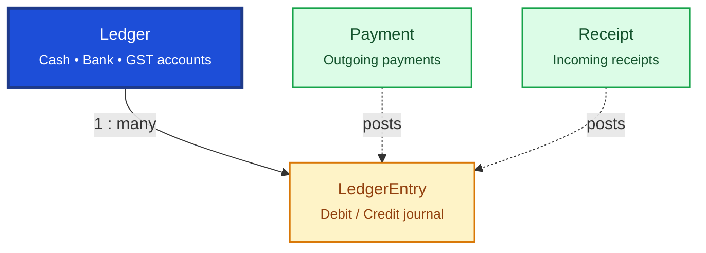

# Financial

Financial tables record money movement and the general ledger. `Payment` and `Receipt` track cash flow; `Ledger` and `LedgerEntry` form the double-entry accounting journal.

## Relationship Diagram



**Legend:** dashed arrows show that business transactions (purchase, sales, returns) generate ledger entries — not always direct FKs.

## How the Tables Work Together

- **Payment** records outgoing money to suppliers, employees, authorities, and other payees.
- **Receipt** records incoming money from customers, insurers, and other sources.
- **Ledger** is the master list of accounting heads (Cash, Bank, Sales, Purchase, GST, etc.).
- **LedgerEntry** is the append-only journal with debit/credit pairs for every financial event.
- Sales, purchase, returns, and adjustments ultimately post to ledger entries.
- Ledger entries support Trial Balance, P&L, Balance Sheet, and GST reporting.
- Financial year scoping comes from `FinancialYear` (configuration).

## Tables

- [payment](#payment) — outgoing payment voucher.
- [receipt](#receipt) — incoming receipt voucher.
- [ledger](#ledger) — accounting ledger master.
- [ledger entry](#ledgerentry) — general ledger journal entry.

---

## Table Specifications

## Payment

> Prisma model: `backend/prisma/schema.prisma` (`Payment`)

## Purpose

The Payment table is the **central payment transaction** table for the Pharmacy ERP.

Unlike `SalesPayment`, which is specific to customer invoice collections, the `Payment` table records all outgoing and incoming financial payments across the ERP.

Typical payment types include:

- Supplier Payment
- Customer Refund
- Employee Reimbursement
- Vendor Advance
- Expense Payment
- Purchase Refund
- Miscellaneous Payment

The table serves as the financial transaction master and integrates with the Ledger module.

---

## Business Rules

- Every Payment must have one Payment Type.
- A Payment may reference one business document (Purchase Invoice, Sales Return, Expense, etc.).
- Payment Amount must be greater than zero.
- Posted payments cannot be modified.
- Cancelled payments require reversal entries rather than deletion.
- Every completed payment creates corresponding Ledger Entries.
- Multiple payments may be made against a single business document.
- UUID is used for synchronization.
- BIGINT is used as the internal primary key.
- Optimistic locking is maintained using the version column.

---

## Relationships

```
Payment
    │
    ├────────► PurchaseInvoice
    ├────────► SalesReturn
    ├────────► Supplier
    ├────────► Customer
    ├────────► Receipt
    └────────► LedgerEntry
```

---

## Columns

| Category | Column | SQLite | PostgreSQL | Nullable | Description |
|----------|--------|---------|------------|----------|-------------|
| Primary Key | id | INTEGER | BIGINT | No | Auto increment primary key |
| Identifier | uuid | TEXT | UUID | No | Global unique identifier |
| Business | paymentNumber | TEXT | VARCHAR(30) | No | Unique payment number |
| Business | paymentType | TEXT | VARCHAR(30) | No | SUPPLIER_PAYMENT, CUSTOMER_REFUND, ADVANCE, EXPENSE, PURCHASE_REFUND |
| Business | paymentDate | DATETIME | TIMESTAMP | No | Payment date/time |
| Financial | amount | REAL | NUMERIC(14,2) | No | Payment amount |
| Business | paymentMethod | TEXT | VARCHAR(20) | No | CASH, UPI, CARD, CHEQUE, BANK_TRANSFER |
| Business | transactionReference | TEXT | VARCHAR(100) | Yes | Bank/UPI/Card reference |
| Business | referenceType | TEXT | VARCHAR(30) | Yes | PURCHASE_INVOICE, SALES_RETURN, EXPENSE, etc. |
| Business | referenceId | INTEGER | BIGINT | Yes | Referenced business document |
| Status | status | TEXT | VARCHAR(20) | No | PENDING, COMPLETED, FAILED, CANCELLED |
| Business | remarks | TEXT | TEXT | Yes | Payment remarks |
| Audit | createdBy | INTEGER | BIGINT | Yes | Employee creating payment |
| Audit | createdAt | DATETIME | TIMESTAMP | No | Record creation timestamp |
| Audit | updatedAt | DATETIME | TIMESTAMP | No | Last update timestamp |
| Audit | deletedAt | DATETIME | TIMESTAMP | Yes | Soft delete timestamp |
| Audit | version | INTEGER | INTEGER | No | Optimistic locking version |

---

## Constraints

- Primary Key (id)
- Unique (uuid)
- Unique (paymentNumber)
- CHECK (amount > 0)
- CHECK (paymentMethod IN ('CASH','UPI','CARD','CHEQUE','BANK_TRANSFER'))
- CHECK (status IN ('PENDING','COMPLETED','FAILED','CANCELLED'))
- CHECK (version >= 1)

---

## Indexes

- PK_Payment
- UK_Payment_UUID
- UK_Payment_Number
- IDX_Payment_Date
- IDX_Payment_Type
- IDX_Payment_Method
- IDX_Payment_Status
- IDX_Payment_Reference

---

## Sample Records

| id | paymentNumber | paymentType | paymentMethod | amount | status |
|----|---------------|-------------|---------------|-------:|--------|
| 1 | PAY250001 | SUPPLIER_PAYMENT | BANK_TRANSFER | 25,000.00 | COMPLETED |
| 2 | PAY250002 | CUSTOMER_REFUND | CASH | 450.00 | COMPLETED |
| 3 | PAY250003 | ADVANCE | UPI | 5,000.00 | PENDING |

---


---

## Notes

- This is the **central payment table** for all outgoing payments.
- Business-specific tables such as **SalesPayment** should reference or map to this table rather than duplicate payment logic.
- Every completed payment should create corresponding **LedgerEntry** records.
- Payment cancellation should create reversal accounting entries instead of modifying historical records.
- Supports partial and multiple payments against the same business document.
- Historical payment records should never be deleted.
- Supports offline-first synchronization using UUID.
- Compatible with both SQLite and PostgreSQL.

---

## Receipt

> Prisma model: `backend/prisma/schema.prisma` (`Receipt`)

## Purpose

The Receipt table records money received by the organization.

Unlike SalesPayment, which is specific to invoice collection, Receipt is the financial transaction document used by the accounting module.

Typical receipts include:

- Customer Payment
- Advance from Customer
- Interest Received
- Miscellaneous Income
- Refund from Supplier
- Deposit Received

Every completed Receipt generates corresponding Ledger Entries.

---

## Business Rules

- Every Receipt has one Receipt Type.
- A Receipt may reference one business document.
- Receipt Amount must be greater than zero.
- Posted Receipts cannot be modified.
- Cancelled Receipts require reversal Ledger Entries.
- Multiple Receipts may exist for one business document.
- UUID is used for synchronization.
- BIGINT is used as the internal primary key.
- Optimistic locking is maintained using the version column.

---

## Relationships

```
Receipt
    │
    ├────────► SalesInvoice
    ├────────► Customer
    ├────────► Payment
    └────────► LedgerEntry
```

---

## Columns

| Category | Column | SQLite | PostgreSQL | Nullable | Description |
|----------|--------|---------|------------|----------|-------------|
| Primary Key | id | INTEGER | BIGINT | No | Auto increment primary key |
| Identifier | uuid | TEXT | UUID | No | Global unique identifier |
| Business | receiptNumber | TEXT | VARCHAR(30) | No | Unique receipt number |
| Business | receiptType | TEXT | VARCHAR(30) | No | CUSTOMER_PAYMENT, ADVANCE, REFUND, INTEREST, OTHER |
| Business | receiptDate | DATETIME | TIMESTAMP | No | Receipt date and time |
| Financial | amount | REAL | NUMERIC(14,2) | No | Amount received |
| Business | receiptMethod | TEXT | VARCHAR(20) | No | CASH, UPI, CARD, CHEQUE, BANK_TRANSFER |
| Business | transactionReference | TEXT | VARCHAR(100) | Yes | Bank/UPI/Card reference |
| Business | referenceType | TEXT | VARCHAR(30) | Yes | SALES_INVOICE, CUSTOMER, PAYMENT, etc. |
| Business | referenceId | INTEGER | BIGINT | Yes | Referenced business document |
| Status | status | TEXT | VARCHAR(20) | No | PENDING, COMPLETED, CANCELLED, REVERSED |
| Business | remarks | TEXT | TEXT | Yes | Receipt remarks |
| Audit | createdBy | INTEGER | BIGINT | Yes | Employee recording receipt |
| Audit | createdAt | DATETIME | TIMESTAMP | No | Record creation timestamp |
| Audit | updatedAt | DATETIME | TIMESTAMP | No | Last update timestamp |
| Audit | deletedAt | DATETIME | TIMESTAMP | Yes | Soft delete timestamp |
| Audit | version | INTEGER | INTEGER | No | Optimistic locking version |

---

## Constraints

- Primary Key (id)
- Unique (uuid)
- Unique (receiptNumber)
- CHECK (amount > 0)
- CHECK (receiptMethod IN ('CASH','UPI','CARD','CHEQUE','BANK_TRANSFER'))
- CHECK (status IN ('PENDING','COMPLETED','CANCELLED','REVERSED'))
- CHECK (version >= 1)

---

## Indexes

- PK_Receipt
- UK_Receipt_UUID
- UK_Receipt_Number
- IDX_Receipt_Date
- IDX_Receipt_Type
- IDX_Receipt_Method
- IDX_Receipt_Status
- IDX_Receipt_Reference

---

## Sample Records

| id | receiptNumber | receiptType | receiptMethod | amount | status |
|----|---------------|-------------|---------------|-------:|--------|
| 1 | REC250001 | CUSTOMER_PAYMENT | CASH | 850.00 | COMPLETED |
| 2 | REC250002 | ADVANCE | UPI | 5,000.00 | COMPLETED |
| 3 | REC250003 | REFUND | BANK_TRANSFER | 2,500.00 | PENDING |

---


---

## Notes

- This is the **central receipt transaction** table for all incoming money.
- Business modules (Sales, Customer Advances, Miscellaneous Income) should reference this table instead of implementing separate receipt logic.
- Every completed Receipt should generate corresponding **LedgerEntry** records.
- Receipt cancellation should create reversal accounting entries rather than modifying historical records.
- Supports partial receipts against invoices.
- Historical receipt records should never be deleted.
- Supports offline-first synchronization using UUID.
- Compatible with both SQLite and PostgreSQL.

---

## Ledger

> Prisma model: `backend/prisma/schema.prisma` (`Ledger`)

## Purpose

The Ledger table represents the Chart of Accounts (COA) for the Pharmacy ERP.

Every financial transaction in the ERP ultimately impacts one or more Ledger accounts through LedgerEntry records.

Examples include:

- Cash
- Bank
- Customer Receivable
- Supplier Payable
- Sales Revenue
- Purchase Account
- GST Input
- GST Output
- Inventory Asset
- Expense Accounts

The Ledger table defines the financial accounts, while actual debit and credit transactions are stored in LedgerEntry.

---

## Business Rules

- Every Ledger account has a unique Ledger Code.
- Ledger hierarchy is supported through Parent Ledger.
- System-defined Ledgers cannot be deleted.
- Transactions are stored only in LedgerEntry.
- Ledger balances are derived from LedgerEntry.
- A Ledger may have multiple child Ledgers.
- UUID is used for synchronization.
- BIGINT is used as the internal primary key.
- Optimistic locking is maintained using the version column.

---

## Relationships

```
Ledger
   │
   ├──────< Ledger (Parent → Child)
   │
   └──────< LedgerEntry
```

---

## Columns

| Category | Column | SQLite | PostgreSQL | Nullable | Description |
|----------|--------|---------|------------|----------|-------------|
| Primary Key | id | INTEGER | BIGINT | No | Auto increment primary key |
| Identifier | uuid | TEXT | UUID | No | Global unique identifier |
| Business | ledgerCode | TEXT | VARCHAR(30) | No | Unique ledger code |
| Business | ledgerName | TEXT | VARCHAR(150) | No | Ledger name |
| Business | ledgerType | TEXT | VARCHAR(30) | No | ASSET, LIABILITY, INCOME, EXPENSE, EQUITY |
| Foreign Key | parentLedgerId | INTEGER | BIGINT | Yes | Parent Ledger |
| Business | normalBalance | TEXT | VARCHAR(10) | No | DEBIT or CREDIT |
| Business | isSystem | INTEGER | BOOLEAN | No | System-defined ledger |
| Business | isActive | INTEGER | BOOLEAN | No | Active ledger |
| Business | description | TEXT | TEXT | Yes | Ledger description |
| Audit | createdAt | DATETIME | TIMESTAMP | No | Record creation timestamp |
| Audit | updatedAt | DATETIME | TIMESTAMP | No | Last update timestamp |
| Audit | deletedAt | DATETIME | TIMESTAMP | Yes | Soft delete timestamp |
| Audit | version | INTEGER | INTEGER | No | Optimistic locking version |

---

## Constraints

- Primary Key (id)
- Unique (uuid)
- Unique (ledgerCode)
- Foreign Key (parentLedgerId → Ledger.id)
- CHECK (ledgerType IN ('ASSET','LIABILITY','INCOME','EXPENSE','EQUITY'))
- CHECK (normalBalance IN ('DEBIT','CREDIT'))
- CHECK (version >= 1)

---

## Indexes

- PK_Ledger
- UK_Ledger_UUID
- UK_Ledger_Code
- IDX_Ledger_Parent
- IDX_Ledger_Type
- IDX_Ledger_Active

---

## Sample Records

| id | ledgerCode | ledgerName | ledgerType | normalBalance |
|----|------------|------------|------------|---------------|
| 1 | CASH001 | Cash in Hand | ASSET | DEBIT |
| 2 | BANK001 | HDFC Bank | ASSET | DEBIT |
| 3 | SALE001 | Sales Revenue | INCOME | CREDIT |
| 4 | PUR001 | Purchase Account | EXPENSE | DEBIT |
| 5 | SUP001 | Supplier Payable | LIABILITY | CREDIT |

---


---

## Notes

- This table represents the **Chart of Accounts (COA)**.
- Ledger balances should never be stored directly; they are calculated from **LedgerEntry** records.
- Parent-child hierarchy enables grouping (e.g., Current Assets → Cash → HDFC Bank).
- System ledgers (Cash, Sales, Inventory, GST, etc.) should not be deleted.
- Financial reports such as Trial Balance, Balance Sheet, Profit & Loss, and General Ledger are generated using Ledger and LedgerEntry.
- Supports offline-first synchronization using UUID.
- Compatible with both SQLite and PostgreSQL.

---

## LedgerEntry

> Prisma model: `backend/prisma/schema.prisma` (`LedgerEntry`)

## Purpose

The LedgerEntry table stores all accounting transactions in the Pharmacy ERP.

Every financial event ultimately generates one or more LedgerEntry records.

Examples include:

- Sales Invoice
- Purchase Invoice
- Sales Return
- Purchase Return
- Customer Receipt
- Supplier Payment
- Expense
- Journal Entry
- Opening Balance
- Stock Adjustment

LedgerEntry is the source of truth for all financial reporting.

---

## Business Rules

- Every LedgerEntry belongs to exactly one Ledger.
- Every LedgerEntry belongs to one Voucher/Business Transaction.
- Every accounting transaction must be balanced.
- Total Debit must equal Total Credit for every Voucher.
- Ledger Entries cannot be edited after posting.
- Cancellation creates reversal entries instead of updates.
- Running Balance is optional and may be calculated.
- UUID is used for synchronization.
- BIGINT is used as the internal primary key.
- Optimistic locking is maintained using the version column.

---

## Relationships

```
Ledger (1)
     │
     └────────< LedgerEntry (Many)
                      │
                      ├── Receipt
                      ├── Payment
                      ├── PurchaseInvoice
                      ├── SalesInvoice
                      ├── PurchaseReturn
                      ├── SalesReturn
                      └── Journal Voucher
```

---

## Columns

| Category | Column | SQLite | PostgreSQL | Nullable | Description |
|----------|--------|---------|------------|----------|-------------|
| Primary Key | id | INTEGER | BIGINT | No | Auto increment primary key |
| Identifier | uuid | TEXT | UUID | No | Global unique identifier |
| Foreign Key | ledgerId | INTEGER | BIGINT | No | References Ledger.id |
| Business | voucherType | TEXT | VARCHAR(30) | No | SALES, PURCHASE, RECEIPT, PAYMENT, JOURNAL, OPENING |
| Business | voucherId | INTEGER | BIGINT | No | Source business document ID |
| Business | voucherNumber | TEXT | VARCHAR(30) | No | Business document number |
| Business | transactionDate | DATETIME | TIMESTAMP | No | Accounting transaction date |
| Financial | debitAmount | REAL | NUMERIC(14,2) | No | Debit amount |
| Financial | creditAmount | REAL | NUMERIC(14,2) | No | Credit amount |
| Financial | runningBalance | REAL | NUMERIC(14,2) | Yes | Running ledger balance |
| Business | narration | TEXT | TEXT | Yes | Transaction narration |
| Status | isPosted | INTEGER | BOOLEAN | No | Posted flag |
| Audit | createdBy | INTEGER | BIGINT | Yes | Employee posting entry |
| Audit | createdAt | DATETIME | TIMESTAMP | No | Record creation timestamp |
| Audit | updatedAt | DATETIME | TIMESTAMP | No | Last update timestamp |
| Audit | deletedAt | DATETIME | TIMESTAMP | Yes | Soft delete timestamp |
| Audit | version | INTEGER | INTEGER | No | Optimistic locking version |

---

## Constraints

- Primary Key (id)
- Unique (uuid)
- Foreign Key (ledgerId → Ledger.id)
- CHECK (debitAmount >= 0)
- CHECK (creditAmount >= 0)
- CHECK (NOT (debitAmount > 0 AND creditAmount > 0))
- CHECK (debitAmount > 0 OR creditAmount > 0)
- CHECK (version >= 1)

---

## Indexes

- PK_LedgerEntry
- UK_LedgerEntry_UUID
- IDX_LedgerEntry_Ledger
- IDX_LedgerEntry_Date
- IDX_LedgerEntry_Voucher
- IDX_LedgerEntry_Posted

---

## Sample Records

| id | ledgerId | voucherType | voucherNumber | debitAmount | creditAmount |
|----|---------:|-------------|---------------|------------:|-------------:|
| 1 | 1 | RECEIPT | REC250001 | 850.00 | 0.00 |
| 2 | 5 | RECEIPT | REC250001 | 0.00 | 850.00 |
| 3 | 3 | SALES | SI250001 | 0.00 | 5,250.00 |
| 4 | 6 | SALES | SI250001 | 5,250.00 | 0.00 |

---


---

## Notes

- This table stores **all accounting postings**.
- Every business transaction should create one or more LedgerEntry records.
- Double-entry accounting must always be maintained:

  - Total Debit = Total Credit

- Ledger balances should be calculated from LedgerEntry records rather than stored directly.
- Historical LedgerEntry records must never be modified after posting.
- Reversals should be handled by creating opposite LedgerEntry records.
- Supports offline-first synchronization using UUID.
- Compatible with both SQLite and PostgreSQL.
