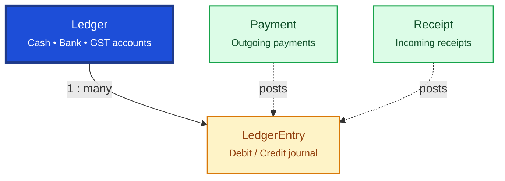

# Financial

Financial tables record money movement and the general ledger. `Payment` and `Receipt` track cash flow; `Ledger` and `LedgerEntry` form the double-entry accounting journal.

## Relationship Diagram

**Legend:** dashed arrows show that business transactions (purchase, sales, returns) generate ledger entries — not always direct FKs.

## How the Tables Work Together

- **Payment** records outgoing money to suppliers, employees, authorities, and other payees.
- **Receipt** records incoming money from customers, insurers, and other sources.
- **Ledger** is the master list of accounting heads (Cash, Bank, Sales, Purchase, GST, etc.).
- **LedgerEntry** is the append-only journal with debit/credit pairs for every financial event.
- Sales, purchase, returns, and adjustments ultimately post to ledger entries.
- Ledger entries support Trial Balance, P&L, Balance Sheet, and GST reporting.
- Financial year scoping comes from `FinancialYear` (configuration).

## Tables

- [[43_payment]] — outgoing payment voucher.
- [[44_receipt]] — incoming receipt voucher.
- [[45_ledger]] — accounting ledger master.
- [[46_ledger_entry]] — general ledger journal entry.
