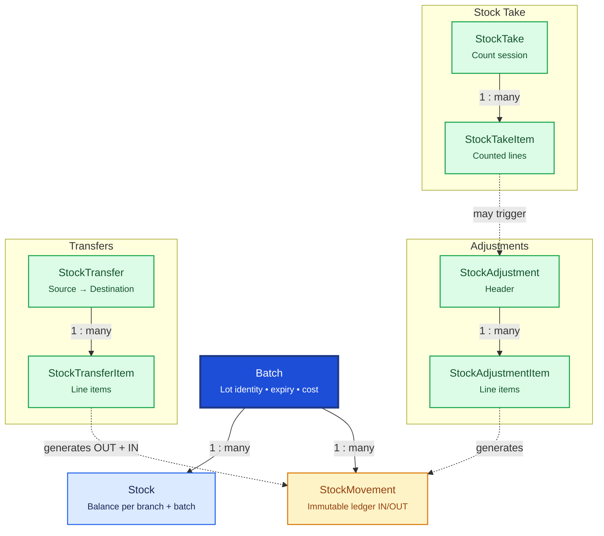

# Inventory

Inventory tracks medicine lots, branch-level stock balances, and every quantity change through an immutable movement ledger. `Batch` is org-global lot identity; `Stock` holds per-branch quantities.

## Relationship Diagram



**Legend:** dashed arrows show business workflows (not direct FKs). `Stock` is unique per `(branchId, batchId)`.

## How the Tables Work Together

- **Batch** stores org-global lot identity: batch number, expiry, purchase rate, statutory MRP — not branch quantities.
- **Stock** holds current quantities for `(branchId, batchId)` — one balance row per branch holding that lot.
- **StockMovement** is the append-only ledger recording every IN/OUT with `balanceAfter` and polymorphic reference.
- **StockAdjustment** + **StockAdjustmentItem** record manual corrections (damage, expiry, theft) with approval workflow.
- **StockTransfer** + **StockTransferItem** move stock between branches (OUT at source, IN at destination).
- **StockTake** + **StockTakeItem** capture physical counts; variances may generate adjustments.
- Stock quantities are never overwritten without a corresponding movement or ledger entry.
- Document numbers (`movementNumber`, `adjustmentNumber`, `transferNumber`) are unique within branch scope.

## Tables

- [batch](#batch) — org-global medicine lot identity.
- [stock](#stock) — per-branch stock balance for a batch.
- [stock movement](#stockmovement) — immutable inventory ledger.
- [stock adjustment](#stockadjustment) — stock adjustment header.
- [stock-adjustment-item](#stockadjustmentitem) — stock adjustment line items.
- [stock transfer](#stocktransfer) — inter-branch transfer header.
- [stock-transfer-item](#stocktransferitem) — stock transfer line items.
- [stock take](#stocktake) — physical stock count session.
- [stock take item](#stocktakeitem) — stock take counted lines.

---

## Table Specifications

## Batch

> Prisma model: `backend/prisma/schema.prisma` (`Batch`)

## Purpose

The Batch table stores batch/lot identity for each medicine: batch number, expiry, lot cost, and statutory MRP.

A medicine can have multiple batches. **Branch-specific sale pricing** is maintained in branch-scoped `PriceList` / `PriceListItem`, not on Batch.

Inventory balances are in **Stock** (one row per batch per branch).

---

## Business Rules

- Every Batch belongs to exactly one Medicine.
- Batch Number must be unique per Medicine: `(medicineId, batchNumber)`.
- Batch stores **purchaseRate** (lot cost) and **mrp** (legal MRP on pack).
- **saleRate** and **discountPercent** are NOT on Batch — use PriceListItem (branch-scoped).
- Sale line items snapshot final price/MRP at transaction time.
- Expired batches cannot be sold.
- FEFO (First Expiry First Out) should be followed during dispensing.
- UUID is used for cloud synchronization.
- BIGINT is the local internal primary key only.

---

## Relationships

```
Medicine (1)
      │
      └──< Batch (Many)
                │
                ├──< Stock (Many — per branch)
                ├──< StockMovement
                └──< SalesInvoiceItem
```

---

## Columns

| Category | Column | SQLite | PostgreSQL (JPA) | Nullable | Description |
|----------|--------|---------|------------------|----------|-------------|
| Primary Key | id | INTEGER | BIGINT | No | Local PK (not synced) |
| Identifier | uuid | TEXT | UUID/TEXT | No | Global sync identifier |
| Foreign Key | medicineId | INTEGER | BIGINT | No | References Medicine.id |
| Business | batchNumber | TEXT | VARCHAR | No | Manufacturer batch number |
| Product | manufacturingDate | DATE | DATE | Yes | Manufacturing date |
| Product | expiryDate | DATE | DATE | No | Expiry date |
| Pricing | purchaseRate | REAL | NUMERIC | No | Lot cost at receipt |
| Pricing | mrp | REAL | NUMERIC | No | Statutory MRP |
| Product | barcode | TEXT | VARCHAR | Yes | Batch barcode |
| Status | isActive | INTEGER | BOOLEAN | No | Active batch |
| Audit | createdAt / updatedAt / deletedAt / version | — | — | — | Standard audit |

---

## Constraints

- Primary Key (id)
- Foreign Key (medicineId → Medicine.id)
- Unique (uuid)
- Unique (medicineId, batchNumber)

---


---

## Notes

- Batch = lot identity + cost + MRP. Not a stock balance.
- Use **Stock** for per-branch quantities.
- Use **PriceListItem** for branch sale price/discount.

---

## Stock

> Prisma model: `backend/prisma/schema.prisma` (`Stock`)

## Purpose

The Stock table maintains the **current inventory balance** for each medicine batch **at a specific branch**.

Unlike the StockMovement table, which records every inventory transaction, the Stock table stores only the latest inventory quantities for fast lookups during sales, purchasing, stock inquiries, and reporting.

**One Batch can have multiple Stock records** — one per branch that holds that lot.

---

## Business Rules

- Every Stock record belongs to exactly one Batch and one Branch.
- A Batch can have **many** Stock records (one per branch).
- Unique constraint: `(branchId, batchId)` — at most one balance row per batch per branch.
- Available Quantity cannot be negative unless negative inventory is explicitly enabled.
- Stock quantities must never be updated directly by business modules.
- All inventory changes must first create a StockMovement record.
- The Stock table should be updated only by the inventory service after validating the StockMovement.
- Reserved Quantity cannot exceed Available Quantity.
- UUID is used for synchronization with the cloud (Spring Boot + JPA + PostgreSQL).
- BIGINT is used as the internal primary key (local only — never sync `id`).
- Optimistic locking is maintained using the version column.

---

## Relationships

```
Medicine (1)
    │
    └──< Batch (Many)
              │
              └──< Stock (Many, one per branch)
                        │
                        └── branchId → Branch
```

---

## Columns

| Category | Column | SQLite | PostgreSQL (JPA) | Nullable | Description |
|----------|--------|---------|------------------|----------|-------------|
| Primary Key | id | INTEGER | BIGINT | No | Local auto increment (not synced) |
| Identifier | uuid | TEXT | UUID/TEXT | No | Global sync identifier |
| Foreign Key | batchId | INTEGER | BIGINT | No | References Batch.id |
| Foreign Key | branchId | INTEGER | BIGINT | No | References Branch.id |
| Quantity | availableQuantity | REAL | NUMERIC | No | Saleable stock quantity |
| Quantity | reservedQuantity | REAL | NUMERIC | No | Reserved for pending sales/orders |
| Quantity | damagedQuantity | REAL | NUMERIC | No | Damaged stock |
| Quantity | expiredQuantity | REAL | NUMERIC | No | Expired stock |
| Quantity | inTransitQuantity | REAL | NUMERIC | No | Pending stock transfer quantity |
| Inventory | lastMovementAt | DATETIME | TIMESTAMP | Yes | Last inventory transaction |
| Status | isActive | INTEGER | BOOLEAN | No | Active stock record |
| Audit | createdAt | DATETIME | TIMESTAMP | No | Record creation timestamp |
| Audit | updatedAt | DATETIME | TIMESTAMP | No | Last update timestamp |
| Audit | deletedAt | DATETIME | TIMESTAMP | Yes | Soft delete timestamp |
| Audit | version | INTEGER | INTEGER | No | Optimistic locking version |

---

## Constraints

- Primary Key (id)
- Foreign Key (batchId → Batch.id)
- Foreign Key (branchId → Branch.id)
- Unique (uuid)
- Unique (branchId, batchId)
- CHECK (availableQuantity >= 0)
- CHECK (reservedQuantity >= 0)
- CHECK (version >= 1)

---

## Indexes

- PK_Stock (id)
- UK_Stock_UUID
- UK_Stock_Branch_Batch
- IDX_Stock_BranchId
- IDX_Stock_BatchId
- IDX_Stock_Branch_AvailableQuantity
- IDX_Stock_Branch_IsActive
- IDX_Stock_LastMovement

---


---

## Notes

- This table stores the **current inventory snapshot** per branch.
- Inter-branch transfers create/update Stock rows at source and destination branches for the same Batch.
- Every inventory transaction must first create a **StockMovement** record, after which Stock is updated.
- Business modules should never update stock quantities directly.
- Sync with cloud uses `uuid`, never local `id`.

---

## StockMovement

> Prisma model: `backend/prisma/schema.prisma` (`StockMovement`)

## Purpose

The StockMovement table is the **inventory transaction ledger** of the Pharmacy ERP.

Every inventory change must create exactly one StockMovement record.

This table provides a complete audit trail of inventory transactions and is the source of truth for stock reconciliation.

Typical transactions include:

- Purchase Receipt
- Sales
- Sales Return
- Purchase Return
- Stock Adjustment
- Stock Transfer
- Stock Take
- Expired Stock Disposal
- Damaged Stock

---

## Business Rules

- Every StockMovement belongs to exactly one Branch, Medicine, and Batch.
- Stock balances are branch-scoped: `(branchId, batchId)` identifies the Stock row updated.
- Every inventory transaction must generate one StockMovement record.
- StockMovement records are immutable and must never be edited or deleted.
- Stock balances are derived by applying StockMovements at the branch level.
- Movement Quantity must always be positive.
- IN and OUT direction determines whether quantity is added or deducted.
- Reference Table and Reference Id must identify the originating business transaction.
- `movementNumber` is unique **per branch**, not globally.
- UUID is used for synchronization.
- BIGINT is used as the internal primary key.

---

## Relationships

```
Branch (1)
     │
     └──────< StockMovement (Many)
                    │
                    ├── Medicine
                    ├── Batch (1) ──< Stock (Many per branch)
                    │
                    ├── PurchaseInvoiceItem
                    ├── SalesInvoiceItem
                    ├── PurchaseReturnItem
                    ├── SalesReturnItem
                    ├── StockAdjustmentItem
                    ├── StockTransferItem
                    └── StockTakeItem
```

---

## Columns

| Category | Column | SQLite | PostgreSQL (JPA) | Nullable | Description |
|----------|--------|---------|------------------|----------|-------------|
| Primary Key | id | INTEGER | BIGINT | No | Auto increment primary key (local only) |
| Identifier | uuid | TEXT | UUID/TEXT | No | Global unique identifier |
| Foreign Key | branchId | INTEGER | BIGINT | No | References Branch.id |
| Foreign Key | medicineId | INTEGER | BIGINT | No | References Medicine.id |
| Foreign Key | batchId | INTEGER | BIGINT | No | References Batch.id |
| Business | movementNumber | TEXT | VARCHAR(30) | No | Branch-scoped movement number |
| Business | movementType | TEXT | VARCHAR(30) | No | PURCHASE_GRN, SALES_INVOICE, etc. (String, not enum) |
| Business | movementDirection | TEXT | VARCHAR(10) | No | IN or OUT |
| Quantity | quantity | REAL | NUMERIC | No | Movement quantity (always positive) |
| Quantity | unitCost | REAL | NUMERIC | No | Cost snapshot at movement time |
| Quantity | balanceAfter | REAL | NUMERIC | No | Branch stock balance after transaction |
| Reference | referenceTable | TEXT | VARCHAR(50) | No | Source table name |
| Reference | referenceId | INTEGER | BIGINT | No | Source record ID |
| Business | movementDate | DATETIME | TIMESTAMP | No | Transaction date/time |
| Business | remarks | TEXT | TEXT | Yes | Additional remarks |
| Audit | createdBy | INTEGER | BIGINT | Yes | User performing transaction |
| Audit | createdAt | DATETIME | TIMESTAMP | No | Record creation timestamp |

---

## Constraints

- Primary Key (id)
- Foreign Key (branchId → Branch.id)
- Foreign Key (medicineId → Medicine.id)
- Foreign Key (batchId → Batch.id)
- Unique (uuid)
- Unique (branchId, movementNumber)
- CHECK (quantity > 0)
- CHECK (movementDirection IN ('IN','OUT'))

---

## Indexes

- PK_StockMovement (id)
- UK_StockMovement_UUID
- UK_StockMovement_Branch_Number
- IDX_StockMovement_Branch_Batch_Date
- IDX_StockMovement_Branch_Medicine_Date
- IDX_StockMovement_Type
- IDX_StockMovement_Reference

---

## Sample Records

| id | branchId | movementNumber | batchId | movementType | movementDirection | quantity | balanceAfter |
|----|----------|----------------|---------|--------------|-------------------|---------:|-------------:|
| 1 | 1 | SM000001 | 1 | PURCHASE_GRN | IN | 100.000 | 100.000 |
| 2 | 1 | SM000002 | 1 | SALES_INVOICE | OUT | 12.000 | 88.000 |
| 3 | 1 | SM000003 | 1 | SALES_RETURN | IN | 2.000 | 90.000 |
| 4 | 2 | SM000001 | 1 | TRANSFER_IN | IN | 10.000 | 10.000 |

Note: Branch 1 and Branch 2 can both use `SM000001` because movement numbers are branch-scoped.

---


---

## Notes

- This is the **inventory ledger** and the source of truth for all inventory transactions.
- Records should be **append-only**; corrections must be made using new StockMovement entries rather than updating existing records.
- The Stock table (one row per batch **per branch**) should be updated based on StockMovement records.
- Supports complete inventory traceability for audits, recalls, and statutory compliance.
- Enables reconstruction of branch stock balances at any historical point in time.
- Supports offline-first synchronization using UUID.
- Status and movement type fields are **String** values validated in application code (not Prisma enums).

---

## StockAdjustment

> Prisma model: `backend/prisma/schema.prisma` (`StockAdjustment`)

## Purpose

The StockAdjustment table records manual corrections made to inventory when the physical stock differs from the system stock at a **specific branch**.

Adjustments are required for situations such as:

- Damaged medicines
- Expired medicines
- Lost or stolen stock
- Physical stock count differences
- Opening stock entry
- System correction
- Free samples
- Internal consumption

Every Stock Adjustment automatically generates one or more StockMovement records at the branch level.

---

## Business Rules

- Every adjustment belongs to exactly one Branch.
- Every adjustment must contain at least one adjustment item.
- Every adjustment requires a valid adjustment reason.
- Adjustments should be approved according to company policy.
- Approved adjustments cannot be modified.
- Cancelling an adjustment should create a reversal StockMovement instead of deleting records.
- Every adjustment updates the branch Stock table through StockMovement.
- `adjustmentNumber` is unique **per branch**, not globally.
- Soft delete should not be used for approved adjustments.
- UUID is used for synchronization.
- BIGINT is used as the internal primary key.
- Optimistic locking is maintained using the version column.

---

## Relationships

```
Branch
    │
    ▼
StockAdjustment
    │
    ├──────< StockAdjustmentItem ──► Batch
    │
    └────────────► StockMovement (branch-scoped)
                         │
                         ▼
                      Stock (branchId + batchId)
```

---

## Columns

| Category | Column | SQLite | PostgreSQL (JPA) | Nullable | Description |
|----------|--------|---------|------------------|----------|-------------|
| Primary Key | id | INTEGER | BIGINT | No | Auto increment primary key |
| Identifier | uuid | TEXT | UUID/TEXT | No | Global unique identifier |
| Foreign Key | branchId | INTEGER | BIGINT | No | Branch where adjustment applies |
| Business | adjustmentNumber | TEXT | VARCHAR(30) | No | Branch-scoped adjustment document number |
| Business | adjustmentType | TEXT | VARCHAR(30) | No | DAMAGE, EXPIRED, LOST, etc. (String) |
| Business | adjustmentDate | DATETIME | TIMESTAMP | No | Adjustment date |
| Business | reason | TEXT | TEXT | No | Reason for adjustment |
| Foreign Key | approvedByEmployeeId | INTEGER | BIGINT | Yes | Approving employee |
| Business | approvedAt | DATETIME | TIMESTAMP | Yes | Approval date |
| Status | status | TEXT | VARCHAR(20) | No | DRAFT, APPROVED, CANCELLED (String) |
| Status | isActive | INTEGER | BOOLEAN | No | Active record |
| Audit | createdBy | INTEGER | BIGINT | Yes | Employee creating adjustment |
| Audit | createdAt | DATETIME | TIMESTAMP | No | Record creation timestamp |
| Audit | updatedAt | DATETIME | TIMESTAMP | No | Last update timestamp |
| Audit | deletedAt | DATETIME | TIMESTAMP | Yes | Normally unused |
| Audit | version | INTEGER | INTEGER | No | Optimistic locking version |

---

## Constraints

- Primary Key (id)
- Unique (uuid)
- Unique (branchId, adjustmentNumber)
- Foreign Key (branchId → Branch.id)
- Foreign Key (approvedByEmployeeId → Employee.id)
- CHECK (version >= 1)

---

## Indexes

- PK_StockAdjustment (id)
- UK_StockAdjustment_UUID
- UK_StockAdjustment_Branch_Number
- IDX_StockAdjustment_Branch
- IDX_StockAdjustment_Date
- IDX_StockAdjustment_Status
- IDX_StockAdjustment_Type
- IDX_StockAdjustment_ApprovedBy

---

## Sample Records

| id | branchId | adjustmentNumber | adjustmentType | adjustmentDate | status |
|----|----------|------------------|----------------|----------------|---------|
| 1 | 1 | ADJ000001 | DAMAGE | 2026-08-01 | APPROVED |
| 2 | 1 | ADJ000002 | EXPIRED | 2026-08-02 | APPROVED |
| 3 | 2 | ADJ000001 | OPENING | 2026-08-03 | DRAFT |

Note: Branch 1 and Branch 2 can both use `ADJ000001` because adjustment numbers are branch-scoped.

---


---

## Notes

- This is the **header table** for branch-scoped stock adjustments.
- Individual medicine adjustments should be stored in **StockAdjustmentItem** (references Batch; branch comes from header).
- Approval workflow should be enforced before inventory is updated.
- Every approved adjustment must automatically generate corresponding **StockMovement** records at `branchId`.
- Stock should never be updated directly from this table.
- Historical adjustments should be preserved for audit and compliance purposes.
- Supports offline-first synchronization using UUID.

---

## StockTransfer

> Prisma model: `backend/prisma/schema.prisma` (`StockTransfer`)

## Purpose

The StockTransfer table records inventory transfers between branches.

It provides complete traceability of inventory movement between branch-scoped Stock balances without affecting overall company inventory totals.

Typical scenarios include:

- Branch-to-Branch Transfer
- Warehouse-to-Store Transfer
- Store-to-Warehouse Return
- Emergency Stock Transfer

Every completed Stock Transfer generates corresponding **StockMovement** records for both the source and destination branches.

---

## Business Rules

- Every transfer must have at least one StockTransferItem.
- Source and Destination branches must be different.
- Transfer quantity cannot exceed available stock at the source branch.
- Only approved/dispatched transfers update inventory.
- Cancelled transfers do not affect stock.
- Every completed transfer creates two StockMovement records:
  - OUT from source branch (reduces source Stock)
  - IN to destination branch (increases destination Stock — same Batch, new branch Stock row if needed)
- `transferNumber` is unique **per source branch**, not globally.
- Soft delete should not be used for completed transfers.
- UUID is used for synchronization.
- BIGINT is used as the internal primary key.
- Optimistic locking is maintained using the version column.

---

## Relationships

```
Branch (source)                    Branch (destination)
        │                                    │
        └──────────► StockTransfer ◄─────────┘
                           │
                    ├──────< StockTransferItem ──► Batch (org-global)
                    │
                    ├────────► StockMovement (OUT, source branch)
                    │
                    └────────► StockMovement (IN, destination branch)
```

---

## Columns

| Category | Column | SQLite | PostgreSQL (JPA) | Nullable | Description |
|----------|--------|---------|------------------|----------|-------------|
| Primary Key | id | INTEGER | BIGINT | No | Auto increment primary key |
| Identifier | uuid | TEXT | UUID/TEXT | No | Global unique identifier |
| Business | transferNumber | TEXT | VARCHAR(30) | No | Unique per source branch |
| Foreign Key | sourceBranchId | INTEGER | BIGINT | No | Source branch |
| Foreign Key | destinationBranchId | INTEGER | BIGINT | No | Destination branch |
| Business | transferDate | DATETIME | TIMESTAMP | No | Transfer date |
| Business | expectedArrivalDate | DATETIME | TIMESTAMP | Yes | Expected arrival |
| Business | receivedDate | DATETIME | TIMESTAMP | Yes | Goods received date |
| Status | status | TEXT | VARCHAR(20) | No | DRAFT, DISPATCHED, COMPLETED, etc. (String) |
| Business | transferType | TEXT | VARCHAR(30) | No | ROUTINE_REPLENISHMENT, EMERGENCY_TRANSFER, etc. |
| Foreign Key | approvedByEmployeeId | INTEGER | BIGINT | Yes | Approving employee |
| Business | approvedAt | DATETIME | TIMESTAMP | Yes | Approval timestamp |
| Business | remarks | TEXT | TEXT | Yes | Transfer remarks |
| Audit | createdBy | INTEGER | BIGINT | Yes | Created by user |
| Audit | createdAt | DATETIME | TIMESTAMP | No | Record creation timestamp |
| Audit | updatedAt | DATETIME | TIMESTAMP | No | Last update timestamp |
| Audit | deletedAt | DATETIME | TIMESTAMP | Yes | Normally unused |
| Audit | version | INTEGER | INTEGER | No | Optimistic locking version |

---

## Constraints

- Primary Key (id)
- Unique (uuid)
- Unique (sourceBranchId, transferNumber)
- Foreign Key (sourceBranchId → Branch.id)
- Foreign Key (destinationBranchId → Branch.id)
- Foreign Key (approvedByEmployeeId → Employee.id)
- CHECK (sourceBranchId <> destinationBranchId)
- CHECK (version >= 1)

---

## Indexes

- PK_StockTransfer (id)
- UK_StockTransfer_UUID
- UK_StockTransfer_Source_Number
- IDX_StockTransfer_Source
- IDX_StockTransfer_Destination
- IDX_StockTransfer_Date
- IDX_StockTransfer_Status
- IDX_StockTransfer_Type

---

## Sample Records

| id | transferNumber | sourceBranchId | destinationBranchId | transferDate | status |
|----|----------------|----------------|---------------------|--------------|--------|
| 1 | ST000001 | 1 | 2 | 2026-08-04 | COMPLETED |
| 2 | ST000002 | 2 | 3 | 2026-08-05 | IN_TRANSIT |
| 3 | ST000001 | 3 | 4 | 2026-08-06 | DRAFT |

Note: Branch 1 and Branch 3 can both issue `ST000001` because transfer numbers are scoped to source branch.

---


---

## Notes

- This is the **header table** for inter-branch stock transfers.
- Batch is org-global; source and destination each maintain their own **Stock** row for `(branchId, batchId)`.
- Individual medicines and quantities are stored in **StockTransferItem**.
- Inventory should only be updated after approval/dispatch according to the configured workflow.
- Each completed transfer generates:
  - One **OUT** StockMovement at the source branch.
  - One **IN** StockMovement at the destination branch.
- Historical transfer records should never be deleted.
- Supports offline-first synchronization using UUID.

---

## StockTake

> Prisma model: `backend/prisma/schema.prisma` (`StockTake`)

## Purpose

The StockTake table represents a physical inventory counting session.

It is the **header/master document** for stock verification. During a stock take, the system records the expected quantities from inventory, while users enter the physical quantities counted. Any differences are reconciled through StockAdjustment after approval.

Typical scenarios include:

- Daily cycle count
- Weekly stock verification
- Monthly stock audit
- Annual inventory audit
- Surprise inventory inspection

---

## Business Rules

- Every Stock Take must have one or more StockTakeItems.
- A Stock Take is performed for a Branch/Warehouse.
- Only one active Stock Take can exist for the same location at a time.
- Once completed, Stock Take becomes read-only.
- Inventory is **not** updated directly from Stock Take.
- Approved variances generate StockAdjustment records.
- StockTake records must never be deleted for audit purposes.
- UUID is used for synchronization.
- BIGINT is used as the internal primary key.
- Optimistic locking is maintained using the version column.

---

## Relationships

```
Branch / Warehouse
        │
        ▼
   StockTake
        │
        ├──────< StockTakeItem
        │
        └────────► StockAdjustment
                       │
                       ▼
                 StockMovement
```

---

## Columns

| Category | Column | SQLite | PostgreSQL | Nullable | Description |
|----------|--------|---------|------------|----------|-------------|
| Primary Key | id | INTEGER | BIGINT | No | Auto increment primary key |
| Identifier | uuid | TEXT | UUID | No | Global unique identifier |
| Business | stockTakeNumber | TEXT | VARCHAR(30) | No | Unique stock take document number |
| Foreign Key | branchId | INTEGER | BIGINT | No | Branch or warehouse being counted |
| Business | stockTakeDate | DATETIME | TIMESTAMP | No | Date of physical stock count |
| Business | countType | TEXT | VARCHAR(20) | No | FULL, CYCLE, RANDOM |
| Status | status | TEXT | VARCHAR(20) | No | DRAFT, IN_PROGRESS, COMPLETED, APPROVED, CANCELLED |
| Foreign Key | countedByEmployeeId | INTEGER | BIGINT | No | Employee performing count |
| Foreign Key | approvedByEmployeeId | INTEGER | BIGINT | Yes | Employee approving stock take |
| Business | approvedAt | DATETIME | TIMESTAMP | Yes | Approval timestamp |
| Business | remarks | TEXT | TEXT | Yes | General remarks |
| Audit | createdAt | DATETIME | TIMESTAMP | No | Record creation timestamp |
| Audit | updatedAt | DATETIME | TIMESTAMP | No | Last update timestamp |
| Audit | deletedAt | DATETIME | TIMESTAMP | Yes | Normally unused |
| Audit | version | INTEGER | INTEGER | No | Optimistic locking version |

---

## Constraints

- Primary Key (id)
- Unique (uuid)
- Unique (stockTakeNumber)
- Foreign Key (branchId → Branch.id)
- Foreign Key (countedByEmployeeId → Employee.id)
- Foreign Key (approvedByEmployeeId → Employee.id)
- CHECK (countType IN ('FULL','CYCLE','RANDOM'))
- CHECK (status IN ('DRAFT','IN_PROGRESS','COMPLETED','APPROVED','CANCELLED'))
- CHECK (version >= 1)

---

## Indexes

- PK_StockTake (id)
- UK_StockTake_UUID
- UK_StockTake_Number
- IDX_StockTake_Branch
- IDX_StockTake_Date
- IDX_StockTake_Status
- IDX_StockTake_CountType

---

## Sample Records

| id | stockTakeNumber | branchId | stockTakeDate | countType | status |
|----|-----------------|----------|---------------|-----------|--------|
| 1 | STK000001 | 1 | 2026-08-01 | FULL | APPROVED |
| 2 | STK000002 | 1 | 2026-08-10 | CYCLE | IN_PROGRESS |
| 3 | STK000003 | 2 | 2026-08-15 | RANDOM | DRAFT |

---


---

## Notes

- This is the **header table** for physical inventory counting.
- Individual medicine counts are stored in the **StockTakeItem** table.
- Completing a Stock Take does **not** directly modify inventory.
- Inventory differences should be converted into **StockAdjustment** documents after approval.
- Historical stock take records should be retained permanently for audit and compliance.
- Supports offline-first synchronization using UUID.
- Compatible with both SQLite and PostgreSQL.

---

## StockTakeItem

> Prisma model: `backend/prisma/schema.prisma` (`StockTakeItem`)

## Purpose

The StockTakeItem table stores the individual medicine batches counted during a Stock Take.

Each record compares the **system quantity** with the **physically counted quantity** and calculates the inventory variance. After approval, variances are converted into Stock Adjustment transactions.

---

## Business Rules

- Every StockTakeItem belongs to exactly one StockTake.
- Every StockTakeItem references exactly one Batch.
- A Batch can appear only once in a StockTake.
- System Quantity is captured when the Stock Take begins.
- Physical Quantity is entered by the employee performing the count.
- Variance is automatically calculated.
- Approved variances generate StockAdjustment records.
- StockTakeItems become read-only after StockTake approval.
- UUID is used for synchronization.
- BIGINT is used as the internal primary key.
- Optimistic locking is maintained using the version column.

---

## Relationships

```
StockTake (1)
      │
      └──────< StockTakeItem (Many)
                     │
                     ├────────► Batch
                     ├────────► Stock
                     └────────► StockAdjustmentItem
```

---

## Columns

| Category | Column | SQLite | PostgreSQL | Nullable | Description |
|----------|--------|---------|------------|----------|-------------|
| Primary Key | id | INTEGER | BIGINT | No | Auto increment primary key |
| Identifier | uuid | TEXT | UUID | No | Global unique identifier |
| Foreign Key | stockTakeId | INTEGER | BIGINT | No | References StockTake.id |
| Foreign Key | batchId | INTEGER | BIGINT | No | References Batch.id |
| Quantity | systemQuantity | REAL | NUMERIC(14,3) | No | Quantity recorded in the system |
| Quantity | physicalQuantity | REAL | NUMERIC(14,3) | No | Quantity counted physically |
| Quantity | varianceQuantity | REAL | NUMERIC(14,3) | No | Physical - System quantity |
| Business | varianceType | TEXT | VARCHAR(20) | No | SHORTAGE, EXCESS, MATCH |
| Business | remarks | TEXT | TEXT | Yes | Counting remarks |
| Status | isReconciled | INTEGER | BOOLEAN | No | Indicates adjustment has been generated |
| Audit | createdAt | DATETIME | TIMESTAMP | No | Record creation timestamp |
| Audit | updatedAt | DATETIME | TIMESTAMP | No | Last update timestamp |
| Audit | deletedAt | DATETIME | TIMESTAMP | Yes | Normally unused |
| Audit | version | INTEGER | INTEGER | No | Optimistic locking version |

---

## Constraints

- Primary Key (id)
- Foreign Key (stockTakeId → StockTake.id)
- Foreign Key (batchId → Batch.id)
- Unique (uuid)
- Unique (stockTakeId, batchId)
- CHECK (systemQuantity >= 0)
- CHECK (physicalQuantity >= 0)
- CHECK (varianceType IN ('MATCH','SHORTAGE','EXCESS'))
- CHECK (version >= 1)

---

## Indexes

- PK_StockTakeItem (id)
- UK_StockTakeItem_UUID
- UK_StockTakeItem_StockTake_Batch
- IDX_StockTakeItem_StockTake
- IDX_StockTakeItem_Batch
- IDX_StockTakeItem_VarianceType
- IDX_StockTakeItem_Reconciled

---

## Sample Records

| id | stockTakeId | batchId | systemQuantity | physicalQuantity | varianceQuantity | varianceType |
|----|-------------|---------|---------------:|-----------------:|-----------------:|---------------|
| 1 | 1 | 101 | 120.000 | 120.000 | 0.000 | MATCH |
| 2 | 1 | 102 | 75.000 | 72.000 | -3.000 | SHORTAGE |
| 3 | 1 | 103 | 50.000 | 55.000 | 5.000 | EXCESS |

---


---

## Notes

- This is the **detail (line item) table** for the StockTake document.
- `systemQuantity` should be captured when the stock take begins to prevent changes caused by later inventory transactions.
- `varianceQuantity` should be calculated automatically as:

  `varianceQuantity = physicalQuantity - systemQuantity`

- A positive variance indicates **EXCESS** stock.
- A negative variance indicates **SHORTAGE** stock.
- A zero variance indicates **MATCH**.
- Once approved, each non-zero variance should generate a corresponding **StockAdjustmentItem**, which in turn creates the required **StockMovement** records.
- Historical stock take details should never be deleted.
- Supports offline-first synchronization using UUID.
- Compatible with both SQLite and PostgreSQL.

---

## StockAdjustmentItem

> Prisma model: `backend/prisma/schema.prisma` (`StockAdjustmentItem`)

## Purpose

The StockAdjustmentItem table stores the individual inventory items affected by a StockAdjustment.

A single StockAdjustment can contain multiple items. Each item identifies the batch being adjusted and the quantity being added to or removed from inventory at the **parent adjustment's branch**.

Every StockAdjustmentItem belongs to exactly one StockAdjustment.

---

## Business Rules

- Every StockAdjustment must contain at least one StockAdjustmentItem.
- Every StockAdjustmentItem must belong to a valid StockAdjustment (which carries `branchId`).
- Every StockAdjustmentItem must reference a valid Batch (org-global lot identity).
- Branch scope comes from the parent StockAdjustment — items adjust Stock at `(branchId, batchId)`.
- The adjustment quantity represents the quantity change applied to branch inventory.
- Positive adjustment quantities increase stock; negative quantities decrease stock.
- `unitCost` snapshots the batch purchase rate for accounting write-offs.
- A batch can appear only once per adjustment document.
- Approved StockAdjustmentItems cannot be modified.
- Stock must never be updated directly from StockAdjustmentItem.
- Approved adjustments generate corresponding branch-scoped StockMovement records.
- UUID is used for synchronization.
- BIGINT is used as the internal primary key.
- Optimistic locking is maintained using the version column.

---

## Relationships

```text
StockAdjustment (branchId)
       │
       │ 1
       ▼
StockAdjustmentItem
       │
       │ N
       ▼
     Batch (org-global)
       │
       └──► Stock (branchId from header + batchId)
```

---

## Columns

| Category | Column | SQLite | PostgreSQL (JPA) | Nullable | Description |
|----------|--------|---------|------------------|----------|-------------|
| Primary Key | id | INTEGER | BIGINT | No | Auto increment primary key |
| Identifier | uuid | TEXT | UUID/TEXT | No | Global unique identifier |
| Foreign Key | stockAdjustmentId | INTEGER | BIGINT | No | Parent StockAdjustment |
| Foreign Key | batchId | INTEGER | BIGINT | No | Batch whose stock is being adjusted |
| Business | quantity | REAL | NUMERIC | No | Signed quantity change |
| Business | unitCost | REAL | NUMERIC | No | Purchase rate snapshot |
| Business | remarks | TEXT | TEXT | Yes | Line remarks |
| Audit | createdAt | DATETIME | TIMESTAMP | No | Record creation timestamp |
| Audit | updatedAt | DATETIME | TIMESTAMP | No | Last update timestamp |
| Audit | deletedAt | DATETIME | TIMESTAMP | Yes | Soft delete timestamp |
| Audit | version | INTEGER | INTEGER | No | Optimistic locking version |

---

## Constraints

- Primary Key (id)
- Unique (uuid)
- Unique (stockAdjustmentId, batchId)
- Foreign Key (stockAdjustmentId → StockAdjustment.id)
- Foreign Key (batchId → Batch.id)
- CHECK (quantity <> 0)
- CHECK (version >= 1)

---

## Indexes

- PK_StockAdjustmentItem (id)
- UK_StockAdjustmentItem_UUID
- UK_StockAdjustmentItem_Adjustment_Batch
- IDX_StockAdjustmentItem_Adjustment
- IDX_StockAdjustmentItem_Batch

---

## Sample Records

| id | stockAdjustmentId | batchId | quantity | unitCost |
|----|-------------------|---------|----------|----------|
| 1 | 1 | 101 | -3 | 45.00 |
| 2 | 1 | 205 | 2 | 120.00 |
| 3 | 2 | 301 | -10 | 88.50 |

---


---

## Inventory Flow

```text
StockAdjustment (branchId = 1)
       │
       ▼
StockAdjustmentItem (batchId, quantity)
       │
       ▼
Approval
       │
       ▼
StockMovement (branchId = 1, batchId)
       │
       ▼
Stock (branchId = 1, batchId)
```

---

## Notes

- This is the detail table for StockAdjustment.
- Branch context is inherited from the header; Batch is org-global.
- One adjustment can contain multiple batches (one line each).
- StockMovement remains the inventory transaction ledger.
- Supports offline-first synchronization using UUID.

---

## StockTransferItem

> Prisma model: `backend/prisma/schema.prisma` (`StockTransferItem`)

## Purpose

The StockTransferItem table stores the individual inventory items included in a StockTransfer.

A single StockTransfer can contain multiple batches. Each item identifies the org-global batch being transferred and the quantities moved from the source branch to the destination branch.

Every StockTransferItem belongs to exactly one StockTransfer.

---

## Business Rules

- Every StockTransfer must contain at least one StockTransferItem.
- Every StockTransferItem must belong to a valid StockTransfer.
- Every StockTransferItem must reference a valid Batch (org-global).
- `sentQuantity` must be greater than zero and cannot exceed source branch Stock.
- `receivedQuantity` and `damagedQuantity` are recorded at receipt (may differ from sent).
- A batch can appear only once per transfer document.
- Only approved/dispatched transfers can proceed to inventory movement.
- Source inventory is reduced via StockMovement OUT at `sourceBranchId`.
- Destination inventory is increased via StockMovement IN at `destinationBranchId`.
- Stock must never be updated directly from StockTransferItem.
- Cancelled transfers must not create inventory movements.
- UUID is used for synchronization.
- BIGINT is used as the internal primary key.
- Optimistic locking is maintained using the version column.

---

## Relationships

```text
StockTransfer (sourceBranchId, destinationBranchId)
       │
       │ 1
       ▼
StockTransferItem
       │
       │ N
       ▼
     Batch (org-global)
       │
       ├────────► Stock (sourceBranchId, batchId)
       │
       └────────► Stock (destinationBranchId, batchId)
```

---

## Columns

| Category | Column | SQLite | PostgreSQL (JPA) | Nullable | Description |
|----------|--------|---------|------------------|----------|-------------|
| Primary Key | id | INTEGER | BIGINT | No | Auto increment primary key |
| Identifier | uuid | TEXT | UUID/TEXT | No | Global unique identifier |
| Foreign Key | stockTransferId | INTEGER | BIGINT | No | Parent StockTransfer |
| Foreign Key | batchId | INTEGER | BIGINT | No | Batch being transferred |
| Business | sentQuantity | REAL | NUMERIC | No | Quantity dispatched from source |
| Business | receivedQuantity | REAL | NUMERIC | Yes | Quantity received at destination |
| Business | damagedQuantity | REAL | NUMERIC | No | Quantity damaged in transit |
| Business | remarks | TEXT | TEXT | Yes | Line remarks |
| Audit | createdAt | DATETIME | TIMESTAMP | No | Record creation timestamp |
| Audit | updatedAt | DATETIME | TIMESTAMP | No | Last update timestamp |
| Audit | deletedAt | DATETIME | TIMESTAMP | Yes | Soft delete timestamp |
| Audit | version | INTEGER | INTEGER | No | Optimistic locking version |

---

## Constraints

- Primary Key (id)
- Unique (uuid)
- Unique (stockTransferId, batchId)
- Foreign Key (stockTransferId → StockTransfer.id)
- Foreign Key (batchId → Batch.id)
- CHECK (sentQuantity > 0)
- CHECK (version >= 1)

---

## Indexes

- PK_StockTransferItem (id)
- UK_StockTransferItem_UUID
- UK_StockTransferItem_Transfer_Batch
- IDX_StockTransferItem_Transfer
- IDX_StockTransferItem_Batch

---

## Sample Records

| id | stockTransferId | batchId | sentQuantity | receivedQuantity | damagedQuantity |
|----|-----------------|---------|-------------:|-----------------:|----------------:|
| 1 | 1 | 101 | 10 | 10 | 0 |
| 2 | 1 | 205 | 25 | 24 | 1 |
| 3 | 2 | 301 | 5 | NULL | 0 |

---


---

## Inventory Flow

```text
StockTransfer
       │
       ▼
StockTransferItem (batchId, sentQuantity)
       │
       ▼
Dispatch → StockMovement OUT (sourceBranchId)
       │
       ▼
Source Stock (sourceBranchId, batchId) decreases
       │
       ▼
Receipt → StockMovement IN (destinationBranchId)
       │
       ▼
Destination Stock (destinationBranchId, batchId) increases
```

---

## Notes

- This is the detail table for StockTransfer.
- Batch is org-global; Stock balances are per branch.
- Quantity fields track dispatch vs receipt variance.
- StockMovement remains the inventory transaction ledger.
- Supports offline-first synchronization using UUID.
