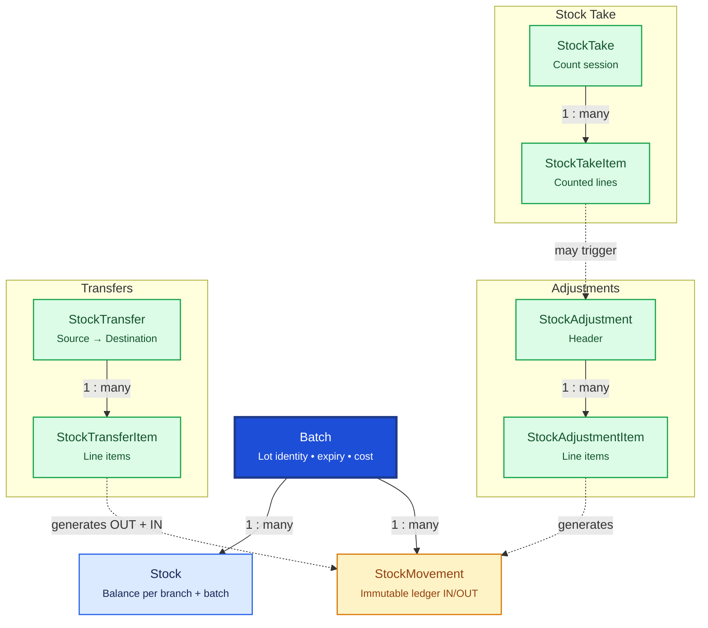

# Inventory

Inventory tracks medicine lots, branch-level stock balances, and every quantity change through an immutable movement ledger. `Batch` is org-global lot identity; `Stock` holds per-branch quantities.

## Relationship Diagram

**Legend:** dashed arrows show business workflows (not direct FKs). `Stock` is unique per `(branchId, batchId)`.

## How the Tables Work Together

- **Batch** stores org-global lot identity: batch number, expiry, purchase rate, statutory MRP — not branch quantities.
- **Stock** holds current quantities for `(branchId, batchId)` — one balance row per branch holding that lot.
- **StockMovement** is the append-only ledger recording every IN/OUT with `balanceAfter` and polymorphic reference.
- **StockAdjustment** + **StockAdjustmentItem** record manual corrections (damage, expiry, theft) with approval workflow.
- **StockTransfer** + **StockTransferItem** move stock between branches (OUT at source, IN at destination).
- **StockTake** + **StockTakeItem** capture physical counts; variances may generate adjustments.
- Stock quantities are never overwritten without a corresponding movement or ledger entry.
- Document numbers (`movementNumber`, `adjustmentNumber`, `transferNumber`) are unique within branch scope.

## Tables

- [[23_batch]] — org-global medicine lot identity.
- [[24_stock]] — per-branch stock balance for a batch.
- [[25_stock_movement]] — immutable inventory ledger.
- [[26_stock_adjustment]] — stock adjustment header.
- [[71_stock-adjustment-item]] — stock adjustment line items.
- [[27_stock_transfer]] — inter-branch transfer header.
- [[72_stock-transfer-item]] — stock transfer line items.
- [[28_stock_take]] — physical stock count session.
- [[29_stock_take_item]] — stock take counted lines.
