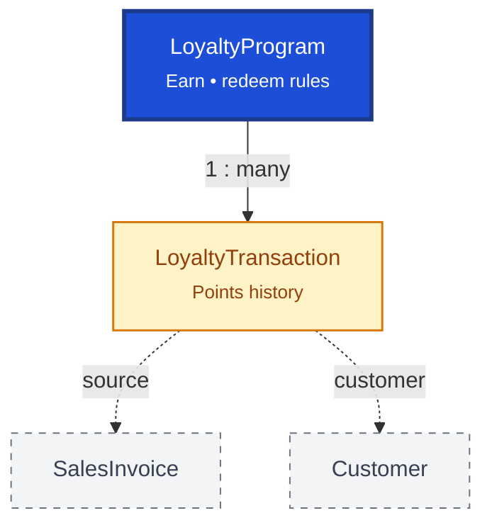

# Loyalty

Loyalty manages customer reward programs. `LoyaltyProgram` defines earning and redemption rules; `LoyaltyTransaction` is the immutable history of points earned, redeemed, or adjusted.

## Relationship Diagram



**Legend:** transactions reference the source sales document and customer for audit trail.

## How the Tables Work Together

- **LoyaltyProgram** configures point earning ratios, redemption rules, validity, and eligible products.
- **LoyaltyTransaction** records every earn, redeem, adjustment, expiry, or promotional bonus.
- Points balance is derived from the transaction history — not stored as a single mutable counter.
- Sales invoices and returns generate loyalty transactions automatically when programs are active.
- Multiple programs can exist for seasonal or targeted campaigns.
- Customer loyalty settings also appear on the `Customer` record (party management).

## Tables

- [loyalty program](#loyaltyprogram) — loyalty program configuration.
- [loyalty transaction](#loyaltytransaction) — loyalty points transaction history.

---

## Table Specifications

## LoyaltyProgram

> Prisma model: `backend/prisma/schema.prisma` (`LoyaltyProgram`)

## Purpose

The LoyaltyProgram table defines customer loyalty schemes offered by the pharmacy.

A Loyalty Program specifies how customers earn and redeem loyalty points based on purchases. Multiple programs may exist simultaneously for different customer groups or promotional campaigns.

Examples include:

- Standard Customer Rewards
- Premium Membership
- Senior Citizen Rewards
- Corporate Employee Program
- Festival Bonus Program

Customer point transactions are recorded separately in the **LoyaltyTransaction** table.

---

## Business Rules

- Every Loyalty Program has a unique program code.
- Only active programs can earn or redeem points.
- A program has an effective start date and optional expiry date.
- Only one default loyalty program may exist.
- Redemption rules must not exceed available customer points.
- Historical programs should never be modified after becoming effective.
- UUID is used for synchronization.
- BIGINT is used as the internal primary key.
- Optimistic locking is maintained using the version column.

---

## Relationships

```
LoyaltyProgram
        │
        └────────< LoyaltyTransaction
                         │
                         ▼
                      Customer
```

---

## Columns

| Category | Column | SQLite | PostgreSQL | Nullable | Description |
|----------|--------|---------|------------|----------|-------------|
| Primary Key | id | INTEGER | BIGINT | No | Auto increment primary key |
| Identifier | uuid | TEXT | UUID | No | Global unique identifier |
| Business | programCode | TEXT | VARCHAR(20) | No | Unique loyalty program code |
| Business | programName | TEXT | VARCHAR(100) | No | Loyalty program name |
| Business | description | TEXT | TEXT | Yes | Program description |
| Business | pointsPerAmount | REAL | NUMERIC(10,2) | No | Points earned per currency amount |
| Business | redemptionValue | REAL | NUMERIC(10,2) | No | Currency value of one point |
| Business | minimumRedemptionPoints | INTEGER | INTEGER | No | Minimum points required for redemption |
| Business | maximumRedemptionPoints | INTEGER | INTEGER | Yes | Maximum points redeemable per invoice |
| Business | effectiveFrom | DATE | DATE | No | Program start date |
| Business | effectiveTo | DATE | DATE | Yes | Program expiry date |
| Status | isDefault | INTEGER | BOOLEAN | No | Default loyalty program |
| Status | isActive | INTEGER | BOOLEAN | No | Active status |
| Audit | createdAt | DATETIME | TIMESTAMP | No | Record creation timestamp |
| Audit | updatedAt | DATETIME | TIMESTAMP | No | Last update timestamp |
| Audit | deletedAt | DATETIME | TIMESTAMP | Yes | Soft delete timestamp |
| Audit | version | INTEGER | INTEGER | No | Optimistic locking version |

---

## Constraints

- Primary Key (id)
- Unique (uuid)
- Unique (programCode)
- Unique (programName)
- CHECK (pointsPerAmount > 0)
- CHECK (redemptionValue >= 0)
- CHECK (minimumRedemptionPoints >= 0)
- CHECK (maximumRedemptionPoints IS NULL OR maximumRedemptionPoints >= minimumRedemptionPoints)
- CHECK (effectiveTo IS NULL OR effectiveTo >= effectiveFrom)
- CHECK (version >= 1)

---

## Indexes

- PK_LoyaltyProgram
- UK_LoyaltyProgram_UUID
- UK_LoyaltyProgram_Code
- UK_LoyaltyProgram_Name
- IDX_LoyaltyProgram_Active
- IDX_LoyaltyProgram_Default
- IDX_LoyaltyProgram_Effective

---

## Sample Records

| id | programCode | programName | pointsPerAmount | redemptionValue | isDefault |
|----|-------------|-------------|----------------:|----------------:|----------|
| 1 | STD | Standard Rewards | 1.00 | 0.25 | Yes |
| 2 | GOLD | Gold Membership | 2.00 | 0.30 | No |
| 3 | SENIOR | Senior Citizen Rewards | 1.50 | 0.30 | No |

---


---

## Notes

- This is the **master table** for customer loyalty schemes.
- Individual earning and redemption events are stored in **LoyaltyTransaction**.
- Customers should normally be enrolled in the default active program unless another program is explicitly assigned.
- The pricing engine should evaluate the active loyalty program during Sales Invoice posting to calculate earned or redeemed points.
- Historical loyalty programs should not be modified once transactions exist; create a new program for revised rules.
- Supports offline-first synchronization using UUID.
- Compatible with both SQLite and PostgreSQL.

---

## LoyaltyTransaction

> Prisma model: `backend/prisma/schema.prisma` (`LoyaltyTransaction`)

## Purpose

The LoyaltyTransaction table records every loyalty point transaction for customers.

It acts as the ledger of the loyalty system, storing all point movements including:

- Points Earned
- Points Redeemed
- Manual Adjustments
- Promotional Bonus Points
- Expired Points
- Reversed Transactions

The customer's current loyalty balance is derived from these transactions rather than being stored directly.

---

## Business Rules

- Every Loyalty Transaction belongs to one Loyalty Program.
- Every Loyalty Transaction belongs to one Customer.
- A transaction may reference one Sales Invoice.
- Earn transactions increase customer points.
- Redeem and Expiry transactions decrease customer points.
- Negative balances are not permitted unless explicitly configured.
- Posted transactions cannot be modified.
- Reversals create opposite transactions instead of updates.
- UUID is used for synchronization.
- BIGINT is used as the internal primary key.
- Optimistic locking is maintained using the version column.

---

## Relationships

```
Customer
     │
     ▼
LoyaltyTransaction
     ▲
     │
LoyaltyProgram
     │
     └────────► SalesInvoice
```

---

## Columns

| Category | Column | SQLite | PostgreSQL | Nullable | Description |
|----------|--------|---------|------------|----------|-------------|
| Primary Key | id | INTEGER | BIGINT | No | Auto increment primary key |
| Identifier | uuid | TEXT | UUID | No | Global unique identifier |
| Foreign Key | loyaltyProgramId | INTEGER | BIGINT | No | References LoyaltyProgram.id |
| Foreign Key | customerId | INTEGER | BIGINT | No | References Customer.id |
| Foreign Key | salesInvoiceId | INTEGER | BIGINT | Yes | References SalesInvoice.id |
| Business | transactionNumber | TEXT | VARCHAR(30) | No | Unique transaction number |
| Business | transactionType | TEXT | VARCHAR(20) | No | EARN, REDEEM, ADJUSTMENT, BONUS, EXPIRY, REVERSAL |
| Business | transactionDate | DATETIME | TIMESTAMP | No | Transaction date |
| Financial | points | INTEGER | INTEGER | No | Points earned or deducted |
| Financial | monetaryValue | REAL | NUMERIC(12,2) | Yes | Monetary equivalent |
| Financial | balanceAfterTransaction | INTEGER | INTEGER | Yes | Running balance after transaction |
| Business | remarks | TEXT | TEXT | Yes | Remarks |
| Status | isPosted | INTEGER | BOOLEAN | No | Posted flag |
| Audit | createdAt | DATETIME | TIMESTAMP | No | Record creation timestamp |
| Audit | updatedAt | DATETIME | TIMESTAMP | No | Last update timestamp |
| Audit | deletedAt | DATETIME | TIMESTAMP | Yes | Soft delete timestamp |
| Audit | version | INTEGER | INTEGER | No | Optimistic locking version |

---

## Constraints

- Primary Key (id)
- Unique (uuid)
- Unique (transactionNumber)
- Foreign Key (loyaltyProgramId → LoyaltyProgram.id)
- Foreign Key (customerId → Customer.id)
- Foreign Key (salesInvoiceId → SalesInvoice.id)
- CHECK (transactionType IN ('EARN','REDEEM','ADJUSTMENT','BONUS','EXPIRY','REVERSAL'))
- CHECK (points <> 0)
- CHECK (version >= 1)

---

## Indexes

- PK_LoyaltyTransaction
- UK_LoyaltyTransaction_UUID
- UK_LoyaltyTransaction_Number
- IDX_LoyaltyTransaction_Customer
- IDX_LoyaltyTransaction_Program
- IDX_LoyaltyTransaction_Invoice
- IDX_LoyaltyTransaction_Date
- IDX_LoyaltyTransaction_Type

---

## Sample Records

| id | customerId | transactionType | points | balanceAfterTransaction |
|----|-----------:|----------------|-------:|------------------------:|
| 1 | 101 | EARN | 25 | 125 |
| 2 | 101 | REDEEM | -50 | 75 |
| 3 | 205 | BONUS | 100 | 100 |

---


---

## Notes

- This table is the **transaction ledger** for the loyalty system.
- Every points movement should be recorded as a separate transaction.
- Customer loyalty balance should be calculated from transactions rather than maintained directly.
- Reversals should create new transactions instead of modifying historical records.
- Loyalty transactions should be generated automatically during Sales Invoice posting and point redemption.
- Supports manual adjustments by authorized users with proper audit logging.
- Historical loyalty transactions should never be deleted.
- Supports offline-first synchronization using UUID.
- Compatible with both SQLite and PostgreSQL.
