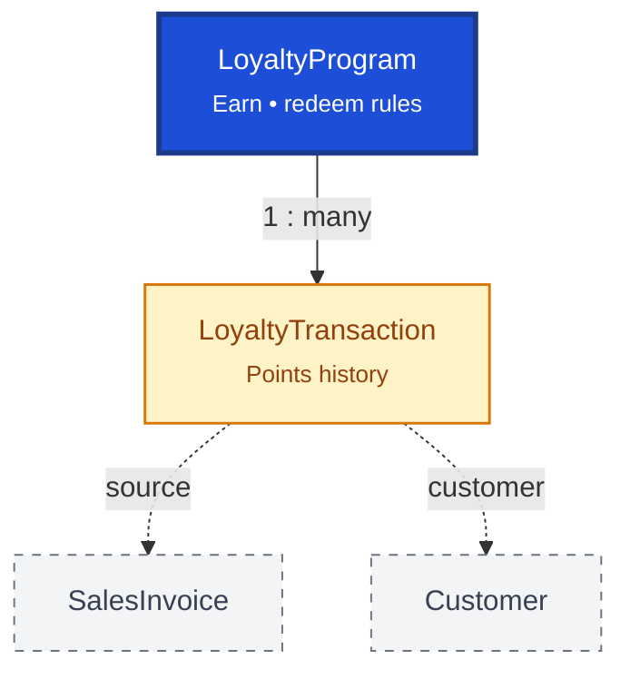

# Loyalty

Loyalty manages customer reward programs. `LoyaltyProgram` defines earning and redemption rules; `LoyaltyTransaction` is the immutable history of points earned, redeemed, or adjusted.

## Relationship Diagram

**Legend:** transactions reference the source sales document and customer for audit trail.

## How the Tables Work Together

- **LoyaltyProgram** configures point earning ratios, redemption rules, validity, and eligible products.
- **LoyaltyTransaction** records every earn, redeem, adjustment, expiry, or promotional bonus.
- Points balance is derived from the transaction history — not stored as a single mutable counter.
- Sales invoices and returns generate loyalty transactions automatically when programs are active.
- Multiple programs can exist for seasonal or targeted campaigns.
- Customer loyalty settings also appear on the `Customer` record (party management).

## Tables

- [[51_loyalty_program]] — loyalty program configuration.
- [[52_loyalty_transaction]] — loyalty points transaction history.
