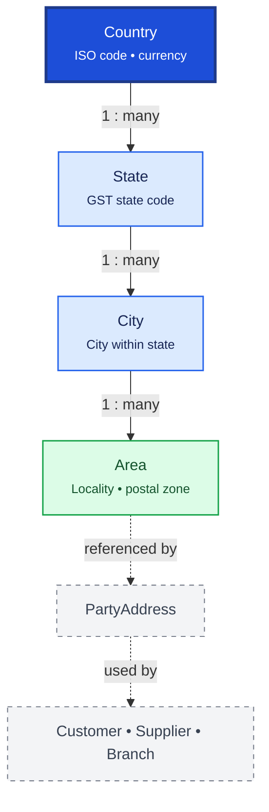

# Lookup / Masters

Lookup / Masters provides hierarchical geographic reference data used across addresses, GST compliance, and reporting. Country → State → City → Area forms a strict parent-child hierarchy.

## Relationship Diagram

**Legend:** addresses store lookup IDs instead of free-text geography for consistency and reporting.

## How the Tables Work Together

- **Country** is the root geographic master with ISO codes and currency metadata.
- **State** belongs to a country and carries GST state codes for Indian tax compliance.
- **City** belongs to a state; used in party addresses, company, and branch records.
- **Area** is a locality or delivery zone within a city, optionally with postal codes.
- Lookup IDs replace repeated free-text in thousands of address records.
- Consistent spelling improves search, GST reporting, and delivery zone management.
- Future lookup tables (Currency, PaymentMethod, DosageForm, etc.) follow the same pattern.

## Tables

- [[67_country]] — country master.
- [[68_state]] — state or province master.
- [[69_city]] — city master.
- [[70_area]] — locality / area master.
