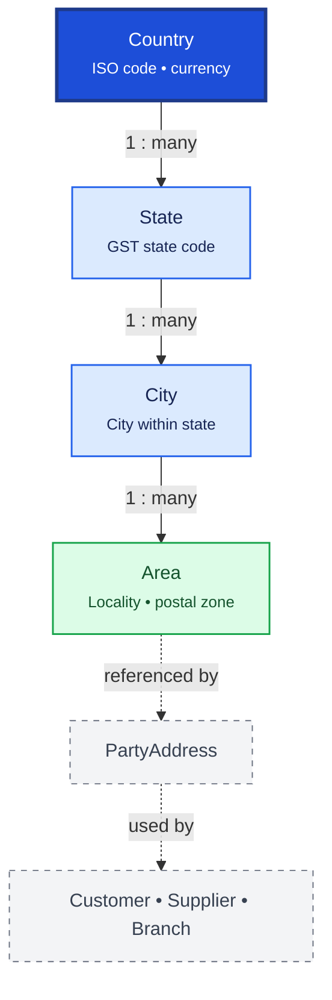

# Lookup / Masters

Lookup / Masters provides hierarchical geographic reference data used across addresses, GST compliance, and reporting. Country → State → City → Area forms a strict parent-child hierarchy.

## Relationship Diagram



**Legend:** addresses store lookup IDs instead of free-text geography for consistency and reporting.

## How the Tables Work Together

- **Country** is the root geographic master with ISO codes and currency metadata.
- **State** belongs to a country and carries GST state codes for Indian tax compliance.
- **City** belongs to a state; used in party addresses, company, and branch records.
- **Area** is a locality or delivery zone within a city, optionally with postal codes.
- Lookup IDs replace repeated free-text in thousands of address records.
- Consistent spelling improves search, GST reporting, and delivery zone management.
- Future lookup tables (Currency, PaymentMethod, DosageForm, etc.) follow the same pattern.

## Tables

- [country](#country) — country master.
- [state](#state) — state or province master.
- [city](#city) — city master.
- [area](#area) — locality / area master.

---

## Table Specifications

## Country

> Prisma model: `backend/prisma/schema.prisma` (`Country`)

## Purpose

The Country table stores the master list of countries used throughout the Pharmacy ERP.

It provides standardized country information for addresses, taxation, reporting, licensing, suppliers, customers, employees, and branches.

The Country table is referenced by State, Company, Branch, PartyAddress, and other address-related entities.

---

## Business Rules

- Every Country has a unique Country Code.
- ISO Alpha-2 and Alpha-3 codes should be unique.
- Country records are reference data and should rarely change.
- Inactive countries cannot be selected for new records.
- Existing transactions referencing inactive countries remain valid.
- UUID is used for synchronization.
- BIGINT is used as the internal primary key.
- Optimistic locking is maintained using the version column.

---

## Relationships

```
Country
    │
    ├────────► State
    ├────────► Company
    ├────────► Branch
    └────────► PartyAddress
```

---

## Columns

| Category | Column | SQLite | PostgreSQL | Nullable | Description |
|----------|--------|---------|------------|----------|-------------|
| Primary Key | id | INTEGER | BIGINT | No | Auto increment primary key |
| Identifier | uuid | TEXT | UUID | No | Global unique identifier |
| Business | countryCode | TEXT | VARCHAR(10) | No | Unique country code |
| Business | isoAlpha2 | TEXT | CHAR(2) | No | ISO 3166-1 Alpha-2 code |
| Business | isoAlpha3 | TEXT | CHAR(3) | No | ISO 3166-1 Alpha-3 code |
| Business | countryName | TEXT | VARCHAR(100) | No | Country name |
| Business | nationality | TEXT | VARCHAR(100) | Yes | Nationality/Demonym |
| Business | phoneCode | TEXT | VARCHAR(10) | Yes | International dialing code |
| Business | currencyCode | TEXT | CHAR(3) | Yes | ISO currency code |
| Business | timezone | TEXT | VARCHAR(100) | Yes | Default timezone |
| Status | isActive | INTEGER | BOOLEAN | No | Active status |
| Audit | createdAt | DATETIME | TIMESTAMP | No | Record creation timestamp |
| Audit | updatedAt | DATETIME | TIMESTAMP | No | Last update timestamp |
| Audit | deletedAt | DATETIME | TIMESTAMP | Yes | Soft delete timestamp |
| Audit | version | INTEGER | INTEGER | No | Optimistic locking version |

---

## Constraints

- Primary Key (id)
- Unique (uuid)
- Unique (countryCode)
- Unique (isoAlpha2)
- Unique (isoAlpha3)
- CHECK (LENGTH(isoAlpha2) = 2)
- CHECK (LENGTH(isoAlpha3) = 3)
- CHECK (version >= 1)

---

## Indexes

- PK_Country
- UK_Country_UUID
- UK_Country_Code
- UK_Country_ISO2
- UK_Country_ISO3
- IDX_Country_Name
- IDX_Country_Active

---

## Sample Records

| id | countryCode | isoAlpha2 | isoAlpha3 | countryName | currencyCode |
|----|-------------|-----------|-----------|-------------|--------------|
| 1 | IN | IN | IND | India | INR |
| 2 | US | US | USA | United States | USD |
| 3 | GB | GB | GBR | United Kingdom | GBP |

---


---

## Notes

- This is a **reference/master table**.
- Country records should normally be loaded from the ISO 3166 standard.
- Country master data is shared across all ERP modules.
- Country records should not be deleted after implementation.
- Changes should be audited using AuditLog and ChangeHistory.
- Supports offline-first synchronization using UUID.
- Compatible with both SQLite and PostgreSQL.

---

## State

> Prisma model: `backend/prisma/schema.prisma` (`State`)

## Purpose

The State table stores the master list of states, provinces, or administrative regions within a Country.

It standardizes geographical information used by Companies, Branches, Customers, Suppliers, Doctors, Employees, and other address-related entities.

The State table acts as the second level of the geographical hierarchy:

Country → State → City → Area

---

## Business Rules

- Every State belongs to exactly one Country.
- State Code must be unique within a Country.
- State Name must be unique within a Country.
- States are reference/master data and rarely change.
- Inactive states cannot be selected for new addresses.
- Existing records referencing inactive states remain valid.
- UUID is used for synchronization.
- BIGINT is used as the internal primary key.
- Optimistic locking is maintained using the version column.

---

## Relationships

```
Country (1)
      │
      └──────< State (Many)
                    │
                    ├────────► City
                    ├────────► Company
                    ├────────► Branch
                    └────────► PartyAddress
```

---

## Columns

| Category | Column | SQLite | PostgreSQL | Nullable | Description |
|----------|--------|---------|------------|----------|-------------|
| Primary Key | id | INTEGER | BIGINT | No | Auto increment primary key |
| Identifier | uuid | TEXT | UUID | No | Global unique identifier |
| Foreign Key | countryId | INTEGER | BIGINT | No | References Country.id |
| Business | stateCode | TEXT | VARCHAR(10) | No | State code |
| Business | stateName | TEXT | VARCHAR(100) | No | State name |
| Business | gstStateCode | TEXT | VARCHAR(5) | Yes | GST State Code (India) |
| Business | isoCode | TEXT | VARCHAR(20) | Yes | ISO 3166-2 code |
| Status | isActive | INTEGER | BOOLEAN | No | Active status |
| Audit | createdAt | DATETIME | TIMESTAMP | No | Record creation timestamp |
| Audit | updatedAt | DATETIME | TIMESTAMP | No | Last update timestamp |
| Audit | deletedAt | DATETIME | TIMESTAMP | Yes | Soft delete timestamp |
| Audit | version | INTEGER | INTEGER | No | Optimistic locking version |

---

## Constraints

- Primary Key (id)
- Unique (uuid)
- Foreign Key (countryId → Country.id)
- Unique (countryId, stateCode)
- Unique (countryId, stateName)
- CHECK (version >= 1)

---

## Indexes

- PK_State
- UK_State_UUID
- UK_State_Code
- UK_State_Name
- IDX_State_Country
- IDX_State_Active

---

## Sample Records

| id | countryId | stateCode | stateName | gstStateCode |
|----|----------:|-----------|-----------|--------------|
| 1 | 1 | MH | Maharashtra | 27 |
| 2 | 1 | GJ | Gujarat | 24 |
| 3 | 1 | KA | Karnataka | 29 |

---


---

## Notes

- This is a **lookup/master table**.
- Each State belongs to exactly one Country.
- For India, GST State Code should be maintained for GST reporting and e-Invoicing.
- State records should normally be imported from official government or ISO sources.
- State master data should not be deleted after implementation.
- Changes should be audited using AuditLog and ChangeHistory.
- Supports offline-first synchronization using UUID.
- Compatible with both SQLite and PostgreSQL.

---

## City

> Prisma model: `backend/prisma/schema.prisma` (`City`)

## Purpose

The City table stores the master list of cities, towns, and municipalities within a State.

It standardizes geographical information used throughout the Pharmacy ERP for Companies, Branches, Customers, Suppliers, Doctors, Employees, and all address-related entities.

The City table represents the third level of the geographical hierarchy:

Country → State → City → Area

---

## Business Rules

- Every City belongs to exactly one State.
- City Code must be unique within a State.
- City Name must be unique within a State.
- Cities are lookup/master data and should rarely change.
- Inactive cities cannot be selected for new addresses.
- Existing business records referencing inactive cities remain valid.
- UUID is used for synchronization.
- BIGINT is used as the internal primary key.
- Optimistic locking is maintained using the version column.

---

## Relationships

```
Country
    │
    ▼
State (1)
    │
    └──────< City (Many)
                   │
                   ├────────► Area
                   ├────────► Company
                   ├────────► Branch
                   └────────► PartyAddress
```

---

## Columns

| Category | Column | SQLite | PostgreSQL | Nullable | Description |
|----------|--------|---------|------------|----------|-------------|
| Primary Key | id | INTEGER | BIGINT | No | Auto increment primary key |
| Identifier | uuid | TEXT | UUID | No | Global unique identifier |
| Foreign Key | stateId | INTEGER | BIGINT | No | References State.id |
| Business | cityCode | TEXT | VARCHAR(20) | No | Unique city code within the state |
| Business | cityName | TEXT | VARCHAR(100) | No | City name |
| Business | district | TEXT | VARCHAR(100) | Yes | Administrative district |
| Business | postalRegion | TEXT | VARCHAR(50) | Yes | Postal region/zone |
| Business | latitude | REAL | DOUBLE PRECISION | Yes | Latitude coordinate |
| Business | longitude | REAL | DOUBLE PRECISION | Yes | Longitude coordinate |
| Status | isActive | INTEGER | BOOLEAN | No | Active status |
| Audit | createdAt | DATETIME | TIMESTAMP | No | Record creation timestamp |
| Audit | updatedAt | DATETIME | TIMESTAMP | No | Last update timestamp |
| Audit | deletedAt | DATETIME | TIMESTAMP | Yes | Soft delete timestamp |
| Audit | version | INTEGER | INTEGER | No | Optimistic locking version |

---

## Constraints

- Primary Key (id)
- Unique (uuid)
- Foreign Key (stateId → State.id)
- Unique (stateId, cityCode)
- Unique (stateId, cityName)
- CHECK (version >= 1)

---

## Indexes

- PK_City
- UK_City_UUID
- UK_City_State_Code
- UK_City_State_Name
- IDX_City_State
- IDX_City_District
- IDX_City_Active

---

## Sample Records

| id | stateId | cityCode | cityName | district |
|----|--------:|----------|----------|----------|
| 1 | 1 | PUNE | Pune | Pune |
| 2 | 1 | MUM | Mumbai | Mumbai |
| 3 | 2 | AHD | Ahmedabad | Ahmedabad |

---


---

## Notes

- This is a **lookup/master table**.
- Every City belongs to one State.
- Geographic coordinates are optional but useful for delivery planning, GIS integration, and branch location mapping.
- City master data should normally be imported from official government datasets.
- City records should not be deleted after implementation.
- Changes should be audited using AuditLog and ChangeHistory.
- Supports offline-first synchronization using UUID.
- Compatible with both SQLite and PostgreSQL.

---

## Area

> Prisma model: `backend/prisma/schema.prisma` (`Area`)

## Purpose

The Area table stores localities, suburbs, villages, sectors, or neighborhoods within a City.

It provides the lowest level of geographical master data used throughout the Pharmacy ERP for address management, delivery routing, customer segmentation, taxation, and logistics.

The Area table completes the geographical hierarchy:

Country → State → City → Area

---

## Business Rules

- Every Area belongs to exactly one City.
- Area Code must be unique within a City.
- Area Name must be unique within a City.
- Areas are lookup/master data and rarely change.
- Inactive Areas cannot be selected for new addresses.
- Existing business records referencing inactive Areas remain valid.
- UUID is used for synchronization.
- BIGINT is used as the internal primary key.
- Optimistic locking is maintained using the version column.

---

## Relationships

```
Country
    │
    ▼
State
    │
    ▼
City (1)
    │
    └──────< Area (Many)
                   │
                   ├────────► Company
                   ├────────► Branch
                   ├────────► PartyAddress
                   ├────────► Customer
                   ├────────► Supplier
                   └────────► Delivery Address
```

---

## Columns

| Category | Column | SQLite | PostgreSQL | Nullable | Description |
|----------|--------|---------|------------|----------|-------------|
| Primary Key | id | INTEGER | BIGINT | No | Auto increment primary key |
| Identifier | uuid | TEXT | UUID | No | Global unique identifier |
| Foreign Key | cityId | INTEGER | BIGINT | No | References City.id |
| Business | areaCode | TEXT | VARCHAR(20) | No | Unique area code within the city |
| Business | areaName | TEXT | VARCHAR(150) | No | Area/locality name |
| Business | postalCode | TEXT | VARCHAR(10) | Yes | PIN/ZIP code |
| Business | deliveryZone | TEXT | VARCHAR(50) | Yes | Delivery zone identifier |
| Business | routeCode | TEXT | VARCHAR(30) | Yes | Delivery route code |
| Business | latitude | REAL | DOUBLE PRECISION | Yes | Latitude coordinate |
| Business | longitude | REAL | DOUBLE PRECISION | Yes | Longitude coordinate |
| Status | isActive | INTEGER | BOOLEAN | No | Active status |
| Audit | createdAt | DATETIME | TIMESTAMP | No | Record creation timestamp |
| Audit | updatedAt | DATETIME | TIMESTAMP | No | Last update timestamp |
| Audit | deletedAt | DATETIME | TIMESTAMP | Yes | Soft delete timestamp |
| Audit | version | INTEGER | INTEGER | No | Optimistic locking version |

---

## Constraints

- Primary Key (id)
- Unique (uuid)
- Foreign Key (cityId → City.id)
- Unique (cityId, areaCode)
- Unique (cityId, areaName)
- CHECK (version >= 1)

---

## Indexes

- PK_Area
- UK_Area_UUID
- UK_Area_City_Code
- UK_Area_City_Name
- IDX_Area_City
- IDX_Area_PostalCode
- IDX_Area_DeliveryZone
- IDX_Area_Active

---

## Sample Records

| id | cityId | areaCode | areaName | postalCode |
|----|-------:|----------|----------|------------|
| 1 | 1 | KOTHRUD | Kothrud | 411038 |
| 2 | 1 | BANER | Baner | 411045 |
| 3 | 2 | ANDHERI | Andheri West | 400058 |

---


---

## Notes

- This is the **lowest-level geographical lookup table**.
- Every Area belongs to exactly one City.
- PIN/ZIP codes may span multiple Areas; therefore, postalCode should not be unique.
- Delivery zones and route codes can be used for home delivery optimization.
- Area master data should not be deleted after implementation.
- Changes should be tracked through AuditLog and ChangeHistory.
- Supports offline-first synchronization using UUID.
- Compatible with both SQLite and PostgreSQL.
