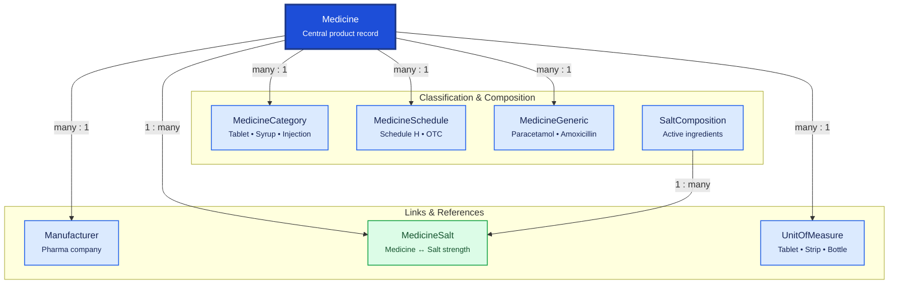

# Medicine Master

Medicine Master is the product catalog for the pharmacy. `Medicine` is the central record; related tables classify medicines, define compositions, link manufacturers, and standardize units of measure.

## Relationship Diagram



**Legend:** `Medicine` is org-global master data referenced by inventory batches, purchase, sales, and prescriptions.

## How the Tables Work Together

- **Medicine** is the central product record — name, barcode, HSN, storage rules, prescription flags.
- **MedicineGeneric** groups branded medicines under a common generic (e.g. Crocin and Dolo under Paracetamol).
- **MedicineCategory** classifies dosage form or product type (Tablet, Syrup, Surgical Item).
- **MedicineSchedule** stores regulatory schedule (Schedule H, H1, X, OTC) for compliance rules.
- **Manufacturer** links to `Party` (party management) for pharma company identity.
- **SaltComposition** is the master list of active pharmaceutical ingredients.
- **MedicineSalt** is the junction defining which salts and strengths a medicine contains.
- **UnitOfMeasure** standardizes quantity units used across inventory, purchase, and sales.
- Sale pricing lives in `PriceListItem` (pricing), not on Medicine.
- All syncable masters use UUID, soft delete, and `version` for optimistic locking.

## Tables

- [medicine](#medicine) — central medicine master record.
- [medicine generic](#medicinegeneric) — generic medicine grouping.
- [medicine category](#medicinecategory) — medicine classification.
- [medicine schedule](#medicineschedule) — regulatory drug schedule.
- [manufacturer](#manufacturer) — medicine manufacturer (links to Party).
- [salt composition](#saltcomposition) — active ingredient master.
- [medicine salt](#medicinesalt) — medicine-to-salt composition junction.
- [unit of measure](#unitofmeasure) — standard units of measure.

---

## Table Specifications

## Medicine

> Prisma model: `backend/prisma/schema.prisma` (`Medicine`)

## Purpose

The Medicine table stores the master information for all medicines sold, purchased, and stocked in the Pharmacy ERP.

This table contains the product identity and business attributes, while inventory, pricing, taxation, and batches are maintained in their respective modules.

A Medicine can have multiple batches, prices, and stock records.

---

## Business Rules

- Every medicine must have a unique Medicine Code.
- Medicine Name should be unique within a manufacturer.
- Every medicine belongs to one Category.
- Every medicine belongs to one Manufacturer.
- Every medicine has one primary Unit of Measure.
- Every medicine may contain multiple salts through the MedicineSalt table.
- Schedule drugs should reference MedicineSchedule.
- Medicine can be discontinued without deleting the record.
- Soft delete should be used.
- UUID is used for synchronization.
- BIGINT is used as the internal primary key.
- Optimistic locking is maintained using the version column.

---

## Relationships

```
Manufacturer (1)
      │
      ▼
 Medicine
      │
      ├──────────────► MedicineCategory
      ├──────────────► MedicineSchedule
      ├──────────────► UnitOfMeasure
      │
      ├──────< MedicineSalt >────── MedicineGeneric
      │
      ├──────< Batch
      ├──────< Stock
      ├──────< PurchaseInvoiceItem
      ├──────< SalesInvoiceItem
      └──────< PriceListItem
```

---

## Columns

| Category | Column | SQLite | PostgreSQL | Nullable | Description |
|----------|--------|---------|------------|----------|-------------|
| Primary Key | id | INTEGER | BIGINT | No | Auto increment primary key |
| Identifier | uuid | TEXT | UUID | No | Global unique identifier |
| Business | medicineCode | TEXT | VARCHAR(30) | No | Unique medicine code |
| Business | medicineName | TEXT | VARCHAR(200) | No | Medicine name |
| Foreign Key | manufacturerId | INTEGER | BIGINT | No | References Manufacturer.id |
| Foreign Key | categoryId | INTEGER | BIGINT | No | References MedicineCategory.id |
| Foreign Key | scheduleId | INTEGER | BIGINT | Yes | References MedicineSchedule.id |
| Foreign Key | unitId | INTEGER | BIGINT | No | References UnitOfMeasure.id |
| Product | brandName | TEXT | VARCHAR(150) | Yes | Brand name |
| Product | strength | TEXT | VARCHAR(50) | Yes | 500 mg, 250 mg, etc. |
| Product | dosageForm | TEXT | VARCHAR(50) | No | Tablet, Capsule, Syrup, Injection |
| Product | packSize | TEXT | VARCHAR(50) | Yes | 10 Tablets, 100 ml, etc. |
| Product | hsnCode | TEXT | VARCHAR(20) | Yes | GST HSN Code |
| Product | barcode | TEXT | VARCHAR(50) | Yes | Product barcode |
| Product | requiresPrescription | INTEGER | BOOLEAN | No | Prescription required |
| Product | narcoticDrug | INTEGER | BOOLEAN | No | Narcotic medicine |
| Product | refrigerated | INTEGER | BOOLEAN | No | Cold storage required |
| Status | discontinued | INTEGER | BOOLEAN | No | Product discontinued |
| Status | isActive | INTEGER | BOOLEAN | No | Active medicine |
| Audit | createdAt | DATETIME | TIMESTAMP | No | Record creation timestamp |
| Audit | updatedAt | DATETIME | TIMESTAMP | No | Last update timestamp |
| Audit | deletedAt | DATETIME | TIMESTAMP | Yes | Soft delete timestamp |
| Audit | version | INTEGER | INTEGER | No | Optimistic locking version |

---

## Constraints

- Primary Key (id)
- Unique (uuid)
- Unique (medicineCode)
- Foreign Key (manufacturerId → Manufacturer.id)
- Foreign Key (categoryId → MedicineCategory.id)
- Foreign Key (scheduleId → MedicineSchedule.id)
- Foreign Key (unitId → UnitOfMeasure.id)
- CHECK version >= 1

---

## Indexes

- PK_Medicine (id)
- UK_Medicine_UUID
- UK_Medicine_Code
- IDX_Medicine_Name
- IDX_Medicine_Manufacturer
- IDX_Medicine_Category
- IDX_Medicine_Barcode
- IDX_Medicine_Active

---

## Sample Records

| id | medicineCode | medicineName | dosageForm | strength | manufacturerId |
|----|--------------|--------------|------------|----------|----------------|
| 1 | MED000001 | Crocin 500 | Tablet | 500 mg | 1 |
| 2 | MED000002 | Augmentin 625 | Tablet | 625 mg | 3 |
| 3 | MED000003 | Benadryl | Syrup | 100 ml | 5 |

---


---

## Notes

- This is the central master table for all pharmaceutical products.
- Chemical composition should **not** be stored here; use **MedicineSalt** to support combination medicines.
- Inventory quantities are maintained in **Stock**.
- Batch-specific information (MRP, expiry date, manufacturing date, purchase rate, sale rate) belongs in the **Batch** table.
- Pricing rules belong in **PriceListItem**.
- Tax information should be maintained in the **Tax** module.
- Supports offline-first synchronization using UUID.
- Compatible with both SQLite and PostgreSQL.

---

## MedicineGeneric

> Prisma model: `backend/prisma/schema.prisma` (`MedicineGeneric`)

## Purpose

The MedicineGeneric table stores the generic (scientific) names of medicines.

A generic medicine represents the active pharmaceutical ingredient (API) independent of any manufacturer or brand. Multiple branded medicines may share the same generic.

Examples:

- Paracetamol
- Amoxicillin
- Cetirizine
- Pantoprazole

Combination medicines are handled through the MedicineSalt table.

---

## Business Rules

- Every generic medicine must have a unique Generic Code.
- Generic Name must be unique.
- A generic medicine can be associated with multiple branded medicines.
- Generic information should not contain manufacturer-specific details.
- Generic medicines may have one or more salts through MedicineSalt.
- Soft delete should be used.
- UUID is used for synchronization.
- BIGINT is used as the internal primary key.
- Optimistic locking is maintained using the version column.

---

## Relationships

```
MedicineGeneric (1)
        │
        └──────< MedicineSalt >────── Medicine
```

---

## Columns

| Category | Column | SQLite | PostgreSQL | Nullable | Description |
|----------|--------|---------|------------|----------|-------------|
| Primary Key | id | INTEGER | BIGINT | No | Auto increment primary key |
| Identifier | uuid | TEXT | UUID | No | Global unique identifier |
| Business | genericCode | TEXT | VARCHAR(30) | No | Unique generic code |
| Business | genericName | TEXT | VARCHAR(150) | No | Scientific/generic medicine name |
| Medical | therapeuticClass | TEXT | VARCHAR(100) | Yes | Therapeutic class |
| Medical | pharmacologicalClass | TEXT | VARCHAR(100) | Yes | Pharmacological classification |
| Medical | description | TEXT | TEXT | Yes | Additional information |
| Status | isActive | INTEGER | BOOLEAN | No | Active generic |
| Audit | createdAt | DATETIME | TIMESTAMP | No | Record creation timestamp |
| Audit | updatedAt | DATETIME | TIMESTAMP | No | Last update timestamp |
| Audit | deletedAt | DATETIME | TIMESTAMP | Yes | Soft delete timestamp |
| Audit | version | INTEGER | INTEGER | No | Optimistic locking version |

---

## Constraints

- Primary Key (id)
- Unique (uuid)
- Unique (genericCode)
- Unique (genericName)
- CHECK version >= 1

---

## Indexes

- PK_MedicineGeneric (id)
- UK_MedicineGeneric_UUID
- UK_MedicineGeneric_Code
- UK_MedicineGeneric_Name
- IDX_MedicineGeneric_TherapeuticClass
- IDX_MedicineGeneric_Active

---

## Sample Records

| id | genericCode | genericName | therapeuticClass |
|----|-------------|-------------|------------------|
| 1 | GEN00001 | Paracetamol | Analgesic |
| 2 | GEN00002 | Amoxicillin | Antibiotic |
| 3 | GEN00003 | Pantoprazole | Proton Pump Inhibitor |

---


---

## Notes

- Stores generic medicine information independent of manufacturers.
- Multiple branded medicines can reference the same generic through MedicineSalt.
- Manufacturer-specific information belongs in the Medicine table.
- Batch, pricing, and stock information should never be stored here.
- Supports offline-first synchronization using UUID.
- Compatible with both SQLite and PostgreSQL.

---

## MedicineCategory

> Prisma model: `backend/prisma/schema.prisma` (`MedicineCategory`)

## Purpose

The MedicineCategory table classifies medicines into logical business groups for inventory management, reporting, pricing, taxation, and user navigation.

Categories help pharmacists and store managers organize medicines efficiently and generate meaningful reports.

Examples:

- Antibiotics
- Analgesics
- Antipyretics
- Vitamins
- Syrups
- Injections
- Surgical Items
- Ayurvedic Medicines

---

## Business Rules

- Every category must have a unique Category Code.
- Category Name must be unique.
- Categories may have a parent category to support hierarchical classification.
- A medicine belongs to exactly one category.
- Categories can be disabled without deleting them.
- Parent categories cannot create circular references.
- Soft delete should be used.
- UUID is used for synchronization.
- BIGINT is used as the internal primary key.
- Optimistic locking is maintained using the version column.

---

## Relationships

```
MedicineCategory
       │
       ├──────< Child Categories
       │
       └──────< Medicine
```

---

## Columns

| Category | Column | SQLite | PostgreSQL | Nullable | Description |
|----------|--------|---------|------------|----------|-------------|
| Primary Key | id | INTEGER | BIGINT | No | Auto increment primary key |
| Identifier | uuid | TEXT | UUID | No | Global unique identifier |
| Foreign Key | parentCategoryId | INTEGER | BIGINT | Yes | References parent category |
| Business | categoryCode | TEXT | VARCHAR(30) | No | Unique category code |
| Business | categoryName | TEXT | VARCHAR(100) | No | Category name |
| Business | description | TEXT | TEXT | Yes | Category description |
| Display | displayOrder | INTEGER | INTEGER | No | Display order |
| Status | isActive | INTEGER | BOOLEAN | No | Active category |
| Audit | createdAt | DATETIME | TIMESTAMP | No | Record creation timestamp |
| Audit | updatedAt | DATETIME | TIMESTAMP | No | Last update timestamp |
| Audit | deletedAt | DATETIME | TIMESTAMP | Yes | Soft delete timestamp |
| Audit | version | INTEGER | INTEGER | No | Optimistic locking version |

---

## Constraints

- Primary Key (id)
- Foreign Key (parentCategoryId → MedicineCategory.id)
- Unique (uuid)
- Unique (categoryCode)
- Unique (categoryName)
- CHECK displayOrder >= 0
- CHECK version >= 1
- CHECK parentCategoryId <> id

---

## Indexes

- PK_MedicineCategory (id)
- UK_MedicineCategory_UUID
- UK_MedicineCategory_Code
- UK_MedicineCategory_Name
- IDX_MedicineCategory_Parent
- IDX_MedicineCategory_DisplayOrder
- IDX_MedicineCategory_Active

---

## Sample Records

| id | categoryCode | categoryName | parentCategoryId |
|----|--------------|--------------|------------------|
| 1 | CAT001 | Tablets | NULL |
| 2 | CAT002 | Antibiotics | 1 |
| 3 | CAT003 | Pain Killers | 1 |
| 4 | CAT004 | Syrups | NULL |

---


---

## Notes

- Supports unlimited category hierarchy using self-referencing relationships.
- Categories are intended for business classification and reporting, not pharmaceutical composition.
- Every medicine should belong to one category.
- Categories should remain stable over time to preserve reporting consistency.
- Parent categories should never be deleted while child categories exist.
- Supports offline-first synchronization using UUID.
- Compatible with both SQLite and PostgreSQL.

---

## MedicineSchedule

> Prisma model: `backend/prisma/schema.prisma` (`MedicineSchedule`)

## Purpose

The MedicineSchedule table defines the regulatory schedule classification of medicines as per applicable drug regulations.

It is used to determine whether a medicine requires a prescription, special storage, restricted sale, or additional compliance during dispensing.

Examples (India):

- Schedule H
- Schedule H1
- Schedule X
- OTC (Over-the-Counter)

---

## Business Rules

- Every schedule must have a unique Schedule Code.
- Schedule Name must be unique.
- A schedule can be assigned to multiple medicines.
- A medicine can belong to only one schedule.
- Schedule definitions should be maintained by administrators only.
- System schedules should not be deleted.
- Soft delete should be used.
- UUID is used for synchronization.
- BIGINT is used as the internal primary key.
- Optimistic locking is maintained using the version column.

---

## Relationships

```
MedicineSchedule (1)
        │
        └──────< Medicine (Many)
```

---

## Columns

| Category | Column | SQLite | PostgreSQL | Nullable | Description |
|----------|--------|---------|------------|----------|-------------|
| Primary Key | id | INTEGER | BIGINT | No | Auto increment primary key |
| Identifier | uuid | TEXT | UUID | No | Global unique identifier |
| Business | scheduleCode | TEXT | VARCHAR(20) | No | Schedule code (H, H1, X, OTC) |
| Business | scheduleName | TEXT | VARCHAR(100) | No | Display name |
| Business | description | TEXT | TEXT | Yes | Regulatory description |
| Compliance | requiresPrescription | INTEGER | BOOLEAN | No | Prescription mandatory |
| Compliance | requiresDoctorDetails | INTEGER | BOOLEAN | No | Doctor details mandatory |
| Compliance | maintainSalesRegister | INTEGER | BOOLEAN | No | Maintain statutory sales register |
| Compliance | controlledSubstance | INTEGER | BOOLEAN | No | Controlled medicine |
| Status | isSystemSchedule | INTEGER | BOOLEAN | No | Built-in schedule |
| Status | isActive | INTEGER | BOOLEAN | No | Active schedule |
| Audit | createdAt | DATETIME | TIMESTAMP | No | Record creation timestamp |
| Audit | updatedAt | DATETIME | TIMESTAMP | No | Last update timestamp |
| Audit | deletedAt | DATETIME | TIMESTAMP | Yes | Soft delete timestamp |
| Audit | version | INTEGER | INTEGER | No | Optimistic locking version |

---

## Constraints

- Primary Key (id)
- Unique (uuid)
- Unique (scheduleCode)
- Unique (scheduleName)
- CHECK version >= 1

---

## Indexes

- PK_MedicineSchedule (id)
- UK_MedicineSchedule_UUID
- UK_MedicineSchedule_Code
- UK_MedicineSchedule_Name
- IDX_MedicineSchedule_Prescription
- IDX_MedicineSchedule_Active

---

## Sample Records

| id | scheduleCode | scheduleName | requiresPrescription | controlledSubstance |
|----|--------------|--------------|-----------------------|---------------------|
| 1 | OTC | Over The Counter | No | No |
| 2 | H | Schedule H | Yes | No |
| 3 | H1 | Schedule H1 | Yes | No |
| 4 | X | Schedule X | Yes | Yes |

---


---

## Notes

- Defines regulatory classifications for medicines.
- Business logic for prescription validation should reference this table rather than hardcoding schedule names.
- System-defined schedules (OTC, H, H1, X) should be seeded during application installation.
- Regulatory requirements may differ by country; therefore, schedule definitions should remain configurable where possible.
- Supports offline-first synchronization using UUID.
- Compatible with both SQLite and PostgreSQL.

---

## Manufacturer

> Prisma model: `backend/prisma/schema.prisma` (`Manufacturer`)

## Purpose

The Manufacturer table stores information about companies that manufacture medicines, medical devices, and healthcare products.

A manufacturer represents the original producer of a medicine and is different from a supplier or distributor. A supplier may distribute products from multiple manufacturers.

General company information (name, address, contacts) is maintained in the Party module. This table stores manufacturer-specific business information.

---

## Business Rules

- Every Manufacturer must reference exactly one Party.
- A Party can have at most one Manufacturer record.
- Manufacturer Code must be unique.
- Manufacturing License Number should be unique when provided.
- GSTIN should be unique when provided.
- A Manufacturer can produce multiple medicines.
- Manufacturers can be marked inactive instead of deleting them.
- Soft delete should be used.
- UUID is used for synchronization.
- BIGINT is used as the internal primary key.
- Optimistic locking is maintained using the version column.

---

## Relationships

```
Party (1)
    │
    └────── Manufacturer (1)
                  │
                  └──────< Medicine (Many)
```

---

## Columns

| Category | Column | SQLite | PostgreSQL | Nullable | Description |
|----------|--------|---------|------------|----------|-------------|
| Primary Key | id | INTEGER | BIGINT | No | Auto increment primary key |
| Foreign Key | partyId | INTEGER | BIGINT | No | References Party.id |
| Identifier | uuid | TEXT | UUID | No | Global unique identifier |
| Business | manufacturerCode | TEXT | VARCHAR(30) | No | Unique manufacturer code |
| Business | manufacturingLicenseNo | TEXT | VARCHAR(50) | Yes | Drug manufacturing license |
| Business | gstin | TEXT | VARCHAR(20) | Yes | GST Identification Number |
| Business | website | TEXT | VARCHAR(255) | Yes | Official website |
| Business | email | TEXT | VARCHAR(150) | Yes | Official email |
| Business | supportPhone | TEXT | VARCHAR(30) | Yes | Customer support number |
| Status | isPreferred | INTEGER | BOOLEAN | No | Preferred manufacturer |
| Status | isActive | INTEGER | BOOLEAN | No | Active manufacturer |
| Audit | createdAt | DATETIME | TIMESTAMP | No | Record creation timestamp |
| Audit | updatedAt | DATETIME | TIMESTAMP | No | Last update timestamp |
| Audit | deletedAt | DATETIME | TIMESTAMP | Yes | Soft delete timestamp |
| Audit | version | INTEGER | INTEGER | No | Optimistic locking version |

---

## Constraints

- Primary Key (id)
- Foreign Key (partyId → Party.id)
- Unique (uuid)
- Unique (partyId)
- Unique (manufacturerCode)
- Unique (manufacturingLicenseNo)
- Unique (gstin)

---

## Indexes

- PK_Manufacturer (id)
- UK_Manufacturer_UUID
- UK_Manufacturer_Code
- UK_Manufacturer_Party
- UK_Manufacturer_License
- IDX_Manufacturer_GSTIN
- IDX_Manufacturer_Preferred
- IDX_Manufacturer_Active

---

## Sample Records

| id | partyId | manufacturerCode | manufacturingLicenseNo | gstin | isPreferred |
|----|---------|------------------|-------------------------|-------|-------------|
| 1 | 100 | MFG00001 | MH-MFG-123456 | 27ABCDE1234F1Z5 | Yes |
| 2 | 101 | MFG00002 | GJ-MFG-998877 | 24PQRSX9876L1Z2 | No |
| 3 | 102 | MFG00003 | DL-MFG-456789 | NULL | No |

---


---

## Notes

- Stores only manufacturer-specific business information.
- Company name, address, and contact details belong in the Party, PartyAddress, and PartyContact tables.
- A manufacturer is different from a supplier; one supplier may distribute products from multiple manufacturers.
- Medicines should always reference Manufacturer rather than Party directly.
- Manufacturing License Number should comply with local regulatory requirements.
- Supports offline-first synchronization using UUID.
- Compatible with both SQLite and PostgreSQL.

---

## SaltComposition

> Prisma model: `backend/prisma/schema.prisma` (`SaltComposition`)

## Purpose

The SaltComposition table defines the composition details of pharmaceutical salts used in medicines.

It stores standardized information about the strength, unit of measure, and composition characteristics of active pharmaceutical ingredients (APIs). This table is referenced by the MedicineSalt table to support both single-salt and combination medicines.

Examples:

- Paracetamol 500 mg
- Amoxicillin 500 mg
- Clavulanic Acid 125 mg
- Cetirizine 10 mg

---

## Business Rules

- Every Salt Composition must have a unique Composition Code.
- Every composition references one Generic Medicine.
- The same Generic + Strength + Unit combination cannot be duplicated.
- Composition information should be standardized and reusable.
- Combination medicines are created by associating multiple SaltComposition records through MedicineSalt.
- Soft delete should be used.
- UUID is used for synchronization.
- BIGINT is used as the internal primary key.
- Optimistic locking is maintained using the version column.

---

## Relationships

```
MedicineGeneric (1)
        │
        └──────< SaltComposition (Many)
                        │
                        └──────< MedicineSalt (Many)
```

---

## Columns

| Category | Column | SQLite | PostgreSQL | Nullable | Description |
|----------|--------|---------|------------|----------|-------------|
| Primary Key | id | INTEGER | BIGINT | No | Auto increment primary key |
| Foreign Key | genericId | INTEGER | BIGINT | No | References MedicineGeneric.id |
| Foreign Key | unitId | INTEGER | BIGINT | No | References UnitOfMeasure.id |
| Identifier | uuid | TEXT | UUID | No | Global unique identifier |
| Business | compositionCode | TEXT | VARCHAR(30) | No | Unique composition code |
| Medical | strength | REAL | NUMERIC(10,3) | No | Salt strength |
| Medical | strengthUnit | TEXT | VARCHAR(20) | No | mg, mcg, g, ml, IU |
| Medical | description | TEXT | TEXT | Yes | Additional composition details |
| Status | isActive | INTEGER | BOOLEAN | No | Active composition |
| Audit | createdAt | DATETIME | TIMESTAMP | No | Record creation timestamp |
| Audit | updatedAt | DATETIME | TIMESTAMP | No | Last update timestamp |
| Audit | deletedAt | DATETIME | TIMESTAMP | Yes | Soft delete timestamp |
| Audit | version | INTEGER | INTEGER | No | Optimistic locking version |

---

## Constraints

- Primary Key (id)
- Foreign Key (genericId → MedicineGeneric.id)
- Foreign Key (unitId → UnitOfMeasure.id)
- Unique (uuid)
- Unique (genericId, strength, strengthUnit)
- Unique (compositionCode)
- CHECK strength > 0
- CHECK version >= 1

---

## Indexes

- PK_SaltComposition (id)
- UK_SaltComposition_UUID
- UK_SaltComposition_Code
- UK_SaltComposition_Generic_Strength
- IDX_SaltComposition_Generic
- IDX_SaltComposition_Unit
- IDX_SaltComposition_Active

---

## Sample Records

| id | genericId | strength | strengthUnit | compositionCode |
|----|-----------|----------|--------------|-----------------|
| 1 | 1 | 500 | mg | COMP00001 |
| 2 | 2 | 500 | mg | COMP00002 |
| 3 | 3 | 125 | mg | COMP00003 |

---


---

## Notes

- Standardizes pharmaceutical salt strengths across the ERP.
- Eliminates duplication of identical salt-strength combinations.
- Supports single-ingredient and multi-ingredient medicines.
- Medicines should reference compositions through the MedicineSalt table rather than storing strength directly.
- Supports offline-first synchronization using UUID.
- Compatible with both SQLite and PostgreSQL.

---

## MedicineSalt

> Prisma model: `backend/prisma/schema.prisma` (`MedicineSalt`)

## Purpose

Maps Medicines to one or more Salt Compositions.

Supports combination medicines by allowing multiple active ingredients.

## Business Rules

- One Medicine can have multiple salts.
- Sequence determines display order.
- Strength percentage is optional.
- Combination must be unique.

## Relationships

Medicine (1)
│
└──────< MedicineSalt >────── SaltComposition (1)

## Columns

| Category | Column | SQLite | PostgreSQL | Nullable | Description |
|----------|--------|---------|------------|----------|-------------|
| PK | id | INTEGER | BIGINT | No | Primary Key |
| FK | medicineId | INTEGER | BIGINT | No | Medicine |
| FK | saltCompositionId | INTEGER | BIGINT | No | Salt Composition |
| Business | sequenceNo | INTEGER | INTEGER | No | Display sequence |
| Business | percentage | REAL | NUMERIC(5,2) | Yes | Percentage composition |
| Audit | createdAt | DATETIME | TIMESTAMP | No | Created time |
| Audit | updatedAt | DATETIME | TIMESTAMP | No | Updated time |
| Audit | deletedAt | DATETIME | TIMESTAMP | Yes | Soft delete |
| Audit | version | INTEGER | INTEGER | No | Version |

## Constraints

- Unique (medicineId, saltCompositionId)

## Indexes

- IDX_MedicineSalt_Medicine
- IDX_MedicineSalt_Salt

## Sample Records

Paracetamol 500 mg

Amoxicillin 500 mg

Clavulanic Acid 125 mg


## Notes

Supports single-salt and combination medicines.

---

## UnitOfMeasure

> Prisma model: `backend/prisma/schema.prisma` (`UnitOfMeasure`)

## Purpose

The UnitOfMeasure table defines the standard units used throughout the Pharmacy ERP for medicines, inventory, purchasing, sales, and stock management.

It provides a centralized master for measurement units, ensuring consistency across all modules.

Examples:

- Tablet
- Capsule
- Bottle
- Strip
- Box
- Vial
- Ampoule
- ml
- mg
- g
- kg
- Piece

---

## Business Rules

- Every Unit of Measure (UOM) must have a unique Unit Code.
- Unit Name must be unique.
- Units should be reusable across all modules.
- Units should not be deleted once referenced by transactions.
- A medicine must have one primary Unit of Measure.
- Unit conversion (if required) should be maintained in a separate table.
- Soft delete should be used.
- UUID is used for synchronization.
- BIGINT is used as the internal primary key.
- Optimistic locking is maintained using the version column.

---

## Relationships

```
UnitOfMeasure (1)
       │
       ├──────< Medicine
       ├──────< SaltComposition
       ├──────< PurchaseInvoiceItem
       ├──────< SalesInvoiceItem
       └──────< Batch
```

---

## Columns

| Category | Column | SQLite | PostgreSQL | Nullable | Description |
|----------|--------|---------|------------|----------|-------------|
| Primary Key | id | INTEGER | BIGINT | No | Auto increment primary key |
| Identifier | uuid | TEXT | UUID | No | Global unique identifier |
| Business | unitCode | TEXT | VARCHAR(20) | No | Unique unit code |
| Business | unitName | TEXT | VARCHAR(100) | No | Display name |
| Business | shortName | TEXT | VARCHAR(20) | No | Abbreviation (TAB, STR, ML) |
| Business | unitType | TEXT | VARCHAR(30) | No | COUNT, WEIGHT, VOLUME, PACKAGING |
| Business | decimalAllowed | INTEGER | BOOLEAN | No | Allows fractional quantities |
| Business | description | TEXT | TEXT | Yes | Additional description |
| Status | isSystemUnit | INTEGER | BOOLEAN | No | Built-in unit |
| Status | isActive | INTEGER | BOOLEAN | No | Active status |
| Audit | createdAt | DATETIME | TIMESTAMP | No | Record creation timestamp |
| Audit | updatedAt | DATETIME | TIMESTAMP | No | Last update timestamp |
| Audit | deletedAt | DATETIME | TIMESTAMP | Yes | Soft delete timestamp |
| Audit | version | INTEGER | INTEGER | No | Optimistic locking version |

---

## Constraints

- Primary Key (id)
- Unique (uuid)
- Unique (unitCode)
- Unique (unitName)
- CHECK unitType IN ('COUNT','WEIGHT','VOLUME','PACKAGING')
- CHECK version >= 1

---

## Indexes

- PK_UnitOfMeasure (id)
- UK_UnitOfMeasure_UUID
- UK_UnitOfMeasure_Code
- UK_UnitOfMeasure_Name
- IDX_UnitOfMeasure_Type
- IDX_UnitOfMeasure_Active

---

## Sample Records

| id | unitCode | unitName | shortName | unitType | decimalAllowed |
|----|----------|----------|-----------|----------|----------------|
| 1 | TAB | Tablet | TAB | COUNT | No |
| 2 | STR | Strip | STR | PACKAGING | No |
| 3 | ML | Millilitre | ml | VOLUME | Yes |
| 4 | MG | Milligram | mg | WEIGHT | Yes |
| 5 | BOX | Box | BOX | PACKAGING | No |

---


---

## Notes

- This is a shared master table used throughout the ERP.
- Units should be standardized and never duplicated.
- Unit conversions (e.g., 1 Box = 10 Strips, 1 Strip = 10 Tablets) should be maintained in a dedicated **UnitConversion** table rather than this table.
- Pharmaceutical strength units (mg, mcg, ml) and packaging units (Strip, Bottle, Box) are intentionally stored together because both are required across pharmacy operations.
- System units should be seeded during application installation and protected from deletion.
- Supports offline-first synchronization using UUID.
- Compatible with both SQLite and PostgreSQL.
