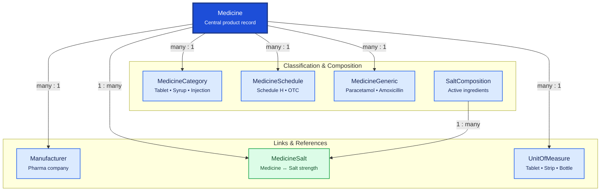

# Medicine Master

Medicine Master is the product catalog for the pharmacy. `Medicine` is the central record; related tables classify medicines, define compositions, link manufacturers, and standardize units of measure.

## Relationship Diagram

**Legend:** `Medicine` is org-global master data referenced by inventory batches, purchase, sales, and prescriptions.

## How the Tables Work Together

- **Medicine** is the central product record — name, barcode, HSN, storage rules, prescription flags.
- **MedicineGeneric** groups branded medicines under a common generic (e.g. Crocin and Dolo under Paracetamol).
- **MedicineCategory** classifies dosage form or product type (Tablet, Syrup, Surgical Item).
- **MedicineSchedule** stores regulatory schedule (Schedule H, H1, X, OTC) for compliance rules.
- **Manufacturer** links to `Party` (party management) for pharma company identity.
- **SaltComposition** is the master list of active pharmaceutical ingredients.
- **MedicineSalt** is the junction defining which salts and strengths a medicine contains.
- **UnitOfMeasure** standardizes quantity units used across inventory, purchase, and sales.
- Sale pricing lives in `PriceListItem` (pricing), not on Medicine.
- All syncable masters use UUID, soft delete, and `version` for optimistic locking.

## Tables

- [[15_medicine]] — central medicine master record.
- [[16_medicine_generic]] — generic medicine grouping.
- [[17_medicine_category]] — medicine classification.
- [[18_medicine_schedule]] — regulatory drug schedule.
- [[19_manufacturer]] — medicine manufacturer (links to Party).
- [[20_salt_composition]] — active ingredient master.
- [[21_medicine_salt]] — medicine-to-salt composition junction.
- [[22_unit_of_measure]] — standard units of measure.
