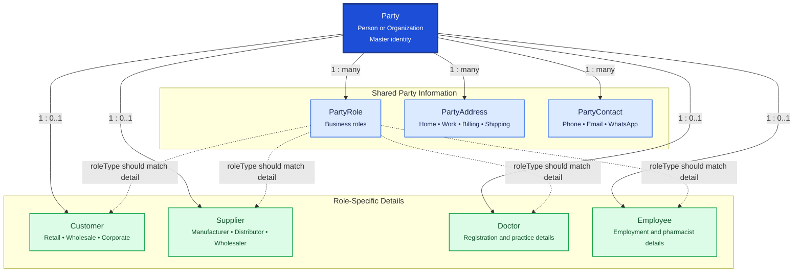

# Party Management

Party Management is the shared master-data area for every person and organization in the Pharmacy ERP. Common identity information is stored once in `Party`; related tables store roles, contact details, addresses, and role-specific data.

## Relationship Diagram



**Legend:** solid arrows show database relationships. Dashed arrows show the application rule that a `PartyRole.roleType` should correspond to the related detail record.
## How the Tables Work Together

- **Party** is the central parent record for a person or organization. It stores shared identity and status information.
- **PartyRole** assigns business roles such as `CUSTOMER`, `SUPPLIER`, `DOCTOR`, `EMPLOYEE`, `ADMIN`, or `OTHER`. A party can have multiple roles.
- **PartyAddress** stores one or more addresses for a party, such as home, work, billing, or shipping addresses.
- **PartyContact** stores phone numbers, email addresses, WhatsApp details, and other contact values.
- **Customer**, **Supplier**, **Doctor**, and **Employee** store attributes specific to those business functions. Each is optional from `Party`, but each record belongs to exactly one party through a unique `partyId`.
- A single person or organization can have multiple business roles. For example, one person may be both a `DOCTOR` and an `EMPLOYEE`.
- `PartyRole` and the detail tables represent related business concepts, but the role-to-detail consistency rule should be enforced by the application service layer.
- All tables use a UUID for synchronization, timestamps for auditing, soft deletion through `deletedAt`, and optimistic locking through `version`.

## Tables

- [party](#party) — central person or organization master.
- [party role](#partyrole) — roles assigned to a party.
- [party address](#partyaddress) — addresses associated with a party.
- [party contact](#partycontact) — contact methods associated with a party.
- [customer](#customer) — customer-specific information.
- [supplier](#supplier) — supplier-specific information.
- [doctor](#doctor) — doctor-specific professional information.
- [employee](#employee) — employee-specific information.

---

## Table Specifications

## Party

> Prisma model: `backend/prisma/schema.prisma` (`Party`)

## Purpose

The Party table is the master entity for every person or organization in the Pharmacy ERP.

A Party can represent:

- Customer
- Supplier
- Doctor
- Employee
- Company
- Any future business entity

Instead of storing duplicate information in separate tables, common information is stored once in Party, while specific roles are maintained in PartyRole.

---

## Business Rules

- Every party must have a unique UUID.
- Every customer, supplier, doctor, and employee must have exactly one Party record.
- A Party can have multiple roles.
- A Party can have multiple addresses.
- A Party can have multiple contact numbers.
- Soft delete should be used.
- UUID is used for synchronization.
- BIGINT is used as the internal primary key.
- Optimistic locking is maintained using the version column.

---

## Relationships

```text
Party (1)
│
├── PartyRole (Many)
├── PartyAddress (Many)
├── PartyContact (Many)
│
├── Customer (Optional 1)
├── Supplier (Optional 1)
├── Doctor (Optional 1)
└── Employee (Optional 1)
```

---

## Columns

| Category     | Column           | SQLite   | PostgreSQL   | Nullable | Description                       |
|--------------|------------------|----------|--------------|----------|-----------------------------------|
| Primary Key  | id               | INTEGER  | BIGINT       | No       | Auto increment primary key        |
| Identifier   | uuid             | TEXT     | UUID         | No       | Global unique identifier for sync |
| Basic        | partyType        | TEXT     | VARCHAR(30)  | No       | PERSON or ORGANIZATION            |
| Basic        | displayName      | TEXT     | VARCHAR(200) | No       | Name displayed throughout ERP     |
| Person       | firstName        | TEXT     | VARCHAR(100) | Yes      | First name                        |
| Person       | middleName       | TEXT     | VARCHAR(100) | Yes      | Middle name                       |
| Person       | lastName         | TEXT     | VARCHAR(100) | Yes      | Last name                         |
| Organization | organizationName | TEXT     | VARCHAR(200) | Yes      | Company/Organization name         |
| Status       | isActive         | INTEGER  | BOOLEAN      | No       | Active status                     |
| Audit        | createdAt        | DATETIME | TIMESTAMP    | No       | Record creation timestamp         |
| Audit        | updatedAt        | DATETIME | TIMESTAMP    | No       | Last update timestamp             |
| Audit        | deletedAt        | DATETIME | TIMESTAMP    | Yes      | Soft delete timestamp             |
| Audit        | version          | INTEGER  | INTEGER      | No       | Optimistic locking version        |

---

## Constraints

- Primary Key (id)
- Unique (uuid)
- CHECK partyType IN ('PERSON', 'ORGANIZATION')
- version >= 1

---

## Indexes

- PK_Party (id)
- UK_Party_UUID (uuid)
- IDX_Party_DisplayName
- IDX_Party_PartyType
- IDX_Party_IsActive

---

## Sample Records

| id | uuid      | partyType    | displayName | firstName | lastName | organizationName   |
|----|-----------|--------------|-------------|-----------|----------|--------------------|
| 1  | xxxxx-111 | PERSON       | John Doe    | John      | Doe      | NULL               |
| 2  | xxxxx-222 | ORGANIZATION | ABC Pharma  | NULL      | NULL     | ABC Pharma Pvt Ltd |

---


---

## Notes

- This is the most important master table in the database.
- Avoid storing duplicate personal or organization information elsewhere.
- Role-specific data should be stored in Customer, Supplier, Doctor, Employee, etc.
- Contact details should be stored in PartyContact.
- Address information should be stored in PartyAddress.
- Designed for offline-first synchronization using UUID.

---

## PartyRole

> Prisma model: `backend/prisma/schema.prisma` (`PartyRole`)

## Purpose

The PartyRole table defines the business roles assigned to a Party. The parent Party model declares the inverse relation as `partyRoles PartyRole[]`.

A single Party can have one or more roles, allowing the same person or organization to participate in multiple business processes without duplicating master data.

Examples:

- Customer
- Supplier
- Doctor
- Employee

This enables a pharmacy to maintain a single master record while supporting multiple business functions.

---

## Business Rules

- Every Party must exist before a role can be assigned.
- A Party can have multiple roles.
- The same role cannot be assigned more than once to the same Party.
- A role can be activated or deactivated without deleting the Party.
- Soft delete should be used.
- UUID is used for synchronization.
- BIGINT is used as the internal primary key.
- Optimistic locking is maintained using the version column.

---

## Relationships

```
Party (1)
    │
    └──────< PartyRole (Many)
                    │
                    ├── CUSTOMER
                    ├── SUPPLIER
                    ├── DOCTOR
                    └── EMPLOYEE
```

---

## Columns

| Category    | Column    | SQLite   | PostgreSQL  | Nullable | Description                          |
|-------------|-----------|----------|-------------|----------|--------------------------------------|
| Primary Key | id        | INTEGER  | BIGINT      | No       | Auto increment primary key           |
| Foreign Key | partyId   | INTEGER  | BIGINT      | No       | References Party.id                  |
| Identifier  | uuid      | TEXT     | UUID        | No       | Global unique identifier             |
| Basic       | roleType  | TEXT     | VARCHAR(30) | No       | CUSTOMER, SUPPLIER, DOCTOR, EMPLOYEE, ADMIN, OTHER |
| Status      | isPrimary | INTEGER  | BOOLEAN     | No       | Indicates the primary/default role   |
| Status      | isActive  | INTEGER  | BOOLEAN     | No       | Whether the role is active           |
| Audit       | createdAt | DATETIME | TIMESTAMP   | No       | Record creation timestamp            |
| Audit       | updatedAt | DATETIME | TIMESTAMP   | No       | Last update timestamp                |
| Audit       | deletedAt | DATETIME | TIMESTAMP   | Yes      | Soft delete timestamp                |
| Audit       | version   | INTEGER  | INTEGER     | No       | Optimistic locking version           |

---

## Constraints

- Primary Key (id)
- Foreign Key (partyId → Party.id)
- Unique (uuid)
- Unique (partyId, roleType)
- CHECK roleType IN ('CUSTOMER','SUPPLIER','DOCTOR','EMPLOYEE','ADMIN','OTHER')
- version >= 1

---

## Indexes

- PK_PartyRole (id)
- UK_PartyRole_UUID (uuid)
- UK_PartyRole_Party_Role (partyId, roleType)
- IDX_PartyRole_Party
- IDX_PartyRole_RoleType
- IDX_PartyRole_IsActive

---

## Sample Records

| id | partyId | uuid     | roleType | isPrimary | isActive |
|----|---------|----------|----------|-----------|----------|
| 1  | 1       | role-111 | CUSTOMER | 1         | 1        |
| 2  | 1       | role-112 | DOCTOR   | 0         | 1        |
| 3  | 2       | role-113 | SUPPLIER | 1         | 1        |

---

## Prisma Models

The inverse relation is declared in `party.prisma`:

```prisma
model Party {
  id         BigInt      @id @default(autoincrement())
  partyRoles PartyRole[]

  customer Customer?
  supplier Supplier?
  doctor   Doctor?
  employee Employee?
}
```

The PartyRole model is defined in `party-role.prisma`:

```prisma
model PartyRole {
  id         BigInt   @id @default(autoincrement())
  partyId    BigInt

  uuid       String   @unique

  roleType   RoleType

  isPrimary  Boolean  @default(false)
  isActive   Boolean  @default(true) @map("is_active")

  createdAt  DateTime @default(now())
  updatedAt  DateTime @updatedAt
  deletedAt  DateTime?

  version    Int      @default(1)

  party       Party    @relation(fields: [partyId], references: [id])

  @@unique([partyId, roleType])
  @@index([partyId])
  @@index([roleType])
  @@index([isActive])
}
```

---

## Notes

- PartyRole enables a single Party to participate in multiple ERP modules.
- Role-specific attributes should **not** be stored here; they belong in their respective tables (Customer, Supplier, Doctor, Employee).
- This table serves as the bridge between the generic Party master and specialized business entities.
- Designed for offline-first synchronization using UUID and soft-delete support.

---

## PartyAddress

> Prisma model: `backend/prisma/schema.prisma` (`PartyAddress`)

## Purpose

The PartyAddress table stores one or more addresses associated with a Party.

A Party may have multiple addresses such as:

- Billing Address
- Shipping Address
- Residential Address
- Work Address
- Warehouse Address

Separating addresses from the Party table keeps the database normalized and allows future expansion without modifying the Party entity.

---

## Business Rules

- Every address must belong to exactly one Party.
- A Party can have multiple addresses.
- Only one address of a particular type should be marked as the default; this is an application-level rule.
- Address type is restricted to the `AddressType` enum: HOME, WORK, BILLING, SHIPPING, REGISTERED, or OTHER.
- Soft delete should be used.
- UUID is used for synchronization.
- BIGINT is used as the internal primary key.
- Optimistic locking is maintained using the version column.

---

## Relationships

```
Party (1)
    │
    └──────< PartyAddress (Many)
```

---

## Columns

| Category | Column | SQLite | PostgreSQL | Nullable | Description |
|----------|--------|---------|------------|----------|-------------|
| Primary Key | id | INTEGER | BIGINT | No | Auto increment primary key |
| Foreign Key | partyId | INTEGER | BIGINT | No | References Party.id |
| Identifier | uuid | TEXT | UUID | No | Global unique identifier |
| Basic | addressType | TEXT | VARCHAR(30) | No | HOME, WORK, BILLING, SHIPPING, REGISTERED, OTHER |
| Address | addressLine1 | TEXT | VARCHAR(200) | No | Primary address line |
| Address | addressLine2 | TEXT | VARCHAR(200) | Yes | Secondary address line |
| Address | landmark | TEXT | VARCHAR(150) | Yes | Nearby landmark |
| Address | area | TEXT | VARCHAR(100) | Yes | Area or locality |
| Address | cityId | INTEGER | BIGINT | Yes | References City |
| Address | stateId | INTEGER | BIGINT | Yes | References State |
| Address | countryId | INTEGER | BIGINT | Yes | References Country |
| Address | postalCode | TEXT | VARCHAR(20) | Yes | ZIP / PIN code |
| Address | latitude | REAL | DECIMAL(10,7) | Yes | GPS latitude |
| Address | longitude | REAL | DECIMAL(10,7) | Yes | GPS longitude |
| Status | isDefault | INTEGER | BOOLEAN | No | Default address of this type |
| Status | isActive | INTEGER | BOOLEAN | No | Active status |
| Audit | createdAt | DATETIME | TIMESTAMP | No | Record creation timestamp |
| Audit | updatedAt | DATETIME | TIMESTAMP | No | Last update timestamp |
| Audit | deletedAt | DATETIME | TIMESTAMP | Yes | Soft delete timestamp |
| Audit | version | INTEGER | INTEGER | No | Optimistic locking version |

---

## Constraints

- Primary Key (id)
- Foreign Key (partyId → Party.id)
- Foreign Key (cityId → City.id)
- Foreign Key (stateId → State.id)
- Foreign Key (countryId → Country.id)
- Unique (uuid)
- CHECK addressType IN ('HOME','WORK','BILLING','SHIPPING','REGISTERED','OTHER')
- version >= 1

---

## Indexes

- PK_PartyAddress (id)
- UK_PartyAddress_UUID (uuid)
- IDX_PartyAddress_Party
- IDX_PartyAddress_AddressType
- IDX_PartyAddress_City
- IDX_PartyAddress_State
- IDX_PartyAddress_Default
- IDX_PartyAddress_Active

---

## Sample Records

| id | partyId | addressType | addressLine1 | cityId | stateId | postalCode | isDefault |
|----|---------|-------------|--------------|--------|---------|------------|-----------|
| 1 | 1 | HOME | 12 MG Road | 101 | 21 | 411001 | Yes |
| 2 | 1 | BILLING | ABC Plaza, FC Road | 101 | 21 | 411004 | No |
| 3 | 2 | WORK | Pharma Industrial Estate | 101 | 21 | 411038 | Yes |

---


---

## Notes

- Stores all addresses for every Party in the ERP.
- A Party may have multiple addresses of different types.
- Geographic master tables (Country, State, City, Area) should be referenced wherever possible instead of storing free-text values.
- GPS coordinates enable delivery routing and map integration.
- Supports offline-first synchronization using UUID.
- Designed to remain compatible with both SQLite and PostgreSQL.

---

## PartyContact

> Prisma model: `backend/prisma/schema.prisma` (`PartyContact`)

## Purpose

The PartyContact table stores one or more contact details associated with a Party.

A Party can have multiple contact methods such as:

- Mobile Number
- Landline Number
- Email Address
- WhatsApp Number
- Fax Number
- Other contact details

Separating contact information from the Party table keeps the database normalized and allows unlimited contact methods for each Party.

---

## Business Rules

- Every contact must belong to exactly one Party.
- A Party can have multiple contact records.
- Only one contact of a specific type should be marked as primary; this is an application-level rule.
- Contact type is restricted to the `ContactType` enum: PHONE, MOBILE, EMAIL, FAX, WHATSAPP, or OTHER.
- Email addresses should be stored in lowercase.
- Mobile numbers should include the country code where applicable.
- Soft delete should be used.
- UUID is used for synchronization.
- BIGINT is used as the internal primary key.
- Optimistic locking is maintained using the version column.

---

## Relationships

```
Party (1)
    │
    └──────< PartyContact (Many)
```

---

## Columns

| Category    | Column       | SQLite   | PostgreSQL   | Nullable | Description                                     |
|-------------|--------------|----------|--------------|----------|-------------------------------------------------|
| Primary Key | id           | INTEGER  | BIGINT       | No       | Auto increment primary key                      |
| Foreign Key | partyId      | INTEGER  | BIGINT       | No       | References Party.id                             |
| Identifier  | uuid         | TEXT     | UUID         | No       | Global unique identifier                        |
| Basic       | contactType  | TEXT     | VARCHAR(30)  | No       | PHONE, MOBILE, EMAIL, FAX, WHATSAPP, OTHER    |
| Contact     | contactValue | TEXT     | VARCHAR(250) | No       | Contact value                                   |
| Contact     | countryCode  | TEXT     | VARCHAR(10)  | Yes      | Country dialing code                            |
| Status      | isPrimary    | INTEGER  | BOOLEAN      | No       | Primary contact of this type                    |
| Status      | isVerified   | INTEGER  | BOOLEAN      | No       | Indicates whether the contact has been verified |
| Status      | isActive     | INTEGER  | BOOLEAN      | No       | Active status                                   |
| Audit       | createdAt    | DATETIME | TIMESTAMP    | No       | Record creation timestamp                       |
| Audit       | updatedAt    | DATETIME | TIMESTAMP    | No       | Last update timestamp                           |
| Audit       | deletedAt    | DATETIME | TIMESTAMP    | Yes      | Soft delete timestamp                           |
| Audit       | version      | INTEGER  | INTEGER      | No       | Optimistic locking version                      |

---

## Constraints

- Primary Key (id)
- Foreign Key (partyId → Party.id)
- Unique (uuid)
- Unique (partyId, contactType, contactValue)
- `contactType` uses the `ContactType` enum: PHONE, MOBILE, EMAIL, FAX, WHATSAPP, OTHER.
- version >= 1

---

## Indexes

- PK_PartyContact (id)
- UK_PartyContact_UUID (uuid)
- UK_PartyContact_Party_Type_Value (partyId, contactType, contactValue)
- IDX_PartyContact_Party
- IDX_PartyContact_Type
- IDX_PartyContact_Primary
- IDX_PartyContact_Active

---

## Sample Records

| id | partyId | contactType | contactValue | countryCode | isPrimary | isVerified |
|----|---------|-------------|--------------|-------------|-----------|------------|
| 1 | 1 | MOBILE | 9876543210 | +91 | Yes | Yes |
| 2 | 1 | EMAIL | john.doe@email.com | NULL | Yes | Yes |
| 3 | 2 | PHONE | 02012345678 | +91 | Yes | No |
| 4 | 2 | OTHER | https://abcpharma.com | NULL | Yes | No |

---


---

## Notes

- Stores all contact methods for every Party in the ERP.
- Supports multiple phone numbers, email addresses, and other contact details for a single Party.
- Business modules should retrieve the primary contact where available.
- Verification status can be used for OTP/email verification workflows.
- Supports offline-first synchronization using UUID.
- Compatible with both SQLite and PostgreSQL.

---

## Customer

> Prisma model: `backend/prisma/schema.prisma` (`Customer`)

## Purpose

The Customer table stores customer-specific information that is not common to all Parties.

General information such as name, address, and contact details is maintained in the Party, PartyAddress, and PartyContact tables. This table contains only attributes specific to customers.

---

## Business Rules

- Every Customer must reference exactly one Party.
- A Party can have at most one Customer record.
- The Party must have the CUSTOMER role assigned in PartyRole.
- Customer Code must be unique within a company.
- Credit limit cannot be negative.
- Current outstanding balance is maintained through Ledger entries and should not be updated directly.
- Customers can be marked inactive instead of being deleted.
- Soft delete should be used.
- UUID is used for synchronization.
- BIGINT is used as the internal primary key.
- Optimistic locking is maintained using the version column.

---

## Relationships

```
Party (1)
    │
    ├── PartyRole (CUSTOMER)
    │
    └────── Customer (1)
                │
                ├── SalesInvoice
                ├── SalesReturn
                ├── SalesPayment
                ├── Prescription
                └── LoyaltyTransaction
```

---

## Columns

| Category    | Column            | SQLite   | PostgreSQL    | Nullable | Description                            |
|-------------|-------------------|----------|---------------|----------|----------------------------------------|
| Primary Key | id                | INTEGER  | BIGINT        | No       | Auto increment primary key             |
| Foreign Key | partyId           | INTEGER  | BIGINT        | No       | References Party.id                    |
| Identifier  | uuid              | TEXT     | UUID          | No       | Global unique identifier               |
| Business    | customerCode      | TEXT     | VARCHAR(30)   | No       | Unique customer code                   |
| Business    | customerType      | TEXT     | VARCHAR(30)   | No       | RETAIL, WHOLESALE, CORPORATE |
| Financial   | creditLimit       | REAL     | NUMERIC(12,2) | No       | Maximum credit allowed                 |
| Financial   | outstandingAmount | REAL     | NUMERIC(12,2) | No       | Current outstanding balance            |
| Financial   | paymentTermsDays  | INTEGER  | INTEGER       | No       | Credit period in days                  |
| Loyalty     | loyaltyPoints     | INTEGER  | INTEGER       | No       | Available loyalty points               |
| Status      | isTaxExempt       | INTEGER  | BOOLEAN       | No       | Tax exemption flag                     |
| Status      | isActive          | INTEGER  | BOOLEAN       | No       | Active status                          |
| Audit       | createdAt         | DATETIME | TIMESTAMP     | No       | Record creation timestamp              |
| Audit       | updatedAt         | DATETIME | TIMESTAMP     | No       | Last update timestamp                  |
| Audit       | deletedAt         | DATETIME | TIMESTAMP     | Yes      | Soft delete timestamp                  |
| Audit       | version           | INTEGER  | INTEGER       | No       | Optimistic locking version             |

---

## Constraints

- Primary Key (id)
- Foreign Key (partyId → Party.id)
- Unique (uuid)
- Unique (partyId)
- Unique (customerCode)
- `customerType` uses the `CustomerType` enum: RETAIL, WHOLESALE, CORPORATE.
- `creditLimit` should not be negative; enforce this in the application layer.
- `outstandingAmount` should not be negative; enforce this in the application layer.
- `loyaltyPoints` should not be negative; enforce this in the application layer.

---

## Indexes

- PK_Customer (id)
- UK_Customer_UUID
- UK_Customer_Code
- UK_Customer_Party
- IDX_Customer_Type
- IDX_Customer_Active
- IDX_Customer_Outstanding

---

## Sample Records

| id | partyId | customerCode | customerType | creditLimit | outstandingAmount | loyaltyPoints |
|----|---------|--------------|--------------|------------:|------------------:|--------------:|
| 1  | 1       | CUST00001    | RETAIL      |        0.00 |              0.00 |             0 |
| 2  | 5       | CUST00002    | RETAIL      |    10000.00 |           2500.00 |           150 |
| 3  | 8       | CUST00003    | CORPORATE    |    50000.00 |          12000.00 |             0 |

---


---

## Notes

- Customer-specific information only should be stored here.
- Personal information belongs in Party.
- Addresses belong in PartyAddress.
- Contact details belong in PartyContact.
- Customer must have the CUSTOMER role in PartyRole.
- Outstanding amount should preferably be calculated from LedgerEntry rather than manually updated.
- Supports offline-first synchronization using UUID.
- Compatible with both SQLite and PostgreSQL.

---

## Supplier

> Prisma model: `backend/prisma/schema.prisma` (`Supplier`)

## Purpose

The Supplier table stores supplier-specific business information that is not common to all Parties.

General information such as supplier name, address, phone numbers, and email addresses are maintained in the Party, PartyAddress, and PartyContact tables.

This table stores procurement and financial information required for purchasing medicines and other inventory.

---

## Business Rules

- Every Supplier must reference exactly one Party.
- A Party can have at most one Supplier record.
- The Party must have the SUPPLIER role assigned in PartyRole.
- Supplier Code must be unique.
- GSTIN must be unique when provided.
- Drug License Number should be maintained for pharmaceutical suppliers.
- Credit limit cannot be negative.
- Outstanding amount is maintained through Ledger entries.
- Suppliers can be marked inactive instead of deleting them.
- Soft delete should be used.
- UUID is used for synchronization.
- BIGINT is used as the internal primary key.
- Optimistic locking is maintained using the version column.

---

## Relationships

```
Party (1)
    │
    ├── PartyRole (SUPPLIER)
    │
    └────── Supplier (1)
                 │
                 ├── PurchaseOrder
                 ├── GoodsReceipt
                 ├── PurchaseInvoice
                 ├── PurchaseReturn
                 └── Payment
```

---

## Columns

| Category | Column | SQLite | PostgreSQL | Nullable | Description |
|----------|--------|---------|------------|----------|-------------|
| Primary Key | id | INTEGER | BIGINT | No | Auto increment primary key |
| Foreign Key | partyId | INTEGER | BIGINT | No | References Party.id |
| Identifier | uuid | TEXT | UUID | No | Global unique identifier |
| Business | supplierCode | TEXT | VARCHAR(30) | No | Unique supplier code |
| Business | supplierType | TEXT | VARCHAR(30) | No | MANUFACTURER, DISTRIBUTOR, WHOLESALER, OTHER |
| Business | gstin | TEXT | VARCHAR(20) | Yes | GST Identification Number |
| Business | drugLicenseNumber | TEXT | VARCHAR(50) | Yes | Drug License Number |
| Business | panNumber | TEXT | VARCHAR(20) | Yes | PAN Number |
| Financial | creditLimit | REAL | NUMERIC(12,2) | No | Maximum credit allowed |
| Financial | outstandingAmount | REAL | NUMERIC(12,2) | No | Current outstanding payable |
| Financial | paymentTermsDays | INTEGER | INTEGER | No | Credit period in days |
| Status | preferredSupplier | INTEGER | BOOLEAN | No | Preferred supplier flag |
| Status | isActive | INTEGER | BOOLEAN | No | Active supplier |
| Audit | createdAt | DATETIME | TIMESTAMP | No | Record creation timestamp |
| Audit | updatedAt | DATETIME | TIMESTAMP | No | Last update timestamp |
| Audit | deletedAt | DATETIME | TIMESTAMP | Yes | Soft delete timestamp |
| Audit | version | INTEGER | INTEGER | No | Optimistic locking version |

---

## Constraints

- Primary Key (id)
- Foreign Key (partyId → Party.id)
- Unique (uuid)
- Unique (partyId)
- Unique (supplierCode)
- Unique (gstin)
- `supplierType` uses the `SupplierType` enum: MANUFACTURER, DISTRIBUTOR, WHOLESALER, OTHER.
- `creditLimit` should not be negative; enforce this in the application layer.
- `outstandingAmount` should not be negative; enforce this in the application layer.

---

## Indexes

- PK_Supplier (id)
- UK_Supplier_UUID
- UK_Supplier_Code
- UK_Supplier_Party
- UK_Supplier_GSTIN
- IDX_Supplier_Type
- IDX_Supplier_Active
- IDX_Supplier_Preferred

---

## Sample Records

| id | partyId | supplierCode | supplierType | gstin | drugLicenseNumber | preferredSupplier |
|----|---------|--------------|--------------|-------|-------------------|-------------------|
| 1 | 20 | SUP00001 | DISTRIBUTOR | 27ABCDE1234F1Z5 | MH/DRUG/12345 | Yes |
| 2 | 25 | SUP00002 | MANUFACTURER | 27PQRSX5678L1Z2 | MH/DRUG/45678 | No |
| 3 | 31 | SUP00003 | WHOLESALER | NULL | MH/DRUG/98765 | No |

---


---

## Notes

- Stores only supplier-specific information.
- General information belongs in Party, PartyAddress, and PartyContact.
- A supplier must have the SUPPLIER role in PartyRole.
- Procurement modules should reference Supplier instead of Party directly.
- Outstanding payable should preferably be calculated from LedgerEntry transactions.
- Drug License Number and GSTIN are important for statutory compliance in pharmacy operations.
- Supports offline-first synchronization using UUID.
- Compatible with both SQLite and PostgreSQL.

---

## Doctor

> Prisma model: `backend/prisma/schema.prisma` (`Doctor`)

## Purpose

The Doctor table stores doctor-specific professional information used for prescriptions, patient history, sales reporting, and regulatory compliance.

General information such as doctor's name, address, phone numbers, and email addresses are maintained in the Party, PartyAddress, and PartyContact tables.

This table stores only medical practice-related information.

---

## Business Rules

- Every Doctor must reference exactly one Party.
- A Party can have at most one Doctor record.
- The Party must have the DOCTOR role assigned in PartyRole.
- Registration Number should be unique.
- Doctors can be marked inactive instead of deleting them.
- Prescriptions should always reference Doctor.
- Soft delete should be used.
- UUID is used for synchronization.
- BIGINT is used as the internal primary key.
- Optimistic locking is maintained using the version column.

---

## Relationships

```
Party (1)
    │
    ├── PartyRole (DOCTOR)
    │
    └────── Doctor (1)
                  │
                  ├── Prescription
                  ├── SalesInvoice
                  └── Patient History
```

---

## Columns

| Category | Column | SQLite | PostgreSQL | Nullable | Description |
|----------|--------|---------|------------|----------|-------------|
| Primary Key | id | INTEGER | BIGINT | No | Auto increment primary key |
| Foreign Key | partyId | INTEGER | BIGINT | No | References Party.id |
| Identifier | uuid | TEXT | UUID | No | Global unique identifier |
| Business | doctorCode | TEXT | VARCHAR(30) | No | Unique doctor code |
| Professional | registrationNumber | TEXT | VARCHAR(50) | No | Medical registration number |
| Professional | qualification | TEXT | VARCHAR(150) | Yes | MBBS, MD, BAMS, etc. |
| Professional | specialization | TEXT | VARCHAR(100) | Yes | Physician, Pediatrician, Cardiologist, etc. |
| Professional | hospitalName | TEXT | VARCHAR(200) | Yes | Affiliated hospital or clinic |
| Professional | consultationFee | REAL | NUMERIC(10,2) | Yes | Consultation fee |
| Status | isVisitingDoctor | INTEGER | BOOLEAN | No | Indicates visiting consultant |
| Status | isActive | INTEGER | BOOLEAN | No | Active doctor |
| Audit | createdAt | DATETIME | TIMESTAMP | No | Record creation timestamp |
| Audit | updatedAt | DATETIME | TIMESTAMP | No | Last update timestamp |
| Audit | deletedAt | DATETIME | TIMESTAMP | Yes | Soft delete timestamp |
| Audit | version | INTEGER | INTEGER | No | Optimistic locking version |

---

## Constraints

- Primary Key (id)
- Foreign Key (partyId → Party.id)
- Unique (uuid)
- Unique (partyId)
- Unique (doctorCode)
- Unique (registrationNumber)
- `consultationFee` should not be negative; enforce this in the application layer.

---

## Indexes

- PK_Doctor (id)
- UK_Doctor_UUID
- UK_Doctor_Code
- UK_Doctor_Registration
- UK_Doctor_Party
- IDX_Doctor_Specialization
- IDX_Doctor_Active
- IDX_Doctor_Hospital

---

## Sample Records

| id | partyId | doctorCode | registrationNumber | qualification | specialization | hospitalName |
|----|---------|------------|--------------------|---------------|----------------|--------------|
| 1 | 40 | DOC00001 | MMC123456 | MBBS | General Physician | City Care Hospital |
| 2 | 41 | DOC00002 | MMC654321 | MD | Cardiologist | Heart Care Clinic |
| 3 | 42 | DOC00003 | MMC998877 | BAMS | Ayurveda | Wellness Clinic |

---


---

## Notes

- Stores only doctor-specific professional information.
- Personal information belongs in Party.
- Contact information belongs in PartyContact.
- Address information belongs in PartyAddress.
- A doctor must have the DOCTOR role assigned in PartyRole.
- Prescription and Sales modules should reference Doctor instead of Party.
- Registration Number should comply with the applicable medical council requirements.
- Supports offline-first synchronization using UUID.
- Compatible with both SQLite and PostgreSQL.

---

## Employee

> Prisma model: `backend/prisma/schema.prisma` (`Employee`)

## Purpose

The Employee table stores employee-specific information required for pharmacy operations.

General information such as employee name, address, phone numbers, and email addresses are maintained in the Party, PartyAddress, and PartyContact tables.

This table contains employment-related information used for user management, billing, inventory operations, auditing, and reporting.

---

## Business Rules

- Every Employee must reference exactly one Party.
- A Party can have at most one Employee record.
- The Party must have the EMPLOYEE role assigned in PartyRole.
- Employee Code must be unique.
- Employees may or may not have a User account.
- Employees can be assigned one or more application Roles through User accounts.
- Employees can be marked inactive instead of deleting them.
- Soft delete should be used.
- UUID is used for synchronization.
- BIGINT is used as the internal primary key.
- Optimistic locking is maintained using the version column.

---

## Relationships

```
Party (1)
    │
    ├── PartyRole (EMPLOYEE)
    │
    └────── Employee (1)
                  │
                  ├── User
                  ├── SalesInvoice
                  ├── PurchaseInvoice
                  ├── StockMovement
                  ├── AuditLog
                  └── ChangeHistory
```

---

## Columns

| Category | Column | SQLite | PostgreSQL | Nullable | Description |
|----------|--------|---------|------------|----------|-------------|
| Primary Key | id | INTEGER | BIGINT | No | Auto increment primary key |
| Foreign Key | partyId | INTEGER | BIGINT | No | References Party.id |
| Identifier | uuid | TEXT | UUID | No | Global unique identifier |
| Business | employeeCode | TEXT | VARCHAR(30) | No | Unique employee code |
| Employment | designation | TEXT | VARCHAR(100) | Yes | Pharmacist, Cashier, Manager, Store Keeper, etc. |
| Employment | department | TEXT | VARCHAR(100) | Yes | Sales, Purchase, Inventory, Administration |
| Employment | joiningDate | DATE | DATE | Yes | Date of joining |
| Employment | leavingDate | DATE | DATE | Yes | Date of resignation/termination |
| Employment | salary | REAL | NUMERIC(12,2) | Yes | Monthly salary |
| Employment | licenseNumber | TEXT | VARCHAR(50) | Yes | Pharmacist license number if applicable |
| Status | isPharmacist | INTEGER | BOOLEAN | No | Indicates registered pharmacist |
| Status | isActive | INTEGER | BOOLEAN | No | Active employee |
| Audit | createdAt | DATETIME | TIMESTAMP | No | Record creation timestamp |
| Audit | updatedAt | DATETIME | TIMESTAMP | No | Last update timestamp |
| Audit | deletedAt | DATETIME | TIMESTAMP | Yes | Soft delete timestamp |
| Audit | version | INTEGER | INTEGER | No | Optimistic locking version |

---

## Constraints

- Primary Key (id)
- Foreign Key (partyId → Party.id)
- Unique (uuid)
- Unique (partyId)
- Unique (employeeCode)
- `salary` should not be negative; enforce this in the application layer.

---

## Indexes

- PK_Employee (id)
- UK_Employee_UUID
- UK_Employee_Code
- UK_Employee_Party
- IDX_Employee_Department
- IDX_Employee_Designation
- IDX_Employee_Pharmacist
- IDX_Employee_Active

---

## Sample Records

| id | partyId | employeeCode | designation | department | joiningDate | isPharmacist |
|----|---------|--------------|-------------|------------|-------------|--------------|
| 1 | 60 | EMP00001 | Pharmacist | Sales | 2025-01-15 | Yes |
| 2 | 61 | EMP00002 | Cashier | Sales | 2025-03-01 | No |
| 3 | 62 | EMP00003 | Store Manager | Inventory | 2024-08-10 | No |

---


---

## Notes

- Stores only employment-specific information.
- Personal details belong in Party.
- Contact information belongs in PartyContact.
- Address information belongs in PartyAddress.
- Authentication and authorization are handled through the User module.
- Only registered pharmacists should have a pharmacist license number.
- Employees are referenced throughout the ERP for auditing, inventory transactions, purchases, sales, and approvals.
- Supports offline-first synchronization using UUID.
- Compatible with both SQLite and PostgreSQL.
