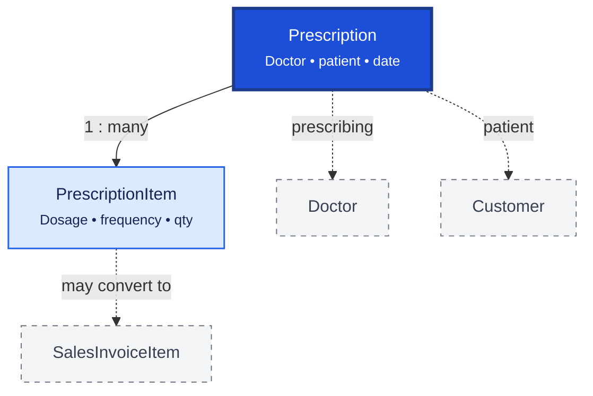

# Prescription

Prescription stores doctor-issued medication orders for patients. `Prescription` is the header; `PrescriptionItem` lists each prescribed medicine with dosage and dispensing instructions.

## Relationship Diagram



**Legend:** prescriptions support Schedule H compliance; items may be converted directly into sales invoice lines.

## How the Tables Work Together

- **Prescription** captures doctor, patient, prescription date, validity, and status.
- **PrescriptionItem** stores medicine, dosage, strength, frequency, duration, and substitution rules.
- Pharmacists use prescription items to guide dispensing and regulatory compliance.
- Approved items can be converted into `SalesInvoiceItem` while retaining prescription reference.
- Schedule H and narcotic medicines require prescription linkage before sale.
- Prescriptions may be entered manually or imported from scanned/electronic sources.

## Tables

- [prescription](#prescription) — prescription header.
- [prescription item](#prescriptionitem) — prescribed medicine line items.

---

## Table Specifications

## Prescription

> Prisma model: `backend/prisma/schema.prisma` (`Prescription`)

## Purpose

The Prescription table stores the prescription header issued by a registered medical practitioner.

A Prescription represents the doctor's order for one patient and may contain one or more prescribed medicines. It serves as the clinical document that can later be converted into a Sales Invoice.

The prescription stores patient information, doctor details, prescription validity, diagnosis, and overall status.

---

## Business Rules

- Every Prescription belongs to one Customer (Patient).
- Every Prescription belongs to one Doctor.
- Every Prescription contains one or more PrescriptionItems.
- Prescription Number must be unique.
- A Prescription may generate one or more Sales Invoices.
- Expired prescriptions cannot be billed unless overridden by authorized users.
- Controlled medicines require a valid prescription.
- Cancelled prescriptions cannot be invoiced.
- UUID is used for synchronization.
- BIGINT is used as the internal primary key.
- Optimistic locking is maintained using the version column.

---

## Relationships

```
Customer (Patient)
        │
        ▼
Prescription
        │
        ├────────► Doctor
        │
        ├──────< PrescriptionItem
        │
        └────────► SalesInvoice
```

---

## Columns

| Category | Column | SQLite | PostgreSQL | Nullable | Description |
|----------|--------|---------|------------|----------|-------------|
| Primary Key | id | INTEGER | BIGINT | No | Auto increment primary key |
| Identifier | uuid | TEXT | UUID | No | Global unique identifier |
| Business | prescriptionNumber | TEXT | VARCHAR(30) | No | Unique prescription number |
| Foreign Key | customerId | INTEGER | BIGINT | No | References Customer.id |
| Foreign Key | doctorId | INTEGER | BIGINT | No | References Doctor.id |
| Foreign Key | branchId | INTEGER | BIGINT | No | Dispensing branch |
| Business | prescriptionDate | DATETIME | TIMESTAMP | No | Prescription issue date |
| Business | validUntil | DATE | DATE | Yes | Prescription validity |
| Medical | diagnosis | TEXT | TEXT | Yes | Diagnosis or clinical notes |
| Medical | symptoms | TEXT | TEXT | Yes | Patient symptoms |
| Business | visitNumber | TEXT | VARCHAR(30) | Yes | OPD/IPD visit reference |
| Status | status | TEXT | VARCHAR(20) | No | DRAFT, ACTIVE, PARTIALLY_DISPENSED, DISPENSED, EXPIRED, CANCELLED |
| Business | remarks | TEXT | TEXT | Yes | Additional remarks |
| Audit | createdAt | DATETIME | TIMESTAMP | No | Record creation timestamp |
| Audit | updatedAt | DATETIME | TIMESTAMP | No | Last update timestamp |
| Audit | deletedAt | DATETIME | TIMESTAMP | Yes | Soft delete timestamp |
| Audit | version | INTEGER | INTEGER | No | Optimistic locking version |

---

## Constraints

- Primary Key (id)
- Unique (uuid)
- Unique (prescriptionNumber)
- Foreign Key (customerId → Customer.id)
- Foreign Key (doctorId → Doctor.id)
- Foreign Key (branchId → Branch.id)
- CHECK (status IN ('DRAFT','ACTIVE','PARTIALLY_DISPENSED','DISPENSED','EXPIRED','CANCELLED'))
- CHECK (validUntil IS NULL OR validUntil >= prescriptionDate)
- CHECK (version >= 1)

---

## Indexes

- PK_Prescription
- UK_Prescription_UUID
- UK_Prescription_Number
- IDX_Prescription_Customer
- IDX_Prescription_Doctor
- IDX_Prescription_Date
- IDX_Prescription_Status
- IDX_Prescription_Branch

---

## Sample Records

| id | prescriptionNumber | customerId | doctorId | prescriptionDate | status |
|----|--------------------|-----------:|----------:|------------------|--------|
| 1 | RX2500001 | 101 | 25 | 2026-08-20 | ACTIVE |
| 2 | RX2500002 | 205 | 18 | 2026-08-21 | DISPENSED |
| 3 | RX2500003 | 310 | 41 | 2026-08-22 | PARTIALLY_DISPENSED |

---


---

## Notes

- This is the **header table** for medical prescriptions.
- Individual prescribed medicines are stored in **PrescriptionItem**.
- A Prescription may be partially dispensed over multiple Sales Invoices until all medicines are issued.
- The system should validate prescription expiry before billing.
- Schedule H, Schedule X, narcotic, or other controlled medicines should require a valid Prescription before dispensing.
- Historical prescriptions should never be modified after dispensing; corrections should be handled through versioning or cancellation with audit history.
- Supports offline-first synchronization using UUID.
- Compatible with both SQLite and PostgreSQL.

---

## PrescriptionItem

> Prisma model: `backend/prisma/schema.prisma` (`PrescriptionItem`)

## Purpose

The PrescriptionItem table stores the individual medicines prescribed within a Prescription.

Each record represents one prescribed medicine and captures dosage instructions, prescribed quantity, dispensing progress, and medicine-specific clinical information.

A Prescription Item may be fully dispensed, partially dispensed, or remain pending. One Prescription Item can generate one or more SalesInvoiceItems until the prescribed quantity is completely dispensed.

---

## Business Rules

- Every PrescriptionItem belongs to exactly one Prescription.
- Every PrescriptionItem references one Medicine.
- Prescribed Quantity must be greater than zero.
- Dispensed Quantity cannot exceed Prescribed Quantity.
- Remaining Quantity is calculated as Prescribed Quantity − Dispensed Quantity.
- Controlled medicines require pharmacist validation before dispensing.
- Once fully dispensed, the item becomes read-only.
- UUID is used for synchronization.
- BIGINT is used as the internal primary key.
- Optimistic locking is maintained using the version column.

---

## Relationships

```
Prescription (1)
      │
      └──────< PrescriptionItem (Many)
                     │
                     ├────────► Medicine
                     ├────────► UnitOfMeasure
                     └────────► SalesInvoiceItem
```

---

## Columns

| Category | Column | SQLite | PostgreSQL | Nullable | Description |
|----------|--------|---------|------------|----------|-------------|
| Primary Key | id | INTEGER | BIGINT | No | Auto increment primary key |
| Identifier | uuid | TEXT | UUID | No | Global unique identifier |
| Foreign Key | prescriptionId | INTEGER | BIGINT | No | References Prescription.id |
| Foreign Key | medicineId | INTEGER | BIGINT | No | References Medicine.id |
| Foreign Key | unitId | INTEGER | BIGINT | No | References UnitOfMeasure.id |
| Business | lineNumber | INTEGER | INTEGER | No | Line sequence number |
| Quantity | prescribedQuantity | REAL | NUMERIC(14,3) | No | Quantity prescribed |
| Quantity | dispensedQuantity | REAL | NUMERIC(14,3) | No | Quantity already dispensed |
| Quantity | remainingQuantity | REAL | NUMERIC(14,3) | No | Quantity yet to dispense |
| Medical | dosage | TEXT | VARCHAR(100) | Yes | Dosage instruction (e.g. 1 tablet) |
| Medical | frequency | TEXT | VARCHAR(50) | Yes | Frequency (e.g. Twice Daily) |
| Medical | duration | TEXT | VARCHAR(50) | Yes | Duration of treatment |
| Medical | route | TEXT | VARCHAR(30) | Yes | Oral, Injection, Topical, etc. |
| Medical | instructions | TEXT | TEXT | Yes | Additional usage instructions |
| Status | status | TEXT | VARCHAR(20) | No | PENDING, PARTIALLY_DISPENSED, DISPENSED, CANCELLED |
| Business | remarks | TEXT | TEXT | Yes | Remarks |
| Audit | createdAt | DATETIME | TIMESTAMP | No | Record creation timestamp |
| Audit | updatedAt | DATETIME | TIMESTAMP | No | Last update timestamp |
| Audit | deletedAt | DATETIME | TIMESTAMP | Yes | Soft delete timestamp |
| Audit | version | INTEGER | INTEGER | No | Optimistic locking version |

---

## Constraints

- Primary Key (id)
- Unique (uuid)
- Foreign Key (prescriptionId → Prescription.id)
- Foreign Key (medicineId → Medicine.id)
- Foreign Key (unitId → UnitOfMeasure.id)
- CHECK (prescribedQuantity > 0)
- CHECK (dispensedQuantity >= 0)
- CHECK (dispensedQuantity <= prescribedQuantity)
- CHECK (remainingQuantity = prescribedQuantity - dispensedQuantity)
- CHECK (status IN ('PENDING','PARTIALLY_DISPENSED','DISPENSED','CANCELLED'))
- CHECK (version >= 1)

---

## Indexes

- PK_PrescriptionItem
- UK_PrescriptionItem_UUID
- IDX_PrescriptionItem_Prescription
- IDX_PrescriptionItem_Medicine
- IDX_PrescriptionItem_Status
- IDX_PrescriptionItem_LineNumber

---

## Sample Records

| id | prescriptionId | lineNumber | medicineId | prescribedQuantity | dispensedQuantity | status |
|----|---------------:|-----------:|-----------:|-------------------:|------------------:|--------|
| 1 | 1 | 1 | 101 | 10.000 | 10.000 | DISPENSED |
| 2 | 1 | 2 | 205 | 30.000 | 10.000 | PARTIALLY_DISPENSED |
| 3 | 2 | 1 | 310 | 5.000 | 0.000 | PENDING |

---


---

## Notes

- This is the **detail (line item)** table for the Prescription document.
- Each PrescriptionItem represents one medicine prescribed by the doctor.
- During billing, the dispensing module should update:
  - `dispensedQuantity`
  - `remainingQuantity`
  - `status`
- One PrescriptionItem may generate multiple SalesInvoiceItems until the prescribed quantity is fully dispensed.
- Historical prescription items should never be modified after dispensing; changes should be tracked through audit history.
- Supports offline-first synchronization using UUID.
- Compatible with both SQLite and PostgreSQL.
