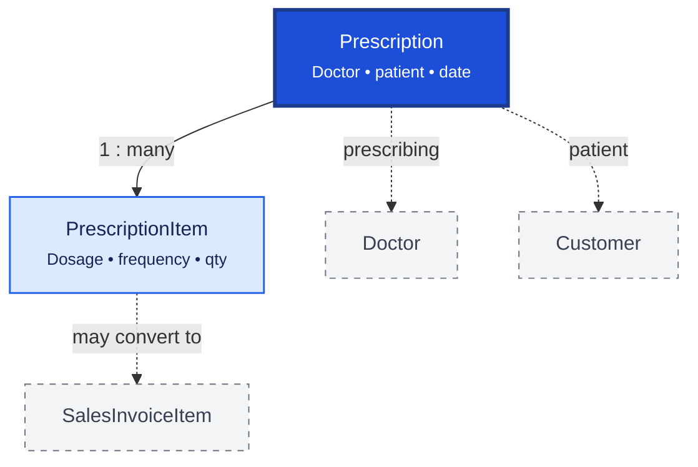

# Prescription

Prescription stores doctor-issued medication orders for patients. `Prescription` is the header; `PrescriptionItem` lists each prescribed medicine with dosage and dispensing instructions.

## Relationship Diagram

**Legend:** prescriptions support Schedule H compliance; items may be converted directly into sales invoice lines.

## How the Tables Work Together

- **Prescription** captures doctor, patient, prescription date, validity, and status.
- **PrescriptionItem** stores medicine, dosage, strength, frequency, duration, and substitution rules.
- Pharmacists use prescription items to guide dispensing and regulatory compliance.
- Approved items can be converted into `SalesInvoiceItem` while retaining prescription reference.
- Schedule H and narcotic medicines require prescription linkage before sale.
- Prescriptions may be entered manually or imported from scanned/electronic sources.

## Tables

- [[53_prescription]] — prescription header.
- [[54_prescription_item]] — prescribed medicine line items.
