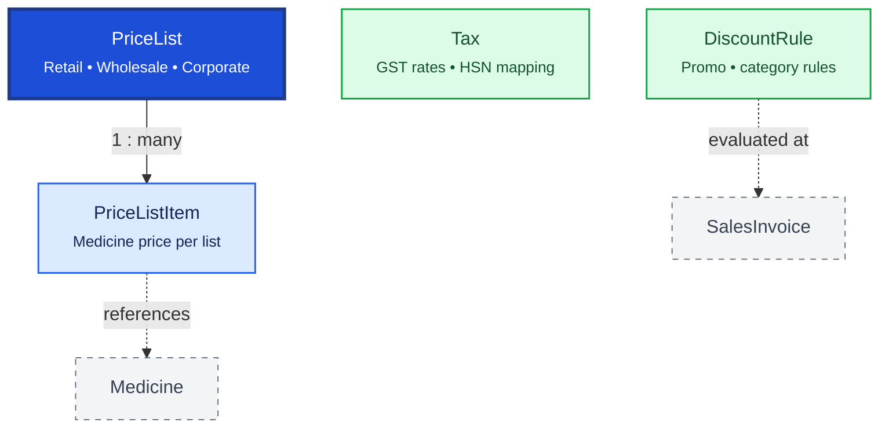

# Pricing

Pricing defines how medicines are priced for different customer groups and scenarios. `PriceList` groups prices; `Tax` and `DiscountRule` apply reusable commercial rules at billing time.

## Relationship Diagram



**Legend:** `PriceList` may be branch-scoped. Final prices are snapshotted on transaction line items.

## How the Tables Work Together

- **PriceList** defines a pricing scheme (Retail, Wholesale, Hospital, Promotional).
- **PriceListItem** stores selling price, discount, and effective dates per medicine within a list.
- **Tax** maintains GST rates, cess, and HSN/SAC mappings with effective date ranges.
- **DiscountRule** defines reusable discount policies (customer category, quantity, campaign).
- Branch-specific sale pricing uses branch-scoped `PriceList` / `PriceListItem` — not on `Batch`.
- Billing evaluates rules at transaction time; line items snapshot the applied price and tax.
- Tax changes should not retroactively alter historical invoice lines.

## Tables

- [price list](#pricelist) — price list header.
- [price list item](#pricelistitem) — medicine price within a price list.
- [tax](#tax) — tax rate master.
- [discount rule](#discountrule) — reusable discount policy.

---

## Table Specifications

## PriceList

> Prisma model: `backend/prisma/schema.prisma` (`PriceList`)

## Purpose

The PriceList table defines **branch-scoped selling price policies** for medicines and healthcare products.

It allows the ERP to maintain multiple selling prices for different customer groups, branches, schemes, or time periods without modifying the Medicine or Batch master data.

**Sale pricing lives here (PriceListItem), not on Batch.** Batch stores lot cost (`purchaseRate`) and statutory MRP only.

Typical Price Lists include:

- Retail Price (branch default)
- Wholesale Price
- Hospital Price
- Distributor Price
- Corporate Price
- Government Scheme Price
- Promotional Price

Individual medicine prices are maintained in the **PriceListItem** table.

---

## Business Rules

- Every Price List contains one or more PriceListItems.
- Price List Name must be unique.
- Only one Default Price List can exist for a Branch.
- A Price List can have an Effective Date and Expiry Date.
- Expired Price Lists cannot be used for billing.
- Price Lists may be branch-specific via `branchId` (null = company-wide default).
- Billing selects branch PriceList → PriceListItem.sellingPrice (not Batch.saleRate).
- UUID is used for synchronization.
- BIGINT is used as the internal primary key.
- Optimistic locking is maintained using the version column.

---

## Relationships

```
Branch (optional)
   │
   ▼
PriceList
   │
   └────────< PriceListItem
                    │
                    ▼
                Medicine
```

Batch (org-global) is **not** the source of sale price — only lot cost and MRP.

---

## Columns

| Category | Column | SQLite | PostgreSQL (JPA) | Nullable | Description |
|----------|--------|---------|------------------|----------|-------------|
| Primary Key | id | INTEGER | BIGINT | No | Auto increment primary key |
| Identifier | uuid | TEXT | UUID/TEXT | No | Global unique identifier |
| Business | priceListCode | TEXT | VARCHAR(20) | No | Unique price list code |
| Business | priceListName | TEXT | VARCHAR(100) | No | Price list name |
| Foreign Key | branchId | INTEGER | BIGINT | Yes | Applicable branch (null = org-wide) |
| Business | priceListType | TEXT | VARCHAR(30) | No | RETAIL, WHOLESALE, etc. (String) |
| Business | effectiveFrom | DATE | DATE | No | Effective date |
| Business | effectiveTo | DATE | DATE | Yes | Expiry date |
| Status | isDefault | INTEGER | BOOLEAN | No | Default price list for branch |
| Status | isActive | INTEGER | BOOLEAN | No | Active status |
| Business | remarks | TEXT | TEXT | Yes | Additional remarks |
| Audit | createdAt | DATETIME | TIMESTAMP | No | Record creation timestamp |
| Audit | updatedAt | DATETIME | TIMESTAMP | No | Last update timestamp |
| Audit | deletedAt | DATETIME | TIMESTAMP | Yes | Soft delete timestamp |
| Audit | version | INTEGER | INTEGER | No | Optimistic locking version |

---

## Constraints

- Primary Key (id)
- Unique (uuid)
- Unique (priceListCode)
- Unique (priceListName)
- Foreign Key (branchId → Branch.id)
- CHECK (effectiveTo IS NULL OR effectiveTo >= effectiveFrom)
- CHECK (version >= 1)

---

## Indexes

- PK_PriceList
- UK_PriceList_UUID
- UK_PriceList_Code
- UK_PriceList_Name
- IDX_PriceList_Branch
- IDX_PriceList_Type
- IDX_PriceList_Effective
- IDX_PriceList_Active

---

## Sample Records

| id | priceListCode | priceListName | branchId | priceListType | effectiveFrom | isDefault |
|----|---------------|---------------|----------|---------------|---------------|-----------|
| 1 | RETAIL-PUN | Pune Retail Price | 2 | RETAIL | 2026-04-01 | Yes |
| 2 | RETAIL-MUM | Mumbai Retail Price | 3 | RETAIL | 2026-04-01 | Yes |
| 3 | WHOLE | Wholesale Price | NULL | WHOLESALE | 2026-04-01 | No |

---


---

## Notes

- This is the **header table** for branch-scoped medicine pricing.
- Individual selling prices are in **PriceListItem** — not on Batch.
- The billing engine selects PriceList by branch + customer type + effective date, then reads `sellingPrice`.
- Sales line items snapshot final price/MRP at transaction time.
- Historical Price Lists should never be modified after they become effective.
- Supports offline-first synchronization using UUID.

---

## PriceListItem

> Prisma model: `backend/prisma/schema.prisma` (`PriceListItem`)

## Purpose

The PriceListItem table stores the **branch-scoped selling price** for individual medicines within a Price List.

Each record defines the selling price, discount policy, tax, and validity for a specific medicine under a particular Price List. This is the authoritative source of **saleRate** — it is **not** stored on Batch.

Batch retains lot cost (`purchaseRate`) and statutory MRP; PriceListItem defines what the branch charges at the counter.

---

## Business Rules

- Every PriceListItem belongs to exactly one PriceList (optionally branch-scoped via header).
- Every PriceListItem references one Medicine.
- A Medicine can appear only once in a PriceList.
- `sellingPrice` is the branch sale rate for billing (replaces former Batch.saleRate).
- Selling Price must be greater than zero.
- MRP on this row is the commercial MRP ceiling for pricing rules (Batch.mrp is statutory pack MRP).
- Effective dates must fall within the parent PriceList validity period.
- Inactive PriceListItems cannot be used during billing.
- SalesInvoiceItem snapshots rate/MRP at sale time.
- UUID is used for synchronization.
- BIGINT is used as the internal primary key.
- Optimistic locking is maintained using the version column.

---

## Relationships

```
PriceList (optional branchId)
      │
      └──────< PriceListItem (Many)
                    │
                    ├────────► Medicine
                    ├────────► Tax
                    └────────► SalesInvoiceItem (price snapshot)

Batch ── purchaseRate, mrp (lot)     PriceListItem ── sellingPrice (branch sale)
```

---

## Columns

| Category | Column | SQLite | PostgreSQL (JPA) | Nullable | Description |
|----------|--------|---------|------------------|----------|-------------|
| Primary Key | id | INTEGER | BIGINT | No | Auto increment primary key |
| Identifier | uuid | TEXT | UUID/TEXT | No | Global unique identifier |
| Foreign Key | priceListId | INTEGER | BIGINT | No | References PriceList.id |
| Foreign Key | medicineId | INTEGER | BIGINT | No | References Medicine.id |
| Business | sellingPrice | REAL | NUMERIC | No | Branch selling price (sale rate) |
| Business | mrp | REAL | NUMERIC | No | Commercial MRP ceiling |
| Business | minimumSellingPrice | REAL | NUMERIC | Yes | Lowest allowed selling price |
| Pricing | discountPercent | REAL | NUMERIC | Yes | Default discount percentage |
| Pricing | taxId | INTEGER | BIGINT | Yes | References Tax.id |
| Business | effectiveFrom | DATE | DATE | No | Effective start date |
| Business | effectiveTo | DATE | DATE | Yes | Effective end date |
| Status | isActive | INTEGER | BOOLEAN | No | Active status |
| Business | remarks | TEXT | TEXT | Yes | Remarks |
| Audit | createdAt | DATETIME | TIMESTAMP | No | Record creation timestamp |
| Audit | updatedAt | DATETIME | TIMESTAMP | No | Last update timestamp |
| Audit | deletedAt | DATETIME | TIMESTAMP | Yes | Soft delete timestamp |
| Audit | version | INTEGER | INTEGER | No | Optimistic locking version |

---

## Constraints

- Primary Key (id)
- Unique (uuid)
- Foreign Key (priceListId → PriceList.id)
- Foreign Key (medicineId → Medicine.id)
- Foreign Key (taxId → Tax.id)
- Unique (priceListId, medicineId)
- CHECK (sellingPrice > 0)
- CHECK (effectiveTo IS NULL OR effectiveTo >= effectiveFrom)
- CHECK (version >= 1)

---

## Indexes

- PK_PriceListItem
- UK_PriceListItem_UUID
- UK_PriceListItem_PriceList_Medicine
- IDX_PriceListItem_PriceList
- IDX_PriceListItem_Medicine
- IDX_PriceListItem_Tax
- IDX_PriceListItem_Active

---

## Sample Records

| id | priceListId | medicineId | sellingPrice | mrp | discountPercent | isActive |
|----|------------:|-----------:|-------------:|----:|----------------:|----------|
| 1 | 1 | 101 | 15.00 | 18.00 | 0.00 | Yes |
| 2 | 1 | 205 | 145.00 | 160.00 | 5.00 | Yes |
| 3 | 2 | 101 | 13.50 | 18.00 | 10.00 | Yes |

Same medicine (101) can have different `sellingPrice` in branch-scoped price lists.

---


---

## Notes

- This is the **detail table** for branch-scoped sale pricing.
- **Batch does not carry saleRate** — use this table for billing lookups.
- The billing engine resolves branch PriceList first, then PriceListItem.
- Line items snapshot prices at sale time for historical accuracy.
- Supports offline-first synchronization using UUID.

---

## Tax

> Prisma model: `backend/prisma/schema.prisma` (`Tax`)

## Purpose

The Tax table defines all tax configurations used throughout the Pharmacy ERP.

It centralizes GST and other tax rules so they can be referenced by Purchase, Sales, and Pricing modules.

Typical taxes include:

- GST 0%
- GST 5%
- GST 12%
- GST 18%
- GST 28%
- IGST
- CGST
- SGST
- CESS (if applicable)

The table stores only tax definitions. Tax amounts are calculated and stored in transactional tables.

---

## Business Rules

- Every Tax Code must be unique.
- Tax rates may change over time using effective dates.
- Historical tax records must never be modified after use.
- Inactive taxes cannot be selected for new transactions.
- A PriceListItem references one Tax.
- PurchaseInvoiceItem and SalesInvoiceItem calculate tax using the selected Tax.
- UUID is used for synchronization.
- BIGINT is used as the internal primary key.
- Optimistic locking is maintained using the version column.

---

## Relationships

```
Tax
 │
 ├────────► PriceListItem
 ├────────► PurchaseInvoiceItem
 └────────► SalesInvoiceItem
```

---

## Columns

| Category | Column | SQLite | PostgreSQL | Nullable | Description |
|----------|--------|---------|------------|----------|-------------|
| Primary Key | id | INTEGER | BIGINT | No | Auto increment primary key |
| Identifier | uuid | TEXT | UUID | No | Global unique identifier |
| Business | taxCode | TEXT | VARCHAR(20) | No | Unique tax code |
| Business | taxName | TEXT | VARCHAR(100) | No | Tax name |
| Business | taxType | TEXT | VARCHAR(20) | No | GST, CGST, SGST, IGST, CESS |
| Business | taxRate | REAL | NUMERIC(5,2) | No | Percentage rate |
| Business | effectiveFrom | DATE | DATE | No | Effective date |
| Business | effectiveTo | DATE | DATE | Yes | Expiry date |
| Status | isActive | INTEGER | BOOLEAN | No | Active tax |
| Business | description | TEXT | TEXT | Yes | Description |
| Audit | createdAt | DATETIME | TIMESTAMP | No | Record creation timestamp |
| Audit | updatedAt | DATETIME | TIMESTAMP | No | Last update timestamp |
| Audit | deletedAt | DATETIME | TIMESTAMP | Yes | Soft delete timestamp |
| Audit | version | INTEGER | INTEGER | No | Optimistic locking version |

---

## Constraints

- Primary Key (id)
- Unique (uuid)
- Unique (taxCode)
- CHECK (taxRate >= 0)
- CHECK (taxRate <= 100)
- CHECK (taxType IN ('GST','CGST','SGST','IGST','CESS'))
- CHECK (effectiveTo IS NULL OR effectiveTo >= effectiveFrom)
- CHECK (version >= 1)

---

## Indexes

- PK_Tax
- UK_Tax_UUID
- UK_Tax_Code
- IDX_Tax_Type
- IDX_Tax_Rate
- IDX_Tax_Effective
- IDX_Tax_Active

---

## Sample Records

| id | taxCode | taxName | taxType | taxRate | isActive |
|----|---------|----------|----------|---------:|----------|
| 1 | GST0 | GST 0% | GST | 0.00 | Yes |
| 2 | GST5 | GST 5% | GST | 5.00 | Yes |
| 3 | GST12 | GST 12% | GST | 12.00 | Yes |
| 4 | GST18 | GST 18% | GST | 18.00 | Yes |

---


---

## Notes

- This table contains **tax master definitions only**.
- Tax amounts should be calculated during transaction processing and stored in PurchaseInvoiceItem and SalesInvoiceItem for audit purposes.
- Existing Tax records should never be edited after transactions exist; create a new Tax record with a new effective period instead.
- Supports multiple GST rates and future tax revisions.
- Supports offline-first synchronization using UUID.
- Compatible with both SQLite and PostgreSQL.

---

## DiscountRule

> Prisma model: `backend/prisma/schema.prisma` (`DiscountRule`)

## Purpose

The DiscountRule table defines configurable discount policies used during billing.

It enables the ERP to automatically determine applicable discounts based on customer type, medicine, category, price list, quantity, promotional campaigns, and validity periods.

Typical discount rules include:

- Retail Customer Discount
- Wholesale Discount
- Senior Citizen Discount
- Doctor Discount
- Employee Discount
- Festival Offer
- Buy X Get Y
- Quantity Discount

The billing engine evaluates these rules during Sales Invoice creation.

---

## Business Rules

- Every Discount Rule has a unique code.
- Multiple Discount Rules may exist simultaneously.
- Rules are evaluated based on priority.
- Only active rules are considered during billing.
- Discount percentage cannot exceed the configured maximum.
- Effective dates determine rule validity.
- Rules can be limited to Medicines, Categories, Customers, or Price Lists.
- UUID is used for synchronization.
- BIGINT is used as the internal primary key.
- Optimistic locking is maintained using the version column.

---

## Relationships

```
Medicine
     │
Category
     │
Customer
     │
PriceList
     │
     ▼
DiscountRule
     │
     ▼
SalesInvoiceItem
```

---

## Columns

| Category | Column | SQLite | PostgreSQL | Nullable | Description |
|----------|--------|---------|------------|----------|-------------|
| Primary Key | id | INTEGER | BIGINT | No | Auto increment primary key |
| Identifier | uuid | TEXT | UUID | No | Global unique identifier |
| Business | ruleCode | TEXT | VARCHAR(30) | No | Unique discount rule code |
| Business | ruleName | TEXT | VARCHAR(150) | No | Discount rule name |
| Business | discountType | TEXT | VARCHAR(20) | No | PERCENTAGE, AMOUNT |
| Business | discountValue | REAL | NUMERIC(12,2) | No | Percentage or fixed amount |
| Business | appliesTo | TEXT | VARCHAR(30) | No | MEDICINE, CATEGORY, CUSTOMER, PRICE_LIST, INVOICE |
| Foreign Key | medicineId | INTEGER | BIGINT | Yes | Applicable medicine |
| Foreign Key | categoryId | INTEGER | BIGINT | Yes | Applicable category |
| Foreign Key | customerId | INTEGER | BIGINT | Yes | Applicable customer |
| Foreign Key | priceListId | INTEGER | BIGINT | Yes | Applicable price list |
| Business | minimumQuantity | REAL | NUMERIC(14,3) | Yes | Minimum quantity required |
| Financial | minimumAmount | REAL | NUMERIC(14,2) | Yes | Minimum invoice amount |
| Business | priority | INTEGER | INTEGER | No | Rule evaluation priority |
| Business | effectiveFrom | DATE | DATE | No | Effective start date |
| Business | effectiveTo | DATE | DATE | Yes | Effective end date |
| Status | isActive | INTEGER | BOOLEAN | No | Active rule |
| Business | remarks | TEXT | TEXT | Yes | Rule description |
| Audit | createdAt | DATETIME | TIMESTAMP | No | Record creation timestamp |
| Audit | updatedAt | DATETIME | TIMESTAMP | No | Last update timestamp |
| Audit | deletedAt | DATETIME | TIMESTAMP | Yes | Soft delete timestamp |
| Audit | version | INTEGER | INTEGER | No | Optimistic locking version |

---

## Constraints

- Primary Key (id)
- Unique (uuid)
- Unique (ruleCode)
- Foreign Key (medicineId → Medicine.id)
- Foreign Key (categoryId → MedicineCategory.id)
- Foreign Key (customerId → Customer.id)
- Foreign Key (priceListId → PriceList.id)
- CHECK (discountType IN ('PERCENTAGE','AMOUNT'))
- CHECK (discountValue >= 0)
- CHECK (priority >= 1)
- CHECK (effectiveTo IS NULL OR effectiveTo >= effectiveFrom)
- CHECK (version >= 1)

---

## Indexes

- PK_DiscountRule
- UK_DiscountRule_UUID
- UK_DiscountRule_Code
- IDX_DiscountRule_Priority
- IDX_DiscountRule_Active
- IDX_DiscountRule_Effective
- IDX_DiscountRule_Medicine
- IDX_DiscountRule_Category
- IDX_DiscountRule_Customer

---

## Sample Records

| id | ruleCode | ruleName | discountType | discountValue | appliesTo | priority |
|----|----------|----------|--------------|--------------:|-----------|---------:|
| 1 | DISC001 | Retail Festival Offer | PERCENTAGE | 10.00 | INVOICE | 1 |
| 2 | DISC002 | Wholesale Discount | PERCENTAGE | 5.00 | PRICE_LIST | 2 |
| 3 | DISC003 | Senior Citizen | AMOUNT | 100.00 | CUSTOMER | 3 |

---


---

## Notes

- This table stores only **discount rules**, not applied discounts.
- During billing, the pricing engine evaluates active rules based on:
  - Effective date
  - Priority
  - Customer
  - Medicine
  - Category
  - Quantity
  - Invoice amount
- The calculated discount amount should be stored in `SalesInvoiceItem` or `SalesInvoice`, ensuring historical invoices remain unchanged even if discount rules are later modified.
- Historical Discount Rules should not be edited once they have been used in transactions. Instead, create a new rule with a new effective period.
- Supports offline-first synchronization using UUID.
- Compatible with both SQLite and PostgreSQL.
