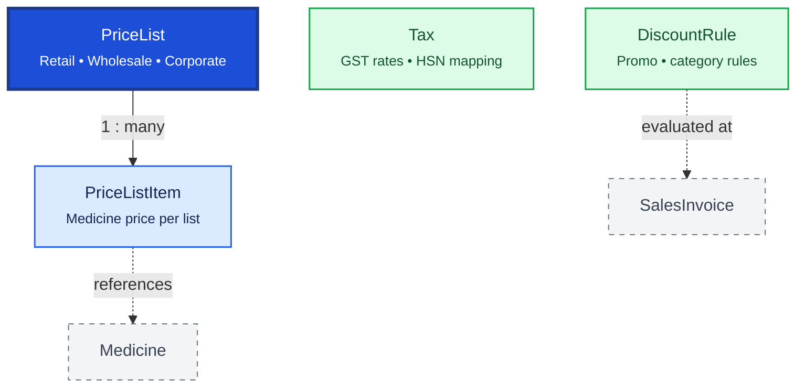

# Pricing

Pricing defines how medicines are priced for different customer groups and scenarios. `PriceList` groups prices; `Tax` and `DiscountRule` apply reusable commercial rules at billing time.

## Relationship Diagram

**Legend:** `PriceList` may be branch-scoped. Final prices are snapshotted on transaction line items.

## How the Tables Work Together

- **PriceList** defines a pricing scheme (Retail, Wholesale, Hospital, Promotional).
- **PriceListItem** stores selling price, discount, and effective dates per medicine within a list.
- **Tax** maintains GST rates, cess, and HSN/SAC mappings with effective date ranges.
- **DiscountRule** defines reusable discount policies (customer category, quantity, campaign).
- Branch-specific sale pricing uses branch-scoped `PriceList` / `PriceListItem` — not on `Batch`.
- Billing evaluates rules at transaction time; line items snapshot the applied price and tax.
- Tax changes should not retroactively alter historical invoice lines.

## Tables

- [[47_price_list]] — price list header.
- [[48_price_list_item]] — medicine price within a price list.
- [[49_tax]] — tax rate master.
- [[50_discount_rule]] — reusable discount policy.
