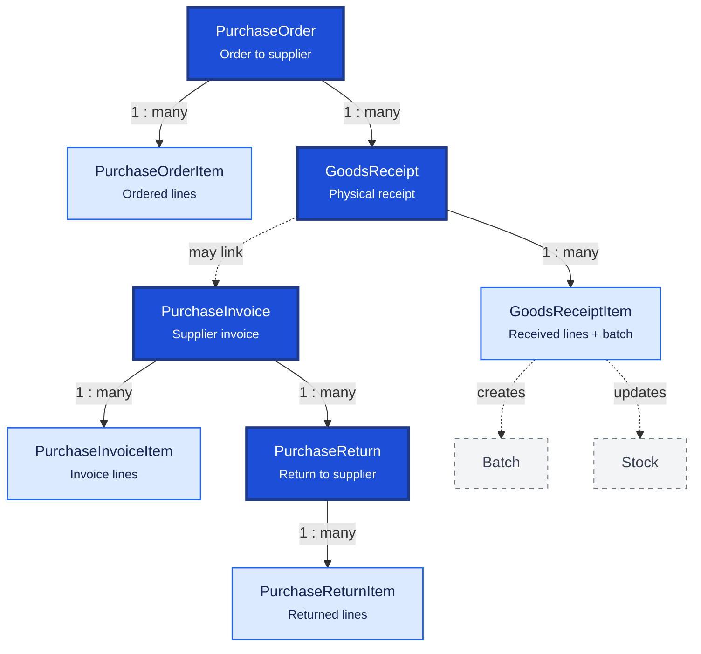

# Purchase

Purchase covers the full procurement lifecycle: ordering from suppliers, receiving goods, recording supplier invoices, and returning stock. Each document type has a header and line-item table.

**Domain documentation:** [Purchasing domain](../../domain/purchasing.md) — PO approval, GRN batch/stock creation, and fulfillment states.

## Relationship Diagram



**Legend:** dashed nodes (`Batch`, `Stock`) are inventory tables updated when goods are received.

## How the Tables Work Together

- **PurchaseOrder** is the procurement request sent to a supplier before goods arrive.
- **PurchaseOrderItem** lists medicines, quantities, and expected prices on the order.
- **GoodsReceipt** records physical delivery; one PO may produce multiple partial receipts.
- **GoodsReceiptItem** captures batch number, expiry, received quantity, and creates `Batch` + `Stock` rows.
- **PurchaseInvoice** is the supplier's financial document for accounting and payment.
- **PurchaseInvoiceItem** line totals drive inventory valuation and cost calculations.
- **PurchaseReturn** handles returns due to expiry, damage, or incorrect supply.
- **PurchaseReturnItem** decreases inventory and may generate supplier credit adjustments.
- All document numbers are unique within branch scope for offline multi-branch safety.
- Posting workflows must be atomic: document + items + stock movements + outbox in one transaction.

## Tables

- [purchase order](#purchaseorder) — purchase order header.
- [purchase order item](#purchaseorderitem) — purchase order line items.
- [goods receipt](#goodsreceipt) — goods receipt note header.
- [goods receipt item](#goodsreceiptitem) — goods receipt line items.
- [purchase invoice](#purchaseinvoice) — supplier purchase invoice header.
- [purchase invoice item](#purchaseinvoiceitem) — purchase invoice line items.
- [purchase return](#purchasereturn) — purchase return header.
- [purchase return item](#purchasereturnitem) — purchase return line items.

---

## Table Specifications

## PurchaseOrder

> Prisma model: `backend/prisma/schema.prisma` (`PurchaseOrder`)

## Purpose

The PurchaseOrder table is the header document for procuring medicines and other products from suppliers.

A Purchase Order (PO) is created before goods are received and serves as the official request sent to a supplier.

It contains document-level information, while individual medicines are stored in the PurchaseOrderItem table.

---

## Business Rules

- Every Purchase Order must have at least one PurchaseOrderItem.
- Every Purchase Order belongs to one Supplier.
- Purchase Orders may be created without immediate approval.
- Only approved Purchase Orders can generate a Goods Receipt.
- A Purchase Order may be partially received.
- A Purchase Order may generate one or more Goods Receipts.
- Closed Purchase Orders cannot be modified.
- Cancelled Purchase Orders do not affect inventory.
- UUID is used for synchronization.
- BIGINT is used as the internal primary key.
- Optimistic locking is maintained using the version column.

---

## Relationships

```
Supplier
     │
     ▼
PurchaseOrder
     │
     ├──────< PurchaseOrderItem
     │
     └────────► GoodsReceipt
```

---

## Columns

| Category | Column | SQLite | PostgreSQL | Nullable | Description |
|----------|--------|---------|------------|----------|-------------|
| Primary Key | id | INTEGER | BIGINT | No | Auto increment primary key |
| Identifier | uuid | TEXT | UUID | No | Global unique identifier |
| Business | purchaseOrderNumber | TEXT | VARCHAR(30) | No | Unique purchase order number |
| Foreign Key | supplierId | INTEGER | BIGINT | No | References Supplier.id |
| Foreign Key | branchId | INTEGER | BIGINT | No | Receiving branch |
| Business | orderDate | DATE | DATE | No | Purchase order date |
| Business | expectedDeliveryDate | DATE | DATE | Yes | Expected delivery date |
| Financial | totalAmount | REAL | NUMERIC(14,2) | No | Total PO amount |
| Financial | taxAmount | REAL | NUMERIC(14,2) | No | Total tax amount |
| Financial | discountAmount | REAL | NUMERIC(14,2) | No | Total discount amount |
| Status | status | TEXT | VARCHAR(20) | No | DRAFT, APPROVED, PARTIALLY_RECEIVED, RECEIVED, CANCELLED, CLOSED |
| Business | remarks | TEXT | TEXT | Yes | Remarks |
| Foreign Key | approvedByEmployeeId | INTEGER | BIGINT | Yes | Approving employee |
| Business | approvedAt | DATETIME | TIMESTAMP | Yes | Approval timestamp |
| Audit | createdAt | DATETIME | TIMESTAMP | No | Record creation timestamp |
| Audit | updatedAt | DATETIME | TIMESTAMP | No | Last update timestamp |
| Audit | deletedAt | DATETIME | TIMESTAMP | Yes | Soft delete timestamp |
| Audit | version | INTEGER | INTEGER | No | Optimistic locking version |

---

## Constraints

- Primary Key (id)
- Unique (uuid)
- Unique (branchId, purchaseOrderNumber) — document numbers are unique per branch, not globally
- Foreign Key (supplierId → Supplier.id)
- Foreign Key (branchId → Branch.id)
- Foreign Key (approvedByEmployeeId → Employee.id)
- CHECK (totalAmount >= 0)
- CHECK (status IN ('DRAFT','APPROVED','PARTIALLY_RECEIVED','RECEIVED','CANCELLED','CLOSED'))
- CHECK (version >= 1)

---

## Indexes

- PK_PurchaseOrder
- UK_PurchaseOrder_UUID
- UK_PurchaseOrder_Number
- IDX_PurchaseOrder_Supplier
- IDX_PurchaseOrder_Date
- IDX_PurchaseOrder_Status
- IDX_PurchaseOrder_Branch

---

## Sample Records

| id | purchaseOrderNumber | supplierId | orderDate | totalAmount | status |
|----|---------------------|------------|-----------|------------:|--------|
| 1 | PO2500001 | 12 | 2026-08-01 | 12450.00 | APPROVED |
| 2 | PO2500002 | 18 | 2026-08-03 | 8750.00 | PARTIALLY_RECEIVED |
| 3 | PO2500003 | 12 | 2026-08-05 | 2450.00 | DRAFT |

---


---

## Notes

- This is the **header table** for procurement documents.
- Individual medicines and quantities are stored in **PurchaseOrderItem**.
- Creating a Purchase Order does **not** affect inventory.
- Inventory changes begin only after a **Goods Receipt** is posted.
- A Purchase Order can be fulfilled through multiple Goods Receipts (partial deliveries).
- Once fully received and invoiced, the Purchase Order should be marked **CLOSED**.
- Supports offline-first synchronization using UUID.
- Compatible with both SQLite and PostgreSQL.

---

## PurchaseOrderItem

> Prisma model: `backend/prisma/schema.prisma` (`PurchaseOrderItem`)

## Purpose

The PurchaseOrderItem table stores the individual medicines and quantities requested in a Purchase Order.

Each record represents one line item within a Purchase Order. It contains product, quantity, pricing, tax, and discount information used for procurement.

---

## Business Rules

- Every PurchaseOrderItem belongs to exactly one PurchaseOrder.
- Every PurchaseOrderItem references one Medicine.
- Ordered Quantity must be greater than zero.
- Received Quantity cannot exceed Ordered Quantity.
- A Purchase Order can contain the same Medicine only once.
- Partial receipt is supported.
- Item prices remain fixed after approval.
- UUID is used for synchronization.
- BIGINT is used as the internal primary key.
- Optimistic locking is maintained using the version column.

---

## Relationships

```
PurchaseOrder (1)
        │
        └──────< PurchaseOrderItem (Many)
                      │
                      ├────────► Medicine
                      ├────────► UnitOfMeasure
                      └────────► GoodsReceiptItem
```

---

## Columns

| Category | Column | SQLite | PostgreSQL | Nullable | Description |
|----------|--------|---------|------------|----------|-------------|
| Primary Key | id | INTEGER | BIGINT | No | Auto increment primary key |
| Identifier | uuid | TEXT | UUID | No | Global unique identifier |
| Foreign Key | purchaseOrderId | INTEGER | BIGINT | No | References PurchaseOrder.id |
| Foreign Key | medicineId | INTEGER | BIGINT | No | References Medicine.id |
| Foreign Key | unitId | INTEGER | BIGINT | No | References UnitOfMeasure.id |
| Business | lineNumber | INTEGER | INTEGER | No | Line sequence number |
| Quantity | orderedQuantity | REAL | NUMERIC(14,3) | No | Ordered quantity |
| Quantity | receivedQuantity | REAL | NUMERIC(14,3) | No | Quantity received |
| Pricing | unitPrice | REAL | NUMERIC(12,2) | No | Purchase price per unit |
| Pricing | discountPercent | REAL | NUMERIC(5,2) | Yes | Discount percentage |
| Pricing | taxPercent | REAL | NUMERIC(5,2) | Yes | Tax percentage |
| Financial | lineAmount | REAL | NUMERIC(14,2) | No | Net line amount |
| Status | isClosed | INTEGER | BOOLEAN | No | Item completely received |
| Audit | createdAt | DATETIME | TIMESTAMP | No | Record creation timestamp |
| Audit | updatedAt | DATETIME | TIMESTAMP | No | Last update timestamp |
| Audit | deletedAt | DATETIME | TIMESTAMP | Yes | Soft delete timestamp |
| Audit | version | INTEGER | INTEGER | No | Optimistic locking version |

---

## Constraints

- Primary Key (id)
- Foreign Key (purchaseOrderId → PurchaseOrder.id)
- Foreign Key (medicineId → Medicine.id)
- Foreign Key (unitId → UnitOfMeasure.id)
- Unique (uuid)
- Unique (purchaseOrderId, medicineId)
- CHECK (orderedQuantity > 0)
- CHECK (receivedQuantity >= 0)
- CHECK (receivedQuantity <= orderedQuantity)
- CHECK (unitPrice >= 0)
- CHECK (version >= 1)

---

## Indexes

- PK_PurchaseOrderItem
- UK_PurchaseOrderItem_UUID
- UK_PurchaseOrderItem_PO_Medicine
- IDX_PurchaseOrderItem_PO
- IDX_PurchaseOrderItem_Medicine
- IDX_PurchaseOrderItem_LineNumber
- IDX_PurchaseOrderItem_Closed

---

## Sample Records

| id | purchaseOrderId | lineNumber | medicineId | orderedQuantity | receivedQuantity | unitPrice |
|----|-----------------|-----------:|-----------:|----------------:|-----------------:|----------:|
| 1 | 1 | 1 | 101 | 100.000 | 100.000 | 8.50 |
| 2 | 1 | 2 | 205 | 50.000 | 25.000 | 42.00 |
| 3 | 2 | 1 | 310 | 20.000 | 0.000 | 125.00 |

---


---

## Notes

- This is the **detail (line item)** table for Purchase Orders.
- One Purchase Order can contain multiple medicines.
- `receivedQuantity` is updated as Goods Receipts are processed.
- A line is considered complete when `receivedQuantity == orderedQuantity`.
- Batch information is **not** stored here; it is captured during **Goods Receipt/Purchase Invoice** processing.
- Inventory is **not** updated from this table.
- Supports offline-first synchronization using UUID.
- Compatible with both SQLite and PostgreSQL.

---

## GoodsReceipt

> Prisma model: `backend/prisma/schema.prisma` (`GoodsReceipt`)

## Purpose

The GoodsReceipt table records the physical receipt of goods from a supplier.

It confirms that the ordered medicines have arrived and captures the receipt transaction before supplier invoicing. Goods Receipt allows partial deliveries and serves as the basis for batch creation and inventory updates.

---

## Business Rules

- Every Goods Receipt belongs to one Supplier.
- A Goods Receipt may reference one Purchase Order.
- A Purchase Order can generate multiple Goods Receipts.
- Goods Receipt must contain at least one GoodsReceiptItem.
- Goods can be received without a Purchase Order only if company policy permits.
- Posting a Goods Receipt creates inventory batches and stock movements.
- Once posted, the document becomes read-only.
- Cancelled Goods Receipts require reversal transactions rather than deletion.
- UUID is used for synchronization.
- BIGINT is used as the internal primary key.
- Optimistic locking is maintained using the version column.

---

## Relationships

```
Supplier
     │
     ▼
PurchaseOrder
     │
     ▼
GoodsReceipt
     │
     ├──────< GoodsReceiptItem
     │
     ├────────► Batch
     ├────────► Stock
     └────────► StockMovement
```

---

## Columns

| Category | Column | SQLite | PostgreSQL | Nullable | Description |
|----------|--------|---------|------------|----------|-------------|
| Primary Key | id | INTEGER | BIGINT | No | Auto increment primary key |
| Identifier | uuid | TEXT | UUID | No | Global unique identifier |
| Business | goodsReceiptNumber | TEXT | VARCHAR(30) | No | Unique GRN number |
| Foreign Key | purchaseOrderId | INTEGER | BIGINT | Yes | References PurchaseOrder.id |
| Foreign Key | supplierId | INTEGER | BIGINT | No | References Supplier.id |
| Foreign Key | branchId | INTEGER | BIGINT | No | Receiving branch |
| Business | receiptDate | DATETIME | TIMESTAMP | No | Goods receipt date |
| Business | supplierChallanNo | TEXT | VARCHAR(50) | Yes | Supplier delivery challan |
| Business | vehicleNumber | TEXT | VARCHAR(20) | Yes | Delivery vehicle |
| Status | status | TEXT | VARCHAR(20) | No | DRAFT, POSTED, CANCELLED |
| Business | remarks | TEXT | TEXT | Yes | General remarks |
| Foreign Key | receivedByEmployeeId | INTEGER | BIGINT | No | Employee receiving goods |
| Audit | createdAt | DATETIME | TIMESTAMP | No | Record creation timestamp |
| Audit | updatedAt | DATETIME | TIMESTAMP | No | Last update timestamp |
| Audit | deletedAt | DATETIME | TIMESTAMP | Yes | Soft delete timestamp |
| Audit | version | INTEGER | INTEGER | No | Optimistic locking version |

---

## Constraints

- Primary Key (id)
- Unique (uuid)
- Unique (branchId, goodsReceiptNumber) — document numbers are unique per branch, not globally
- Foreign Key (purchaseOrderId → PurchaseOrder.id)
- Foreign Key (supplierId → Supplier.id)
- Foreign Key (branchId → Branch.id)
- Foreign Key (receivedByEmployeeId → Employee.id)
- CHECK (status IN ('DRAFT','POSTED','CANCELLED'))
- CHECK (version >= 1)

---

## Indexes

- PK_GoodsReceipt
- UK_GoodsReceipt_UUID
- UK_GoodsReceipt_Number
- IDX_GoodsReceipt_PO
- IDX_GoodsReceipt_Supplier
- IDX_GoodsReceipt_Date
- IDX_GoodsReceipt_Status

---

## Sample Records

| id | goodsReceiptNumber | purchaseOrderId | supplierId | receiptDate | status |
|----|--------------------|-----------------|------------|-------------|--------|
| 1 | GRN2500001 | 1 | 12 | 2026-08-05 | POSTED |
| 2 | GRN2500002 | 2 | 18 | 2026-08-06 | DRAFT |
| 3 | GRN2500003 | 1 | 12 | 2026-08-08 | POSTED |

---


---

## Notes

- This is the **header table** for goods receipt transactions.
- Individual medicines, batches, expiry dates, and received quantities belong in **GoodsReceiptItem**.
- Posting a Goods Receipt should:
  - Create Batch records (if new batches are received).
  - Create StockMovement entries.
  - Update the Stock table.
  - Update the received quantity in the related PurchaseOrderItem.
- Supplier invoices may be matched later through the **PurchaseInvoice** module.
- Supports offline-first synchronization using UUID.
- Compatible with both SQLite and PostgreSQL.

---

## GoodsReceiptItem

> Prisma model: `backend/prisma/schema.prisma` (`GoodsReceiptItem`)

## Purpose

The GoodsReceiptItem table stores the individual medicines received in a Goods Receipt.

Each record represents one medicine batch received from the supplier and captures the batch number, manufacturing date, expiry date, quantity, and pricing information.

Posting a Goods Receipt Item results in:

- Batch creation (or update)
- StockMovement creation
- Stock update
- Purchase Order fulfillment update

---

## Business Rules

- Every GoodsReceiptItem belongs to exactly one GoodsReceipt.
- Every GoodsReceiptItem references one Medicine.
- Every GoodsReceiptItem may reference one PurchaseOrderItem.
- Batch Number is mandatory.
- Expiry Date is mandatory for medicines.
- Received Quantity must be greater than zero.
- Multiple batches of the same medicine may exist within one Goods Receipt.
- Posting the Goods Receipt creates or updates Batch records.
- UUID is used for synchronization.
- BIGINT is used as the internal primary key.
- Optimistic locking is maintained using the version column.

---

## Relationships

```
GoodsReceipt (1)
      │
      └──────< GoodsReceiptItem (Many)
                    │
                    ├────────► PurchaseOrderItem
                    ├────────► Medicine
                    ├────────► UnitOfMeasure
                    ├────────► Batch
                    ├────────► Stock
                    └────────► StockMovement
```

---

## Columns

| Category | Column | SQLite | PostgreSQL | Nullable | Description |
|----------|--------|---------|------------|----------|-------------|
| Primary Key | id | INTEGER | BIGINT | No | Auto increment primary key |
| Identifier | uuid | TEXT | UUID | No | Global unique identifier |
| Foreign Key | goodsReceiptId | INTEGER | BIGINT | No | References GoodsReceipt.id |
| Foreign Key | purchaseOrderItemId | INTEGER | BIGINT | Yes | References PurchaseOrderItem.id |
| Foreign Key | medicineId | INTEGER | BIGINT | No | References Medicine.id |
| Foreign Key | unitId | INTEGER | BIGINT | No | References UnitOfMeasure.id |
| Business | lineNumber | INTEGER | INTEGER | No | Line sequence number |
| Product | batchNumber | TEXT | VARCHAR(50) | No | Manufacturer batch number |
| Product | manufacturingDate | DATE | DATE | Yes | Manufacturing date |
| Product | expiryDate | DATE | DATE | No | Expiry date |
| Quantity | receivedQuantity | REAL | NUMERIC(14,3) | No | Quantity received |
| Pricing | purchaseRate | REAL | NUMERIC(12,2) | No | Purchase rate |
| Pricing | mrp | REAL | NUMERIC(12,2) | No | Maximum Retail Price |
| Pricing | saleRate | REAL | NUMERIC(12,2) | No | Selling price |
| Financial | lineAmount | REAL | NUMERIC(14,2) | No | Line total amount |
| Business | remarks | TEXT | TEXT | Yes | Line remarks |
| Audit | createdAt | DATETIME | TIMESTAMP | No | Record creation timestamp |
| Audit | updatedAt | DATETIME | TIMESTAMP | No | Last update timestamp |
| Audit | deletedAt | DATETIME | TIMESTAMP | Yes | Soft delete timestamp |
| Audit | version | INTEGER | INTEGER | No | Optimistic locking version |

---

## Constraints

- Primary Key (id)
- Foreign Key (goodsReceiptId → GoodsReceipt.id)
- Foreign Key (purchaseOrderItemId → PurchaseOrderItem.id)
- Foreign Key (medicineId → Medicine.id)
- Foreign Key (unitId → UnitOfMeasure.id)
- Unique (uuid)
- CHECK (receivedQuantity > 0)
- CHECK (purchaseRate >= 0)
- CHECK (mrp >= 0)
- CHECK (saleRate >= 0)
- CHECK (expiryDate >= manufacturingDate)
- CHECK (version >= 1)

---

## Indexes

- PK_GoodsReceiptItem
- UK_GoodsReceiptItem_UUID
- IDX_GoodsReceiptItem_GR
- IDX_GoodsReceiptItem_POItem
- IDX_GoodsReceiptItem_Medicine
- IDX_GoodsReceiptItem_Batch
- IDX_GoodsReceiptItem_Expiry

---

## Sample Records

| id | goodsReceiptId | lineNumber | medicineId | batchNumber | expiryDate | receivedQuantity |
|----|----------------|-----------:|-----------:|-------------|------------|-----------------:|
| 1 | 1 | 1 | 101 | PCM240101 | 2027-01-31 | 100.000 |
| 2 | 1 | 2 | 205 | AUG240220 | 2026-12-31 | 50.000 |
| 3 | 2 | 1 | 310 | CET240301 | 2028-03-31 | 25.000 |

---


---

## Notes

- This is the **detail (line item)** table for the Goods Receipt document.
- Each line normally results in the creation of a **Batch** (or updates an existing batch if permitted by business rules).
- Posting a Goods Receipt Item should:
  - Update the corresponding **PurchaseOrderItem.receivedQuantity**.
  - Create or update the **Batch**.
  - Create an **IN** StockMovement.
  - Update the current **Stock** balance.
- Batch-level information is captured here because different batches of the same medicine may be received in a single delivery.
- Historical Goods Receipt Items should never be deleted after posting.
- Supports offline-first synchronization using UUID.
- Compatible with both SQLite and PostgreSQL.

---

## PurchaseInvoice

> Prisma model: `backend/prisma/schema.prisma` (`PurchaseInvoice`)

## Purpose

The PurchaseInvoice table stores supplier invoices received for purchased medicines and products.

A Purchase Invoice represents the financial document issued by the supplier. It records the payable amount, taxes, discounts, and payment status.

Inventory should normally already be updated through the Goods Receipt process. The Purchase Invoice is primarily used for accounting, supplier reconciliation, and payment processing.

---

## Business Rules

- Every Purchase Invoice belongs to one Supplier.
- A Purchase Invoice may reference one Goods Receipt.
- A Goods Receipt can generate one or more Purchase Invoices.
- Purchase Invoice must contain at least one PurchaseInvoiceItem.
- Supplier Invoice Number should be unique per Supplier.
- Posted invoices cannot be modified.
- Cancelled invoices require reversal accounting entries.
- UUID is used for synchronization.
- BIGINT is used as the internal primary key.
- Optimistic locking is maintained using the version column.

---

## Relationships

```
Supplier
     │
     ▼
PurchaseInvoice
     │
     ├──────< PurchaseInvoiceItem
     │
     ├────────► GoodsReceipt
     ├────────► Payment
     └────────► LedgerEntry
```

---

## Columns

| Category | Column | SQLite | PostgreSQL | Nullable | Description |
|----------|--------|---------|------------|----------|-------------|
| Primary Key | id | INTEGER | BIGINT | No | Auto increment primary key |
| Identifier | uuid | TEXT | UUID | No | Global unique identifier |
| Business | purchaseInvoiceNumber | TEXT | VARCHAR(30) | No | Internal purchase invoice number |
| Business | supplierInvoiceNumber | TEXT | VARCHAR(50) | No | Supplier invoice number |
| Foreign Key | supplierId | INTEGER | BIGINT | No | References Supplier.id |
| Foreign Key | goodsReceiptId | INTEGER | BIGINT | Yes | References GoodsReceipt.id |
| Foreign Key | branchId | INTEGER | BIGINT | No | Receiving branch |
| Business | invoiceDate | DATE | DATE | No | Supplier invoice date |
| Business | dueDate | DATE | DATE | Yes | Payment due date |
| Financial | grossAmount | REAL | NUMERIC(14,2) | No | Gross amount |
| Financial | discountAmount | REAL | NUMERIC(14,2) | No | Total discount |
| Financial | taxAmount | REAL | NUMERIC(14,2) | No | Total tax |
| Financial | netAmount | REAL | NUMERIC(14,2) | No | Net payable amount |
| Financial | paidAmount | REAL | NUMERIC(14,2) | No | Amount paid |
| Financial | balanceAmount | REAL | NUMERIC(14,2) | No | Outstanding balance |
| Status | status | TEXT | VARCHAR(20) | No | DRAFT, POSTED, PARTIALLY_PAID, PAID, CANCELLED |
| Business | remarks | TEXT | TEXT | Yes | Invoice remarks |
| Audit | createdAt | DATETIME | TIMESTAMP | No | Record creation timestamp |
| Audit | updatedAt | DATETIME | TIMESTAMP | No | Last update timestamp |
| Audit | deletedAt | DATETIME | TIMESTAMP | Yes | Soft delete timestamp |
| Audit | version | INTEGER | INTEGER | No | Optimistic locking version |

---

## Constraints

- Primary Key (id)
- Unique (uuid)
- Unique (branchId, purchaseInvoiceNumber) — document numbers are unique per branch, not globally
- Unique (supplierId, supplierInvoiceNumber)
- Foreign Key (supplierId → Supplier.id)
- Foreign Key (goodsReceiptId → GoodsReceipt.id)
- Foreign Key (branchId → Branch.id)
- CHECK (grossAmount >= 0)
- CHECK (netAmount >= 0)
- CHECK (paidAmount >= 0)
- CHECK (balanceAmount >= 0)
- CHECK (status IN ('DRAFT','POSTED','PARTIALLY_PAID','PAID','CANCELLED'))
- CHECK (version >= 1)

---

## Indexes

- PK_PurchaseInvoice
- UK_PurchaseInvoice_UUID
- UK_PurchaseInvoice_Number
- UK_PurchaseInvoice_SupplierInvoice
- IDX_PurchaseInvoice_Supplier
- IDX_PurchaseInvoice_Date
- IDX_PurchaseInvoice_Status
- IDX_PurchaseInvoice_DueDate

---

## Sample Records

| id | purchaseInvoiceNumber | supplierInvoiceNumber | supplierId | invoiceDate | netAmount | status |
|----|-----------------------|-----------------------|-----------:|-------------|----------:|--------|
| 1 | PI2500001 | INV-4587 | 12 | 2026-08-05 | 12,450.00 | POSTED |
| 2 | PI2500002 | APL-9982 | 18 | 2026-08-06 | 8,750.00 | PARTIALLY_PAID |
| 3 | PI2500003 | SUP-7788 | 12 | 2026-08-08 | 2,450.00 | DRAFT |

---


---

## Notes

- This is the **header table** for supplier invoices.
- Individual medicines are stored in **PurchaseInvoiceItem**.
- The invoice represents the supplier's financial claim and forms the basis for Accounts Payable.
- Payments made to suppliers should reference this table.
- If the business follows a **GRN-based inventory process**, inventory should already be updated during Goods Receipt. Posting the Purchase Invoice should create accounting entries only and **must not** update stock again.
- Supports offline-first synchronization using UUID.
- Compatible with both SQLite and PostgreSQL.

---

## PurchaseInvoiceItem

> Prisma model: `backend/prisma/schema.prisma` (`PurchaseInvoiceItem`)

## Purpose

The PurchaseInvoiceItem table stores the individual medicines billed in a supplier's Purchase Invoice.

Each record represents one line item within the Purchase Invoice and contains medicine, batch, quantity, pricing, taxes, discounts, and financial information.

When the ERP uses a **Goods Receipt (GRN)** process, this table primarily serves financial reconciliation. Inventory should already have been updated through the Goods Receipt process.

---

## Business Rules

- Every PurchaseInvoiceItem belongs to exactly one PurchaseInvoice.
- Every PurchaseInvoiceItem references one Medicine.
- Every PurchaseInvoiceItem references one Batch.
- Every PurchaseInvoiceItem may reference one GoodsReceiptItem.
- Invoice Quantity must be greater than zero.
- Unit Price cannot be negative.
- Invoice lines become read-only after posting.
- Financial totals should always equal the PurchaseInvoice totals.
- UUID is used for synchronization.
- BIGINT is used as the internal primary key.
- Optimistic locking is maintained using the version column.

---

## Relationships

```
PurchaseInvoice (1)
        │
        └──────< PurchaseInvoiceItem (Many)
                      │
                      ├────────► GoodsReceiptItem
                      ├────────► Medicine
                      ├────────► Batch
                      ├────────► UnitOfMeasure
                      └────────► Tax
```

---

## Columns

| Category | Column | SQLite | PostgreSQL | Nullable | Description |
|----------|--------|---------|------------|----------|-------------|
| Primary Key | id | INTEGER | BIGINT | No | Auto increment primary key |
| Identifier | uuid | TEXT | UUID | No | Global unique identifier |
| Foreign Key | purchaseInvoiceId | INTEGER | BIGINT | No | References PurchaseInvoice.id |
| Foreign Key | goodsReceiptItemId | INTEGER | BIGINT | Yes | References GoodsReceiptItem.id |
| Foreign Key | medicineId | INTEGER | BIGINT | No | References Medicine.id |
| Foreign Key | batchId | INTEGER | BIGINT | No | References Batch.id |
| Foreign Key | unitId | INTEGER | BIGINT | No | References UnitOfMeasure.id |
| Business | lineNumber | INTEGER | INTEGER | No | Line sequence number |
| Quantity | invoiceQuantity | REAL | NUMERIC(14,3) | No | Invoiced quantity |
| Pricing | unitPrice | REAL | NUMERIC(12,2) | No | Purchase price per unit |
| Pricing | discountPercent | REAL | NUMERIC(5,2) | Yes | Discount percentage |
| Pricing | discountAmount | REAL | NUMERIC(12,2) | No | Discount amount |
| Pricing | taxPercent | REAL | NUMERIC(5,2) | Yes | Tax percentage |
| Pricing | taxAmount | REAL | NUMERIC(12,2) | No | Tax amount |
| Financial | lineAmount | REAL | NUMERIC(14,2) | No | Net line amount |
| Business | remarks | TEXT | TEXT | Yes | Line remarks |
| Audit | createdAt | DATETIME | TIMESTAMP | No | Record creation timestamp |
| Audit | updatedAt | DATETIME | TIMESTAMP | No | Last update timestamp |
| Audit | deletedAt | DATETIME | TIMESTAMP | Yes | Soft delete timestamp |
| Audit | version | INTEGER | INTEGER | No | Optimistic locking version |

---

## Constraints

- Primary Key (id)
- Foreign Key (purchaseInvoiceId → PurchaseInvoice.id)
- Foreign Key (goodsReceiptItemId → GoodsReceiptItem.id)
- Foreign Key (medicineId → Medicine.id)
- Foreign Key (batchId → Batch.id)
- Foreign Key (unitId → UnitOfMeasure.id)
- Unique (uuid)
- CHECK (invoiceQuantity > 0)
- CHECK (unitPrice >= 0)
- CHECK (discountAmount >= 0)
- CHECK (taxAmount >= 0)
- CHECK (lineAmount >= 0)
- CHECK (version >= 1)

---

## Indexes

- PK_PurchaseInvoiceItem
- UK_PurchaseInvoiceItem_UUID
- IDX_PurchaseInvoiceItem_Invoice
- IDX_PurchaseInvoiceItem_GRItem
- IDX_PurchaseInvoiceItem_Medicine
- IDX_PurchaseInvoiceItem_Batch
- IDX_PurchaseInvoiceItem_LineNumber

---

## Sample Records

| id | purchaseInvoiceId | lineNumber | medicineId | batchId | invoiceQuantity | unitPrice | lineAmount |
|----|------------------:|-----------:|-----------:|--------:|----------------:|----------:|-----------:|
| 1 | 1 | 1 | 101 | 501 | 100.000 | 8.50 | 850.00 |
| 2 | 1 | 2 | 205 | 502 | 50.000 | 42.00 | 2100.00 |
| 3 | 2 | 1 | 310 | 503 | 20.000 | 125.00 | 2500.00 |

---


---

## Notes

- This is the **detail (line item)** table for the Purchase Invoice document.
- Each invoice item should normally reference the corresponding **GoodsReceiptItem** to support three-way matching (**Purchase Order → Goods Receipt → Purchase Invoice**).
- Inventory should **not** be updated from this table when the ERP uses a GRN process.
- Batch information is referenced rather than recreated.
- Financial values from all line items should reconcile with the PurchaseInvoice header totals.
- Historical invoice items should never be deleted after posting.
- Supports offline-first synchronization using UUID.
- Compatible with both SQLite and PostgreSQL.

---

## PurchaseReturn

> Prisma model: `backend/prisma/schema.prisma` (`PurchaseReturn`)

## Purpose

The PurchaseReturn table represents the **header document** for returning purchased medicines or products to a supplier.

Purchase Returns are created when goods need to be sent back due to:

- Expired medicines
- Damaged goods
- Wrong medicine supplied
- Excess quantity received
- Batch recall
- Pricing disputes
- Quality issues

Posting a Purchase Return reduces inventory, creates StockMovement records, adjusts supplier payable balances, and may generate a supplier credit note.

---

## Business Rules

- Every Purchase Return belongs to exactly one Supplier.
- Every Purchase Return contains one or more PurchaseReturnItems.
- A Purchase Return may reference one Purchase Invoice.
- A Purchase Invoice can have multiple Purchase Returns.
- Return quantity cannot exceed the available purchased quantity.
- Approved returns cannot be modified.
- Cancelling a return requires reversal inventory and accounting entries.
- Every approved Purchase Return creates **OUT** StockMovement records.
- UUID is used for synchronization.
- BIGINT is used as the internal primary key.
- Optimistic locking is maintained using the version column.

---

## Relationships

```
Supplier
     │
     ▼
PurchaseInvoice
     │
     ▼
PurchaseReturn
     │
     ├──────< PurchaseReturnItem
     │
     ├────────► StockMovement
     └────────► LedgerEntry
```

---

## Columns

| Category | Column | SQLite | PostgreSQL | Nullable | Description |
|----------|--------|---------|------------|----------|-------------|
| Primary Key | id | INTEGER | BIGINT | No | Auto increment primary key |
| Identifier | uuid | TEXT | UUID | No | Global unique identifier |
| Business | purchaseReturnNumber | TEXT | VARCHAR(30) | No | Internal return document number |
| Foreign Key | supplierId | INTEGER | BIGINT | No | References Supplier.id |
| Foreign Key | purchaseInvoiceId | INTEGER | BIGINT | Yes | References PurchaseInvoice.id |
| Foreign Key | branchId | INTEGER | BIGINT | No | Branch returning goods |
| Business | returnDate | DATE | DATE | No | Return date |
| Business | returnReason | TEXT | TEXT | No | Reason for return |
| Financial | totalAmount | REAL | NUMERIC(14,2) | No | Total return value |
| Status | status | TEXT | VARCHAR(20) | No | DRAFT, APPROVED, SENT, COMPLETED, CANCELLED |
| Business | supplierCreditNoteNo | TEXT | VARCHAR(50) | Yes | Supplier credit note reference |
| Business | remarks | TEXT | TEXT | Yes | General remarks |
| Foreign Key | approvedByEmployeeId | INTEGER | BIGINT | Yes | Approving employee |
| Business | approvedAt | DATETIME | TIMESTAMP | Yes | Approval timestamp |
| Audit | createdAt | DATETIME | TIMESTAMP | No | Record creation timestamp |
| Audit | updatedAt | DATETIME | TIMESTAMP | No | Last update timestamp |
| Audit | deletedAt | DATETIME | TIMESTAMP | Yes | Soft delete timestamp |
| Audit | version | INTEGER | INTEGER | No | Optimistic locking version |

---

## Constraints

- Primary Key (id)
- Unique (uuid)
- Unique (purchaseReturnNumber)
- Foreign Key (supplierId → Supplier.id)
- Foreign Key (purchaseInvoiceId → PurchaseInvoice.id)
- Foreign Key (branchId → Branch.id)
- Foreign Key (approvedByEmployeeId → Employee.id)
- CHECK (totalAmount >= 0)
- CHECK (status IN ('DRAFT','APPROVED','SENT','COMPLETED','CANCELLED'))
- CHECK (version >= 1)

---

## Indexes

- PK_PurchaseReturn
- UK_PurchaseReturn_UUID
- UK_PurchaseReturn_Number
- IDX_PurchaseReturn_Supplier
- IDX_PurchaseReturn_Invoice
- IDX_PurchaseReturn_Date
- IDX_PurchaseReturn_Status

---

## Sample Records

| id | purchaseReturnNumber | supplierId | purchaseInvoiceId | returnDate | totalAmount | status |
|----|----------------------|-----------:|------------------:|------------|------------:|--------|
| 1 | PR2500001 | 12 | 1 | 2026-08-12 | 1,250.00 | APPROVED |
| 2 | PR2500002 | 18 | 2 | 2026-08-15 | 850.00 | SENT |
| 3 | PR2500003 | 12 | 1 | 2026-08-18 | 425.00 | DRAFT |

---


---

## Notes

- This is the **header table** for Purchase Return documents.
- Individual medicines are stored in **PurchaseReturnItem**.
- Posting a Purchase Return should:
  - Reduce inventory through **StockMovement (OUT)**.
  - Update the **Stock** table.
  - Reduce supplier payable.
  - Generate accounting entries.
- Return quantities should be validated against the original Purchase Invoice or Goods Receipt.
- Historical Purchase Returns should never be deleted after approval.
- Supports offline-first synchronization using UUID.
- Compatible with both SQLite and PostgreSQL.

---

## PurchaseReturnItem

> Prisma model: `backend/prisma/schema.prisma` (`PurchaseReturnItem`)

## Purpose

The PurchaseReturnItem table stores the individual medicines being returned to a supplier as part of a Purchase Return document.

Each record represents one medicine batch being returned and contains the quantity, batch information, pricing, taxes, and financial values. Posting a Purchase Return Item reduces inventory and creates the corresponding StockMovement and accounting entries.

---

## Business Rules

- Every PurchaseReturnItem belongs to exactly one PurchaseReturn.
- Every PurchaseReturnItem references one PurchaseInvoiceItem.
- Every PurchaseReturnItem references one Batch.
- Return Quantity must be greater than zero.
- Return Quantity cannot exceed the available quantity from the original Purchase Invoice.
- A returned batch must exist in inventory.
- Once approved, Purchase Return Items become read-only.
- UUID is used for synchronization.
- BIGINT is used as the internal primary key.
- Optimistic locking is maintained using the version column.

---

## Relationships

```
PurchaseReturn (1)
        │
        └──────< PurchaseReturnItem (Many)
                      │
                      ├────────► PurchaseInvoiceItem
                      ├────────► Batch
                      ├────────► Medicine
                      ├────────► UnitOfMeasure
                      ├────────► StockMovement
                      └────────► LedgerEntry
```

---

## Columns

| Category | Column | SQLite | PostgreSQL | Nullable | Description |
|----------|--------|---------|------------|----------|-------------|
| Primary Key | id | INTEGER | BIGINT | No | Auto increment primary key |
| Identifier | uuid | TEXT | UUID | No | Global unique identifier |
| Foreign Key | purchaseReturnId | INTEGER | BIGINT | No | References PurchaseReturn.id |
| Foreign Key | purchaseInvoiceItemId | INTEGER | BIGINT | No | References PurchaseInvoiceItem.id |
| Foreign Key | medicineId | INTEGER | BIGINT | No | References Medicine.id |
| Foreign Key | batchId | INTEGER | BIGINT | No | References Batch.id |
| Foreign Key | unitId | INTEGER | BIGINT | No | References UnitOfMeasure.id |
| Business | lineNumber | INTEGER | INTEGER | No | Line sequence number |
| Quantity | returnQuantity | REAL | NUMERIC(14,3) | No | Quantity being returned |
| Pricing | unitPrice | REAL | NUMERIC(12,2) | No | Purchase price per unit |
| Pricing | discountAmount | REAL | NUMERIC(12,2) | No | Discount amount |
| Pricing | taxAmount | REAL | NUMERIC(12,2) | No | Tax amount |
| Financial | lineAmount | REAL | NUMERIC(14,2) | No | Net return amount |
| Business | returnReason | TEXT | TEXT | No | Item-level return reason |
| Business | remarks | TEXT | TEXT | Yes | Additional remarks |
| Audit | createdAt | DATETIME | TIMESTAMP | No | Record creation timestamp |
| Audit | updatedAt | DATETIME | TIMESTAMP | No | Last update timestamp |
| Audit | deletedAt | DATETIME | TIMESTAMP | Yes | Soft delete timestamp |
| Audit | version | INTEGER | INTEGER | No | Optimistic locking version |

---

## Constraints

- Primary Key (id)
- Foreign Key (purchaseReturnId → PurchaseReturn.id)
- Foreign Key (purchaseInvoiceItemId → PurchaseInvoiceItem.id)
- Foreign Key (medicineId → Medicine.id)
- Foreign Key (batchId → Batch.id)
- Foreign Key (unitId → UnitOfMeasure.id)
- Unique (uuid)
- CHECK (returnQuantity > 0)
- CHECK (unitPrice >= 0)
- CHECK (lineAmount >= 0)
- CHECK (version >= 1)

---

## Indexes

- PK_PurchaseReturnItem
- UK_PurchaseReturnItem_UUID
- IDX_PurchaseReturnItem_Return
- IDX_PurchaseReturnItem_InvoiceItem
- IDX_PurchaseReturnItem_Batch
- IDX_PurchaseReturnItem_Medicine
- IDX_PurchaseReturnItem_LineNumber

---

## Sample Records

| id | purchaseReturnId | lineNumber | medicineId | batchId | returnQuantity | unitPrice | lineAmount |
|----|-----------------:|-----------:|-----------:|--------:|---------------:|----------:|-----------:|
| 1 | 1 | 1 | 101 | 501 | 10.000 | 8.50 | 85.00 |
| 2 | 1 | 2 | 205 | 502 | 5.000 | 42.00 | 210.00 |
| 3 | 2 | 1 | 310 | 503 | 2.000 | 125.00 | 250.00 |

---


---

## Notes

- This is the **detail (line item)** table for the Purchase Return document.
- Every item should reference the original **PurchaseInvoiceItem** to ensure complete traceability.
- The returned **Batch** must be explicitly identified because returns are batch-specific in pharmacy operations.
- Posting a Purchase Return Item should:
  - Create an **OUT** StockMovement.
  - Reduce the current Stock quantity.
  - Reduce supplier payable or generate a supplier credit note.
- The system should prevent returning more than the quantity originally purchased, taking previous returns into account.
- Historical Purchase Return Items should never be deleted after approval.
- Supports offline-first synchronization using UUID.
- Compatible with both SQLite and PostgreSQL.
