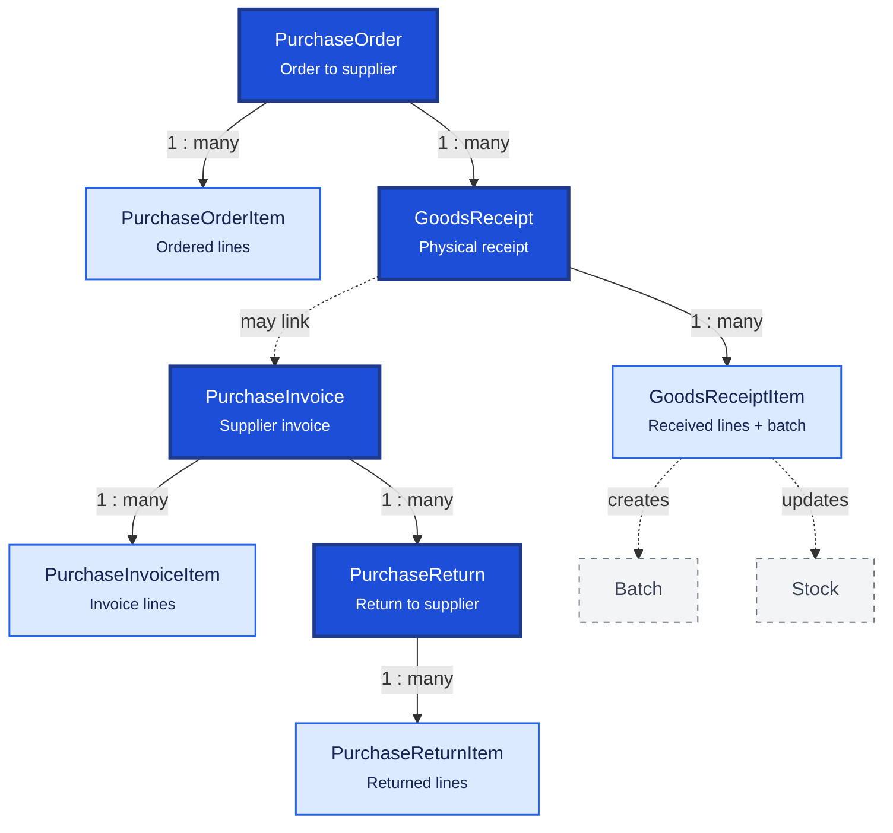

# Purchase

Purchase covers the full procurement lifecycle: ordering from suppliers, receiving goods, recording supplier invoices, and returning stock. Each document type has a header and line-item table.

**Domain documentation:** [Purchasing domain overview](../../domain/purchasing/README.md) — PO approval, GRN batch/stock creation, and fulfillment states.

## Relationship Diagram

**Legend:** dashed nodes (`Batch`, `Stock`) are inventory tables updated when goods are received.

## How the Tables Work Together

- **PurchaseOrder** is the procurement request sent to a supplier before goods arrive.
- **PurchaseOrderItem** lists medicines, quantities, and expected prices on the order.
- **GoodsReceipt** records physical delivery; one PO may produce multiple partial receipts.
- **GoodsReceiptItem** captures batch number, expiry, received quantity, and creates `Batch` + `Stock` rows.
- **PurchaseInvoice** is the supplier's financial document for accounting and payment.
- **PurchaseInvoiceItem** line totals drive inventory valuation and cost calculations.
- **PurchaseReturn** handles returns due to expiry, damage, or incorrect supply.
- **PurchaseReturnItem** decreases inventory and may generate supplier credit adjustments.
- All document numbers are unique within branch scope for offline multi-branch safety.
- Posting workflows must be atomic: document + items + stock movements + outbox in one transaction.

## Tables

- [[30_purchase_order]] — purchase order header.
- [[31_purchase_order_item]] — purchase order line items.
- [[32_goods_receipt]] — goods receipt note header.
- [[33_goods_receipt_item]] — goods receipt line items.
- [[34_purchase_invoice]] — supplier purchase invoice header.
- [[35_purchase_invoice_item]] — purchase invoice line items.
- [[36_purchase_return]] — purchase return header.
- [[37_purchase_return_item]] — purchase return line items.
