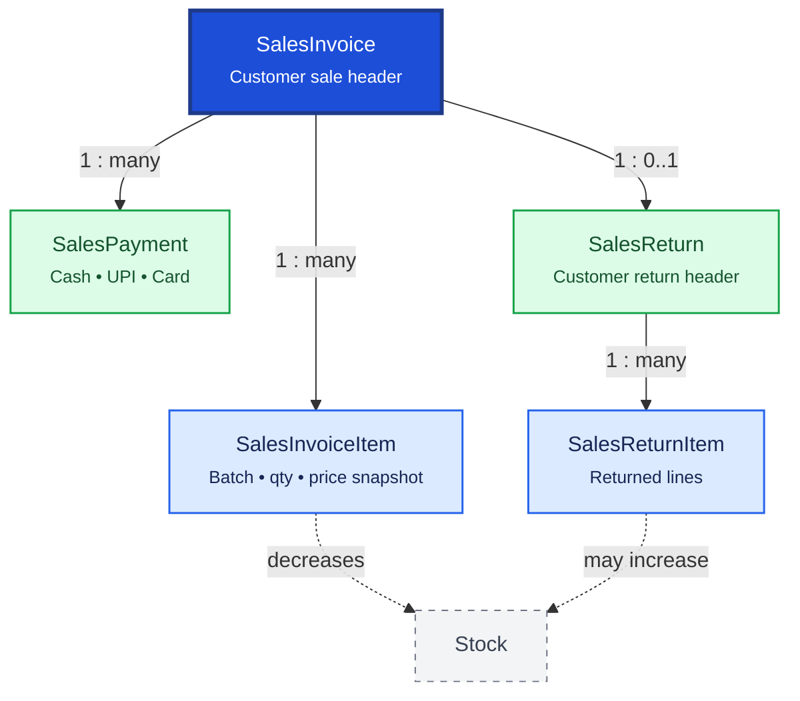

# Sales

Sales records customer transactions from invoice through payment and returns. `SalesInvoice` is the primary billing document; line items snapshot batch, price, and tax at sale time.

**Domain documentation:** [Sales domain overview](../../domain/sales/README.md) — business rules, workflows, and permissions. There is no `SalesOrder` or `Quotation` table in the current schema.

## Relationship Diagram

**Legend:** dashed `Stock` node shows inventory impact on posting. `SalesReturn` references the original invoice.

## How the Tables Work Together

- **SalesInvoice** is the customer billing document with totals, tax, discounts, and optional prescribing doctor.
- **SalesInvoiceItem** snapshots batch, quantity, selling price, MRP, GST, and line total at transaction time.
- **SalesPayment** records payments (Cash, UPI, Card, mixed modes) including partial and advance payments.
- **SalesReturn** handles customer returns with reason, approval status, and refund method.
- **SalesReturnItem** restores inventory where applicable and maintains batch-level traceability.
- Invoice numbers are unique within branch scope.
- Posting must atomically update invoice, items, stock movements, and outbox.
- Schedule H medicines may require prescription and patient/doctor fields on the invoice.

## Tables

- [[38_sales_invoice]] — sales invoice header.
- [[39_sales_invoice_item]] — sales invoice line items.
- [[40_sales_return]] — sales return header.
- [[41_sales_return_item]] — sales return line items.
- [[42_sales_payment]] — payment received against sales invoices.
