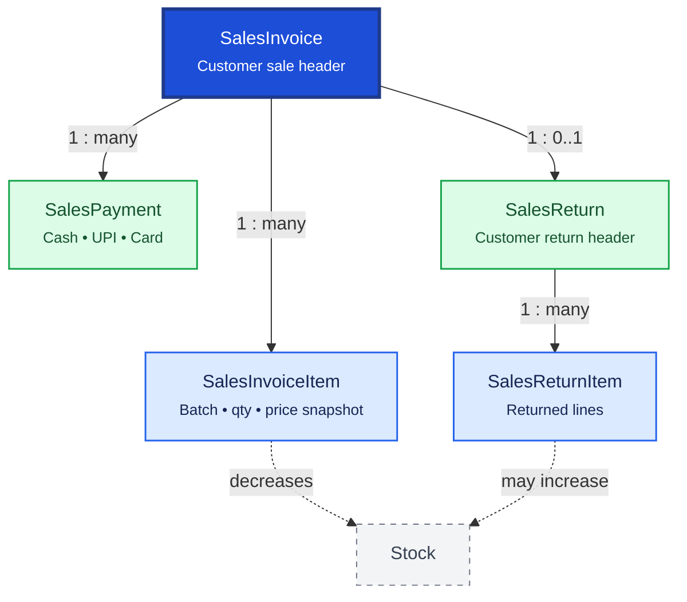

# Sales

Sales records customer transactions from invoice through payment and returns. `SalesInvoice` is the primary billing document; line items snapshot batch, price, and tax at sale time.

**Domain documentation:** [Sales domain overview](../../domain/sales.md) — business rules, workflows, and permissions. There is no `SalesOrder` or `Quotation` table in the current schema.

## Relationship Diagram



**Legend:** dashed `Stock` node shows inventory impact on posting. `SalesReturn` references the original invoice.

## How the Tables Work Together

- **SalesInvoice** is the customer billing document with totals, tax, discounts, and optional prescribing doctor.
- **SalesInvoiceItem** snapshots batch, quantity, selling price, MRP, GST, and line total at transaction time.
- **SalesPayment** records payments (Cash, UPI, Card, mixed modes) including partial and advance payments.
- **SalesReturn** handles customer returns with reason, approval status, and refund method.
- **SalesReturnItem** restores inventory where applicable and maintains batch-level traceability.
- Invoice numbers are unique within branch scope.
- Posting must atomically update invoice, items, stock movements, and outbox.
- Schedule H medicines may require prescription and patient/doctor fields on the invoice.

## Tables

- [sales invoice](#salesinvoice) — sales invoice header.
- [sales invoice item](#salesinvoiceitem) — sales invoice line items.
- [sales return](#salesreturn) — sales return header.
- [sales return item](#salesreturnitem) — sales return line items.
- [sales payment](#salespayment) — payment received against sales invoices.

---

## Table Specifications

## SalesInvoice

> Prisma model: `backend/prisma/schema.prisma` (`SalesInvoice`)

## Purpose

The SalesInvoice table represents the **header document** for customer billing.

It records the sale of medicines and healthcare products to customers and serves as the primary financial document for retail pharmacy transactions.

A Sales Invoice may be created:

- Against a Prescription
- As an OTC (Over-the-Counter) sale
- Against a Customer Order

Posting a Sales Invoice reduces inventory, generates stock movements, records customer receivables (if credit sale), and creates accounting entries.

---

## Business Rules

- Every Sales Invoice must contain at least one SalesInvoiceItem.
- Every Sales Invoice belongs to one Branch.
- Customer is optional for OTC cash sales.
- A Sales Invoice may reference a Prescription.
- Posted invoices cannot be edited.
- Cancelled invoices require reversal inventory and accounting entries.
- Every posted Sales Invoice generates StockMovement (OUT) records.
- Invoice numbers must be unique within the financial year.
- UUID is used for synchronization.
- BIGINT is used as the internal primary key.
- Optimistic locking is maintained using the version column.

---

## Relationships

```
Customer
     │
     ▼
SalesInvoice
     │
     ├──────< SalesInvoiceItem
     │
     ├────────► Prescription
     ├────────► SalesPayment
     ├────────► LedgerEntry
     └────────► StockMovement
```

---

## Columns

| Category | Column | SQLite | PostgreSQL | Nullable | Description |
|----------|--------|---------|------------|----------|-------------|
| Primary Key | id | INTEGER | BIGINT | No | Auto increment primary key |
| Identifier | uuid | TEXT | UUID | No | Global unique identifier |
| Business | invoiceNumber | TEXT | VARCHAR(30) | No | Internal invoice number |
| Foreign Key | customerId | INTEGER | BIGINT | Yes | References Customer.id (NULL for walk-in customer) |
| Foreign Key | prescriptionId | INTEGER | BIGINT | Yes | References Prescription.id |
| Foreign Key | branchId | INTEGER | BIGINT | No | Selling branch |
| Business | invoiceDate | DATETIME | TIMESTAMP | No | Invoice date and time |
| Financial | grossAmount | REAL | NUMERIC(14,2) | No | Gross amount |
| Financial | discountAmount | REAL | NUMERIC(14,2) | No | Discount amount |
| Financial | taxAmount | REAL | NUMERIC(14,2) | No | Tax amount |
| Financial | netAmount | REAL | NUMERIC(14,2) | No | Net invoice amount |
| Financial | paidAmount | REAL | NUMERIC(14,2) | No | Amount received |
| Financial | balanceAmount | REAL | NUMERIC(14,2) | No | Outstanding amount |
| Business | paymentMode | TEXT | VARCHAR(20) | Yes | CASH, CARD, UPI, CREDIT, MIXED |
| Status | status | TEXT | VARCHAR(20) | No | DRAFT, POSTED, PARTIALLY_PAID, PAID, CANCELLED |
| Business | remarks | TEXT | TEXT | Yes | Invoice remarks |
| Audit | createdBy | INTEGER | BIGINT | Yes | Employee creating invoice |
| Audit | createdAt | DATETIME | TIMESTAMP | No | Record creation timestamp |
| Audit | updatedAt | DATETIME | TIMESTAMP | No | Last update timestamp |
| Audit | deletedAt | DATETIME | TIMESTAMP | Yes | Soft delete timestamp |
| Audit | version | INTEGER | INTEGER | No | Optimistic locking version |

---

## Constraints

- Primary Key (id)
- Unique (uuid)
- Unique (branchId, invoiceNumber) — document numbers are unique per branch, not globally
- Foreign Key (customerId → Customer.id)
- Foreign Key (prescriptionId → Prescription.id)
- Foreign Key (branchId → Branch.id)
- CHECK (grossAmount >= 0)
- CHECK (netAmount >= 0)
- CHECK (paidAmount >= 0)
- CHECK (balanceAmount >= 0)
- CHECK (status IN ('DRAFT','POSTED','PARTIALLY_PAID','PAID','CANCELLED'))
- CHECK (version >= 1)

---

## Indexes

- PK_SalesInvoice
- UK_SalesInvoice_UUID
- UK_SalesInvoice_Number
- IDX_SalesInvoice_Customer
- IDX_SalesInvoice_Date
- IDX_SalesInvoice_Status
- IDX_SalesInvoice_Prescription
- IDX_SalesInvoice_Branch

---

## Sample Records

| id | invoiceNumber | customerId | prescriptionId | invoiceDate | netAmount | status |
|----|---------------|-----------:|---------------:|-------------|----------:|--------|
| 1 | SI2500001 | 105 | 210 | 2026-08-15 10:45 | 850.00 | PAID |
| 2 | SI2500002 | NULL | NULL | 2026-08-15 11:20 | 120.00 | PAID |
| 3 | SI2500003 | 132 | NULL | 2026-08-15 14:10 | 2,450.00 | PARTIALLY_PAID |

---


---

## Notes

- This is the **header table** for customer billing.
- Individual medicines are stored in **SalesInvoiceItem**.
- Posting a Sales Invoice should:
  - Create **OUT** StockMovement records.
  - Update the Stock table.
  - Create customer receivable entries for credit sales.
  - Generate accounting entries.
- OTC sales may not require a Customer or Prescription.
- Prescription-based sales should maintain a reference to the originating Prescription.
- Historical invoices must never be deleted after posting.
- Supports offline-first synchronization using UUID.
- Compatible with both SQLite and PostgreSQL.

---

## SalesInvoiceItem

> Prisma model: `backend/prisma/schema.prisma` (`SalesInvoiceItem`)

## Purpose

The SalesInvoiceItem table stores the individual medicines sold in a Sales Invoice.

Each record represents one line item in the invoice and references the specific **Batch** from which the medicine was dispensed. This enables complete inventory traceability, FEFO compliance, expiry tracking, and accurate cost calculations.

Posting a Sales Invoice Item creates an **OUT StockMovement** and updates the Stock balance.

---

## Business Rules

- Every SalesInvoiceItem belongs to exactly one SalesInvoice.
- Every SalesInvoiceItem references one Medicine.
- Every SalesInvoiceItem references one Batch.
- Every SalesInvoiceItem references one Unit of Measure.
- Sold Quantity must be greater than zero.
- Sold Quantity cannot exceed available stock.
- Batch must not be expired unless explicitly permitted.
- Sale price is captured at the time of sale and remains immutable after posting.
- UUID is used for synchronization.
- BIGINT is used as the internal primary key.
- Optimistic locking is maintained using the version column.

---

## Relationships

```
SalesInvoice (1)
      │
      └──────< SalesInvoiceItem (Many)
                    │
                    ├────────► Medicine
                    ├────────► Batch
                    ├────────► UnitOfMeasure
                    ├────────► StockMovement
                    └────────► Tax
```

---

## Columns

| Category | Column | SQLite | PostgreSQL | Nullable | Description |
|----------|--------|---------|------------|----------|-------------|
| Primary Key | id | INTEGER | BIGINT | No | Auto increment primary key |
| Identifier | uuid | TEXT | UUID | No | Global unique identifier |
| Foreign Key | salesInvoiceId | INTEGER | BIGINT | No | References SalesInvoice.id |
| Foreign Key | medicineId | INTEGER | BIGINT | No | References Medicine.id |
| Foreign Key | batchId | INTEGER | BIGINT | No | References Batch.id |
| Foreign Key | unitId | INTEGER | BIGINT | No | References UnitOfMeasure.id |
| Business | lineNumber | INTEGER | INTEGER | No | Line sequence number |
| Quantity | soldQuantity | REAL | NUMERIC(14,3) | No | Quantity sold |
| Pricing | unitPrice | REAL | NUMERIC(12,2) | No | Selling price per unit |
| Pricing | discountPercent | REAL | NUMERIC(5,2) | Yes | Discount percentage |
| Pricing | discountAmount | REAL | NUMERIC(12,2) | No | Discount amount |
| Pricing | taxPercent | REAL | NUMERIC(5,2) | Yes | Tax percentage |
| Pricing | taxAmount | REAL | NUMERIC(12,2) | No | Tax amount |
| Financial | lineAmount | REAL | NUMERIC(14,2) | No | Net line amount |
| Business | remarks | TEXT | TEXT | Yes | Item remarks |
| Audit | createdAt | DATETIME | TIMESTAMP | No | Record creation timestamp |
| Audit | updatedAt | DATETIME | TIMESTAMP | No | Last update timestamp |
| Audit | deletedAt | DATETIME | TIMESTAMP | Yes | Soft delete timestamp |
| Audit | version | INTEGER | INTEGER | No | Optimistic locking version |

---

## Constraints

- Primary Key (id)
- Foreign Key (salesInvoiceId → SalesInvoice.id)
- Foreign Key (medicineId → Medicine.id)
- Foreign Key (batchId → Batch.id)
- Foreign Key (unitId → UnitOfMeasure.id)
- Unique (uuid)
- CHECK (soldQuantity > 0)
- CHECK (unitPrice >= 0)
- CHECK (discountAmount >= 0)
- CHECK (taxAmount >= 0)
- CHECK (lineAmount >= 0)
- CHECK (version >= 1)

---

## Indexes

- PK_SalesInvoiceItem
- UK_SalesInvoiceItem_UUID
- IDX_SalesInvoiceItem_Invoice
- IDX_SalesInvoiceItem_Medicine
- IDX_SalesInvoiceItem_Batch
- IDX_SalesInvoiceItem_LineNumber

---

## Sample Records

| id | salesInvoiceId | lineNumber | medicineId | batchId | soldQuantity | unitPrice | lineAmount |
|----|---------------:|-----------:|-----------:|--------:|-------------:|----------:|-----------:|
| 1 | 1 | 1 | 101 | 501 | 2.000 | 15.00 | 30.00 |
| 2 | 1 | 2 | 205 | 612 | 1.000 | 145.00 | 145.00 |
| 3 | 2 | 1 | 310 | 730 | 5.000 | 18.50 | 92.50 |

---


---

## Notes

- This is the **detail (line item)** table for the Sales Invoice document.
- Every item should reference the exact **Batch** from which stock was issued.
- Posting a Sales Invoice Item should:
  - Validate available stock.
  - Prevent sale of expired batches unless permitted by policy.
  - Create an **OUT** StockMovement.
  - Update the Stock table.
  - Record the selling price used for the transaction.
- The application should select batches using the **FEFO (First Expiry First Out)** rule by default.
- Historical Sales Invoice Items should never be deleted after posting.
- Supports offline-first synchronization using UUID.
- Compatible with both SQLite and PostgreSQL.

---

## SalesReturn

> Prisma model: `backend/prisma/schema.prisma` (`SalesReturn`)

## Purpose

The SalesReturn table represents the **header document** for medicines and products returned by customers.

Sales Returns are created for situations such as:

- Wrong medicine dispensed
- Damaged product
- Defective medicine
- Customer cancellation
- Product recall
- Billing error
- Prescription change

Posting a Sales Return updates inventory, creates StockMovement records, reverses revenue where applicable, and generates customer refunds or credit notes.

---

## Business Rules

- Every Sales Return belongs to one Sales Invoice.
- Every Sales Return contains one or more SalesReturnItems.
- A Sales Invoice can have multiple Sales Returns.
- Return quantity cannot exceed the quantity originally sold.
- Medicines past their expiry date cannot be accepted unless permitted by company policy.
- Batch number must be identified for every returned medicine.
- Approved Sales Returns cannot be modified.
- Cancelling a return requires reversal inventory and accounting entries.
- Every approved Sales Return creates **IN** StockMovement records.
- UUID is used for synchronization.
- BIGINT is used as the internal primary key.
- Optimistic locking is maintained using the version column.

---

## Relationships

```
Customer
     │
     ▼
SalesInvoice
     │
     ▼
SalesReturn
     │
     ├──────< SalesReturnItem
     │
     ├────────► StockMovement
     ├────────► SalesPayment
     └────────► LedgerEntry
```

---

## Columns

| Category | Column | SQLite | PostgreSQL | Nullable | Description |
|----------|--------|---------|------------|----------|-------------|
| Primary Key | id | INTEGER | BIGINT | No | Auto increment primary key |
| Identifier | uuid | TEXT | UUID | No | Global unique identifier |
| Business | salesReturnNumber | TEXT | VARCHAR(30) | No | Internal return number |
| Foreign Key | salesInvoiceId | INTEGER | BIGINT | No | References SalesInvoice.id |
| Foreign Key | customerId | INTEGER | BIGINT | Yes | References Customer.id |
| Foreign Key | branchId | INTEGER | BIGINT | No | Branch accepting return |
| Business | returnDate | DATETIME | TIMESTAMP | No | Return date and time |
| Business | returnReason | TEXT | TEXT | No | Reason for return |
| Financial | totalAmount | REAL | NUMERIC(14,2) | No | Total return amount |
| Financial | refundAmount | REAL | NUMERIC(14,2) | No | Amount refunded |
| Status | status | TEXT | VARCHAR(20) | No | DRAFT, APPROVED, REFUNDED, CANCELLED |
| Business | remarks | TEXT | TEXT | Yes | General remarks |
| Foreign Key | approvedByEmployeeId | INTEGER | BIGINT | Yes | Approving employee |
| Business | approvedAt | DATETIME | TIMESTAMP | Yes | Approval timestamp |
| Audit | createdAt | DATETIME | TIMESTAMP | No | Record creation timestamp |
| Audit | updatedAt | DATETIME | TIMESTAMP | No | Last update timestamp |
| Audit | deletedAt | DATETIME | TIMESTAMP | Yes | Soft delete timestamp |
| Audit | version | INTEGER | INTEGER | No | Optimistic locking version |

---

## Constraints

- Primary Key (id)
- Unique (uuid)
- Unique (salesReturnNumber)
- Foreign Key (salesInvoiceId → SalesInvoice.id)
- Foreign Key (customerId → Customer.id)
- Foreign Key (branchId → Branch.id)
- Foreign Key (approvedByEmployeeId → Employee.id)
- CHECK (totalAmount >= 0)
- CHECK (refundAmount >= 0)
- CHECK (status IN ('DRAFT','APPROVED','REFUNDED','CANCELLED'))
- CHECK (version >= 1)

---

## Indexes

- PK_SalesReturn
- UK_SalesReturn_UUID
- UK_SalesReturn_Number
- IDX_SalesReturn_Invoice
- IDX_SalesReturn_Customer
- IDX_SalesReturn_Date
- IDX_SalesReturn_Status

---

## Sample Records

| id | salesReturnNumber | salesInvoiceId | customerId | returnDate | totalAmount | status |
|----|-------------------|---------------:|-----------:|------------|------------:|--------|
| 1 | SR2500001 | 101 | 205 | 2026-08-18 | 350.00 | APPROVED |
| 2 | SR2500002 | 102 | NULL | 2026-08-19 | 120.00 | REFUNDED |
| 3 | SR2500003 | 103 | 310 | 2026-08-20 | 890.00 | DRAFT |

---


---

## Notes

- This is the **header table** for Sales Return documents.
- Individual returned medicines are stored in **SalesReturnItem**.
- Posting a Sales Return should:
  - Create **IN** StockMovement records.
  - Update the Stock table.
  - Reverse revenue where applicable.
  - Generate customer refunds or store credit.
- Returned medicines should undergo quality checks before being added back to saleable inventory.
- Returned expired or damaged medicines should be routed to **StockAdjustment** instead of normal stock.
- Historical Sales Returns should never be deleted after approval.
- Supports offline-first synchronization using UUID.
- Compatible with both SQLite and PostgreSQL.

---

## SalesReturnItem

> Prisma model: `backend/prisma/schema.prisma` (`SalesReturnItem`)

## Purpose

The SalesReturnItem table stores the individual medicines returned by customers as part of a Sales Return document.

Each record represents one medicine batch being returned and contains the returned quantity, pricing, tax information, and inventory disposition.

After approval, the system determines whether the returned medicine should:

- Return to saleable inventory
- Be marked as damaged
- Be marked as expired
- Be quarantined
- Be held for manufacturer recall

---

## Business Rules

- Every SalesReturnItem belongs to exactly one SalesReturn.
- Every SalesReturnItem references exactly one SalesInvoiceItem.
- Every SalesReturnItem references exactly one Batch.
- Return Quantity must be greater than zero.
- Return Quantity cannot exceed the quantity originally sold.
- Returned Batch must match the original sold batch.
- Inventory disposition must be determined before stock update.
- Approved return items become read-only.
- UUID is used for synchronization.
- BIGINT is used as the internal primary key.
- Optimistic locking is maintained using the version column.

---

## Relationships

```
SalesReturn (1)
      │
      └──────< SalesReturnItem (Many)
                     │
                     ├────────► SalesInvoiceItem
                     ├────────► Medicine
                     ├────────► Batch
                     ├────────► UnitOfMeasure
                     ├────────► StockMovement
                     └────────► StockAdjustment
```

---

## Columns

| Category | Column | SQLite | PostgreSQL | Nullable | Description |
|----------|--------|---------|------------|----------|-------------|
| Primary Key | id | INTEGER | BIGINT | No | Auto increment primary key |
| Identifier | uuid | TEXT | UUID | No | Global unique identifier |
| Foreign Key | salesReturnId | INTEGER | BIGINT | No | References SalesReturn.id |
| Foreign Key | salesInvoiceItemId | INTEGER | BIGINT | No | References SalesInvoiceItem.id |
| Foreign Key | medicineId | INTEGER | BIGINT | No | References Medicine.id |
| Foreign Key | batchId | INTEGER | BIGINT | No | References Batch.id |
| Foreign Key | unitId | INTEGER | BIGINT | No | References UnitOfMeasure.id |
| Business | lineNumber | INTEGER | INTEGER | No | Line sequence number |
| Quantity | returnQuantity | REAL | NUMERIC(14,3) | No | Returned quantity |
| Pricing | unitPrice | REAL | NUMERIC(12,2) | No | Original selling price |
| Pricing | discountAmount | REAL | NUMERIC(12,2) | No | Discount amount |
| Pricing | taxAmount | REAL | NUMERIC(12,2) | No | Tax amount |
| Financial | lineAmount | REAL | NUMERIC(14,2) | No | Return value |
| Business | returnReason | TEXT | TEXT | No | Reason for return |
| Business | disposition | TEXT | VARCHAR(20) | No | SALEABLE, DAMAGED, EXPIRED, RECALL, QUARANTINE |
| Business | remarks | TEXT | TEXT | Yes | Item remarks |
| Audit | createdAt | DATETIME | TIMESTAMP | No | Record creation timestamp |
| Audit | updatedAt | DATETIME | TIMESTAMP | No | Last update timestamp |
| Audit | deletedAt | DATETIME | TIMESTAMP | Yes | Soft delete timestamp |
| Audit | version | INTEGER | INTEGER | No | Optimistic locking version |

---

## Constraints

- Primary Key (id)
- Foreign Key (salesReturnId → SalesReturn.id)
- Foreign Key (salesInvoiceItemId → SalesInvoiceItem.id)
- Foreign Key (medicineId → Medicine.id)
- Foreign Key (batchId → Batch.id)
- Foreign Key (unitId → UnitOfMeasure.id)
- Unique (uuid)
- CHECK (returnQuantity > 0)
- CHECK (unitPrice >= 0)
- CHECK (lineAmount >= 0)
- CHECK (disposition IN ('SALEABLE','DAMAGED','EXPIRED','RECALL','QUARANTINE'))
- CHECK (version >= 1)

---

## Indexes

- PK_SalesReturnItem
- UK_SalesReturnItem_UUID
- IDX_SalesReturnItem_Return
- IDX_SalesReturnItem_InvoiceItem
- IDX_SalesReturnItem_Batch
- IDX_SalesReturnItem_Medicine
- IDX_SalesReturnItem_Disposition
- IDX_SalesReturnItem_LineNumber

---

## Sample Records

| id | salesReturnId | lineNumber | medicineId | batchId | returnQuantity | disposition | lineAmount |
|----|--------------:|-----------:|-----------:|--------:|---------------:|-------------|-----------:|
| 1 | 1 | 1 | 101 | 501 | 2.000 | SALEABLE | 30.00 |
| 2 | 1 | 2 | 205 | 612 | 1.000 | DAMAGED | 145.00 |
| 3 | 2 | 1 | 310 | 730 | 5.000 | EXPIRED | 92.50 |

---


---

## Notes

- This is the **detail (line item)** table for the Sales Return document.
- Every return item should reference the original **SalesInvoiceItem** to ensure complete traceability.
- The returned **Batch** must match the batch originally sold to maintain regulatory compliance.
- Posting a Sales Return Item should:
  - Validate that the returned quantity does not exceed the remaining returnable quantity.
  - Determine the inventory disposition.
  - Create an **IN** StockMovement for saleable items.
  - Create a **StockAdjustment** for damaged, expired, recalled, or quarantined items.
  - Update the Stock table accordingly.
- Historical Sales Return Items should never be deleted after approval.
- Supports offline-first synchronization using UUID.
- Compatible with both SQLite and PostgreSQL.

---

## SalesPayment

> Prisma model: `backend/prisma/schema.prisma` (`SalesPayment`)

## Purpose

The SalesPayment table records payments received against Sales Invoices.

It supports immediate payments for retail (cash sales), partial payments for credit customers, and multiple payment methods for a single invoice.

Typical payment methods include:

- Cash
- UPI
- Credit Card
- Debit Card
- Net Banking
- Cheque
- Credit Account
- Mixed Payment

---

## Business Rules

- Every Sales Payment belongs to one Sales Invoice.
- One Sales Invoice can have multiple Sales Payments.
- Payment Amount must be greater than zero.
- Total received payments cannot exceed the invoice amount unless excess payment handling is enabled.
- Posted payments cannot be edited.
- Cancelling a payment requires a reversal transaction.
- Every payment creates corresponding Ledger entries.
- UUID is used for synchronization.
- BIGINT is used as the internal primary key.
- Optimistic locking is maintained using the version column.

---

## Relationships

```
SalesInvoice (1)
      │
      └──────< SalesPayment (Many)
                     │
                     ├────────► Payment
                     ├────────► Receipt
                     └────────► LedgerEntry
```

---

## Columns

| Category | Column | SQLite | PostgreSQL | Nullable | Description |
|----------|--------|---------|------------|----------|-------------|
| Primary Key | id | INTEGER | BIGINT | No | Auto increment primary key |
| Identifier | uuid | TEXT | UUID | No | Global unique identifier |
| Foreign Key | salesInvoiceId | INTEGER | BIGINT | No | References SalesInvoice.id |
| Business | paymentNumber | TEXT | VARCHAR(30) | No | Unique payment number |
| Business | paymentDate | DATETIME | TIMESTAMP | No | Date and time of payment |
| Financial | paymentAmount | REAL | NUMERIC(14,2) | No | Amount received |
| Business | paymentMethod | TEXT | VARCHAR(20) | No | CASH, CARD, UPI, CHEQUE, BANK, CREDIT |
| Business | transactionReference | TEXT | VARCHAR(100) | Yes | Bank/UPI/Card reference |
| Business | bankName | TEXT | VARCHAR(100) | Yes | Bank name |
| Business | chequeNumber | TEXT | VARCHAR(50) | Yes | Cheque number |
| Business | chequeDate | DATE | DATE | Yes | Cheque date |
| Status | status | TEXT | VARCHAR(20) | No | PENDING, COMPLETED, FAILED, CANCELLED, REFUNDED |
| Business | remarks | TEXT | TEXT | Yes | Payment remarks |
| Audit | createdBy | INTEGER | BIGINT | Yes | Employee receiving payment |
| Audit | createdAt | DATETIME | TIMESTAMP | No | Record creation timestamp |
| Audit | updatedAt | DATETIME | TIMESTAMP | No | Last update timestamp |
| Audit | deletedAt | DATETIME | TIMESTAMP | Yes | Soft delete timestamp |
| Audit | version | INTEGER | INTEGER | No | Optimistic locking version |

---

## Constraints

- Primary Key (id)
- Unique (uuid)
- Unique (paymentNumber)
- Foreign Key (salesInvoiceId → SalesInvoice.id)
- CHECK (paymentAmount > 0)
- CHECK (paymentMethod IN ('CASH','CARD','UPI','CHEQUE','BANK','CREDIT'))
- CHECK (status IN ('PENDING','COMPLETED','FAILED','CANCELLED','REFUNDED'))
- CHECK (version >= 1)

---

## Indexes

- PK_SalesPayment
- UK_SalesPayment_UUID
- UK_SalesPayment_Number
- IDX_SalesPayment_Invoice
- IDX_SalesPayment_Date
- IDX_SalesPayment_Method
- IDX_SalesPayment_Status

---

## Sample Records

| id | paymentNumber | salesInvoiceId | paymentMethod | paymentAmount | status |
|----|---------------|---------------:|---------------|--------------:|--------|
| 1 | PAY2500001 | 101 | CASH | 850.00 | COMPLETED |
| 2 | PAY2500002 | 102 | UPI | 1,250.00 | COMPLETED |
| 3 | PAY2500003 | 103 | CREDIT | 500.00 | PENDING |

---


---

## Notes

- This table records **customer payments** against Sales Invoices.
- Multiple payments may be recorded for a single invoice.
- Credit sales can be settled over multiple payment transactions.
- Posting a completed payment should:
  - Update the `paidAmount` and `balanceAmount` of the SalesInvoice.
  - Create accounting entries in the Ledger.
  - Generate a Receipt document if required.
- Payment cancellation should create reversal accounting entries rather than deleting the payment.
- Historical payment records should never be deleted.
- Supports offline-first synchronization using UUID.
- Compatible with both SQLite and PostgreSQL.
