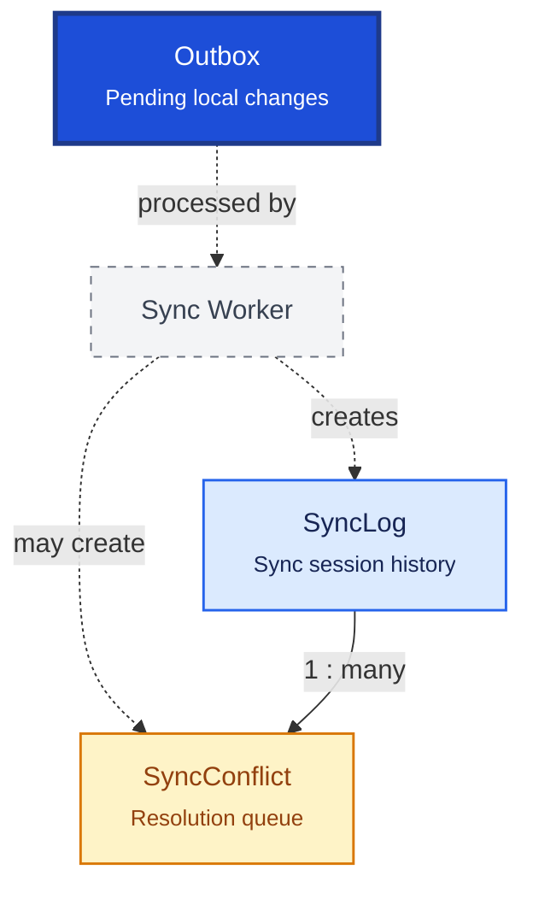

# Synchronization

Synchronization enables offline-first operation by queuing local changes for cloud upload and tracking sync health. The outbox pattern guarantees reliable delivery after crashes or network outages.

## Relationship Diagram



**Legend:** outbox entries use `entityUuid` (not local `entityId`) for cross-device identity. Written in the same transaction as business mutations.

## How the Tables Work Together

- **Outbox** queues every create/update/delete with operation type, payload envelope, and sync status.
- Background worker reads outbox, uploads to cloud, marks success, and retries failures.
- **SyncLog** records each sync session: direction, record counts, errors, and duration.
- **SyncConflict** captures when the same `entityUuid` was modified locally and in cloud before sync.
- Conflict resolution rules vary by entity type (inventory = business rules; masters = server authority).
- Outbox includes `deviceId`, `operationId`, and `sequenceNo` for idempotent replay.
- Delta sync sends only changed records — never the full database.

## Tables

- [outbox](#outbox) — transactional outbox for pending sync events.
- [sync log](#synclog) — synchronization session audit log.
- [sync conflict](#syncconflict) — data conflict resolution queue.

---

## Table Specifications

## Outbox

> Prisma model: `backend/prisma/schema.prisma` (`Outbox`)

## Purpose

The Outbox table stores all local database changes that need to be synchronized with the cloud/server.

It is the foundation of the **Outbox Pattern**, ensuring reliable offline-first synchronization. Whenever a business transaction is committed locally, an Outbox record is created in the same database transaction.

The synchronization service processes pending Outbox records and sends them to the server.

---

## Business Rules

- Every local CREATE, UPDATE, and DELETE operation generates an Outbox record.
- Business transactions and Outbox records must be committed atomically.
- Records are processed in `sequenceNo` order (per device).
- Successfully synchronized records are marked as completed.
- Failed synchronization attempts are retried using the same `operationId` (idempotent).
- Records are never physically deleted immediately.
- Payload should contain the complete business object or delta.
- **`entityUuid`** (not local `entityId`) identifies the business entity across devices.
- `deviceId`, `branchId`, `operationId`, and `sequenceNo` support attribution, ordering, and idempotent replay.
- UUID is used for synchronization across devices.
- BIGINT is used as the internal primary key.

---

## Relationships

```
Business Tables (uuid)
     │
     ├── Medicine
     ├── Customer
     ├── SalesInvoice
     ├── StockMovement
     └── ...
          │
          ▼
       Outbox (entityUuid)
          │
          ▼
Synchronization Service
          │
          ▼
Cloud API (Spring Boot + JPA + PostgreSQL)
```

---

## Columns

| Category | Column | SQLite | PostgreSQL (JPA) | Nullable | Description |
|----------|--------|---------|------------------|----------|-------------|
| Primary Key | id | INTEGER | BIGINT | No | Auto increment primary key (local only) |
| Identifier | uuid | TEXT | UUID/TEXT | No | Unique synchronization identifier |
| Business | entityType | TEXT | VARCHAR(100) | No | Entity name (Medicine, SalesInvoice, etc.) |
| Business | entityUuid | TEXT | UUID/TEXT | No | Global entity UUID (never local BigInt id) |
| Business | operation | TEXT | VARCHAR(10) | No | CREATE, UPDATE, DELETE |
| Business | payload | TEXT | JSONB | No | Serialized entity payload (TEXT in SQLite; JSONB in cloud JPA) |
| Business | payloadVersion | INTEGER | INTEGER | No | Schema version of payload |
| Sync | deviceId | TEXT | VARCHAR(100) | No | Client device identifier |
| Sync | branchId | INTEGER | BIGINT | Yes | Origin branch for branch-scoped entities |
| Sync | operationId | TEXT | UUID/TEXT | No | Idempotency key (unique) |
| Sync | sequenceNo | INTEGER | BIGINT | No | Monotonic ordering per device |
| Status | syncStatus | TEXT | VARCHAR(20) | No | PENDING, PROCESSING, SYNCED, FAILED (String) |
| Business | retryCount | INTEGER | INTEGER | No | Number of retry attempts |
| Business | lastError | TEXT | TEXT | Yes | Last synchronization error |
| Business | createdAt | DATETIME | TIMESTAMP | No | Local transaction timestamp |
| Business | processedAt | DATETIME | TIMESTAMP | Yes | Server synchronization timestamp |
| Audit | version | INTEGER | INTEGER | No | Optimistic locking version |

---

## Constraints

- Primary Key (id)
- Unique (uuid)
- Unique (operationId)
- Foreign Key (branchId → Branch.id) when present
- CHECK (retryCount >= 0)
- CHECK (payloadVersion >= 1)
- CHECK (version >= 1)

---

## Indexes

- PK_Outbox
- UK_Outbox_UUID
- UK_Outbox_OperationId
- IDX_Outbox_Status
- IDX_Outbox_CreatedAt
- IDX_Outbox_Entity (entityType, entityUuid)
- IDX_Outbox_Operation
- IDX_Outbox_Retry
- IDX_Outbox_SequenceNo
- IDX_Outbox_DeviceId

---

## Sample Records

| id | entityType | entityUuid | operation | deviceId | sequenceNo | syncStatus |
|----|------------|------------|-----------|----------|------------|------------|
| 1 | SalesInvoice | a1b2-... | CREATE | DESK-001 | 1001 | PENDING |
| 2 | Customer | c3d4-... | UPDATE | DESK-001 | 1002 | PROCESSING |
| 3 | StockMovement | e5f6-... | CREATE | DESK-002 | 501 | FAILED |

---


> **PostgreSQL (JPA) note:** Map `payload` to `JSONB` in the cloud entity. Prisma uses `Json` (TEXT in SQLite). Do not use `@db.JsonB` in the shared Prisma schema.

---

## Notes

- Implements the **Transactional Outbox Pattern**.
- Outbox records must be inserted in the **same database transaction** as the business data.
- Sync keys on **`entityUuid`**, never on local autoincrement `id`.
- The Synchronization Service polls pending records ordered by `sequenceNo`.
- Failed records remain until successfully synchronized or manually resolved.
- Supports offline-first architecture with SQLite clients and PostgreSQL cloud servers.

---

## SyncLog

> Prisma model: `backend/prisma/schema.prisma` (`SyncLog`)

## Purpose

The SyncLog table records the execution history of every synchronization session between the local SQLite database and the cloud PostgreSQL server.

Unlike the Outbox table, which stores pending changes, SyncLog records synchronization metadata, performance statistics, execution status, and errors for monitoring and troubleshooting.

Each synchronization attempt creates one SyncLog record.

---

## Business Rules

- Every synchronization session creates one SyncLog record.
- A SyncLog may process multiple Outbox records.
- Sync status is updated throughout the synchronization lifecycle (String field, not enum).
- Completed logs are immutable.
- Failed synchronizations retain complete error details.
- `deviceId` identifies the client device that initiated the session.
- Sync logs are retained for audit and troubleshooting.
- UUID is used for synchronization.
- BIGINT is used as the internal primary key.

---

## Relationships

```
Synchronization Service
          │
          ▼
      SyncLog
          │
          └────────< SyncConflict
```

---

## Columns

| Category | Column | SQLite | PostgreSQL (JPA) | Nullable | Description |
|----------|--------|---------|------------------|----------|-------------|
| Primary Key | id | INTEGER | BIGINT | No | Auto increment primary key |
| Identifier | uuid | TEXT | UUID/TEXT | No | Unique synchronization session identifier |
| Business | syncType | TEXT | VARCHAR(20) | No | FULL, INCREMENTAL, MANUAL, STARTUP (String) |
| Business | syncDirection | TEXT | VARCHAR(20) | No | UPLOAD, DOWNLOAD, BIDIRECTIONAL (String) |
| Business | startedAt | DATETIME | TIMESTAMP | No | Synchronization start time |
| Business | completedAt | DATETIME | TIMESTAMP | Yes | Synchronization completion time |
| Statistics | recordsUploaded | INTEGER | INTEGER | No | Number of uploaded records |
| Statistics | recordsDownloaded | INTEGER | INTEGER | No | Number of downloaded records |
| Statistics | conflictsDetected | INTEGER | INTEGER | No | Number of conflicts detected |
| Statistics | failedRecords | INTEGER | INTEGER | No | Number of failed records |
| Status | status | TEXT | VARCHAR(20) | No | RUNNING, SUCCESS, PARTIAL_SUCCESS, FAILED (String) |
| Business | errorMessage | TEXT | TEXT | Yes | Error details if synchronization fails |
| Business | deviceId | TEXT | VARCHAR(100) | Yes | Client device identifier |
| Business | appVersion | TEXT | VARCHAR(30) | Yes | Client application version |
| Audit | createdAt | DATETIME | TIMESTAMP | No | Record creation timestamp |
| Audit | version | INTEGER | INTEGER | No | Optimistic locking version |

---

## Constraints

- Primary Key (id)
- Unique (uuid)
- CHECK (recordsUploaded >= 0)
- CHECK (recordsDownloaded >= 0)
- CHECK (conflictsDetected >= 0)
- CHECK (failedRecords >= 0)
- CHECK (version >= 1)

---

## Indexes

- PK_SyncLog
- UK_SyncLog_UUID
- IDX_SyncLog_Status
- IDX_SyncLog_StartedAt
- IDX_SyncLog_Type
- IDX_SyncLog_Direction
- IDX_SyncLog_Device

---

## Sample Records

| id | syncType | syncDirection | status | deviceId | recordsUploaded | recordsDownloaded |
|----|----------|---------------|---------|----------|----------------:|------------------:|
| 1 | INCREMENTAL | BIDIRECTIONAL | SUCCESS | DESK-001 | 15 | 22 |
| 2 | STARTUP | DOWNLOAD | SUCCESS | DESK-001 | 0 | 350 |
| 3 | MANUAL | UPLOAD | FAILED | DESK-002 | 5 | 0 |

---


---

## Notes

- Stores synchronization **session history**, not business data.
- One SyncLog represents one synchronization execution.
- Related SyncConflict records reference `syncLogId`.
- Error messages should contain only technical details; sensitive business data should not be stored.
- Supports offline-first synchronization using SQLite clients and PostgreSQL servers.

---

## SyncConflict

> Prisma model: `backend/prisma/schema.prisma` (`SyncConflict`)

## Purpose

The SyncConflict table records data conflicts detected during synchronization between the local SQLite database and the cloud PostgreSQL server.

A conflict occurs when the same business record (identified by **`entityUuid`**) has been modified on both the client and the server before synchronization.

The table preserves both versions of the data and records how the conflict was resolved.

---

## Business Rules

- Every conflict belongs to one synchronization session (`syncLogId`).
- Every conflict references one business entity by **`entityUuid`** (not local `entityId`).
- Both local and server versions must be preserved until resolution.
- Resolved conflicts become read-only.
- Conflicts may be resolved automatically or manually.
- Conflict history must never be deleted.
- UUID is used for synchronization.
- BIGINT is used as the internal primary key.
- Optimistic locking is maintained using the version column.

---

## Relationships

```
SyncLog
    │
    └────────< SyncConflict (entityUuid)
                    │
                    └────────► Business Entity (by uuid)
```

---

## Columns

| Category | Column | SQLite | PostgreSQL (JPA) | Nullable | Description |
|----------|--------|---------|------------------|----------|-------------|
| Primary Key | id | INTEGER | BIGINT | No | Auto increment primary key |
| Identifier | uuid | TEXT | UUID/TEXT | No | Global unique identifier |
| Foreign Key | syncLogId | INTEGER | BIGINT | No | References SyncLog.id |
| Business | entityType | TEXT | VARCHAR(100) | No | Entity name (Medicine, SalesInvoice, etc.) |
| Business | entityUuid | TEXT | UUID/TEXT | No | Global entity UUID |
| Business | conflictType | TEXT | VARCHAR(30) | No | UPDATE_UPDATE, DELETE_UPDATE, etc. (String) |
| Business | localPayload | TEXT | JSONB | No | Local version (TEXT in SQLite; JSONB in cloud JPA) |
| Business | serverPayload | TEXT | JSONB | No | Server version (TEXT in SQLite; JSONB in cloud JPA) |
| Status | resolutionStatus | TEXT | VARCHAR(20) | No | PENDING, AUTO_RESOLVED, etc. (String) |
| Business | resolutionStrategy | TEXT | VARCHAR(30) | Yes | SERVER_WINS, CLIENT_WINS, MERGED, MANUAL |
| Business | resolvedBy | TEXT | VARCHAR(100) | Yes | User or process resolving the conflict |
| Business | resolvedAt | DATETIME | TIMESTAMP | Yes | Resolution timestamp |
| Business | remarks | TEXT | TEXT | Yes | Resolution notes |
| Audit | createdAt | DATETIME | TIMESTAMP | No | Conflict detection timestamp |
| Audit | version | INTEGER | INTEGER | No | Optimistic locking version |

---

## Constraints

- Primary Key (id)
- Unique (uuid)
- Foreign Key (syncLogId → SyncLog.id)
- CHECK (version >= 1)

---

## Indexes

- PK_SyncConflict
- UK_SyncConflict_UUID
- IDX_SyncConflict_SyncLog
- IDX_SyncConflict_Entity (entityType, entityUuid)
- IDX_SyncConflict_Status
- IDX_SyncConflict_Type
- IDX_SyncConflict_ResolvedAt

---

## Sample Records

| id | entityType | entityUuid | conflictType | resolutionStatus | resolutionStrategy |
|----|------------|------------|--------------|------------------|--------------------|
| 1 | Customer | a1b2-... | UPDATE_UPDATE | AUTO_RESOLVED | SERVER_WINS |
| 2 | SalesInvoice | c3d4-... | VERSION_MISMATCH | PENDING | NULL |
| 3 | Stock | e5f6-... | UPDATE_UPDATE | MANUAL_RESOLVED | CLIENT_WINS |

---


> **PostgreSQL (JPA) note:** Map `localPayload` and `serverPayload` to `JSONB` in the cloud entity. Prisma uses `Json` (TEXT in SQLite). Do not use `@db.JsonB` in the shared Prisma schema.

---

## Notes

- Stores only **conflicted synchronization records**.
- Sync identity uses **`entityUuid`**, never local autoincrement `id`.
- Both payloads should remain unchanged until the conflict is resolved.
- Manual conflict resolution should be available for business-critical entities such as SalesInvoice, Stock, and Payment.
- Every conflict resolution should be fully auditable.
- Historical conflict records should never be deleted.
