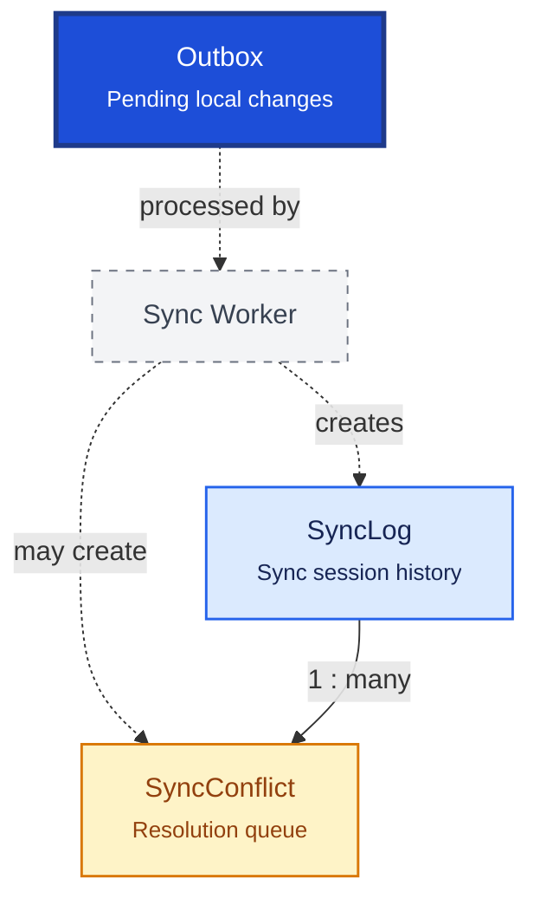

# Synchronization

Synchronization enables offline-first operation by queuing local changes for cloud upload and tracking sync health. The outbox pattern guarantees reliable delivery after crashes or network outages.

## Relationship Diagram

**Legend:** outbox entries use `entityUuid` (not local `entityId`) for cross-device identity. Written in the same transaction as business mutations.

## How the Tables Work Together

- **Outbox** queues every create/update/delete with operation type, payload envelope, and sync status.
- Background worker reads outbox, uploads to cloud, marks success, and retries failures.
- **SyncLog** records each sync session: direction, record counts, errors, and duration.
- **SyncConflict** captures when the same `entityUuid` was modified locally and in cloud before sync.
- Conflict resolution rules vary by entity type (inventory = business rules; masters = server authority).
- Outbox includes `deviceId`, `operationId`, and `sequenceNo` for idempotent replay.
- Delta sync sends only changed records — never the full database.

## Tables

- [[55_outbox]] — transactional outbox for pending sync events.
- [[56_sync_log]] — synchronization session audit log.
- [[57_sync_conflict]] — data conflict resolution queue.
