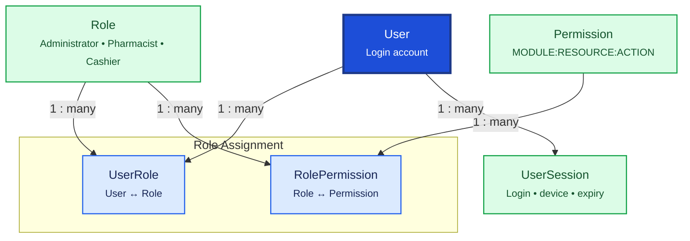

# User & Security

User & Security governs who can access the Pharmacy ERP, what they can do, and how login sessions are tracked. `User` accounts link to `Employee` records; permissions are assigned through `Role` and `Permission` junction tables.

## Relationship Diagram

**Legend:** solid arrows show database relationships. `User` links to `Employee` (party management) — one account per employee.

## How the Tables Work Together

- **User** is the login account with credentials, lockout state, and link to exactly one `Employee`.
- **Role** groups permissions into business roles such as Administrator, Pharmacist, Cashier, or Store Manager.
- **Permission** defines a single fine-grained action (`MODULE:RESOURCE:ACTION` format).
- **RolePermission** maps which permissions belong to each role.
- **UserRole** maps which roles a user holds; a user may have multiple roles.
- **UserSession** tracks active login sessions, refresh tokens, device identity, and expiry for security auditing.
- Permissions are always enforced in the backend; UI checks are supplementary only.
- All tables use UUID for sync, soft delete via `deletedAt`, and optimistic locking via `version`.

## Tables

- [[09_user]] — application login account linked to an employee.
- [[10_role]] — named role grouping permissions.
- [[11_permission]] — single actionable permission.
- [[12_role_permission]] — maps permissions to roles.
- [[13_user_role]] — maps roles to users.
- [[14_user_session]] — login session and refresh token tracking.
