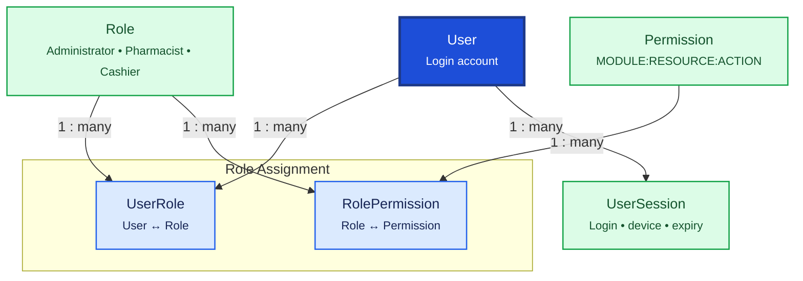

# User & Security

User & Security governs who can access the Pharmacy ERP, what they can do, and how login sessions are tracked. `User` accounts link to `Employee` records; permissions are assigned through `Role` and `Permission` junction tables.

## Relationship Diagram



**Legend:** solid arrows show database relationships. `User` links to `Employee` (party management) — one account per employee.

## How the Tables Work Together

- **User** is the login account with credentials, lockout state, and link to exactly one `Employee`.
- **Role** groups permissions into business roles such as Administrator, Pharmacist, Cashier, or Store Manager.
- **Permission** defines a single fine-grained action (`MODULE:RESOURCE:ACTION` format).
- **RolePermission** maps which permissions belong to each role.
- **UserRole** maps which roles a user holds; a user may have multiple roles.
- **UserSession** tracks active login sessions, refresh tokens, device identity, and expiry for security auditing.
- Permissions are always enforced in the backend; UI checks are supplementary only.
- All tables use UUID for sync, soft delete via `deletedAt`, and optimistic locking via `version`.

## Tables

- [user](#user) — application login account linked to an employee.
- [role](#role) — named role grouping permissions.
- [permission](#permission) — single actionable permission.
- [role permission](#rolepermission) — maps permissions to roles.
- [user role](#userrole) — maps roles to users.
- [user session](#usersession) — login session and refresh token tracking.

---

## Table Specifications

## User

> Prisma model: `backend/prisma/schema.prisma` (`User`)

## Purpose

The User table stores application login accounts used to authenticate employees into the Pharmacy ERP.

A User account is separate from the Employee record because not every employee requires system access, and authentication details should remain independent of employee master data.

---

## Business Rules

- Every User must be linked to exactly one Employee.
- An Employee can have at most one User account.
- Username must be unique.
- Passwords must never be stored in plain text.
- Passwords must be stored using a secure hashing algorithm (Argon2id or bcrypt).
- User permissions are assigned through Roles.
- Accounts can be locked after repeated failed login attempts.
- Soft delete should be used instead of physical deletion.
- UUID is used for synchronization.
- BIGINT is used as the internal primary key.
- Optimistic locking is maintained using the version column.

---

## Relationships

```
Employee (1)
     │
     └────── User (1)
                 │
                 ├── UserRole
                 ├── UserSession
                 ├── AuditLog
                 └── ChangeHistory
```

---

## Columns

| Category | Column | SQLite | PostgreSQL | Nullable | Description |
|----------|--------|---------|------------|----------|-------------|
| Primary Key | id | INTEGER | BIGINT | No | Auto increment primary key |
| Foreign Key | employeeId | INTEGER | BIGINT | No | References Employee.id |
| Identifier | uuid | TEXT | UUID | No | Global unique identifier |
| Authentication | username | TEXT | VARCHAR(100) | No | Login username |
| Authentication | passwordHash | TEXT | TEXT | No | Secure password hash |
| Authentication | passwordChangedAt | DATETIME | TIMESTAMP | Yes | Last password change |
| Security | failedLoginAttempts | INTEGER | INTEGER | No | Failed login count |
| Security | lockedUntil | DATETIME | TIMESTAMP | Yes | Account lock expiry |
| Security | lastLoginAt | DATETIME | TIMESTAMP | Yes | Last successful login |
| Status | isActive | INTEGER | BOOLEAN | No | Active account |
| Status | mustChangePassword | INTEGER | BOOLEAN | No | Force password change |
| Audit | createdAt | DATETIME | TIMESTAMP | No | Record creation timestamp |
| Audit | updatedAt | DATETIME | TIMESTAMP | No | Last update timestamp |
| Audit | deletedAt | DATETIME | TIMESTAMP | Yes | Soft delete timestamp |
| Audit | version | INTEGER | INTEGER | No | Optimistic locking version |

---

## Constraints

- Primary Key (id)
- Foreign Key (employeeId → Employee.id)
- Unique (uuid)
- Unique (employeeId)
- Unique (username)
- CHECK failedLoginAttempts >= 0
- CHECK version >= 1

---

## Indexes

- PK_User (id)
- UK_User_UUID
- UK_User_Username
- UK_User_Employee
- IDX_User_Active
- IDX_User_LastLogin
- IDX_User_LockedUntil

---

## Sample Records

| id | employeeId | username | isActive | failedLoginAttempts | lastLoginAt |
|----|------------|----------|----------|----------------------|-------------|
| 1 | 1 | admin | Yes | 0 | 2026-08-04 09:15 |
| 2 | 2 | pharmacist01 | Yes | 1 | 2026-08-03 18:40 |
| 3 | 3 | cashier01 | Yes | 0 | 2026-08-04 10:05 |

---


---

## Notes

- Stores authentication information only.
- Personal details belong in **Party**.
- Employment information belongs in **Employee**.
- Authorization is managed through **Role**, **Permission**, and **UserRole**.
- Passwords must be stored only as secure hashes (never plaintext).
- Multi-factor authentication (MFA) can be added in the future without changing the core schema.
- User sessions should be tracked in the **UserSession** table.
- Supports offline-first synchronization using UUID.
- Compatible with both SQLite and PostgreSQL.

---

## Role

> Prisma model: `backend/prisma/schema.prisma` (`Role`)

## Purpose

The Role table defines security roles used for Role-Based Access Control (RBAC) within the Pharmacy ERP.

Roles group permissions together so that users can be assigned business responsibilities without granting permissions individually.

Examples:

- Administrator
- Pharmacist
- Cashier
- Store Manager
- Purchase Manager
- Inventory Manager

---

## Business Rules

- Every role must have a unique code.
- Role names should be unique.
- A role can be assigned to multiple users.
- A user can have multiple roles.
- Permissions are assigned through the RolePermission table.
- System roles cannot be deleted.
- Roles can be marked inactive instead of deleting them.
- Soft delete should be used.
- UUID is used for synchronization.
- BIGINT is used as the internal primary key.
- Optimistic locking is maintained using the version column.

---

## Relationships

```
Role (1)
    │
    ├──────< UserRole (Many)
    │
    └──────< RolePermission (Many)
```

---

## Columns

| Category | Column | SQLite | PostgreSQL | Nullable | Description |
|----------|--------|---------|------------|----------|-------------|
| Primary Key | id | INTEGER | BIGINT | No | Auto increment primary key |
| Identifier | uuid | TEXT | UUID | No | Global unique identifier |
| Business | roleCode | TEXT | VARCHAR(30) | No | Unique role code |
| Business | roleName | TEXT | VARCHAR(100) | No | Display name of the role |
| Business | description | TEXT | TEXT | Yes | Role description |
| Status | isSystemRole | INTEGER | BOOLEAN | No | Indicates built-in system role |
| Status | isActive | INTEGER | BOOLEAN | No | Active status |
| Audit | createdAt | DATETIME | TIMESTAMP | No | Record creation timestamp |
| Audit | updatedAt | DATETIME | TIMESTAMP | No | Last update timestamp |
| Audit | deletedAt | DATETIME | TIMESTAMP | Yes | Soft delete timestamp |
| Audit | version | INTEGER | INTEGER | No | Optimistic locking version |

---

## Constraints

- Primary Key (id)
- Unique (uuid)
- Unique (roleCode)
- Unique (roleName)
- CHECK version >= 1

---

## Indexes

- PK_Role (id)
- UK_Role_UUID
- UK_Role_Code
- UK_Role_Name
- IDX_Role_Active
- IDX_Role_SystemRole

---

## Sample Records

| id | roleCode | roleName | isSystemRole | isActive |
|----|----------|----------|--------------|----------|
| 1 | ADMIN | Administrator | Yes | Yes |
| 2 | PHARMACIST | Pharmacist | Yes | Yes |
| 3 | CASHIER | Cashier | Yes | Yes |
| 4 | STORE_MANAGER | Store Manager | No | Yes |

---


---

## Notes

- Implements Role-Based Access Control (RBAC).
- Roles should represent business responsibilities rather than individual permissions.
- Permissions are assigned through the RolePermission table.
- Users receive permissions through one or more assigned roles.
- Built-in roles (Administrator, Pharmacist, Cashier) should be marked as system roles to prevent accidental deletion.
- New roles can be added without changing application code.
- Supports offline-first synchronization using UUID.
- Compatible with both SQLite and PostgreSQL.

---

## Permission

> Prisma model: `backend/prisma/schema.prisma` (`Permission`)

## Purpose

The Permission table defines the smallest unit of authorization within the Pharmacy ERP.

Permissions represent specific actions that can be performed on application resources. Roles are assigned collections of permissions, and users inherit permissions through their assigned roles.

Examples:

- Create Medicine
- Edit Medicine
- Delete Medicine
- View Purchase Invoice
- Approve Purchase Order
- Print Sales Invoice

---

## Business Rules

- Every permission must have a unique code.
- Permission names should be unique.
- Permissions are assigned to Roles through the RolePermission table.
- Users should never be assigned permissions directly.
- Permission codes should remain stable once released.
- System permissions cannot be deleted.
- Soft delete should be used.
- UUID is used for synchronization.
- BIGINT is used as the internal primary key.
- Optimistic locking is maintained using the version column.

---

## Relationships

```
Permission (1)
      │
      └──────< RolePermission (Many)
```

---

## Columns

| Category | Column | SQLite | PostgreSQL | Nullable | Description |
|----------|--------|---------|------------|----------|-------------|
| Primary Key | id | INTEGER | BIGINT | No | Auto increment primary key |
| Identifier | uuid | TEXT | UUID | No | Global unique identifier |
| Business | permissionCode | TEXT | VARCHAR(100) | No | Unique permission identifier |
| Business | permissionName | TEXT | VARCHAR(150) | No | Display name |
| Business | module | TEXT | VARCHAR(50) | No | Functional module (Sales, Purchase, Inventory, etc.) |
| Business | resource | TEXT | VARCHAR(100) | No | Business resource (Medicine, Supplier, Invoice, etc.) |
| Business | action | TEXT | VARCHAR(30) | No | VIEW, CREATE, UPDATE, DELETE, APPROVE, PRINT, EXPORT |
| Business | description | TEXT | TEXT | Yes | Permission description |
| Status | isSystemPermission | INTEGER | BOOLEAN | No | Built-in permission |
| Status | isActive | INTEGER | BOOLEAN | No | Active permission |
| Audit | createdAt | DATETIME | TIMESTAMP | No | Record creation timestamp |
| Audit | updatedAt | DATETIME | TIMESTAMP | No | Last update timestamp |
| Audit | deletedAt | DATETIME | TIMESTAMP | Yes | Soft delete timestamp |
| Audit | version | INTEGER | INTEGER | No | Optimistic locking version |

---

## Constraints

- Primary Key (id)
- Unique (uuid)
- Unique (permissionCode)
- Unique (module, resource, action)
- CHECK action IN ('VIEW','CREATE','UPDATE','DELETE','APPROVE','PRINT','EXPORT','IMPORT')
- CHECK version >= 1

---

## Indexes

- PK_Permission (id)
- UK_Permission_UUID
- UK_Permission_Code
- UK_Permission_Module_Resource_Action
- IDX_Permission_Module
- IDX_Permission_Action
- IDX_Permission_Active

---

## Sample Records

| id | permissionCode | module | resource | action |
|----|----------------|--------|----------|--------|
| 1 | SALES_INVOICE_VIEW | Sales | SalesInvoice | VIEW |
| 2 | SALES_INVOICE_CREATE | Sales | SalesInvoice | CREATE |
| 3 | MEDICINE_UPDATE | Medicine | Medicine | UPDATE |
| 4 | PURCHASE_APPROVE | Purchase | PurchaseOrder | APPROVE |
| 5 | INVENTORY_EXPORT | Inventory | Stock | EXPORT |

---


---

## Notes

- Permission is the smallest authorization unit in the system.
- Permissions should represent business actions rather than UI components.
- Users inherit permissions through Roles; direct user-permission assignments are intentionally avoided.
- Permission codes should remain stable because they may be referenced by application code.
- System permissions should not be modified or deleted after deployment.
- Supports offline-first synchronization using UUID.
- Compatible with both SQLite and PostgreSQL.

---

## RolePermission

> Prisma model: `backend/prisma/schema.prisma` (`RolePermission`)

## Purpose

The RolePermission table maps Roles to Permissions and forms the core of the Role-Based Access Control (RBAC) system.

A Role can have many Permissions, and a Permission can belong to many Roles.

This table enables flexible security management without changing application code.

---

## Business Rules

- Every record must reference one Role.
- Every record must reference one Permission.
- A Role cannot have the same Permission assigned more than once.
- System roles inherit permissions through this table.
- Soft delete should be used.
- UUID is used for synchronization.
- BIGINT is used as the internal primary key.
- Optimistic locking is maintained using the version column.

---

## Relationships

```
Role (1)
   │
   ├──────< RolePermission >────── Permission (1)
```

---

## Columns

| Category | Column | SQLite | PostgreSQL | Nullable | Description |
|----------|--------|---------|------------|----------|-------------|
| Primary Key | id | INTEGER | BIGINT | No | Auto increment primary key |
| Foreign Key | roleId | INTEGER | BIGINT | No | References Role.id |
| Foreign Key | permissionId | INTEGER | BIGINT | No | References Permission.id |
| Identifier | uuid | TEXT | UUID | No | Global unique identifier |
| Status | isGranted | INTEGER | BOOLEAN | No | Whether permission is granted |
| Audit | createdAt | DATETIME | TIMESTAMP | No | Record creation timestamp |
| Audit | updatedAt | DATETIME | TIMESTAMP | No | Last update timestamp |
| Audit | deletedAt | DATETIME | TIMESTAMP | Yes | Soft delete timestamp |
| Audit | version | INTEGER | INTEGER | No | Optimistic locking version |

---

## Constraints

- Primary Key (id)
- Foreign Key (roleId → Role.id)
- Foreign Key (permissionId → Permission.id)
- Unique (uuid)
- Unique (roleId, permissionId)
- CHECK version >= 1

---

## Indexes

- PK_RolePermission (id)
- UK_RolePermission_UUID
- UK_RolePermission_Role_Permission
- IDX_RolePermission_Role
- IDX_RolePermission_Permission
- IDX_RolePermission_Granted

---

## Sample Records

| id | roleId | permissionId | isGranted |
|----|--------|--------------|-----------|
| 1 | 1 | 1 | Yes |
| 2 | 1 | 2 | Yes |
| 3 | 2 | 1 | Yes |
| 4 | 2 | 15 | No |

---


---

## Notes

- This is the junction table implementing the many-to-many relationship between Roles and Permissions.
- Permissions should always be assigned through this table.
- Removing a permission from a role immediately affects all users assigned to that role.
- The `isGranted` column allows future support for explicit deny rules if required.
- Supports offline-first synchronization using UUID.
- Compatible with both SQLite and PostgreSQL.

---

## UserRole

> Prisma model: `backend/prisma/schema.prisma` (`UserRole`)

## Purpose

The UserRole table maps Users to Roles and completes the Role-Based Access Control (RBAC) implementation.

A User can have multiple Roles, and a Role can be assigned to multiple Users. Users inherit all permissions through their assigned roles.

Examples:

- A pharmacist may have both **PHARMACIST** and **INVENTORY_MANAGER** roles.
- An administrator may also act as a cashier.

---

## Business Rules

- Every record must reference one User.
- Every record must reference one Role.
- A User cannot be assigned the same Role more than once.
- A User must have at least one active Role to access the application.
- Roles determine permissions; direct permission assignment to Users is not supported.
- Soft delete should be used.
- UUID is used for synchronization.
- BIGINT is used as the internal primary key.
- Optimistic locking is maintained using the version column.

---

## Relationships

```
User (1)
   │
   ├──────< UserRole >────── Role (1)
                                  │
                                  └──────< RolePermission
                                              │
                                              ▼
                                         Permission
```

---

## Columns

| Category | Column | SQLite | PostgreSQL | Nullable | Description |
|----------|--------|---------|------------|----------|-------------|
| Primary Key | id | INTEGER | BIGINT | No | Auto increment primary key |
| Foreign Key | userId | INTEGER | BIGINT | No | References User.id |
| Foreign Key | roleId | INTEGER | BIGINT | No | References Role.id |
| Identifier | uuid | TEXT | UUID | No | Global unique identifier |
| Business | assignedAt | DATETIME | TIMESTAMP | No | Role assignment timestamp |
| Business | assignedByUserId | INTEGER | BIGINT | Yes | User who assigned the role |
| Status | isActive | INTEGER | BOOLEAN | No | Active role assignment |
| Audit | createdAt | DATETIME | TIMESTAMP | No | Record creation timestamp |
| Audit | updatedAt | DATETIME | TIMESTAMP | No | Last update timestamp |
| Audit | deletedAt | DATETIME | TIMESTAMP | Yes | Soft delete timestamp |
| Audit | version | INTEGER | INTEGER | No | Optimistic locking version |

---

## Constraints

- Primary Key (id)
- Foreign Key (userId → User.id)
- Foreign Key (roleId → Role.id)
- Foreign Key (assignedByUserId → User.id)
- Unique (uuid)
- Unique (userId, roleId)
- CHECK version >= 1

---

## Indexes

- PK_UserRole (id)
- UK_UserRole_UUID
- UK_UserRole_User_Role
- IDX_UserRole_User
- IDX_UserRole_Role
- IDX_UserRole_Active
- IDX_UserRole_AssignedAt

---

## Sample Records

| id | userId | roleId | assignedAt | assignedByUserId | isActive |
|----|--------|--------|------------|------------------|----------|
| 1 | 1 | 1 | 2026-08-04 09:00 | 1 | Yes |
| 2 | 2 | 2 | 2026-08-04 09:15 | 1 | Yes |
| 3 | 2 | 4 | 2026-08-04 09:16 | 1 | Yes |
| 4 | 3 | 3 | 2026-08-04 09:30 | 1 | Yes |

---


---

## Notes

- This is the junction table implementing the many-to-many relationship between Users and Roles.
- Users inherit all permissions through their assigned Roles.
- A user can perform multiple business functions by having multiple active roles.
- Role assignments should be audited for security and compliance.
- Deactivating a UserRole immediately revokes permissions associated with that role.
- Supports offline-first synchronization using UUID.
- Compatible with both SQLite and PostgreSQL.

---

## UserSession

> Prisma model: `backend/prisma/schema.prisma` (`UserSession`)

## Purpose

The UserSession table tracks user login sessions within the Pharmacy ERP.

It records authentication events, active sessions, logout history, and device information for security auditing and session management.

This table is especially useful for:

- Login auditing
- Session timeout handling
- Concurrent login control
- Device tracking
- Security investigations

---

## Business Rules

- Every session belongs to exactly one User.
- A User can have multiple sessions.
- Only active sessions should be considered for authentication.
- Sessions expire automatically after the configured timeout.
- Logging out should mark the session as inactive instead of deleting it.
- Expired sessions should remain for audit purposes.
- Soft delete should rarely be required because session history is valuable.
- UUID is used for synchronization.
- BIGINT is used as the internal primary key.
- Optimistic locking is maintained using the version column.

---

## Relationships

```
User (1)
    │
    └──────< UserSession (Many)
```

---

## Columns

| Category | Column | SQLite | PostgreSQL | Nullable | Description |
|----------|--------|---------|------------|----------|-------------|
| Primary Key | id | INTEGER | BIGINT | No | Auto increment primary key |
| Foreign Key | userId | INTEGER | BIGINT | No | References User.id |
| Identifier | uuid | TEXT | UUID | No | Global unique identifier |
| Authentication | sessionToken | TEXT | VARCHAR(255) | No | Unique session identifier |
| Authentication | refreshToken | TEXT | TEXT | Yes | Refresh token if applicable |
| Device | deviceName | TEXT | VARCHAR(100) | Yes | Device name |
| Device | deviceType | TEXT | VARCHAR(50) | Yes | Desktop, Laptop, Tablet |
| Device | operatingSystem | TEXT | VARCHAR(100) | Yes | Windows, Linux, macOS |
| Device | applicationVersion | TEXT | VARCHAR(30) | Yes | ERP application version |
| Network | ipAddress | TEXT | VARCHAR(50) | Yes | Client IP address |
| Network | loginTime | DATETIME | TIMESTAMP | No | Login timestamp |
| Network | lastActivityAt | DATETIME | TIMESTAMP | No | Last activity timestamp |
| Network | logoutTime | DATETIME | TIMESTAMP | Yes | Logout timestamp |
| Network | expiresAt | DATETIME | TIMESTAMP | No | Session expiration time |
| Status | isActive | INTEGER | BOOLEAN | No | Indicates active session |
| Status | logoutReason | TEXT | VARCHAR(50) | Yes | USER_LOGOUT, TIMEOUT, FORCE_LOGOUT |
| Audit | createdAt | DATETIME | TIMESTAMP | No | Record creation timestamp |
| Audit | updatedAt | DATETIME | TIMESTAMP | No | Last update timestamp |
| Audit | deletedAt | DATETIME | TIMESTAMP | Yes | Soft delete timestamp |
| Audit | version | INTEGER | INTEGER | No | Optimistic locking version |

---

## Constraints

- Primary Key (id)
- Foreign Key (userId → User.id)
- Unique (uuid)
- Unique (sessionToken)
- CHECK logoutReason IN ('USER_LOGOUT','TIMEOUT','FORCE_LOGOUT','SYSTEM_RESTART')
- CHECK version >= 1

---

## Indexes

- PK_UserSession (id)
- UK_UserSession_UUID
- UK_UserSession_Token
- IDX_UserSession_User
- IDX_UserSession_Active
- IDX_UserSession_LoginTime
- IDX_UserSession_ExpiresAt

---

## Sample Records

| id | userId | sessionToken | loginTime | expiresAt | isActive |
|----|--------|--------------|------------|-----------|----------|
| 1 | 1 | sess_a81d9f | 2026-08-04 09:00 | 2026-08-04 17:00 | Yes |
| 2 | 2 | sess_b12f4c | 2026-08-04 09:15 | 2026-08-04 17:15 | Yes |
| 3 | 3 | sess_c72aa1 | 2026-08-03 10:00 | 2026-08-03 18:00 | No |

---


---

## Notes

- Maintains complete authentication history for auditing.
- Supports automatic session timeout and forced logout.
- Multiple active sessions per user can be enabled or restricted through business rules.
- Stores device information to help identify suspicious login activity.
- Useful for compliance, troubleshooting, and security reporting.
- In the current Electron + NestJS offline architecture, session tracking can be simplified while retaining this schema for future cloud synchronization.
- Supports offline-first synchronization using UUID.
- Compatible with both SQLite and PostgreSQL.
