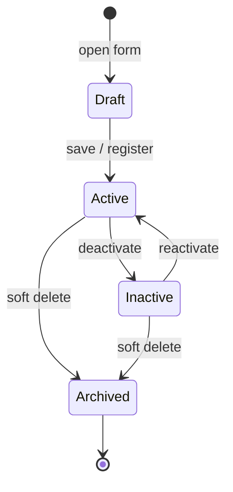
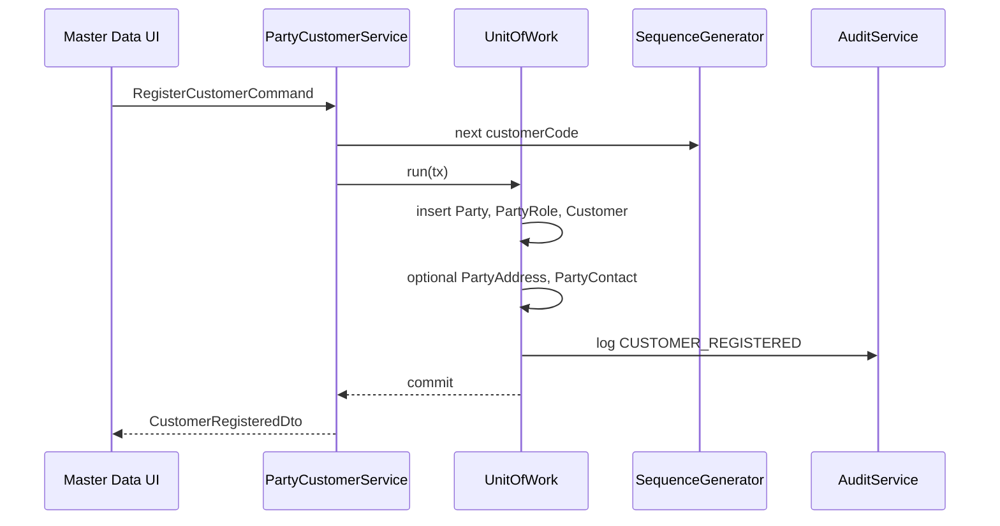

# Customer Domain

The Customer bounded context manages retail, wholesale, and corporate buyers. **Party** is the shared identity root; **Customer** is the role-specific extension coordinating addresses, contacts, credit terms, and loyalty participation.

**Table overview:** [party_management.md](../database/tables/party_management/party_management.md), [loyalty.md](../database/tables/loyalty/loyalty.md)

**Related domains:** [sales.md](sales.md), [finance.md](finance.md)

## Overview & Aggregate

### Responsibilities

- Register and maintain customer master data through the Party aggregate.
- Enforce role consistency between `PartyRole` (`CUSTOMER`) and the `Customer` detail record.
- Manage customer-specific financial attributes (credit limit, payment terms); balance truth lives in ledger entries.
- Coordinate loyalty program enrollment and point transaction history.
- Expose customer identity to Sales, Prescription, and Finance by stable `uuid`.

### In scope

Party identity, CUSTOMER role, addresses, contacts, customer type/code, credit limit, payment terms, tax exemption, loyalty participation, activation/deactivation/soft delete.

### Out of scope

Sales invoice posting and pricing ([sales.md](sales.md)); receipt collection and receivables ([finance.md](finance.md)); prescription clinical validation; supplier/doctor/employee roles.

### Related entities

| Entity | Role |
|--------|------|
| Party | Aggregate root for identity |
| PartyRole | Business role assignment (`CUSTOMER`) |
| PartyAddress | Physical / billing / shipping addresses |
| PartyContact | Phone, email, WhatsApp |
| Customer | Customer-specific attributes |
| LoyaltyProgram | Earning and redemption rules |
| LoyaltyTransaction | Immutable points history |

### Aggregate structure

```
Party (root)
├── PartyRole[]          — includes CUSTOMER role
├── PartyAddress[]
├── PartyContact[]
└── Customer?            — 0..1 detail record
         └── LoyaltyTransaction[]  — referenced, not owned
```

| Component | Type | Notes |
|-----------|------|-------|
| Party | Root | `partyType`, `displayName`, person/org names, `isActive` |
| PartyRole | Entity | `roleType = CUSTOMER`; unique per party per role type |
| PartyAddress | Entity | `addressType`: HOME, WORK, BILLING, SHIPPING |
| PartyContact | Entity | `contactType`: PHONE, EMAIL, WHATSAPP |
| Customer | Entity | `customerCode`, `customerType`, credit fields, loyalty cache |

**Consistency rule:** Creating a Customer must atomically ensure a CUSTOMER `PartyRole` exists. Removing the Customer role must not orphan a Customer row.

Loyalty transactions are **not** modified through the Party aggregate; they are created by Sales/Finance workflows.

**Operational active** requires `Party.isActive`, CUSTOMER `PartyRole.isActive`, and `Customer.isActive` all true.

Integrations: **SequenceGenerator** (`customerCode`), **AuditService** (same transaction), **Outbox** (sync keyed on `uuid`).

## Terminology

| Term | Definition | Persistence |
|------|------------|-------------|
| **Party** | Person or organization master record shared across roles | `Party` |
| **Customer** | Party acting as a buyer; holds credit and loyalty attributes | `Customer` |
| **Party Role** | Assignment of a business function to a party | `PartyRole.roleType = CUSTOMER` |
| **Walk-in Customer** | Default retail customer when no named buyer is selected | Seeded `Customer` + Party |
| **Customer Code** | Human-readable unique identifier (`CUST00001`) | `Customer.customerCode` |
| **Customer Type** | Commercial segment: RETAIL, WHOLESALE, CORPORATE | `Customer.customerType` |
| **Credit Limit** | Maximum outstanding receivable allowed | `Customer.creditLimit` |
| **Outstanding Amount** | Denormalized receivable balance | `Customer.outstandingAmount`; derived from `LedgerEntry` |
| **Payment Terms** | Credit period in days | `Customer.paymentTermsDays` |
| **Tax Exempt** | Flag excluding customer from tax on eligible sales | `Customer.isTaxExempt` |
| **Loyalty Program** | Rules for earning and redeeming points | `LoyaltyProgram` |
| **Loyalty Transaction** | Immutable points movement (earn, redeem, adjust) | `LoyaltyTransaction` |
| **Points Balance** | Sum of posted loyalty transactions | `Customer.loyaltyPoints` is cache only |
| **Primary Address** | Default address for a given address type | `PartyAddress.isPrimary` |
| **Display Name** | Name shown across ERP screens | `Party.displayName` |

Naming conventions: use **Customer** in sales flows; **Party** in master-data admin; **deactivate** not **delete**; **loyalty transaction** not **points update**. Event names: PascalCase past tense (`CustomerRegistered`).

External systems exchange **uuid** identifiers, never local numeric ids.

## Business Rules & Invariants

### Business rules

#### Identity and role

| ID | Rule | Enforcement |
|----|------|-------------|
| BR-C01 | Every Customer must reference exactly one Party | DB FK + application |
| BR-C02 | A Party may have at most one Customer record | Unique `partyId` |
| BR-C03 | Customer must have CUSTOMER role before first sale | Application on activate |
| BR-C04 | Same role type cannot be duplicated on one Party | Unique (partyId, roleType) |
| BR-C05 | `displayName` is required and used as primary search key | Validation |

#### Customer classification

| ID | Rule | Enforcement |
|----|------|-------------|
| BR-C10 | `customerType` ∈ {RETAIL, WHOLESALE, CORPORATE} | Validation |
| BR-C11 | `customerCode` unique per company | DB unique + sequence |
| BR-C12 | WHOLESALE and CORPORATE may require credit limit > 0 before credit sale | Sales integration |

#### Financial attributes

| ID | Rule | Enforcement |
|----|------|-------------|
| BR-C20 | `creditLimit` ≥ 0 | Validation |
| BR-C21 | `outstandingAmount` ≥ 0 | Validation; prefer ledger-derived |
| BR-C22 | Credit sale blocked when outstanding + invoice total > credit limit | Sales service |
| BR-C23 | `paymentTermsDays` ≥ 0 | Validation |
| BR-C24 | Do not manually set `outstandingAmount` except reconciliation job | Application policy |

#### Loyalty

| ID | Rule | Enforcement |
|----|------|-------------|
| BR-C30 | Points balance = sum of posted LoyaltyTransaction | Domain service |
| BR-C31 | Redemption cannot exceed available points | Sales + loyalty service |
| BR-C32 | Only active LoyaltyProgram within effective dates applies | Program selector |
| BR-C33 | Earn/redeem creates LoyaltyTransaction; reversals create REVERSAL type | Sales post |

#### Lifecycle

| ID | Rule | Enforcement |
|----|------|-------------|
| BR-C40 | Soft delete only; never hard delete with transaction history | Application |
| BR-C41 | Deactivated customer cannot be selected for new invoices | Sales UI + API |
| BR-C42 | Party soft delete hides Customer from operational queries | Query filters |

Additional aggregate rules: one Party → at most one Customer; `customerCode` via sequence generator; at most one primary address per `addressType`; soft delete sets `deletedAt` on Party; a party may hold other roles concurrently.

### Invariants (always true)

| ID | Invariant |
|----|-----------|
| INV-C01 | If `Customer` exists, referenced `Party` exists and is not hard-deleted |
| INV-C02 | `Customer.partyId` is unique |
| INV-C03 | `Customer.uuid` and `Party.uuid` are globally unique non-empty strings |
| INV-C04 | `Customer.version` ≥ 1 and increments on every successful update |
| INV-C05 | Non-deleted Customer has PartyRole with `roleType = CUSTOMER` |
| INV-C06 | Operational Customer requires active CUSTOMER PartyRole |
| INV-C07 | `Customer.creditLimit` ≥ 0 |
| INV-C08 | `Customer.outstandingAmount` ≥ 0 |
| INV-C09 | After reconciliation, `outstandingAmount` equals ledger-derived receivable within ε |
| INV-C10 | Every `LoyaltyTransaction` references valid `customerId` and `loyaltyProgramId` |
| INV-C11 | Posted loyalty transactions are immutable |
| INV-C12 | Sum of `LoyaltyTransaction.points` equals cached `Customer.loyaltyPoints` after sync job |
| INV-C13 | REDEEM and EXPIRY transactions follow deducting sign convention |
| INV-C14 | Sync replication keys on `uuid`, never local `BigInt id` |
| INV-C15 | Soft-deleted records have `deletedAt` ≥ `createdAt` |

Invariant violations must not emit domain events; return application error.

### Validation

#### Party

| Field | Rules |
|-------|-------|
| `partyType` | Required; enum PERSON, ORGANIZATION |
| `displayName` | Required; max 200 chars; trim whitespace |
| `firstName`, `lastName` | Required when PERSON; max 100 each |
| `organizationName` | Required when ORGANIZATION; max 200 |
| `isActive` | Boolean |

#### Customer

| Field | Rules |
|-------|-------|
| `customerType` | Required; RETAIL, WHOLESALE, CORPORATE |
| `customerCode` | Optional on create (generated); max 30; alphanumeric |
| `creditLimit` | Required; ≥ 0; max 12,2 decimal |
| `paymentTermsDays` | Required; integer ≥ 0 |
| `isTaxExempt` | Boolean |
| `loyaltyPoints` | Read-only on API update |

#### PartyAddress / PartyContact

Address: `addressType` HOME/WORK/BILLING/SHIPPING; `line1` required; city/state required for billing/shipping; at most one primary per type.

Contact: `contactType` PHONE/EMAIL/WHATSAPP; `contactValue` required with format validation; at most one primary per type.

Cross-field: PERSON requires firstName; ORGANIZATION requires organizationName; update DTO must include matching `version`.

Implementation: class-validator on NestJS DTOs; domain validation in PartyCustomerService.

## Lifecycle & States

### Phases

1. **Registration** — Create Party, CUSTOMER role, Customer with generated code; optional address/contact. Event: `CustomerRegistered`.
2. **Active operation** — Sales selection, loyalty earn/redeem, credit sales within limit, profile updates.
3. **Credit review** — WHOLESALE/CORPORATE with limit > 0; Finance posts receipts; reconciliation updates outstanding.
4. **Deactivation** — Set `isActive = false`; historical data retained. Event: `CustomerDeactivated`.
5. **Archival** — Soft delete (`deletedAt` on Party). Event: `CustomerArchived`.

Cannot archive Party with open receivable above threshold without supervisor override.

### State machine

| State | Conditions |
|-------|------------|
| **Draft** | UI-only: form in progress before save |
| **Active** | Party, CUSTOMER role, and Customer all active; not soft-deleted |
| **Inactive** | Customer or role deactivated |
| **Archived** | `Party.deletedAt IS NOT NULL` (terminal) |



| From | To | Guard | Side effects |
|------|-----|-------|--------------|
| Draft | Active | Valid Party + Customer + role | Emit `CustomerRegistered` |
| Active | Inactive | No blocking policy | Block new sales selection |
| Inactive | Active | Supervisor approval optional | Restore sales eligibility |
| Active/Inactive | Archived | No open receivable OR override | Set `deletedAt`, audit log |

## Domain Events

Events publish **after** database commit via outbox (`UnitOfWork`). Payloads use `uuid` only for cross-device sync.

### Customer aggregate events

| Event | Trigger | Payload (key fields) | Consumers |
|-------|---------|----------------------|-----------|
| `CustomerRegistered` | Party + Customer + role saved | `partyUuid`, `customerUuid`, `customerCode`, `customerType`, `displayName` | Audit, search index, outbox |
| `CustomerProfileUpdated` | Profile/address/contact changed | `customerUuid`, `changedFields[]`, `version` | Audit, CRM sync |
| `CustomerCreditLimitChanged` | `creditLimit` updated | `customerUuid`, `oldLimit`, `newLimit`, `changedBy` | Audit, sales credit cache |
| `CustomerDeactivated` | isActive false | `customerUuid`, `reason` | Sales block list |
| `CustomerReactivated` | Reverse deactivation | `customerUuid` | Sales allow list |
| `CustomerArchived` | Soft delete | `partyUuid`, `deletedAt` | Sync tombstone |

### Loyalty events (customer context)

| Event | Trigger | Payload | Consumers |
|-------|---------|---------|-----------|
| `LoyaltyPointsEarned` | Sales posts EARN | `customerUuid`, `transactionUuid`, `points`, `invoiceUuid` | Customer cache |
| `LoyaltyPointsRedeemed` | Sales posts REDEEM | `customerUuid`, `points`, `invoiceUuid` | Customer cache |
| `LoyaltyPointsAdjusted` | Manual ADJUSTMENT | `customerUuid`, `points`, `remarks`, `authorizedBy` | Audit |
| `LoyaltyTransactionReversed` | REVERSAL posted | `originalTransactionUuid`, `reversalUuid` | Balance recalc |

Only **Active** customers emit earn events. `CustomerProfileUpdated` outbox payloads should minimize PII on untrusted devices.

## Permissions

Format: **`MODULE:RESOURCE:ACTION`**. Seed reference: `PARTY_MANAGE` in `backend/seed/data/security/permission.json`.

| Permission code | Seeded |
|-----------------|--------|
| `PARTY:PARTY:UPDATE` | Yes (`PARTY_MANAGE`) |
| `PARTY:PARTY:READ` | Planned |
| `LOYALTY:TRANSACTION:CREATE` | Planned |

| Operation | Required permission |
|-----------|---------------------|
| View customer list / search | `SALES:VIEW` or `PARTY:PARTY:READ` |
| Register / update / deactivate / archive | `PARTY:PARTY:UPDATE` |
| Change credit limit | `PARTY:PARTY:UPDATE` (supervisor TBD) |
| Manual loyalty adjustment | `LOYALTY:TRANSACTION:CREATE` (future) |
| View loyalty history | `SALES:VIEW` or dedicated read |

Checks run in guards and application service. JWT caches permissions for access token lifetime.

## Workflows

### WF-C01 — Register new customer



Preconditions: `PARTY:PARTY:UPDATE`. Postconditions: INV-C01–C06; outbox queued.

### WF-C02 — Update customer profile

Load aggregate by uuid; validate `version`; update in single transaction; emit `CustomerProfileUpdated`.

### WF-C03 — Deactivate customer

Verify no draft sales invoices; set `Customer.isActive = false`; emit `CustomerDeactivated`. Outstanding may remain.

### WF-C04 — Loyalty earn on sales (cross-context)

Sales posts invoice → LoyaltyService calculates points → inserts EARN transaction → updates cache → `LoyaltyPointsEarned`.

### WF-C05 — Loyalty redeem on sales

Validate balance ≥ redeem points on post; insert REDEEM; apply monetary discount.

### WF-C06 — Manual loyalty adjustment

Supervisor enters delta and reason; insert ADJUSTMENT; audit authorized user.

### WF-C07 — Outstanding reconciliation

Scheduled job sums Customer Receivable `LedgerEntry`; updates `outstandingAmount` if drift > ε.

## Integrations

### Sales

| Direction | Mechanism |
|-----------|-----------|
| Customer → Sales | FK `SalesInvoice.customerId`; walk-in default seeded |
| Sales → Loyalty | Invoice post hook creates `LoyaltyTransaction` |
| Sales → Customer | Credit check reads `creditLimit`, `outstandingAmount` |

### Finance

| Direction | Mechanism |
|-----------|-----------|
| Sales → LedgerEntry | Invoice post debits Customer Receivable |
| Receipt → LedgerEntry | Credits receivable; reduces outstanding |
| Finance → Customer | Reconciliation job updates cache |

See [financial.md](../database/tables/financial/financial.md).

### Loyalty

Active program selection; EARN/REDEEM on post; `loyaltyPoints` cache updated from transaction sum.

### Sync (offline-first)

All entities expose `uuid`; outbox publishes changes. Conflict: last-write-wins with `version` check. Tombstones via `deletedAt`.

### Audit & Settings

`AuditService.log` in same `UnitOfWork` (module `PARTY`). Default walk-in customer uuid from `AppSetting`.

Cross-context calls must not bypass aggregate services.
