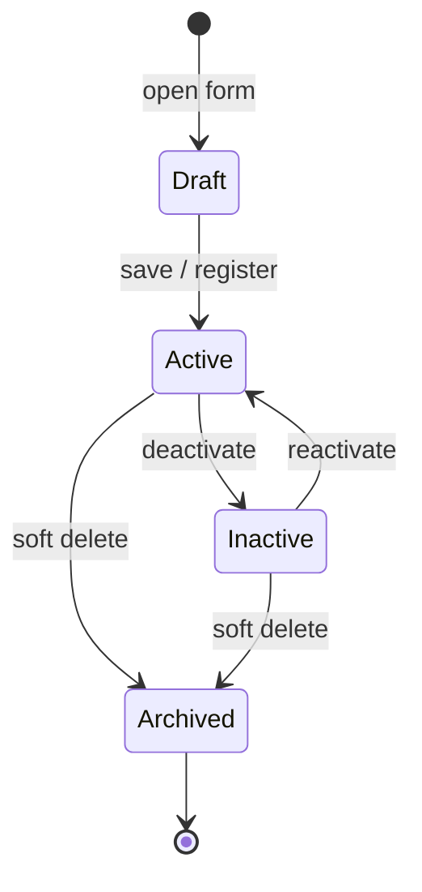

# Customer — State Machine

## Purpose

Formalize allowed state transitions for customer operational status so UI, API, and sync handlers reject illegal transitions.

## Responsibilities

- Define states, transitions, guards, and side effects.
- Align composite status from Party, PartyRole, and Customer flags.

## Scope

### In Scope

- Operational status derived from master-data flags.

### Out of Scope

- LoyaltyTransaction or SalesInvoice document statuses.

## Related Entities

Party, PartyRole (`CUSTOMER`), Customer — [party_management.md](../../database/tables/party_management/party_management.md).

## States

| State | Conditions |
|-------|------------|
| **Draft** | UI-only: form in progress before save |
| **Active** | `Party.isActive` ∧ CUSTOMER role active ∧ `Customer.isActive` ∧ not soft-deleted |
| **Inactive** | Customer or CUSTOMER role deactivated; Party may still be active for other roles |
| **Archived** | `Party.deletedAt IS NOT NULL` |

## State Diagram

## Transitions

| From | To | Guard | Side effects |
|------|-----|-------|--------------|
| Draft | Active | Valid Party + Customer + role | Emit `CustomerRegistered` |
| Active | Inactive | No blocking policy | Block new sales selection |
| Inactive | Active | Supervisor approval optional | Restore sales eligibility |
| Active | Archived | No open receivable OR override | Set `deletedAt`, audit log |
| Inactive | Archived | Same as above | Hide from lists |

## Business Rules

- Transition Active → Inactive does not reverse loyalty balance or outstanding amount.
- Archived is terminal for operational use; no transition back to Active without data restore procedure.

## Domain Events

| Transition | Event |
|------------|-------|
| Draft → Active | `CustomerRegistered` |
| Active → Inactive | `CustomerDeactivated` |
| Inactive → Active | `CustomerReactivated` |
| * → Archived | `CustomerArchived` |

## Integrations

- Sync consumers must treat Archived parties as tombstones using `uuid` and `deletedAt`.

## Security Considerations

- Archived transition may require dual approval when outstanding > 0.

## Performance Considerations

- State queries use composite index on `Customer.isActive` + Party join; avoid computing state in application without caching for large lists.

## Future Enhancements

- Explicit `Customer.status` column if composite flags become insufficient for reporting.
