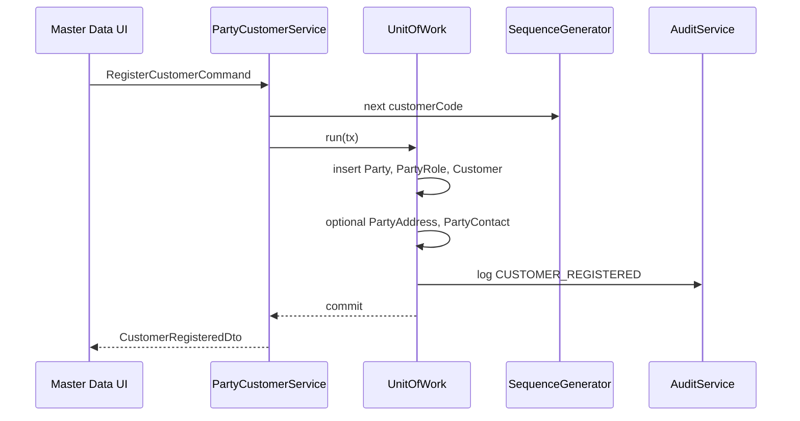

# Customer — Workflows

## Purpose

Describe end-to-end application workflows for customer master-data operations, including transaction boundaries and cross-context handoffs.

## Responsibilities

- Step through operator and system-initiated flows.
- Specify which services participate and which tables are touched.

## Scope

### In Scope

- Register, update, deactivate, loyalty enrollment, credit limit change, reconciliation touchpoints.

### Out of Scope

- Sales invoice creation workflow (initiated from Sales with customer reference).

## Related Entities

[party_management.md](../../database/tables/party_management/party_management.md), [loyalty.md](../../database/tables/loyalty/loyalty.md).

## Workflows

### WF-C01 — Register new customer

**Preconditions:** Caller has `PARTY:PARTY:UPDATE`.

**Postconditions:** INV-C01–C06 satisfied; outbox event queued.

### WF-C02 — Update customer profile

1. Load Party aggregate by `customerUuid` or `partyUuid`.
2. Validate optimistic lock (`version`).
3. Update Party fields, addresses, contacts, Customer attributes in single transaction.
4. Emit `CustomerProfileUpdated`; audit changed fields.

**Note:** Changing `customerType` may affect pricing rules in Sales — notify via event.

### WF-C03 — Deactivate customer

1. Verify no draft sales invoices open (Sales query).
2. Set `Customer.isActive = false`; optionally deactivate CUSTOMER role.
3. Emit `CustomerDeactivated`.

Outstanding receivable may remain; collections continue via Finance.

### WF-C04 — Loyalty earn on sales (cross-context)

1. Sales posts invoice → calls LoyaltyService with `customerId`, invoice totals.
2. LoyaltyService selects active default `LoyaltyProgram`.
3. Calculates points = f(`pointsPerAmount`, net eligible amount).
4. Inserts `LoyaltyTransaction` (EARN) in same invoice transaction.
5. Updates `Customer.loyaltyPoints` cache.
6. Emit `LoyaltyPointsEarned`.

See [52_loyalty_transaction.md](../../database/tables/loyalty/52_loyalty_transaction.md).

### WF-C05 — Loyalty redeem on sales

1. Cashier applies points discount on invoice draft.
2. On post, LoyaltyService validates balance ≥ redeem points.
3. Inserts REDEEM transaction; reduces cache.
4. Pricing engine applies monetary discount from `redemptionValue`.

### WF-C06 — Manual loyalty adjustment

1. Supervisor enters points delta and reason.
2. LoyaltyService inserts ADJUSTMENT transaction.
3. Audit logs authorized user and remarks.

### WF-C07 — Outstanding reconciliation

1. Scheduled job sums Customer Receivable `LedgerEntry` for party-linked sub-ledger.
2. Updates `Customer.outstandingAmount` if drift > ε.
3. Logs reconciliation audit entry (no domain event unless threshold exceeded).

Finance reference: [financial.md](../../database/tables/financial/financial.md).

## Business Rules

Each workflow enforces rules from [business-rules.md](business-rules.md) at noted steps.

## Domain Events

See [events.md](events.md) for events emitted per workflow.

## State Model

WF-C01 creates **Active** state; WF-C03 moves to **Inactive**.

## Integrations

| Workflow | External context |
|----------|------------------|
| WF-C04, WF-C05 | Sales |
| WF-C07 | Finance / LedgerEntry |
| All writes | Audit, Outbox |

## Security Considerations

- WF-C06 requires elevated permission (future `LOYALTY:TRANSACTION:CREATE`).
- WF-C01–C03 require `PARTY:PARTY:UPDATE`.

## Performance Considerations

- WF-C01 at POS should complete < 200ms — defer non-critical address fields to async update if needed.

## Future Enhancements

- Bulk CSV import workflow with validation report.
- Customer merge workflow for duplicate Party records.
