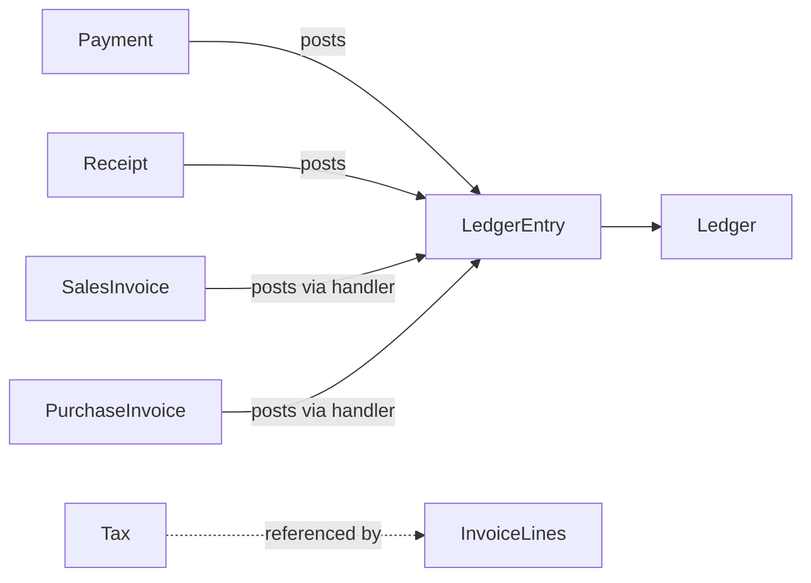
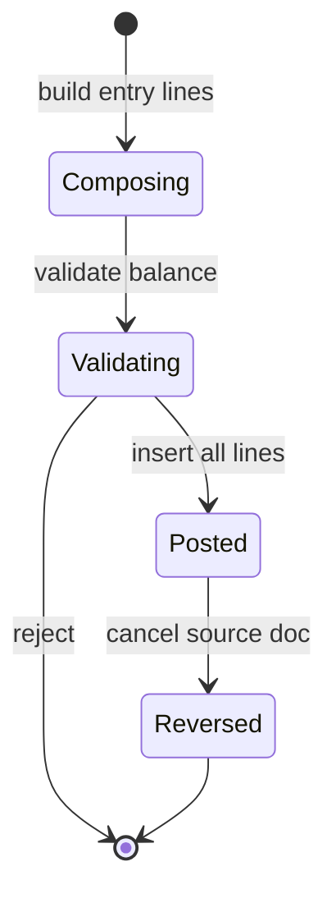

# Finance Domain

The Finance bounded context records all monetary movement for the pharmacy through double-entry accounting. It provides the chart of accounts (`Ledger`), immutable journal lines (`LedgerEntry`), payment and receipt vouchers, expense tracking, and tax configuration consumed by pricing and transactional modules.

**Table overview:** [financial.md](../database/tables/financial/financial.md), [pricing.md](../database/tables/pricing/pricing.md)

**Related domains:** [sales.md](sales.md), [customer.md](customer.md), [supplier.md](supplier.md), [inventory.md](inventory.md)

## Overview & Aggregate

### Responsibilities

- Maintain chart of accounts and posting rules.
- Enforce double-entry balance on every voucher.
- Record outgoing `Payment` and incoming `Receipt` transactions.
- Post journal entries for sales, purchase, returns, and adjustments (via integration handlers).
- Expose tax master data (`Tax`) for pricing — table under pricing category.
- Support reconciliation, trial balance, and statutory reporting.

### In scope

- Ledger, LedgerEntry (general journal).
- Payment, Receipt vouchers.
- Expense payments (via Payment types; Expense table planned — see [future-roadmap](../roadmap/future-roadmap.md#finance)).
- Tax definitions (pricing integration).
- Financial year scoping via configuration.

### Out of scope

- Sales invoice line pricing ([sales.md](sales.md)).
- Supplier/customer master data ([customer.md](customer.md), [supplier.md](supplier.md)).
- Inventory valuation postings detail ([inventory.md](inventory.md)) — referenced only.

### Related entities

| Entity | Role |
|--------|------|
| Ledger | Chart of accounts node; hierarchy via `parentLedgerId` |
| LedgerEntry | Immutable double-entry journal line |
| Payment | Outgoing money voucher |
| Receipt | Incoming money voucher |
| Tax | Rate master (pricing tables; finance-owned conceptually) |

**Note:** `Expense` is referenced in architecture docs and payment types but **not yet modeled** as a dedicated table — see [architecture-review.md](../database/architecture-review.md).

### Aggregates

#### Ledger aggregate (chart of accounts)

| Component | Type | Notes |
|-----------|------|-------|
| Ledger | Root | COA node; hierarchy via `parentLedgerId` |
| Child Ledger | Entity | Nested accounts |

**Rules:** System ledgers (`isSystem = true`) cannot be deleted. No balance stored on root.

#### Journal posting unit (conceptual)

Each business voucher forms a **posting unit** — not a classic DDD aggregate root in DB, but a consistency boundary:

| Component | Type | Notes |
|-----------|------|-------|
| LedgerEntry[] | Entities | 2+ lines; balanced debits/credits |
| Voucher reference | Value | `voucherType` + `voucherId` + `voucherNumber` |

All lines for one voucher insert in **one transaction** via `UnitOfWork`.

#### Payment aggregate

| Component | Type | Notes |
|-----------|------|-------|
| Payment | Root | Outgoing money |
| LedgerEntry[] | Created on complete | Debit payable/expense; credit cash/bank |

#### Receipt aggregate

| Component | Type | Notes |
|-----------|------|-------|
| Receipt | Root | Incoming money |
| LedgerEntry[] | Created on complete | Debit cash/bank; credit receivable/income |

#### Tax aggregate (pricing boundary)

| Component | Type | Notes |
|-----------|------|-------|
| Tax | Root | Rate master; owned by pricing/finance config |

Tax amounts on transactions are **snapshotted** on invoice lines, not on the Tax aggregate.

### Aggregate relationships



**Consistency rules:** Payment/Receipt aggregate controls status; LedgerEntry creation is side effect on COMPLETED. Cannot partially post voucher — all lines or rollback. `LedgerPostingService` shared by Payment, Receipt, Sales, Purchasing modules. `SequenceGenerator` for `paymentNumber`, `receiptNumber`.

## Terminology

| Term | Definition | Persistence |
|------|------------|-------------|
| **Chart of Accounts (COA)** | Hierarchical account structure for GL reporting | `Ledger` |
| **Ledger** | Single account in the COA with type and normal balance | `Ledger` |
| **LedgerEntry** | Append-only journal line; source of truth for financial reporting | `LedgerEntry` |
| **Voucher** | Group of balanced LedgerEntry rows sharing `voucherType`, `voucherId`, `voucherNumber` | Logical grouping |
| **Posting unit** | Consistency boundary for double-entry insert (all lines or rollback) | Application transaction |
| **Payment** | Outgoing money document (supplier, expense, refund) | `Payment` |
| **Receipt** | Incoming money document (customer payment, advance) | `Receipt` |
| **Tax** | GST rate master with effective dating | `Tax` (pricing tables) |
| **Normal balance** | Side (DEBIT/CREDIT) that increases an account type | `Ledger.normalBalance` |
| **Reversal** | Opposite LedgerEntry voucher; never UPDATE posted rows | New voucher |
| **Outstanding (cache)** | Denormalized receivable/payable on Customer/Supplier | Reconciled against ledger |

Event names: PascalCase past tense (`PaymentCompleted`, `LedgerEntryPosted`).

## Business Rules & Invariants

### Ledger rules

| ID | Rule | Enforcement |
|----|------|-------------|
| BR-F01 | `ledgerCode` unique | DB |
| BR-F02 | `ledgerType` ∈ ASSET, LIABILITY, INCOME, EXPENSE, EQUITY | Validation |
| BR-F03 | `normalBalance` ∈ DEBIT, CREDIT | Validation |
| BR-F04 | System ledgers cannot be deleted | Application |
| BR-F05 | Ledger balance = sum(entries); never store on Ledger | Design |

### Journal (LedgerEntry) rules

| ID | Rule | Enforcement |
|----|------|-------------|
| BR-F10 | Each line: debit XOR credit (not both > 0) | DB CHECK |
| BR-F11 | Each line: debit ≥ 0 AND credit ≥ 0 | DB CHECK |
| BR-F12 | Per voucher: Σ debit = Σ credit | Posting service |
| BR-F13 | Posted entries immutable | Application |
| BR-F14 | Cancellation = reversal entries with opposite amounts | Posting service |
| BR-F15 | `voucherType` + `voucherId` groups entries | Index |

### Payment rules

| ID | Rule | Enforcement |
|----|------|-------------|
| BR-F20 | `amount` > 0 | DB CHECK |
| BR-F21 | COMPLETED payment has ledger entries | Transaction |
| BR-F22 | CANCELLED payment has reversal entries | Transaction |
| BR-F23 | `paymentNumber` unique | DB |
| BR-F24 | SUPPLIER_PAYMENT references supplier or purchase invoice | Validation |

### Receipt rules

| ID | Rule | Enforcement |
|----|------|-------------|
| BR-F30 | `amount` > 0 | DB CHECK |
| BR-F31 | COMPLETED receipt has ledger entries | Transaction |
| BR-F32 | `receiptNumber` unique | DB |
| BR-F33 | CUSTOMER_PAYMENT reduces receivable | Posting + customer cache |

### Tax rules

| ID | Rule | Enforcement |
|----|------|-------------|
| BR-F40 | `taxCode` unique | DB |
| BR-F41 | 0 ≤ `taxRate` ≤ 100 | DB CHECK |
| BR-F42 | Inactive tax not selectable on new lines | UI + validation |
| BR-F43 | Do not edit tax after use; add new effective row | Application |
| BR-F44 | Invoice lines snapshot `taxRate` at post time | Sales/Purchasing |

### Expense rules (conceptual — table not modeled)

| ID | Rule | Status |
|----|------|--------|
| BR-F50 | Expense payment uses Payment with `paymentType = EXPENSE` | Via Payment |
| BR-F51 | Expense approval before post | Future |

### Reconciliation rules

| ID | Rule |
|----|------|
| BR-R01 | LedgerEntry is authoritative for monetary outstanding |
| BR-R02 | Cache updates must be audited |
| BR-R03 | Reconciliation does not modify posted LedgerEntry |
| BR-R04 | Large drift triggers alert to admin |

### Validation

#### Payment

| Field | Rules |
|-------|-------|
| `paymentType` | Required; valid enum set |
| `amount` | > 0; max 14,2 |
| `paymentMethod` | CASH, UPI, CARD, CHEQUE, BANK_TRANSFER |
| `paymentDate` | Required; not future beyond policy |
| `referenceType` / `referenceId` | Required for SUPPLIER_PAYMENT when paying invoice |
| `transactionReference` | Required for BANK_TRANSFER, CHEQUE |

#### Receipt

| Field | Rules |
|-------|-------|
| `receiptType` | CUSTOMER_PAYMENT, ADVANCE, REFUND, INTEREST, OTHER |
| `amount` | > 0 |
| `receiptMethod` | Same set as payment methods |
| `referenceId` | Required when allocating to sales invoice |

#### Journal line

| Rule | Check |
|------|-------|
| Minimum lines | ≥ 2 per voucher |
| Balance | Σ debit = Σ credit |
| Per line | debit XOR credit strictly |
| `ledgerId` | Must exist and `isActive` |
| `transactionDate` | Within open financial year |
| `voucherNumber` | Non-empty; max 30 |

#### Ledger master

| Field | Rules |
|-------|-------|
| `ledgerCode` | Unique; max 30 |
| `ledgerName` | Required; max 150 |
| `ledgerType` | Valid enum |
| `parentLedgerId` | No circular hierarchy |

#### Tax

| Field | Rules |
|-------|-------|
| `taxCode` | Unique; max 20 |
| `taxRate` | 0–100 |
| `taxType` | GST, CGST, SGST, IGST, CESS |
| `effectiveFrom` | Required |
| `effectiveTo` | ≥ `effectiveFrom` if set |

Implementation: class-validator on NestJS DTOs; `LedgerPostingService` validates voucher before insert. Validation failure returns `ApplicationException` with `ErrorCode` — no events.

## Lifecycle & States

### Payment / Receipt documents

| Document | States |
|----------|--------|
| Payment | PENDING, COMPLETED, FAILED, CANCELLED |
| Receipt | PENDING, COMPLETED, CANCELLED, REVERSED |
| LedgerEntry | `isPosted` true (immutable) |

Payment PENDING may exist without LedgerEntry; COMPLETED always has entries. PENDING documents editable; COMPLETED triggers BR-F21/BR-F31. `PaymentCompleted` requires COMPLETED status and posted entries — single atomic transition.

### LedgerEntry posting lifecycle



1. **Composing** — application builds in-memory `JournalLine[]`.
2. **Validating** — balance check, ledger active, period open.
3. **Posted** — single transaction insert all rows with `isPosted = true`.
4. **Reversed** — new voucher with negated lines; original unchanged.

Never UPDATE debit/credit on posted rows. `runningBalance` optional denormalization per ledger line — recalculate if used.

### Ledger master

Ledger `isActive` controls selectable accounts on new postings; historical entries retain inactive ledger ids. Posted is terminal for individual lines; document cancellation adds new lines.

Tax effective window independent of Payment/Receipt lifecycle.

## Domain Events

Events emit only after commit. Payloads use `uuid` for cross-context sync. Naming: past-tense PascalCase.

### Journal events

| Event | Trigger | Payload | Consumers |
|-------|---------|---------|-----------|
| `LedgerEntryPosted` | Balanced voucher inserted | `voucherType`, `voucherId`, `voucherNumber`, `lineCount`, `totalAmount` | Reports cache, audit |
| `LedgerEntryReversed` | Reversal voucher posted | `originalVoucherId`, `reversalVoucherId` | Audit |

### Payment events

| Event | Trigger | Payload | Consumers |
|-------|---------|---------|-----------|
| `PaymentCreated` | Payment PENDING saved | `paymentUuid`, `paymentType`, `amount` | Audit |
| `PaymentCompleted` | Status COMPLETED + entries | `paymentUuid`, `paymentNumber`, `ledgerEntryUuids[]` | Supplier outstanding, audit |
| `PaymentCancelled` | Reversal posted | `paymentUuid`, `reason` | Supplier outstanding |
| `SupplierPaymentCompleted` | `paymentType = SUPPLIER_PAYMENT` | `supplierUuid`, `amount` | Supplier domain |

### Receipt events

| Event | Trigger | Payload | Consumers |
|-------|---------|---------|-----------|
| `ReceiptCreated` | Receipt PENDING | `receiptUuid`, `receiptType`, `amount` | Audit |
| `ReceiptCompleted` | Status COMPLETED + entries | `receiptUuid`, `receiptNumber` | Customer outstanding |
| `ReceiptCancelled` | Reversal | `receiptUuid` | Customer outstanding |

### Tax events

| Event | Trigger | Payload | Consumers |
|-------|---------|---------|-----------|
| `TaxRateActivated` | New Tax row effective | `taxUuid`, `taxCode`, `taxRate`, `effectiveFrom` | Pricing cache |
| `TaxDeactivated` | `isActive` false | `taxUuid` | Block new line selection |

### Reconciliation events

| Event | Trigger | Payload | Consumers |
|-------|---------|---------|-----------|
| `OutstandingReconciled` | Job fixes drift | `entityType`, `entityUuid`, `oldBalance`, `newBalance` | Audit |

### Ledger master events

| Event | Trigger |
|-------|---------|
| `LedgerAccountCreated` | Manual account add (non-system) |
| `LedgerAccountDeactivated` | `isActive` false |

### Subscribers

| Subscriber | Events |
|------------|--------|
| Customer cache | `ReceiptCompleted` |
| Supplier cache | `PaymentCompleted` (supplier type) |
| Outbox | All completion events |
| AuditService | All mutating events |

`LedgerEntryPosted` is high volume — subscribers must be async via outbox consumer. Financial events in logs must not include full bank account numbers.

## Permissions

Format: **`MODULE:RESOURCE:ACTION`**. Financial posting permissions are **planned** — not yet seeded (only `REPORT:REPORT:READ` exists today).

| Permission code | Status |
|-----------------|--------|
| `FINANCE:PAYMENT:CREATE` | Planned |
| `FINANCE:PAYMENT:READ` | Planned |
| `FINANCE:PAYMENT:CANCEL` | Planned |
| `FINANCE:RECEIPT:CREATE` | Planned |
| `FINANCE:RECEIPT:READ` | Planned |
| `FINANCE:RECEIPT:CANCEL` | Planned |
| `FINANCE:LEDGER:READ` | Planned |
| `FINANCE:LEDGER:UPDATE` | Planned (COA admin) |
| `FINANCE:JOURNAL:CREATE` | Planned (manual entries) |

| Operation | Required permission |
|-----------|---------------------|
| Post supplier payment | `FINANCE:PAYMENT:CREATE` |
| Post customer receipt | `FINANCE:RECEIPT:CREATE` |
| Cancel payment/receipt | `FINANCE:PAYMENT:CANCEL` / `FINANCE:RECEIPT:CANCEL` + supervisor |
| View trial balance / GL | `FINANCE:LEDGER:READ` or `REPORT:REPORT:READ` |
| Edit chart of accounts | `FINANCE:LEDGER:UPDATE` |
| Manual journal voucher | `FINANCE:JOURNAL:CREATE` (future) |
| Tax master edit | Admin-only |

All posts audited with user id and correlation id. Ledger master edit restricted; posting requires transaction permissions. COA edit restricted to admin; system ledger codes immutable.

## Workflows

### WF-F01 — Post supplier payment

1. Select supplier and invoices to pay.
2. Create `Payment` (PENDING) with `paymentType = SUPPLIER_PAYMENT`.
3. Build balanced LedgerEntry lines (Payable DR, Bank CR).
4. Set Payment COMPLETED in same `UnitOfWork`.
5. Update `Supplier.outstandingAmount`.
6. Emit `PaymentCompleted`.

Detail: [supplier.md](supplier.md#supplier-payments).

### WF-F02 — Post customer receipt

1. Select customer and optional sales invoices.
2. Create `Receipt` (PENDING), `receiptType = CUSTOMER_PAYMENT`.
3. LedgerEntry: Cash/Bank DR, Receivable CR.
4. Receipt COMPLETED; update `Customer.outstandingAmount`.
5. Emit `ReceiptCompleted`.

### WF-F03 — Cancel payment / receipt

1. Verify user has cancel permission.
2. Create reversal LedgerEntry voucher (opposite debits/credits).
3. Set original status CANCELLED/REVERSED.
4. Restore party outstanding cache.
5. Emit cancellation event.

Never delete posted rows.

### WF-F04 — Sales invoice accounting (integration)

Triggered by Sales module on invoice post:

1. Load tax snapshots from invoice lines.
2. Build multi-line journal: revenue, GST output, receivable/cash, COGS/inventory.
3. `LedgerPostingService.post(voucherType=SALES, voucherId=invoiceId)`.
4. Emit `LedgerEntryPosted`.

### WF-F05 — Purchase invoice accounting (integration)

Similar to WF-F04 with `PURCHASE` voucherType — increases Supplier payable.

### WF-F06 — Record expense payment

Until Expense table exists:

1. Create Payment with `paymentType = EXPENSE`.
2. Post DR Expense ledger, CR Cash/Bank.
3. Optional `referenceType` for memo.

### WF-F07 — Add new tax rate

1. Clone or create new `Tax` row with new `effectiveFrom`.
2. Set prior tax `effectiveTo` if replacing.
3. Emit `TaxRateActivated`.
4. Do not mutate rates used on historical invoices (BR-F43).

### WF-F08 — Outstanding reconciliation

1. Nightly job for each Customer/Supplier with activity.
2. Sum receivable/payable ledger entries.
3. Compare to denormalized outstanding on master.
4. Update if |drift| > ε; log `OutstandingReconciled`.

WF-F01/F02 transition PENDING → COMPLETED atomically with journal post.

### Accounting (double-entry)

#### Equation

```text
Assets = Liabilities + Equity
```

Income increases equity (via retained earnings); expenses decrease it.

#### Double-entry rule

Every transaction affects **at least two** accounts with equal total debits and credits. Implemented as multiple `LedgerEntry` rows per voucher.

#### Normal balances

| Type | Increases with | Decreases with |
|------|----------------|----------------|
| ASSET | Debit | Credit |
| EXPENSE | Debit | Credit |
| LIABILITY | Credit | Debit |
| INCOME | Credit | Debit |
| EQUITY | Credit | Debit |

#### Transaction → posting map

**Sales invoice (simplified retail cash):**

| Account | Debit | Credit |
|---------|------:|-------:|
| Cash / Receivable | Total invoice | |
| Sales Revenue | | Taxable + exempt sales |
| GST Output | | Tax amount |
| COGS / Inventory | Cost | |
| Inventory Asset | | Cost |

**Purchase invoice:**

| Account | Debit | Credit |
|---------|------:|-------:|
| Purchase / Inventory | Net + tax | |
| GST Input | Input tax | |
| Supplier Payable | | Total |

**Customer receipt:** Debit Cash/Bank; Credit Customer Receivable.

**Supplier payment:** Debit Supplier Payable; Credit Cash/Bank.

**Expense (via Payment):** Debit Expense account; Credit Cash/Bank with `paymentType = EXPENSE`.

#### Reports from LedgerEntry

| Report | Derivation |
|--------|------------|
| **Trial Balance** | Sum debits and credits per `ledgerId` for period |
| **General Ledger** | Lines filtered by `ledgerId` + date |
| **P&L** | INCOME − EXPENSE ledgers for period |
| **Balance Sheet** | ASSET, LIABILITY, EQUITY as of date |
| **GST Summary** | GST Input/Output ledger activity |

Financial year from `FinancialYear` configuration table scopes date filters.

### Ledger (chart of accounts)

#### Account types

| `ledgerType` | Normal balance | Examples |
|--------------|----------------|----------|
| ASSET | DEBIT | Cash, Bank, Inventory, Customer Receivable |
| LIABILITY | CREDIT | Supplier Payable, GST Output payable |
| INCOME | CREDIT | Sales Revenue, Other Income |
| EXPENSE | DEBIT | Purchase, Rent, Salaries |
| EQUITY | CREDIT | Owner Capital, Retained Earnings |

#### Hierarchy

Parent-child via `parentLedgerId` enables roll-up reporting:

```text
Assets
├── Current Assets
│   ├── Cash in Hand (CASH001)
│   └── HDFC Bank (BANK001)
└── Inventory Asset (INV001)

Liabilities
└── Supplier Payable (SUP001)
```

#### System ledgers

Seeded `isSystem = true` accounts cannot be deleted: Cash, primary Bank, Sales, Purchase, GST Input/Output, Supplier Payable, Customer Receivable, Inventory.

Balance query: `SUM(debitAmount) - SUM(creditAmount)` adjusted for normal balance sign.

### Journal (LedgerEntry pattern)

Every financial event produces **two or more** `LedgerEntry` rows sharing:

| Field | Purpose |
|-------|---------|
| `voucherType` | SALES, PURCHASE, RECEIPT, PAYMENT, JOURNAL, OPENING, etc. |
| `voucherId` | Source document primary key |
| `voucherNumber` | Human-readable document number |
| `transactionDate` | Accounting date (may differ from document date) |
| `ledgerId` | Account affected |
| `debitAmount` / `creditAmount` | Exactly one side > 0 per line |
| `isPosted` | true when finalized |

**Double-entry invariant** for each `(voucherType, voucherId)`:

```text
Σ debitAmount = Σ creditAmount
```

**Example — Customer receipt (₹850):**

| Account | Debit | Credit |
|---------|------:|-------:|
| Cash | 850 | 0 |
| Customer Receivable | 0 | 850 |

**Example — Supplier payment (₹25,000):**

| Account | Debit | Credit |
|---------|------:|-------:|
| Supplier Payable | 25,000 | 0 |
| HDFC Bank | 0 | 25,000 |

| Source module | `voucherType` |
|---------------|---------------|
| Sales | SALES |
| Purchasing | PURCHASE |
| Payment | PAYMENT |
| Receipt | RECEIPT |
| Stock adjustment | JOURNAL (policy) |
| Opening balance | OPENING |

### Taxation

Central `Tax` table defines:

| Field | Purpose |
|-------|---------|
| `taxCode` | Short code (GST18, GST5) |
| `taxName` | Display label |
| `taxType` | GST, CGST, SGST, IGST, CESS |
| `taxRate` | Percentage 0–100 |
| `effectiveFrom` / `effectiveTo` | Rate validity window |
| `isActive` | Selectable on new transactions |

#### Typical pharmacy GST rates (India)

| `taxCode` | Rate | Use |
|-----------|-----:|-----|
| GST0 | 0% | Exempt / zero-rated |
| GST5 | 5% | Essential medicines (schedule) |
| GST12 | 12% | Selected formulations |
| GST18 | 18% | General pharma products |
| GST28 | 28% | Cosmetics / non-schedule (policy) |

Split CGST/SGST for intra-state; IGST for inter-state — application logic on invoice post.

Customer `isTaxExempt` flag may zero tax on eligible sales — see [party_management.md](../database/tables/party_management/party_management.md).

**WF-TAX01 — Rate change:**

1. End-date current Tax row (`effectiveTo`).
2. Insert new row with new rate and `effectiveFrom`.
3. Invalidate pricing cache.
4. Historical invoices unchanged (snapshot preserved).

### Reconciliation

#### REC-01 — Customer receivable outstanding

**Goal:** `Customer.outstandingAmount` matches ledger-derived receivable balance.

**Source of truth:** Sum of `LedgerEntry` on Customer Receivable sub-ledger.

**Procedure (WF-F08):** compute `ledgerBalance`, compare to cache, update if |drift| > ε (e.g., ₹0.01), emit `OutstandingReconciled`.

**Common drift causes:** manual SQL on Customer row; failed partial transaction; receipt posted without cache update.

#### REC-02 — Supplier payable outstanding

Same pattern for `Supplier.outstandingAmount` vs Supplier Payable ledger.

#### REC-03 — Cash drawer vs Cash ledger

End-of-shift physical count vs Cash in Hand ledger; variance posts to Cash Short/Over expense journal (manual JOURNAL voucher).

#### REC-04 — Bank statement (future)

Match Payment/Receipt with `transactionReference` to bank CSV — not implemented.

#### REC-05 — Loyalty points (cross-domain)

**Goal:** `Customer.loyaltyPoints` matches sum of `LoyaltyTransaction.points` — see [loyalty.md](../database/tables/loyalty/loyalty.md).

Reconciliation is an operational process — no document state machine. Run REC-01/REC-02 nightly off-peak; incremental reconciliation for parties with entries since last run.

## Integrations

| Module | Mechanism |
|--------|-----------|
| **Sales** | Invoice post handler creates LedgerEntry sets; tax snapshots on lines |
| **Purchasing** | Purchase invoice post increases Supplier payable |
| **Customer** | Receipt credits receivable; reconciliation updates `outstandingAmount` |
| **Supplier** | Payment debits payable; reconciliation updates `outstandingAmount` |
| **Pricing** | Tax master on invoice lines; `PriceListItem` default tax |
| **Inventory** | Adjustment journal (policy); COGS/inventory on sales post |
| **Configuration** | `FinancialYear` for report periods |
| **Loyalty** | Redemption discounts post to Sales discount accounts — no separate ledger in v1 |

| Workflow | External module |
|----------|-----------------|
| WF-F04 | Sales |
| WF-F05 | Purchasing |
| WF-F01 | Supplier |
| WF-F02 | Customer |

Cross-links: [customer.md](customer.md), [supplier.md](supplier.md#domain-events).

### Performance

- Index `LedgerEntry` by `voucherType`/`voucherId` and `transactionDate`.
- Composite index `(ledgerId, transactionDate)` for account statements.
- Trial balance queries aggregate by `ledgerId` and date range.
- BR-F12 validation in memory before batch insert — O(n) on line count per voucher.
- Batch insert LedgerEntry lines in single SQL statement per voucher.
- Cache ledger code → id map in memory at startup (small COA).
- WF-F08 batch by branch; limit concurrency to avoid DB lock on SQLite.
- Cache active taxes by date in memory for POS barcode scans.
