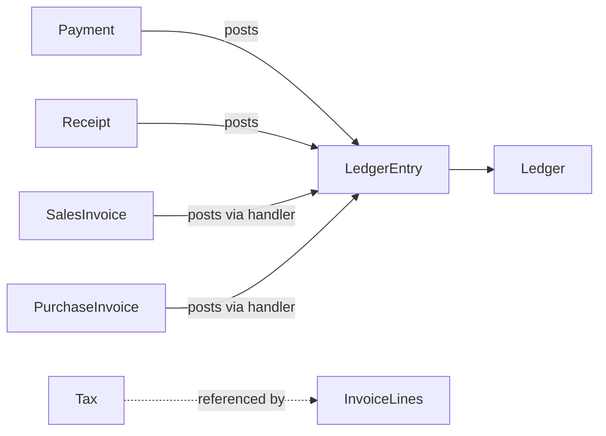

# Finance — Aggregate Design

## Purpose

Define aggregate boundaries for financial documents and the chart of accounts so posting integrity and voucher lifecycle remain consistent.

## Responsibilities

- Separate aggregates for configuration (Ledger), transactions (Payment, Receipt), and journal lines (LedgerEntry).
- Specify consistency boundaries for double-entry posting.

## Scope

Finance aggregates and cross-aggregate invariants.

## Related Entities

[financial.md](../../database/tables/financial/financial.md), [49_tax.md](../../database/tables/pricing/49_tax.md).

## Aggregates

### Ledger Aggregate (Chart of Accounts)

| Component | Type | Notes |
|-----------|------|-------|
| Ledger | Root | COA node; hierarchy via parentLedgerId |
| Child Ledger | Entity | Nested accounts |

**Rules:** System ledgers (`isSystem = true`) cannot be deleted. No balance stored on root.

### Journal Posting Unit (conceptual)

Each business voucher forms a **posting unit** — not a classic DDD aggregate root in DB, but an consistency boundary:

| Component | Type | Notes |
|-----------|------|-------|
| LedgerEntry[] | Entities | 2+ lines; balanced debits/credits |
| Voucher reference | Value | voucherType + voucherId + voucherNumber |

All lines for one voucher insert in **one transaction** via `UnitOfWork`.

### Payment Aggregate

| Component | Type | Notes |
|-----------|------|-------|
| Payment | Root | Outgoing money |
| LedgerEntry[] | Created on complete | Debit payable/expense; credit cash/bank |

See [43_payment.md](../../database/tables/financial/43_payment.md).

### Receipt Aggregate

| Component | Type | Notes |
|-----------|------|-------|
| Receipt | Root | Incoming money |
| LedgerEntry[] | Created on complete | Debit cash/bank; credit receivable/income |

See [44_receipt.md](../../database/tables/financial/44_receipt.md).

### Tax Aggregate (Pricing boundary)

| Component | Type | Notes |
|-----------|------|-------|
| Tax | Root | Rate master; owned by pricing/finance config |

Tax amounts on transactions are **snapshotted** on invoice lines, not on Tax aggregate.

## Aggregate Relationships

## Business Rules

- Payment/Receipt aggregate controls status; LedgerEntry creation is side effect on COMPLETED.
- Cannot partially post voucher — all lines or rollback.

## Domain Events

`PaymentCompleted` emitted by Payment aggregate; `LedgerEntryPosted` by posting service.

## State Model

Payment PENDING may exist without LedgerEntry; COMPLETED always has entries.

## Integrations

- `LedgerPostingService` shared by Payment, Receipt, Sales, Purchasing modules.
- SequenceGenerator for paymentNumber, receiptNumber.

## Security Considerations

- Ledger master edit restricted; posting requires transaction permissions.

## Performance Considerations

- Batch insert LedgerEntry lines in single SQL statement per voucher.

## Future Enhancements

- Expense aggregate root when Expense table added.
- JournalVoucher aggregate for manual GL entries.
