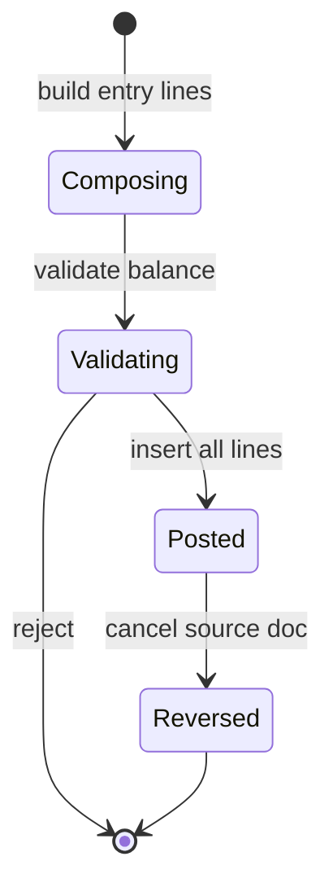

# Finance — Journal (LedgerEntry Pattern)

## Purpose

Define the **LedgerEntry** journal pattern — the append-only double-entry log that is the source of truth for all financial reporting.

## Responsibilities

- Document voucher grouping, line structure, posting lifecycle, and reversal pattern.
- Align application services with [46_ledger_entry.md](../../database/tables/financial/46_ledger_entry.md).

## Scope

General ledger journal mechanics shared by Payment, Receipt, Sales, Purchase, Expense, and manual journals.

## Related Entities

[46_ledger_entry.md](../../database/tables/financial/46_ledger_entry.md), [financial.md](../../database/tables/financial/financial.md), [45_ledger.md](../../database/tables/financial/45_ledger.md).

## LedgerEntry Pattern

### Core concept

Every financial event produces **two or more** `LedgerEntry` rows sharing:

| Field | Purpose |
|-------|---------|
| `voucherType` | SALES, PURCHASE, RECEIPT, PAYMENT, JOURNAL, OPENING, etc. |
| `voucherId` | Source document primary key |
| `voucherNumber` | Human-readable document number |
| `transactionDate` | Accounting date (may differ from document date) |
| `ledgerId` | Account affected |
| `debitAmount` / `creditAmount` | Exactly one side > 0 per line |
| `isPosted` | true when finalized |

### Double-entry invariant

For each `(voucherType, voucherId)`:

```text
Σ debitAmount = Σ creditAmount
```

Enforced in `LedgerPostingService` before insert (BR-F12).

### Example — Customer receipt (₹850 cash sale collection)

| ledgerId | Account | Debit | Credit |
|---------:|---------|------:|-------:|
| 1 | Cash | 850 | 0 |
| 5 | Customer Receivable | 0 | 850 |

`voucherType = RECEIPT`, `voucherNumber = REC250001`.

### Example — Supplier payment (₹25,000)

| ledgerId | Account | Debit | Credit |
|---------:|---------|------:|-------:|
| 6 | Supplier Payable | 25,000 | 0 |
| 2 | HDFC Bank | 0 | 25,000 |

`voucherType = PAYMENT`, `voucherNumber = PAY250001`.

See [supplier/payments.md](../supplier/payments.md).

## Posting Lifecycle



1. **Composing** — application builds in-memory `JournalLine[]`.
2. **Validating** — balance check, ledger active, period open.
3. **Posted** — single transaction insert all rows with `isPosted = true`.
4. **Reversed** — new voucher with negated lines; original unchanged.

## Business Rules

BR-F10–BR-F15 in [business-rules.md](business-rules.md).

- Never UPDATE debit/credit on posted rows.
- `runningBalance` optional denormalization per ledger line — recalculate if used.

## Domain Events

- `LedgerEntryPosted` — after successful insert batch.
- `LedgerEntryReversed` — reversal voucher posted.

## State Model

Posted is terminal for individual lines; document cancellation adds new lines.

## Integrations

| Source module | voucherType |
|---------------|-------------|
| Sales | SALES |
| Purchasing | PURCHASE |
| Payment | PAYMENT |
| Receipt | RECEIPT |
| Stock adjustment | JOURNAL (policy) |
| Opening balance | OPENING |

Cross-link party balances: Customer/Supplier outstanding reconciliation reads entries on receivable/payable ledgers — [reconciliation.md](reconciliation.md).

## Security Considerations

- Manual JOURNAL vouchers require elevated permission (future).
- Posted entries visible in audit reports — no PII in narration fields.

## Performance Considerations

- Composite index `(voucherType, voucherId)` for voucher lookup.
- `(ledgerId, transactionDate)` for account statement queries.

## Future Enhancements

- Idempotent posting via `operationId` on voucher.
- Async posting queue for bulk historical import (still balanced per voucher).

## See Also

[accounting.md](accounting.md) — accounting equation and report mapping.
