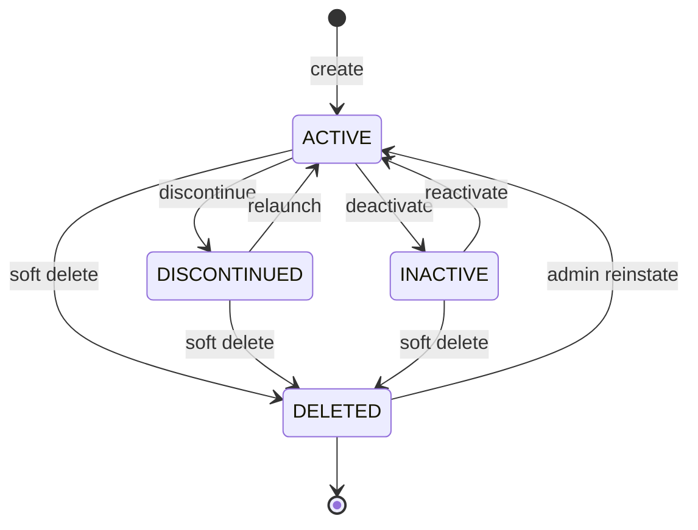
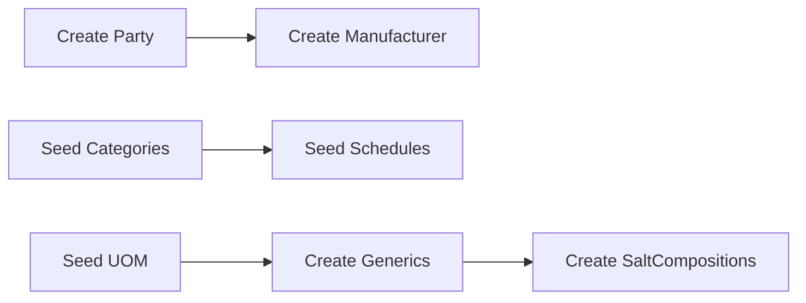

# Medicine Master Domain

The Medicine Master bounded context owns the pharmaceutical product catalog for the pharmacy ERP. It defines what can be purchased, stocked, priced, and sold — without storing inventory quantities, batch lots, or branch sale rates.

This file is named `product.md` for historical layout reasons; the domain vocabulary is **Medicine**, not Product. There is no `Product` table in the schema.

**Table overview:** [medicine_master.md](../database/tables/medicine_master/medicine_master.md), [inventory.md](../database/tables/inventory/inventory.md), [pricing.md](../database/tables/pricing/pricing.md)

**Related domains:** [inventory.md](inventory.md), [purchasing.md](purchasing.md), [sales.md](sales.md), [supplier.md](supplier.md)

## Overview & Aggregate

### Responsibilities

- Maintain org-global medicine identity (`medicineCode`, name, dosage form, HSN, barcode).
- Classify medicines via category, schedule, and generic/salt composition.
- Link each medicine to a manufacturer and primary unit of measure.
- Enforce regulatory flags (prescription, narcotic, refrigerated) and lifecycle flags (`isActive`, `discontinued`).
- Publish master-data changes for sync via transactional outbox (`OutboxEntityType.MEDICINE`).

### In scope

- `Medicine` and supporting reference masters: `MedicineGeneric`, `MedicineCategory`, `MedicineSchedule`, `Manufacturer`, `SaltComposition`, `MedicineSalt`, `UnitOfMeasure`.
- Medicine master maintenance workflows, validation, permissions, and domain events.
- Cross-domain **references** to inventory (`Batch`, `Stock`), pricing (`PriceList`, `PriceListItem`), and party (`Party` via `Manufacturer`).

### Out of scope

- Stock quantities, batch lots, and stock movements — Inventory bounded context.
- Branch sale pricing and tax application — Pricing tables.
- Purchase and sales transaction processing — Purchasing and Sales bounded contexts.
- Supplier/distributor party management (distinct from manufacturer) — Supplier bounded context.

### Related entities

| Entity | Role |
|--------|------|
| **Medicine** | Aggregate root — branded product record |
| **MedicineGeneric** | Scientific/generic name (API) |
| **MedicineCategory** | Hierarchical classification |
| **MedicineSchedule** | Regulatory schedule (H, H1, X, OTC) |
| **Manufacturer** | Pharma producer (links `Party`) |
| **SaltComposition** | Standardized salt strength |
| **MedicineSalt** | Medicine ↔ salt junction |
| **UnitOfMeasure** | Shared quantity unit master |
| **Batch** | Lot identity per medicine (inventory) |
| **PriceListItem** | Branch sale price per medicine |

### Aggregate structure

```
Manufacturer ──► Medicine ◄── MedicineCategory
                      │
         ┌────────────┼────────────┐
         ▼            ▼            ▼
  MedicineSchedule  UnitOfMeasure  MedicineSalt ──► SaltComposition ──► MedicineGeneric
```

| Component | Type | Notes |
|-----------|------|-------|
| Medicine | Root | `medicineCode`, `medicineName`, `brandName`, `dosageForm`, `packSize`, `strength`, `hsnCode`, `barcode` |
| MedicineSalt | Entity | Junction to `SaltComposition`; ordered by `sequenceNo` |
| Manufacturer | Referenced master | One `Party` → one `Manufacturer` → many `Medicine` |
| MedicineCategory | Referenced master | Exactly one category per medicine |
| MedicineSchedule | Referenced master | Optional; drives prescription and register rules |
| UnitOfMeasure | Referenced master | Primary UOM for invoices and stock |

**Consistency rule:** `medicineCode` is globally unique; chemical composition is modeled through `MedicineSalt` → `SaltComposition`, not duplicated on `Medicine.strength` alone. Sale pricing lives in `PriceListItem`, not on `Medicine` or `Batch`.

Masters use UUID for sync, BIGINT internal PK, soft delete (`deletedAt`), and optimistic locking (`version`). Medicine master data is **org-global**; branch scoping applies to transactions (sales, stock, price lists), not to the medicine row itself.

Integrations: **SequenceGenerator** (may allocate `medicineCode`), **AuditService** (module `MASTER`), **Outbox** (sync keyed on `uuid`).

## Terminology

| Term | Definition | Persistence |
|------|------------|-------------|
| **Medicine** | Branded sellable SKU (e.g. "Crocin 500 Tablet") | `Medicine` |
| **MedicineGeneric** | Active pharmaceutical ingredient independent of brand | `MedicineGeneric` |
| **SaltComposition** | Standardized strength of a generic (e.g. Paracetamol 500 mg) | `SaltComposition` |
| **MedicineSalt** | Link between medicine and one or more salt compositions | `MedicineSalt` |
| **MedicineCategory** | Business classification (Antibiotics, Tablets, Surgical Items) | `MedicineCategory` |
| **MedicineSchedule** | Regulatory class (OTC, Schedule H, H1, X) | `MedicineSchedule` |
| **Manufacturer** | Company that manufactures the medicine; links to `Party` | `Manufacturer` |
| **UnitOfMeasure (UOM)** | Count/pack/volume unit for transactions | `UnitOfMeasure` |
| **Batch** | Lot of a medicine (batch no, expiry, cost) | Inventory domain |
| **Stock** | Branch quantity for a batch | Inventory domain |
| **Supplier** | Distributor who invoices the pharmacy | Party / Purchasing |
| **PriceListItem** | Branch sale price for a medicine | Pricing domain |
| **HSN** | GST classification code on medicine | `Medicine.hsnCode` |
| **MRP** | Statutory on batch; commercial ceiling on price item | `Batch.mrp` / `PriceListItem.mrp` |

### Use "Medicine", not "Product"

| Prefer | Avoid | Reason |
|--------|-------|--------|
| Medicine | Product | No `Product` table exists |
| medicineCode | productCode | Column is `medicineCode` |
| Medicine master | Product catalog | Matches bounded context intent |
| `MASTER:MEDICINE:UPDATE` | `MASTER:PRODUCT:UPDATE` | Seed resource is `MEDICINE` |

Naming conventions: event names use Medicine prefix (`MedicineCreated`, not `ProductCreated`); API routes prefer `/medicines` not `/products`; outbox entity type `Medicine` (`OutboxEntityType.MEDICINE`). Medicine uses **boolean lifecycle flags**, not a single "status" string — do not apply invoice status words to medicine master.

External systems exchange **uuid** identifiers, never local numeric ids.

## Business Rules & Invariants

### Business rules

#### Medicine (aggregate root)

| ID | Rule | Enforcement |
|----|------|-------------|
| BR-M01 | `medicineCode` unique across organization | DB unique + sequence |
| BR-M02 | `manufacturerId`, `categoryId`, `unitId` mandatory; `scheduleId` optional | Validation |
| BR-M03 | `medicineName` must not duplicate another active medicine for same manufacturer | Application |
| BR-M04 | `dosageForm` required (Tablet, Capsule, Syrup, Injection, etc.) | Validation |
| BR-M05 | No sale rate, discount, or tax on `Medicine` | Schema policy |
| BR-M06 | No inventory quantities on `Medicine` | Schema policy |
| BR-M07 | Multi-ingredient formulas use `MedicineSalt`; do not encode composition only in `strength` | Application |
| BR-M08 | Set `discontinued = true` instead of hard delete when product withdrawn | Application |
| BR-M09 | Soft delete via `deletedAt`; never hard delete medicines referenced by batches or transactions | Application |
| BR-M10 | Every medicine has stable `uuid`; `id` (BIGINT) is local only | Schema |

#### Reference masters

| ID | Rule | Enforcement |
|----|------|-------------|
| BR-M20 | `MedicineGeneric`: unique `genericCode` and `genericName` | DB unique |
| BR-M21 | `MedicineCategory`: unique codes; optional hierarchy; no circular parent chains | Validation |
| BR-M22 | `MedicineSchedule`: unique codes; seeded system schedules must not be deleted | Validation |
| BR-M23 | `Manufacturer`: one per `Party`; unique `manufacturerCode` | DB unique |
| BR-M24 | `SaltComposition`: unique `(genericId, strength, strengthUnit)` | DB unique |
| BR-M25 | `MedicineSalt`: unique `(medicineId, saltCompositionId)` | DB unique |
| BR-M26 | `UnitOfMeasure`: unique codes; `unitType` ∈ COUNT, WEIGHT, VOLUME, PACKAGING | Validation |

#### Manufacturer vs supplier

| ID | Rule | Enforcement |
|----|------|-------------|
| BR-M30 | Medicines reference `Manufacturer`, not Supplier or `Party` directly | FK |
| BR-M31 | Supplier distributes; manufacturer is pharma company on the pack | Domain policy |
| BR-M32 | GRN line references `medicineId` (hence manufacturer) and invoice supplier separately | Purchasing |

#### Cross-cutting

- Org-global masters — medicine rows are not branch-scoped; branch applies on `Batch`/`Stock`/`PriceList`.
- Optimistic locking — all syncable masters use `version >= 1`; updates must check expected version.
- Schedule compliance flags (`requiresPrescription`, `requiresDoctorDetails`, `maintainSalesRegister`, `controlledSubstance`) drive sales validation.

### Invariants (always true)

| ID | Invariant |
|----|-----------|
| INV-M01 | If `Medicine` exists, referenced `Manufacturer`, `MedicineCategory`, and `UnitOfMeasure` exist |
| INV-M02 | `Medicine.medicineCode` is globally unique among non-deleted rows |
| INV-M03 | `Medicine.uuid` is globally unique non-empty string |
| INV-M04 | `Medicine.version` ≥ 1 and increments on every successful update |
| INV-M05 | Each medicine belongs to exactly one category |
| INV-M06 | A medicine references at most one schedule |
| INV-M07 | `Manufacturer.partyId` is unique on `Manufacturer` |
| INV-M08 | Sync replication keys on `uuid`, never local `BigInt id` |
| INV-M09 | Soft-deleted records have `deletedAt` ≥ `createdAt` |
| INV-M10 | Discontinuing a medicine does not delete batches or historical transactions |

Invariant violations must not emit domain events; return application error.

### Validation

#### Medicine — required fields (create)

| Field | Rules |
|-------|-------|
| `medicineCode` | Non-empty, max 30, unique |
| `medicineName` | Non-empty, max 200 |
| `manufacturerId` | Valid, active manufacturer exists |
| `categoryId` | Valid, active category exists |
| `unitId` | Valid, active UOM exists |
| `dosageForm` | Non-empty, max 50 |

#### Medicine — optional fields

| Field | Rules |
|-------|-------|
| `scheduleId` | If set, schedule exists and active |
| `brandName` | Max 150 |
| `strength` | Max 50 (display hint; composition is authoritative) |
| `packSize` | Max 50 |
| `hsnCode` | Max 20; numeric pattern per GST policy |
| `barcode` | Max 50; unique if provided |
| `requiresPrescription`, `narcoticDrug`, `refrigerated` | Boolean, default false |

#### Medicine — flags and concurrency

| Field | Rules |
|-------|-------|
| `isActive` | Boolean, default true |
| `discontinued` | Boolean, default false |
| `version` | Required on update, >= 1, must match DB row |

#### Cross-field validation

1. **Name per manufacturer** — reject duplicate `medicineName` + `manufacturerId` → `CONFLICT`.
2. **Schedule vs prescription** — warn if `schedule.requiresPrescription` and `requiresPrescription = false`.
3. **Narcotic** — if `MedicineSchedule.controlledSubstance`, recommend `narcoticDrug = true`.
4. **Soft delete** — reject if policy forbids delete with open stock → `CONFLICT`.

#### MedicineSalt — composition

| Field | Rules |
|-------|-------|
| `saltCompositionId` | Must exist, active |
| `sequenceNo` | Integer >= 1 |
| `percentage` | If set, 0–100 |
| Uniqueness | No duplicate `saltCompositionId` per medicine |

At least one salt recommended for scheduled medicines; not a hard DB constraint.

Implementation: class-validator on NestJS DTOs; domain validation in MedicineService; PATCH/PUT must include `version`; mismatch → `CONFLICT`. Whitelist DTO fields — unknown properties rejected.

## Lifecycle & States

### Phases

1. **Introduction** — Create with `isActive = true`, `discontinued = false`, `deletedAt = NULL`; assign `medicineCode`; complete composition for scheduled drugs. Event: `MedicineCreated`.
2. **Active operation** — Available in search, PO lines, goods receipt, and sales (subject to batch stock and schedule rules). Updates with optimistic locking.
3. **Discontinuation** — Set `discontinued = true` when manufacturer withdraws SKU; block new PO lines; existing stock sells through. Event: `MedicineDiscontinued`.
4. **Deactivation** — Set `isActive = false` to hide from selectors (duplicate cleanup, data quality hold). Event: `MedicineDeactivated`.
5. **Soft delete** — Set `deletedAt` only when no operational dependency remains. Event: `MedicineDeleted`.
6. **Reinstatement** — Clear flags or `deletedAt` with admin workflow. Event: `MedicineUpdated`.

Prefer discontinue over delete for products that ever had stock or sales.

### State machine

Medicine lifecycle is modeled with **boolean flags** plus soft delete, not a string status column:

| Label | Condition | Operational summary |
|-------|-----------|---------------------|
| **ACTIVE** | `deletedAt` null, `isActive`, not `discontinued` | Full use |
| **DISCONTINUED** | `deletedAt` null, `discontinued` | No new procurement; stock may sell |
| **INACTIVE** | `deletedAt` null, not `isActive`, not `discontinued` | Hidden; data hold or duplicate |
| **DELETED** | `deletedAt` set | Terminal; history only |



| From | To | Guard | Side effects |
|------|-----|-------|--------------|
| ACTIVE | DISCONTINUED | User confirms | Block new PO lines; warn on purchase |
| ACTIVE | INACTIVE | — | Hide from default search |
| ACTIVE | DELETED | No stock/transactions OR override | Outbox DELETE |
| DISCONTINUED | ACTIVE | Product relaunched | Restore procurement |
| INACTIVE | ACTIVE | Data corrected | Restore selectors |
| DELETED | ACTIVE | Admin approval | Clear `deletedAt`, audit |

Schedule compliance is orthogonal to lifecycle: Schedule H medicine in **ACTIVE** state still requires prescription at sale time; **DELETED** medicine never sold regardless of schedule.

## Domain Events

Events publish **after** database commit via outbox (`UnitOfWork`). Payloads use `uuid` only for cross-device sync. Every committed medicine mutation that should sync MUST enqueue outbox in the **same database transaction** as the business write.

### Medicine aggregate events

| Event | Trigger | Payload (key fields) | Consumers |
|-------|---------|----------------------|-----------|
| `MedicineCreated` | New medicine persisted | `uuid`, `medicineCode`, `manufacturerUuid`, `categoryUuid`, `unitUuid`, `version` | Audit, search index, outbox |
| `MedicineUpdated` | Master fields changed | Changed fields, new `version` | Cache invalidation, POS catalog |
| `MedicineCompositionChanged` | `MedicineSalt` rows added/removed/reordered | Embedded `salts[]` or delta | Label/display refresh |
| `MedicineDeactivated` | `isActive` false | `uuid`, `version` | Block new PO/price entries |
| `MedicineDiscontinued` | `discontinued` true | `uuid`, `version` | Warn on purchase |
| `MedicineDeleted` | Soft delete | `uuid`, `deletedAt` | Sync tombstone |

Outbox: `entityType = Medicine`, `entityUuid = medicine.uuid`, `operation = CREATE | UPDATE | DELETE`.

### Reference master events (planned)

| Event | Entity |
|-------|--------|
| `MedicineGenericCreated` / `Updated` / `Deleted` | MedicineGeneric |
| `ManufacturerCreated` / `Updated` | Manufacturer |
| `MedicineCategoryCreated` / `Updated` | MedicineCategory |

Sync status uses string values: `PENDING`, `PROCESSING`, `SYNCED`, `FAILED` (`OutboxSyncStatus`).

## Permissions

Format: **`MODULE:RESOURCE:ACTION`**. Seed reference: `MASTER_MEDICINE` in `backend/seed/data/security/permission.json`.

| Permission code | Seeded |
|-----------------|--------|
| `MASTER:MEDICINE:UPDATE` | Yes (`MASTER_MEDICINE`) |
| `MASTER:MEDICINE:READ` | Planned |

| Operation | Required permission |
|-----------|---------------------|
| List / search medicines | Authenticated (future: `MASTER:MEDICINE:READ`) |
| Get medicine by uuid | Authenticated |
| Create / update / soft delete / discontinue | `MASTER:MEDICINE:UPDATE` |
| Manage composition | `MASTER:MEDICINE:UPDATE` |
| View stock for medicine | `INVENTORY:STOCK:READ` (seed: `INVENTORY_VIEW`) |
| Stock adjustments | `INVENTORY:STOCK_ADJUSTMENT:CREATE` (seed: `INVENTORY_ADJUST`) |

`UPDATE` implies write — create, update, soft delete, discontinue, and composition changes require `MASTER:MEDICINE:UPDATE` until granular actions are seeded. Medicine master is org-global; JWT still carries `branchId` for audit and downstream modules, not for row-level filter on `Medicine`.

Checks run in guards and application service. JWT caches permissions for access token lifetime.

## Workflows

### WF-M01 — Prerequisites (one-time / periodic)



| Step | Actor | Permission | Output |
|------|-------|------------|--------|
| 1. Party | Admin | `PARTY:PARTY:UPDATE` | Legal entity |
| 2. Manufacturer | Master steward | `MASTER:MEDICINE:UPDATE` | `manufacturerId` |
| 3. Categories / schedules / UOM | Admin | `MASTER:MEDICINE:UPDATE` | Reference ids |
| 4. Generics + salts | Master steward | `MASTER:MEDICINE:UPDATE` | `saltCompositionId` list |

System schedules and system UOMs are seeded at install.

### WF-M02 — Create medicine (happy path)

| Step | Action | Validation | Downstream |
|------|--------|------------|------------|
| 1 | Open medicine form | `MASTER:MEDICINE:UPDATE` | — |
| 2 | Enter identity: code, name, brand, dosage, pack, HSN, barcode | Field validation | — |
| 3 | Select manufacturer, category, UOM, schedule | FK exists, active | — |
| 4 | Set flags: prescription, narcotic, refrigerated | Schedule alignment warn | Sales compliance |
| 5 | Add MedicineSalt rows | Unique junction | Label/display |
| 6 | Save in unit of work | Version = 1 | Outbox CREATE |
| 7 | Audit log | Auto | Compliance |
| 8 | Branch pricing setup (separate task) | Price > 0, tax | PriceListItem per branch |
| 9 | First purchase (separate task) | Medicine active | Batch + Stock |

Medicine create does **not** auto-create batches or prices.

### WF-M03 — Update medicine

Load by uuid with current `version`; edit allowed fields (avoid changing `medicineCode` post-sync); update composition diff; save with version increment; emit `MedicineUpdated`; invalidate caches. Historical invoices retain snapshotted names.

### WF-M04 — Discontinue medicine

User selects Discontinue → confirm existing stock may remain → set `discontinued = true` → emit `MedicineDiscontinued` → purchasing UI warns on new PO lines → optionally deactivate branch PriceListItems.

### WF-M05 — Deactivate medicine

Set `isActive = false` → hide from default search → block new batches and PO lines. Used for duplicates or temporary delist without manufacturer withdrawal.

### WF-M06 — Soft delete medicine

Verify no stock / no posted transactions (policy) → set `deletedAt` → outbox DELETE → remove from all selectors. Prefer discontinue when history exists.

### WF-M07 — Reinstate

Admin clears `deletedAt` or restores flags → `MedicineUpdated` with audit reason → re-add PriceListItem if needed.

## Integrations

### Inventory

```
Medicine (org-global)
    └──< Batch (org-global lot identity)
              └──< Stock (branch-scoped quantity)
                        └──< StockMovement (immutable ledger)
```

| Rule | Detail |
|------|--------|
| One medicine, many batches | Unique `(medicineId, batchNumber)` |
| Stock is branch-scoped | Quantity per `(branchId, batchId)`, not on `Medicine` |
| Lot pricing on batch | `purchaseRate` (cost) and statutory `mrp` on `Batch` |
| Sale rate from pricing | Billing uses `PriceListItem.sellingPrice` |
| Expired batches | Cannot be sold; medicine may remain active |
| Discontinued medicine | Existing batches remain; new batches discouraged |
| Soft-deleted medicine | Must not appear in GRN or sales selectors |

| Medicine state | New batch? | Sell existing stock? |
|----------------|------------|----------------------|
| Active | Yes | Yes |
| Discontinued | No (policy) | Yes |
| Inactive | No | Policy-dependent |
| Deleted | No | No (historical only) |

See [inventory.md](../database/tables/inventory/inventory.md).

### Pricing

Sale pricing is branch-scoped in `PriceList` / `PriceListItem`, not on `Medicine` or `Batch`.

| Location | Field | Meaning |
|----------|-------|---------|
| Medicine | — | Identity and classification only |
| Batch | `purchaseRate`, `mrp` | Cost and statutory pack MRP |
| PriceListItem | `sellingPrice`, `mrp` | Branch counter rate and commercial ceiling |

Billing resolution: resolve active `PriceList` for transaction `branchId` → find active `PriceListItem` for `medicineId` with valid effective dates → apply `sellingPrice`, optional `discountPercent`, and `taxId` → snapshot on `SalesInvoiceItem`. One item per medicine per price list; unique `(priceListId, medicineId)`.

See [pricing.md](../database/tables/pricing/pricing.md).

### Manufacturer and Party

```
Party (legal identity)
    ├── Manufacturer (1:1) ──< Medicine (many)
    └── Supplier (1:1) ── used on PurchaseOrder / PurchaseInvoice
```

Create Party first, then Manufacturer extension row. Manufacturer create/update may use `MASTER:MEDICINE:UPDATE` or `PARTY:PARTY:UPDATE` for Party shell — align with role design.

See [party_management.md](../database/tables/party_management/party_management.md).

### Purchasing / Sales

- **Purchasing** — validates medicine active and not soft-deleted before PO line add; PO to Supplier; line items resolve Medicine → Manufacturer.
- **Sales** — block deleted/inactive; warn on discontinued; schedule rules still apply when active; validates schedule flags at invoice time.
- **Barcode** — `BarcodeConfiguration.appliesTo = MEDICINE` for label printing; scan may match `Medicine.barcode` or `Batch.barcode`.

### Sync (offline-first)

All entities expose `uuid`; outbox publishes changes on medicine mutations. Conflict: last-write-wins with `version` check. Tombstones via `deletedAt`. `operationId` provides idempotency for sync retries.

### Audit

`AuditService.log` in same `UnitOfWork` (module `MASTER`). Lifecycle changes logged with before/after flags.

Cross-context calls must not bypass aggregate services.
