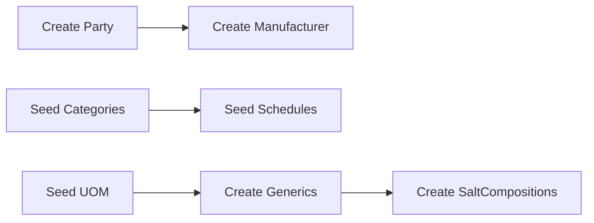

# Medicine Master — Workflows

## Purpose

Describe the end-to-end workflows for creating and maintaining medicine master data, including prerequisites, validation gates, downstream setup, and sync behavior.

## Responsibilities

- Define ordered steps for master data stewards and implementers.
- Identify handoffs to Pricing and Inventory domains.
- Map workflow steps to permissions and domain events.

## Scope

### In Scope

- Greenfield medicine setup and ongoing maintenance.
- Reference master prerequisites (Party, Manufacturer, category, UOM, schedule, generics/salts).
- Discontinue, deactivate, and soft-delete paths.

### Out of Scope

- Goods receipt and batch creation — Purchasing / Inventory workflows.
- Price list bulk import — Pricing workflows.
- Sales dispensing workflow — Sales domain.

## Related Entities

Workflow touches:

1. `Party` → `Manufacturer` — [19_manufacturer.md](../../database/tables/medicine_master/19_manufacturer.md)
2. `MedicineCategory`, `MedicineSchedule`, `UnitOfMeasure`, `MedicineGeneric`, `SaltComposition`
3. `Medicine` + `MedicineSalt` — [15_medicine.md](../../database/tables/medicine_master/15_medicine.md)
4. `PriceListItem` — [48_price_list_item.md](../../database/tables/pricing/48_price_list_item.md)
5. `Batch` — created on first stock receipt — [23_batch.md](../../database/tables/inventory/23_batch.md)

## Business Rules

- Prerequisites must exist before medicine create (manufacturer, category, UOM).
- Composition should be finalized before scheduled drugs are sold.
- Sale pricing configured per branch after medicine exists — not on medicine save.
- All writes run inside `RequestContextService` + `UnitOfWorkService` with outbox enqueue.
- Offline desktop may queue medicine creates; sync resolves by UUID.

## Domain Events

| Workflow step | Event |
|---------------|-------|
| Save new medicine | `MedicineCreated` |
| Edit header | `MedicineUpdated` |
| Edit salts | `MedicineCompositionChanged` / `MedicineUpdated` |
| Discontinue | `MedicineDiscontinued` |
| Deactivate | `MedicineDeactivated` |
| Delete | `MedicineDeleted` |

## State Model

Workflow entry/exit by state — see [lifecycle.md](./lifecycle.md):

- New records start **ACTIVE**.
- Discontinue workflow ends in **DISCONTINUED**.
- Data quality hold ends in **INACTIVE**.

---

## Workflow 1 — Prerequisites (one-time / periodic)

| Step | Actor | Permission | Output |
|------|-------|------------|--------|
| 1. Party | Admin | `PARTY:PARTY:UPDATE` | Legal entity |
| 2. Manufacturer | Master steward | `MASTER:MEDICINE:UPDATE` | `manufacturerId` |
| 3. Categories / schedules / UOM | Admin | `MASTER:MEDICINE:UPDATE` | Reference ids |
| 4. Generics + salts | Master steward | `MASTER:MEDICINE:UPDATE` | `saltCompositionId` list |

System schedules and system UOMs are seeded at install — [medicine_master.md](../../database/tables/medicine_master/medicine_master.md).

---

## Workflow 2 — Create medicine (happy path)

| Step | Action | Validation | Downstream |
|------|--------|------------|------------|
| 1 | Open medicine form | User has `MASTER:MEDICINE:UPDATE` | — |
| 2 | Enter identity: code, name, brand, dosage, pack, HSN, barcode | [validation.md](./validation.md) | — |
| 3 | Select manufacturer, category, UOM, schedule | FK exists, active | — |
| 4 | Set flags: prescription, narcotic, refrigerated | Schedule alignment warn | Sales compliance |
| 5 | Add MedicineSalt rows (sequence, composition) | Unique junction | Label/display |
| 6 | Save in unit of work | Version = 1 | Outbox CREATE |
| 7 | Audit log | Auto | Compliance |
| 8 | **Branch pricing setup** (separate task) | Price > 0, tax | PriceListItem per branch |
| 9 | **First purchase** (separate task) | Medicine active | Batch + Stock |

Medicine create does **not** auto-create batches or prices.

---

## Workflow 3 — Update medicine

| Step | Action | Notes |
|------|--------|-------|
| 1 | Load by uuid with current `version` | Optimistic lock |
| 2 | Edit allowed fields | Avoid changing `medicineCode` post-sync |
| 3 | Update composition diff | Add/remove/reorder salts |
| 4 | Save | `version` increment; outbox UPDATE |
| 5 | Invalidate caches | POS/search |

Historical invoices retain snapshotted names; master name change does not rewrite posted lines.

---

## Workflow 4 — Discontinue medicine

| Step | Action |
|------|--------|
| 1 | User selects Discontinue |
| 2 | Confirm — existing stock may remain |
| 3 | Set `discontinued = true` |
| 4 | Emit `MedicineDiscontinued` |
| 5 | Purchasing UI warns on new PO lines |
| 6 | Optionally deactivate branch PriceListItems |

---

## Workflow 5 — Deactivate medicine

Used for duplicates or temporary delist without manufacturer withdrawal.

| Step | Action |
|------|--------|
| 1 | Set `isActive = false` |
| 2 | Hide from default search |
| 3 | Block new batches and PO lines |

---

## Workflow 6 — Soft delete medicine

| Step | Action |
|------|--------|
| 1 | Verify no stock / no posted transactions (policy) |
| 2 | Set `deletedAt` |
| 3 | Outbox DELETE |
| 4 | Remove from all selectors |

Prefer discontinue when history exists.

---

## Workflow 7 — Reinstate

| Step | Action |
|------|--------|
| 1 | Admin clears `deletedAt` or restores flags |
| 2 | `MedicineUpdated` with audit reason |
| 3 | Re-add PriceListItem if needed |

---

## Integrations

| System | Integration point |
|--------|-------------------|
| **NestJS API** | Medicine module controller + service |
| **Audit** | `AuditService` on commit |
| **Outbox** | Same transaction as medicine persist |
| **Electron UI** | Master data menu → medicine form |
| **Sync** | Peer receives Medicine CREATE/UPDATE/DELETE by uuid |

Branch scoping: workflow runs at org level; user JWT includes `branchId` for audit only on master writes unless branch-specific pricing step.

## Security Considerations

- All write workflows require `MASTER:MEDICINE:UPDATE`.
- Discontinue/delete should show confirmation with impact summary.
- Audit captures user, timestamp, correlation id, before/after JSON.

## Performance Considerations

- Wizard-style create: lazy-load manufacturer/category dropdowns with pagination.
- Defer price list setup to background task for bulk catalog imports.
- Batch composition save in one transaction — avoid N+1 salt inserts.

## Future Enhancements

- Draft medicine workflow with pharmacist approval before ACTIVE.
- Bulk import CSV with validation report and staged commit.
- Integration workflow from barcode scan → lookup → create if missing.

See [README.md](./README.md) for topic index and [supplier.md](./supplier.md) for Party → Manufacturer prerequisite detail.
