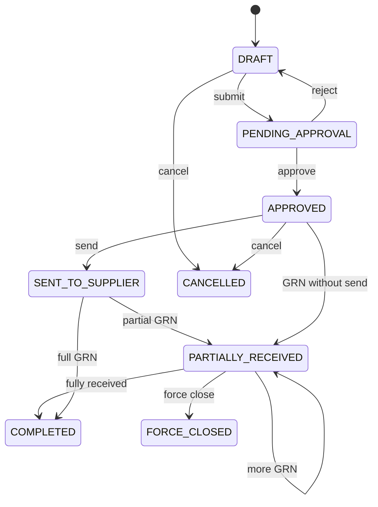
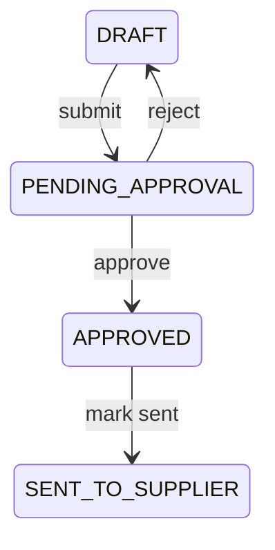
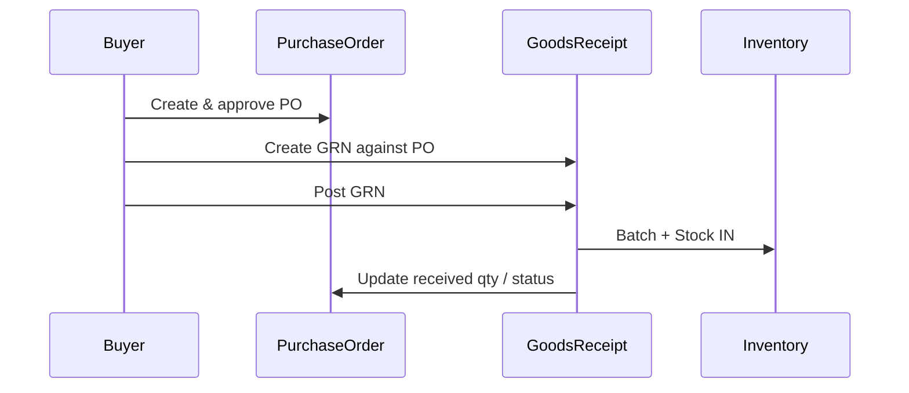

# Purchasing Domain

The Purchasing domain manages procurement from suppliers: raising purchase orders, receiving goods into branch inventory, matching supplier invoices, and returning defective or excess stock. It is the inbound counterpart to Sales — stock enters the pharmacy through **Goods Receipt**, not through the PO alone.

**Database reference:** [Purchase tables overview](../database/tables/purchase/purchase.md)

**Related domains:** [supplier.md](supplier.md), [inventory.md](inventory.md), [finance.md](finance.md)

## Overview & Aggregate

### Responsibilities

- Create and approve **PurchaseOrder** with line items
- Record **GoodsReceipt** (GRN) that creates **Batch** and **Stock** at the receiving branch
- Register **PurchaseInvoice** against receipts or PO for accounts payable
- Process **PurchaseReturn** to suppliers with stock OUT
- Maintain PO fulfillment state across partial receipts
- Emit events and outbox records atomically with inventory and audit

### In scope

- `PurchaseOrder`, `PurchaseOrderItem`
- `GoodsReceipt`, `GoodsReceiptItem`
- `PurchaseInvoice`, `PurchaseInvoiceItem`
- `PurchaseReturn`, `PurchaseReturnItem`
- Branch-scoped document numbers for all document types
- PO lifecycle through approval, supplier send, partial receipt, completion, force close, cancel

### Out of scope

- Supplier master maintenance (Supplier domain)
- Sales and customer billing (Sales domain)
- Payment to supplier execution (Finance domain) — Purchasing records invoice liability
- RFQ / vendor bidding (see [future-roadmap](../roadmap/future-roadmap.md#purchasing))

### Related entities

| Entity | Role |
|--------|------|
| `PurchaseOrder` | Procurement request to supplier |
| `PurchaseOrderItem` | Ordered lines |
| `GoodsReceipt` | Physical receipt (GRN) |
| `GoodsReceiptItem` | Received qty, batch, expiry |
| `PurchaseInvoice` | Supplier bill |
| `PurchaseInvoiceItem` | Invoice lines |
| `PurchaseReturn` | Return to supplier |
| `PurchaseReturnItem` | Returned lines |
| `Supplier`, `Branch`, `Medicine` | Masters and scope |
| `Batch`, `Stock`, `StockMovement` | Created/updated on GRN post |

Table specs: [purchase](../database/tables/purchase/purchase.md) category.

### Aggregate structure

**PurchaseOrder** is the fulfillment anchor; **GoodsReceipt** is the inventory mutation boundary (creates `Batch` + `Stock`). **PurchaseInvoice** and **PurchaseReturn** are financially significant aggregates linked to receipts and stock.

```
PurchaseOrder (root)
 ├── PurchaseOrderItem[*]
 └── GoodsReceipt[*] (separate root, FK optional/required)
      └── GoodsReceiptItem[*] → creates Batch + Stock

PurchaseInvoice (root)
 └── PurchaseInvoiceItem[*]

PurchaseReturn (root)
 └── PurchaseReturnItem[*]
```

| Aggregate | Inventory impact |
|-----------|------------------|
| `PurchaseOrder` | None |
| `GoodsReceipt` | **IN** — creates/updates Batch, Stock |
| `PurchaseInvoice` | None (cost accounting only) |
| `PurchaseReturn` | **OUT** from branch stock |

- PO lines track `orderedQuantity` and cumulative `receivedQuantity` updated only from posted GRNs.
- GRN post is the **only** purchasing path that creates new `Batch` rows at receipt (org-global batch key: medicine + batch number).
- Stock balance is always `(branchId, batchId)` — GRN specifies receiving branch.
- Invoice lines may reference GRN lines for matching but posting invoice does not double-count stock.
- Terminal PO states (`COMPLETED`, `FORCE_CLOSED`, `CANCELLED`) block new GRNs.

UUID is the sync identity; local `BigInt id` is for FK performance only.

### Performance

- Index PO by `(branchId, status)`, GRN by `(purchaseOrderId)`.
- Batch-load PO lines with `receivedQty` aggregates for fulfillment UI.
- GRN post: bulk insert batches/stock rows for multi-line receipts in one transaction.
- Roll up PO received qty from GRN items via SQL aggregate, not in-memory full history scan on every post.
- Supplier typeahead: search by name/code with limit 20; index supplier name.
- Match validation: join invoice lines to GRN items in one query before post.
- Validate stock availability with single `SELECT availableQuantity FROM Stock WHERE branchId AND batchId`.

## Business Rules & Invariants

Consolidated rules for the procurement lifecycle from PO creation through GRN, supplier invoice, and return.

### Document numbering

- All purchasing document numbers unique per branch (`purchaseOrderNumber`, `goodsReceiptNumber`, etc.).
- UUID is sync identity; never expose local id across devices.

### Purchase order

- PO must have ≥1 line before submit/approve.
- `purchaseOrderNumber` unique per `(branchId, purchaseOrderNumber)`.
- `supplierId` required; supplier must supply branch's company.
- Status values: `DRAFT`, `PENDING_APPROVAL`, `APPROVED`, `SENT_TO_SUPPLIER`, `PARTIALLY_RECEIVED`, `COMPLETED`, `FORCE_CLOSED`, `CANCELLED`.
- PO create/edit requires `PURCHASE:PURCHASE_ORDER:CREATE`.
- Inventory unchanged by PO alone.
- Cancelled PO cannot receive GRNs.
- `COMPLETED` when every line `receivedQuantity >= orderedQuantity` within tolerance.
- `FORCE_CLOSED` closes remaining open qty with audit reason.
- Only `DRAFT` and `PENDING_APPROVAL` (reject path) allow structural line changes.
- `expectedDeliveryDate` optional; overdue POs flagged in reports only.
- Totals on header recalc from lines on save.

### Goods receipt

- GRN post creates/updates **Batch** (org-global) and **Stock** at **branchId**.
- GRN post creates IN **StockMovement** per line.
- Multiple GRNs allowed per PO (partial delivery).
- Posted GRN read-only; reversal via cancel workflow.
- Batch number + expiry mandatory for pharmaceutical lines.
- `purchaseRate` and `mrp` captured on batch at receipt — not sale price.
- At least one `GoodsReceiptItem`; `goodsReceiptNumber` unique per branch.
- `supplierId`, `branchId`, `receivedByEmployeeId`, `receiptDate` required.
- If `purchaseOrderId` set: PO supplier matches; PO status receivable (`APPROVED` or later, not `CANCELLED`).
- Per line on **post**: resolve or create `Batch` for `(medicineId, batchNumber)`; upsert `Stock` for `(branchId, batchId)`; create IN `StockMovement`; increment `PurchaseOrderItem.receivedQuantity` when PO-linked.
- Post: sum received on PO line + this GRN ≤ ordered qty + over-receipt tolerance.
- Expiry date required; reject post if missing (past expiry: warning vs error per setting).

### Purchase invoice

- Invoice post records AP; no stock change.
- Prefer qty/cost match to GRN when linking enabled.
- Duplicate supplier invoice number blocked per policy.
- At least one invoice line; supplier invoice number required.
- Posted invoice immutable; corrections via credit note or return or cancel policy.
- Three-way match (when enabled): invoice qty ≤ GRN received qty; unit cost variance beyond tolerance requires approver.

### Purchase return

- Return post creates OUT stock movement.
- Return qty ≤ branch available for batch.
- Supplier credit tracked in Finance after return post.
- Cannot return more than received on linked GRN line when traceability enforced.
- Return number unique per branch.
- Expired batch return may require supplier RMA number in `remarks`.

### Cross-cutting

- All posts: `UnitOfWork.run` — business + audit + outbox atomic.
- Optimistic locking via `version` on concurrent edits.
- Soft delete only on drafts; posted docs use cancel/reversal.
- Tenant scope: all docs carry `branchId`; company via branch.
- Document numbers generated before post, unique per branch.
- `version` match on update (optimistic lock).
- `branchId` from request context, validated against user branches.

Validation runs at DTO (API), domain service, and database constraint layers. Draft validation is lenient; post validation is strict. Failed validation emits no events.

## Lifecycle & States

### PurchaseOrder.status

| Status | Meaning |
|--------|---------|
| `DRAFT` | Editable; not sent |
| `PENDING_APPROVAL` | Awaiting approver |
| `APPROVED` | May send to supplier / receive goods |
| `SENT_TO_SUPPLIER` | Communicated to vendor |
| `PARTIALLY_RECEIVED` | At least one GRN posted, qty open |
| `COMPLETED` | Full quantity received per policy |
| `FORCE_CLOSED` | Manually closed with open qty |
| `CANCELLED` | Voided; no further receipts |



### GoodsReceipt.status

| status | Stock |
|--------|-------|
| `DRAFT` | No impact |
| `POSTED` | Batch + Stock IN applied |
| `CANCELLED` | Reversal if was posted |

### Purchase invoice / return

Typical invoice: `DRAFT` → `POSTED` → `CANCELLED`. Return: `DRAFT` → `APPROVED` / `POSTED` → `CANCELLED` per table definition.

### Approval flow states



- Submit for approval requires complete lines and valid supplier.
- When `SEgregationOfDuties` setting true, `approvedByEmployeeId` ≠ `createdBy`.
- Rejection returns PO to `DRAFT` with reason in audit/remarks — not a separate status.
- Only `APPROVED` or `SENT_TO_SUPPLIER` POs should spawn GRNs (configurable strictness).
- `FORCE_CLOSED` requires manager role and mandatory reason — separate from approval path.
- Approval does not affect inventory.

## Domain Events

Events feed outbox/sync, audit, and downstream finance/inventory consumers. Outbox written in same transaction as GRN post and other posts. Payload uses `entityUuid` and `entityVersion`. Consumers idempotent via `operationId`.

| Event | When | Outbox | Notes |
|-------|------|--------|-------|
| `PurchaseOrderCreated` | PO draft saved | Optional | |
| `PurchaseOrderUpdated` | Draft edit | Optional | |
| `PurchaseOrderSubmittedForApproval` | Submit | Optional | |
| `PurchaseOrderApproved` | Approved | **Yes** | Approver id |
| `PurchaseOrderRejected` | Back to draft | Audit | |
| `PurchaseOrderSentToSupplier` | Mark sent | **Yes** | |
| `GoodsReceiptPosted` | GRN post | **Yes** | Batch/stock created |
| `PurchaseOrderPartiallyReceived` | After GRN rollup | Derived | |
| `PurchaseOrderCompleted` | Full receipt | **Yes** | |
| `PurchaseOrderForceClosed` | Force close | **Yes** | Reason |
| `PurchaseOrderCancelled` | PO cancel | **Yes** | |
| `PurchaseInvoicePosted` | Invoice post | **Yes** | AP |
| `PurchaseInvoiceCancelled` | Cancel | **Yes** | |
| `PurchaseInvoiceMatched` | GRN link validated | Optional | |
| `PurchaseReturnApproved` | Return post | **Yes** | Stock OUT |
| `BatchCreated` | New lot on GRN | Internal | Inventory domain may echo |

**OutboxService** entity types: `PURCHASE_ORDER`, `GOODS_RECEIPT`, `PURCHASE_INVOICE`, `PURCHASE_RETURN`. **AuditService:** module `PURCHASE`, actions per document. Event payloads exclude supplier bank details; sanitize in logs.

## Permissions

| Code | permissionCode (seed) | Description |
|------|----------------------|-------------|
| `PURCHASE:PURCHASE_ORDER:CREATE` | `PURCHASE_CREATE` | Create and edit draft PO |

Minimum permission: `PURCHASE:PURCHASE_ORDER:CREATE`. GRN post, invoice, return approval, and approve/send/force-close require elevated permissions when added to seed. Branch-scoped access on all documents. Approval permission distinct from `PURCHASE:PURCHASE_ORDER:CREATE`. Users see only suppliers scoped to their company.

## Workflows

End-to-end operational workflows for procurement. GRN post is atomic with batch/stock/movement + PO rollup + outbox. PO never touches stock directly.

### Purchase order

`PurchaseOrder` is the formal request to a supplier listing medicines, quantities, and expected commercial terms. It controls approval and fulfillment tracking but **does not change inventory** until a **GoodsReceipt** is posted.

- Assign branch-scoped `purchaseOrderNumber` via `SequenceGenerator` (`documentType = PURCHASE_ORDER`, format e.g. `PO-{BR}-{SEQ}`)
- Capture supplier, branch, dates, and line-level order qty/price
- Drive approval workflow and supplier communication states
- Roll up received quantities from GRNs into PO status
- List open POs: filter `(branchId, status IN ('APPROVED','SENT_TO_SUPPLIER','PARTIALLY_RECEIVED'))`

### Goods receipt (GRN)

`GoodsReceipt` (GRN — Goods Receipt Note) records physical arrival of stock from a supplier. **Posting a GRN creates or updates `Batch` and increases branch `Stock`** — this is the inventory inbound event for purchasing.

- Capture receipt date, supplier challan, receiver employee
- Link to `PurchaseOrder` when receipt fulfills an order
- On post: create batch metadata (batch number, expiry, MRP, purchase rate) and stock IN
- Update PO line received quantities and PO status
- Full and partial receipts against PO lines; ad-hoc receipt without PO if policy allows
- Cancellation with reversal movements
- GRN post typically restricted beyond PO create — future `PURCHASE:GOODS_RECEIPT:POST`
- Receiver must belong to receiving branch

### Purchase invoice

`PurchaseInvoice` records the supplier's financial bill for goods or services. It drives accounts payable and cost validation against GRN/PO but **does not by itself increase stock** — inventory was already updated on GRN post.

- Register supplier invoice number, date, and amounts
- Line-level cost, tax, and discount for valuation
- Optional link to PO/GRN for three-way match
- Trigger finance AP entries on post
- Separate permission recommended: `PURCHASE:PURCHASE_INVOICE:CREATE`
- Prevent invoice for supplier not contracted with branch company

### Purchase return

`PurchaseReturn` handles sending stock back to a supplier — damaged goods, wrong items, near-expiry returns under agreement, or post-invoice adjustments. Posting decreases branch `Stock` and creates OUT `StockMovement` records.

- Document return authorization with supplier reference
- Line-level batch and quantity returned
- Reduce inventory at branch
- Link to purchase invoice or GRN when applicable for credit note tracking
- Return approval often manager-only — future `PURCHASE:PURCHASE_RETURN:APPROVE`
- On post: OUT movement, decrement stock, optional AP credit expectation in Finance

### Approval flow

Govern who may submit, approve, reject, and send purchase orders before goods are received. Approval separates operational buying from financial control and prevents unauthorized commitments to suppliers.

- `DRAFT` → `PENDING_APPROVAL` → `APPROVED` | back to `DRAFT`
- Optional `APPROVED` → `SENT_TO_SUPPLIER`
- Record approver identity and timestamp on PO (`approvedByEmployeeId`, `approvedAt`)
- Enforce segregation of duties (creator ≠ approver when configured)
- Rejection comments and audit
- Pending approval queue: index `(branchId, status)` where status = `PENDING_APPROVAL`

### Supplier selection

Supplier master data lives in the Supplier domain; Purchasing applies business rules for eligible vendors per branch, medicine, and compliance.

- Validate supplier active and licensed for procurement
- Prefer default supplier per medicine where configured
- Enforce branch–supplier commercial relationships
- PO `supplierId` required; must belong to same `companyId` as branch via tenant rules
- Inactive supplier (`isActive = false`) cannot be selected on new PO
- GRN `supplierId` must match linked PO supplier when `purchaseOrderId` set
- Ad-hoc GRN without PO still requires valid supplier
- Changing supplier on PO allowed only in `DRAFT`; after approval, cancel and recreate PO
- No dedicated supplier selection events; supplier captured on `PurchaseOrderCreated` / `GoodsReceiptCreated`

### Workflow 1: Standard procure-to-stock

1. Buyer creates **DRAFT** PO with lines and supplier.
2. Submit → `PENDING_APPROVAL`.
3. Manager approves → `APPROVED`.
4. Mark **sent to supplier** → `SENT_TO_SUPPLIER` (optional step).
5. Goods arrive: create **DRAFT** GRN linked to PO.
6. Enter lines: batch no, expiry, qty, purchase rate, MRP.
7. **Post GRN**:
   - Create/update **Batch**
   - Increase **Stock** at branch
   - IN **StockMovement**
   - Update PO line received qty; PO → `PARTIALLY_RECEIVED` or `COMPLETED`
   - Outbox + audit; commit
8. Supplier bill arrives: enter **PurchaseInvoice**, match GRN, post → AP.

### Workflow 2: Partial delivery

1. Repeat GRN post for subset of lines (Workflow 1 step 5–7).
2. PO stays `PARTIALLY_RECEIVED` until cumulative received meets order.
3. Final GRN moves PO to `COMPLETED`.

### Workflow 3: Force close PO

1. Open qty remains after supplier short-ship.
2. Manager **force close** with reason → `FORCE_CLOSED`.
3. No further GRNs allowed.

### Workflow 4: Purchase return

1. Identify batch at branch with issue.
2. Create **PurchaseReturn** lines.
3. Approve/post → OUT stock, supplier credit workflow in Finance.

### Workflow 5: GRN without PO (exception)

1. Setting `ALLOW_GRN_WITHOUT_PO = true`.
2. Create GRN with supplier only; post creates batch/stock.
3. Optional retroactive PO for audit (manual process).



## Integrations

- **Inventory:** GRN post creates `Batch` + `Stock`; returns OUT. Same ledger patterns as sales OUT but direction IN.
- **SequenceGenerator:** `PURCHASE_ORDER`, `GOODS_RECEIPT`, `PURCHASE_INVOICE`, `PURCHASE_RETURN` per branch.
- **Finance:** AP from purchase invoice; GRN for accrual if used. Supplier credit note / debit note expectation on return.
- **Outbox / Sync:** UUID-based replication; desktop ↔ HO ordered by sequence.
- **Supplier:** supplierId on PO, GRN, invoice, return; read supplier credit limit for PO block (future).
- **SettingsService:** tolerance flags, allow GRN without PO, segregation of duties, over-receipt tolerance.
- **class-validator** on DTOs; **Prisma** FK enforcement.
- **UnitOfWork:** GRN post and purchase return approve include inventory writes.
- **Audit:** Log approver, prior status, amount threshold on approval.

Procurement UI → API → `UnitOfWork` → Inventory + Outbox + Audit.
