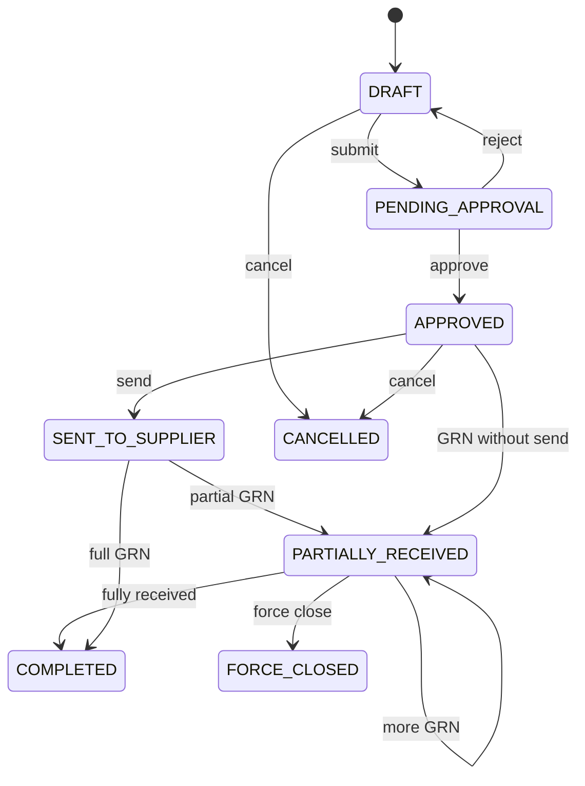

# Purchasing Domain

## Purpose

The Purchasing domain manages procurement from suppliers: raising purchase orders, receiving goods into branch inventory, matching supplier invoices, and returning defective or excess stock. It is the inbound counterpart to Sales — stock enters the pharmacy through **Goods Receipt**, not through the PO alone.

**Database reference:** [Purchase tables overview](../../database/tables/purchase/purchase.md)

## Responsibilities

- Create and approve **PurchaseOrder** with line items
- Record **GoodsReceipt** (GRN) that creates **Batch** and **Stock** at the receiving branch
- Register **PurchaseInvoice** against receipts or PO for accounts payable
- Process **PurchaseReturn** to suppliers with stock OUT
- Maintain PO fulfillment state across partial receipts
- Emit events and outbox records atomically with inventory and audit

## Scope

### In Scope

- `PurchaseOrder`, `PurchaseOrderItem`
- `GoodsReceipt`, `GoodsReceiptItem`
- `PurchaseInvoice`, `PurchaseInvoiceItem`
- `PurchaseReturn`, `PurchaseReturnItem`
- Branch-scoped document numbers for all document types
- PO lifecycle through approval, supplier send, partial receipt, completion, force close, cancel

### Out of Scope

- Supplier master maintenance (Supplier domain)
- Sales and customer billing (Sales domain)
- Payment to supplier execution (Finance domain) — Purchasing records invoice liability
- RFQ / vendor bidding (future)

## Related Entities

| Entity | Role |
|--------|------|
| [PurchaseOrder](../../database/tables/purchase/30_purchase_order.md) | Procurement request to supplier |
| [PurchaseOrderItem](../../database/tables/purchase/31_purchase_order_item.md) | Ordered lines |
| [GoodsReceipt](../../database/tables/purchase/32_goods_receipt.md) | Physical receipt (GRN) |
| [GoodsReceiptItem](../../database/tables/purchase/33_goods_receipt_item.md) | Received qty, batch, expiry |
| [PurchaseInvoice](../../database/tables/purchase/34_purchase_invoice.md) | Supplier bill |
| [PurchaseInvoiceItem](../../database/tables/purchase/35_purchase_invoice_item.md) | Invoice lines |
| [PurchaseReturn](../../database/tables/purchase/36_purchase_return.md) | Return to supplier |
| [PurchaseReturnItem](../../database/tables/purchase/37_purchase_return_item.md) | Returned lines |
| `Supplier`, `Branch`, `Medicine` | Masters and scope |
| `Batch`, `Stock`, `StockMovement` | Created/updated on GRN post |

## Business Rules

- PO must have at least one line; `purchaseOrderNumber` unique per branch.
- Only **APPROVED** (or later) POs may generate GRN (configurable: allow GRN without PO).
- **Posting GRN** creates or updates `Batch` and increases `Stock` at `branchId` — PO alone does not touch inventory.
- Partial deliveries: multiple GRNs per PO; PO `status` → `PARTIALLY_RECEIVED` until fully received.
- PO terminal states: `COMPLETED`, `FORCE_CLOSED`, `CANCELLED` — no line edits.
- Purchase invoice may reference GRN/PO for three-way match (qty/cost validation).
- Purchase return decreases branch stock with OUT movement.
- All posts use `UnitOfWork.run` — document + items + stock + outbox + audit in one transaction.

## Domain Events

| Event | Trigger |
|-------|---------|
| `PurchaseOrderCreated` | PO draft saved |
| `PurchaseOrderSubmittedForApproval` | → `PENDING_APPROVAL` |
| `PurchaseOrderApproved` | → `APPROVED` |
| `PurchaseOrderSentToSupplier` | → `SENT_TO_SUPPLIER` |
| `GoodsReceiptPosted` | GRN post — batch/stock created |
| `PurchaseOrderPartiallyReceived` | GRN qty < ordered |
| `PurchaseOrderCompleted` | Full receipt |
| `PurchaseInvoicePosted` | Supplier bill recorded |
| `PurchaseReturnApproved` | Stock returned to supplier |
| `PurchaseOrderForceClosed` / `PurchaseOrderCancelled` | Terminal PO |

## State Model

### PurchaseOrder.status

| Status | Meaning |
|--------|---------|
| `DRAFT` | Editable; not sent |
| `PENDING_APPROVAL` | Awaiting approver |
| `APPROVED` | May send to supplier / receive goods |
| `SENT_TO_SUPPLIER` | Communicated to vendor |
| `PARTIALLY_RECEIVED` | At least one GRN posted, qty open |
| `COMPLETED` | Full quantity received per policy |
| `FORCE_CLOSED` | Manually closed with open qty |
| `CANCELLED` | Voided; no further receipts |

### GoodsReceipt.status

`DRAFT`, `POSTED`, `CANCELLED`

## Integrations

- **Inventory:** GRN post creates `Batch` + `Stock`; returns OUT
- **SequenceGenerator:** `PURCHASE_ORDER`, `GOODS_RECEIPT`, etc. per branch
- **Finance:** AP from purchase invoice; GRN for accrual if used
- **Outbox / Sync:** UUID-based replication
- **Supplier:** supplierId on PO, GRN, invoice, return

## Security

- Minimum permission: `PURCHASE:PURCHASE_ORDER:CREATE` (seed: `PURCHASE_CREATE`).
- GRN post and invoice likely require additional permissions when added to seed.
- Branch-scoped access on all documents.

## Performance

- Index PO by `(branchId, status)`, GRN by `(purchaseOrderId)`.
- Batch-load PO lines with `receivedQty` aggregates for fulfillment UI.
- GRN post: bulk insert batches/stock rows for multi-line receipts.

## Future

- Three-way match automation PO ↔ GRN ↔ invoice
- EDI / supplier portal PO acknowledgment
- Landed cost allocation on GRN
- Reorder suggestions from min/max stock
