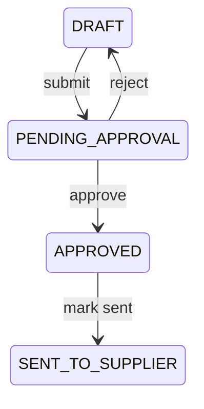

# Purchasing — Approval Flow

## Purpose

Govern who may submit, approve, reject, and send purchase orders before goods are received. Approval separates operational buying from financial control and prevents unauthorized commitments to suppliers.

**Database reference:** [PurchaseOrder](../../database/tables/purchase/30_purchase_order.md) · [Purchase overview](../../database/tables/purchase/purchase.md)

## Responsibilities

- Define PO status transitions involving approval
- Record approver identity and timestamp on PO
- Enforce segregation of duties (creator ≠ approver when configured)

## Scope

### In Scope

- `DRAFT` → `PENDING_APPROVAL` → `APPROVED` | back to `DRAFT`
- Optional `APPROVED` → `SENT_TO_SUPPLIER`
- Rejection comments and audit

### Out of Scope

- GRN QC approval (future quality module)
- Invoice approval (Finance workflow)

## Related Entities

- `PurchaseOrder.approvedByEmployeeId`, `approvedAt`
- `Employee`, `Role`, permissions
- Audit log entries

## Business Rules

- Submit for approval requires complete lines and valid supplier.
- Approver must hold approval permission (future `PURCHASE:PURCHASE_ORDER:APPROVE`).
- When `SEgregationOfDuties` setting true, `approvedByEmployeeId` ≠ `createdBy`.
- Rejection returns PO to `DRAFT` with reason in audit/remarks — not a separate status.
- Only `APPROVED` or `SENT_TO_SUPPLIER` POs should spawn GRNs (configurable strictness).
- `FORCE_CLOSED` requires manager role and mandatory reason — separate from approval path.
- Approval does not affect inventory.

## Domain Events

- `PurchaseOrderSubmittedForApproval`
- `PurchaseOrderApproved`
- `PurchaseOrderRejected` (returns to draft)
- `PurchaseOrderSentToSupplier`

## State Model

## Integrations

- **Notifications:** Email/in-app queue for pending approvals (future)
- **Audit:** Log approver, prior status, amount threshold
- **Settings:** `PO_APPROVAL_THRESHOLD` — auto-approve below amount (future)

## Security

- Approval permission distinct from `PURCHASE:PURCHASE_ORDER:CREATE`.
- Threshold-based dual approval for high-value POs (future).

## Performance

- Pending approval queue: index `(branchId, status)` where status = `PENDING_APPROVAL`.

## Future

- Multi-level approval chains by amount band
- Mobile push for approvers
- Delegation when approver on leave
