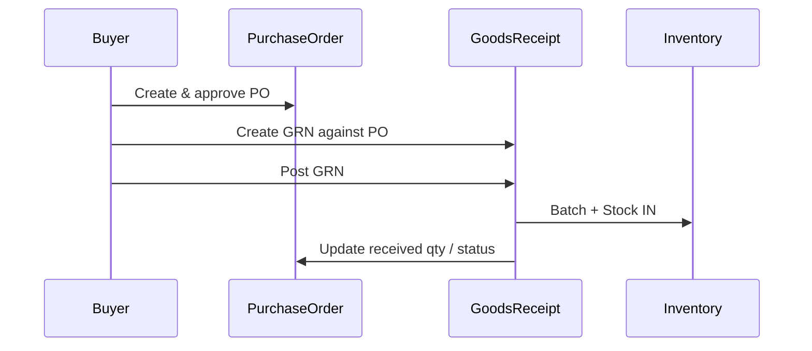

# Purchasing — Workflows

## Purpose

End-to-end operational workflows for procurement: order → approve → receive → invoice → return. Shows transaction boundaries and integration touchpoints.

**Database reference:** [Purchase overview](../../database/tables/purchase/purchase.md)

## Responsibilities

- Document happy paths and exceptions
- Clarify when inventory changes (GRN post only for inbound)

## Scope

### In Scope

- Standard PO-driven procurement
- Partial receipts
- Ad-hoc GRN (if policy allows)

### Out of Scope

- Supplier payment run (Finance)

## Related Entities

- PO, GRN, purchase invoice, purchase return
- `Batch`, `Stock`, `Outbox`

## Business Rules

- GRN post is atomic with batch/stock/movement + PO rollup + outbox.
- PO never touches stock directly.

## Domain Events

Per step see [events.md](./events.md).

## State Model

PO progresses `DRAFT` → … → `COMPLETED` | `FORCE_CLOSED` | `CANCELLED`; GRN `POSTED` triggers inventory.

## Integrations

Procurement UI → API → `UnitOfWork` → Inventory + Outbox + Audit.

---

## Workflow 1: Standard procure-to-stock

1. Buyer creates **DRAFT** PO with lines and supplier ([supplier-selection.md](./supplier-selection.md)).
2. Submit → `PENDING_APPROVAL` ([approval-flow.md](./approval-flow.md)).
3. Manager approves → `APPROVED`.
4. Mark **sent to supplier** → `SENT_TO_SUPPLIER` (optional step).
5. Goods arrive: create **DRAFT** GRN linked to PO.
6. Enter lines: batch no, expiry, qty, purchase rate, MRP.
7. **Post GRN**:
   - Create/update **Batch**
   - Increase **Stock** at branch
   - IN **StockMovement**
   - Update PO line received qty; PO → `PARTIALLY_RECEIVED` or `COMPLETED`
   - Outbox + audit; commit
8. Supplier bill arrives: enter **PurchaseInvoice**, match GRN, post → AP.

## Workflow 2: Partial delivery

1. Repeat GRN post for subset of lines (Workflow 1 step 5–7).
2. PO stays `PARTIALLY_RECEIVED` until cumulative received meets order.
3. Final GRN moves PO to `COMPLETED`.

## Workflow 3: Force close PO

1. Open qty remains after supplier short-ship.
2. Manager **force close** with reason → `FORCE_CLOSED`.
3. No further GRNs allowed.

## Workflow 4: Purchase return

1. Identify batch at branch with issue.
2. Create **PurchaseReturn** lines.
3. Approve/post → OUT stock, supplier credit workflow in Finance.

## Workflow 5: GRN without PO (exception)

1. Setting `ALLOW_GRN_WITHOUT_PO = true`.
2. Create GRN with supplier only; post creates batch/stock.
3. Optional retroactive PO for audit (manual process).

## Security

- Create PO: `PURCHASE:PURCHASE_ORDER:CREATE`
- Approve/post GRN: elevated permissions when seeded

## Performance

- Partial delivery: avoid reloading entire PO history — show received/ordered on line from aggregate column.

## Future

- Automated PO from reorder point
- Supplier EDI inbound ASN before GRN
